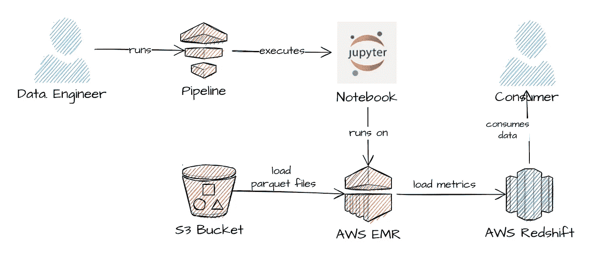
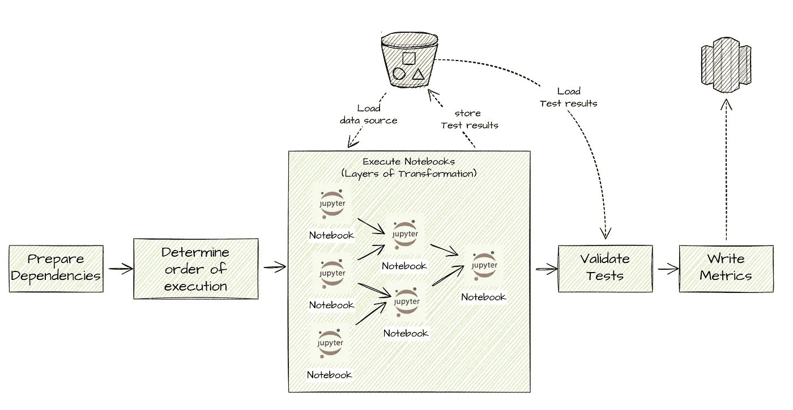
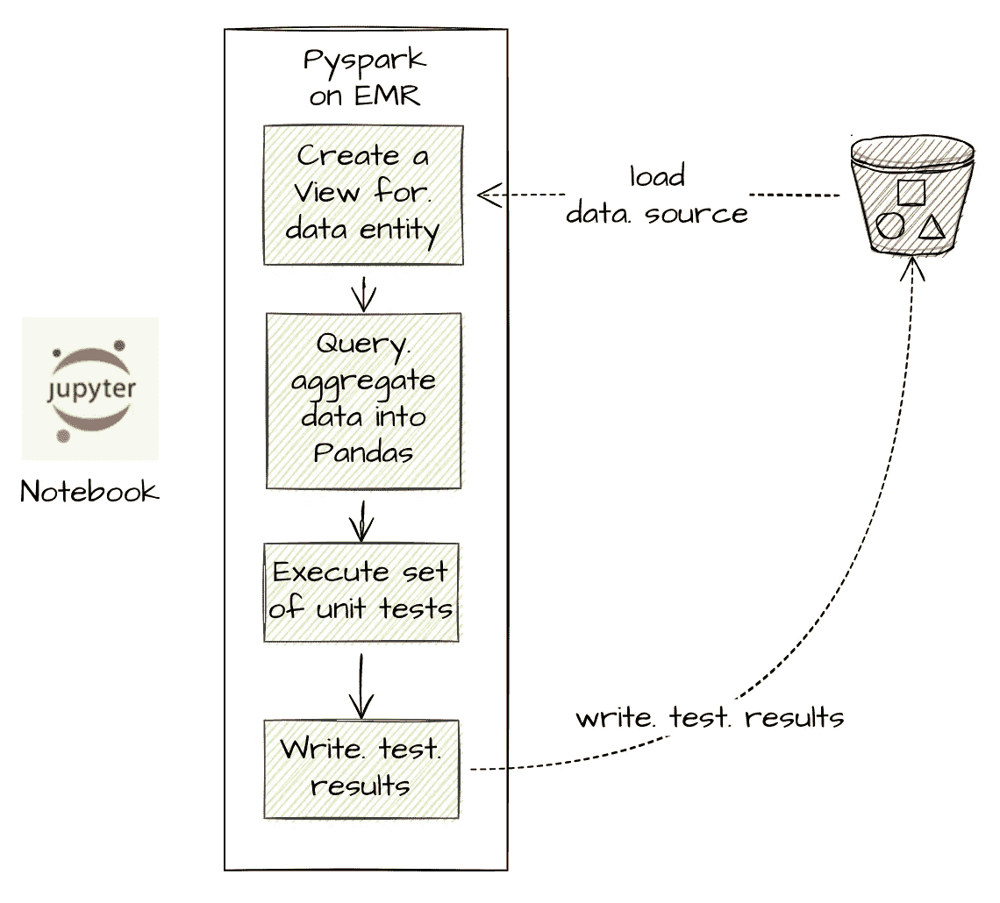

# 远大前程:数据测试工具——这是我们数据质量需求的答案吗？

> 原文：<https://towardsdatascience.com/great-expectations-the-data-testing-tool-is-this-the-answer-to-our-data-quality-needs-f6d07e63f485?source=collection_archive---------5----------------------->

## 数据工程-数据质量-伟大的期望系列

## 我的评估远大前程的旅程，数据质量框架-第 1 部分


米卡·鲍梅斯特在 [Unsplash](https://unsplash.com?utm_source=medium&utm_medium=referral) 上的照片

我是一名数据工程师，目前在银行业工作。我在交付一个重要项目中发挥了重要作用，该项目侧重于风险评估，以保护机构及其客户免受金融犯罪的影响。编制准确、完整、一致、时间相关和标准化的定期风险报告尤为重要，以便进行正确的分析并降低固有风险。如果做不到这一点，不仅会给银行，也会给其利益相关者和个人客户带来严重后果。在数据管道中整合一个强大的数据质量流程是必须的，选择一个有效的工具来实现这一目的肯定会改变游戏规则。

[***远大前程***](https://greatexpectations.io/) 是一个帮助团队通过数据测试、文档和概要分析来消除管道债务的工具。我一直打算探索和评估这个工具，以确定它是否可以与我们现有的环境集成，以及它是否有可能改善我们当前流程中的明显约束，并在我们未来迁移数据平台时防止重大的重构工作。

# 我们目前的做法

为了交付下游指标进行分析，我们必须处理来自各种源系统的数以亿计的数据，这些数据经过不同的转换层。我们利用适用于[大数据](https://en.wikipedia.org/wiki/Big_data)的存储和计算，如 [AWS S3](https://aws.amazon.com/s3/) 和 [AWS EMR](https://aws.amazon.com/emr/) ，使用 [Jupyter](https://jupyter.org/) 和 [Pyspark](http://spark.apache.org/docs/latest/api/python/) 作为 ETL 工具，并将最终指标加载到 [AWS 红移](https://aws.amazon.com/redshift/)。



数据平台—作者图片

管道做五件主要的事情:准备依赖关系，确定执行的顺序，执行笔记，验证测试结果，最后，将最终的指标加载到数据仓库中。



数据管道—按作者分类的图像

每个笔记本创建一个单独的数据实体。为了运行一些质量检查，聚集的数据被查询并加载到 DataFrame 中，然后对其执行单元测试。测试结果被记录到 S3 中，并在测试验证阶段加载以评估覆盖率。



笔记本 ETL 脚本—作者图片

这个过程目前有效，但我认为还有一些事情可以做得更好。

# 警告

## 代码的重复

每个笔记本中都有单元测试代码。但是大多数笔记本都在运行完全相同的单元测试。这导致了代码的重复。

## 没有数据质量文档

如果有一个用户友好的静态网站在整个团队中共享就好了，它可以显示我们的数据在任何环境中到底发生了什么。在我们当前的设置中，当执行管道时，我们得到的只是控制台中输出的一长串测试结果。

## 即将迁移到雪花

我们期待着从红移和火花环境到[雪花](https://www.snowflake.com/)的大迁移，这意味着我们将不得不抛弃我们主要用 Pyspark 写的笔记本和单元测试当前驻留的地方，并可能切换到 [DBT](https://www.getdbt.com/) 来做我们的数据转换。我们必须找到一种方法对新的数据源进行测试。

当然，我们总是可以重构代码来生成一个可重用的测试模块，这个模块是解耦的，并且实现了依赖注入，所以即使数据源发生变化也没有关系。另一方面，文档的实现并不简单。如果有这样一个工具可以帮助克服当前的限制，并提供更多有益的功能，那就太好了。

# 数据质量工具:我在寻找什么？

1.  单元测试或期望直接转化为文档
2.  添加关于单元测试的额外信息
3.  文档可以在 S3 托管
4.  现成的通用数据质量测试功能
5.  支持我们已经进行的大部分数据质量检查
6.  支持多个 Pandas/Spark 数据框架和雪花数据源
7.  可扩张的
8.  与气流或 DBT 等编排工具集成

# 决策寄存器

## 单元测试或期望直接转化为文档

我们知道文档是多么强大和方便，但是没有人想维护单独的文档，只是为了确保它与最新的代码同步。我更喜欢从已定义的单元测试中生成文档的现成特性。

```
Great expectations: **Supported**; Score: **1/8**
```

## 添加关于单元测试的额外信息

我希望能够详细说明到底在测试什么，而不是泛泛的描述，以便让任何检查数据质量报告的人都能理解。

根据[风格指南](https://docs.greatexpectations.io/docs/contributing/style_guides/code_style)，推荐使用 google 风格的 docstrings。

```
Great expectations: **Supported**; Score: **2/8**
```

## 文档可以在 S3 托管

AWS S3 是托管静态网站的一个方便的位置，因为我们已经使用了 S3，不妨使用相同的部署共享文档。

默认情况下，文档存储在本地，但也可以部署在包括 S3 在内的云 blob 存储中[。](https://docs.greatexpectations.io/docs/tutorials/getting_started/customize_your_deployment/#options-for-hosting-data-docs)

```
Great expectations: **Supported**; Score: **3/8**
```

## 现成的通用数据质量测试功能

如果已经有了[原生单元测试函数](https://greatexpectations.io/expectations/)，我们可以利用它来避免从头开始编写动态测试，这将大大加快重构过程。

```
Great expectations: **Supported**; Score: **4/8**
```

## 支持我们已经进行的大部分数据质量检查

我已经搜索了可用的[期望](https://greatexpectations.io/expectations/)，它们可能至少在语义上匹配我们最常见的数据质量检查。

```
Great expectations: **Mostly supported**; Score: **5/8**
```

## 支持多个 Pandas/Spark 数据框架和雪花数据源

它应该可以在我们当前和未来的环境中工作，只需很少的重构工作。

支持的数据源: [Pandas DataFrame](https://docs.greatexpectations.io/docs/guides/connecting_to_your_data/in_memory/pandas) 、 [Spark DataFrame](https://docs.greatexpectations.io/docs/guides/connecting_to_your_data/in_memory/spark) 和 [Snowflake via SQLAlchemy](https://docs.greatexpectations.io/docs/guides/connecting_to_your_data/database/snowflake)

```
Great expectations: **Supported**; Score: **6/8**
```

## 可扩张的

尽管它支持我们开箱即用的大多数数据质量期望，但它应该足够灵活，能够为那些它本身不支持的测试编写定制测试。

```
Great expectations: **Supported**; Score: **7/8**
```

## 与气流或 DBT 等编排工具集成

它应该支持与我们数据生态系统中现有编排平台的集成。

[验证](https://docs.greatexpectations.io/docs/deployment_patterns/how_to_run_a_checkpoint_in_airflow)可以通过 BashOperator 或 PythonOperator 经由[气流](https://airflow.apache.org/)运行。也有一个[扩展包](https://github.com/calogica/dbt-expectations)用于 [DBT](https://www.getdbt.com/) 。

```
Great expectations: **Supported**; Score: **8/8**
```

# 裁决

看起来《远大前程》在理论上看起来不错，但实际上能起作用吗？让我们来了解一下！在我的旅程中，请跟随我尝试这个工具并探索它的功能。请关注本博客系列的下一部续集。

*   [py spark 中使用远大前程的数据质量单元测试](https://karenbajador.medium.com/data-quality-unit-tests-in-pyspark-using-great-expectations-e2e2c0a2c102)

# 参考

*   [https://docs.greatexpectations.io/docs/](https://docs.greatexpectations.io/docs/)