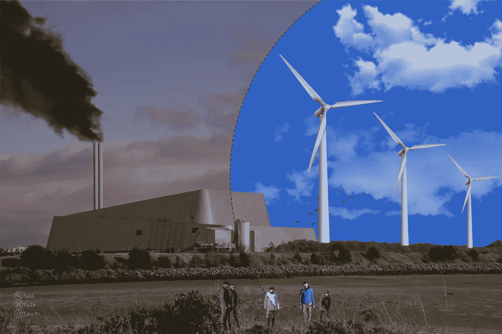
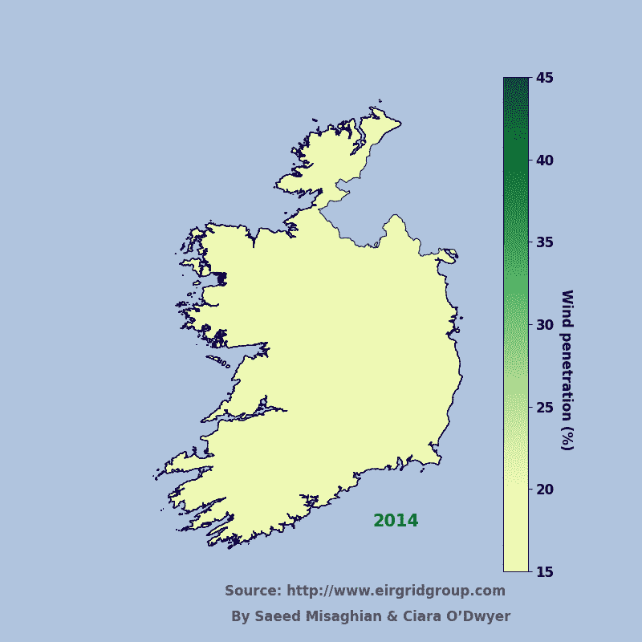
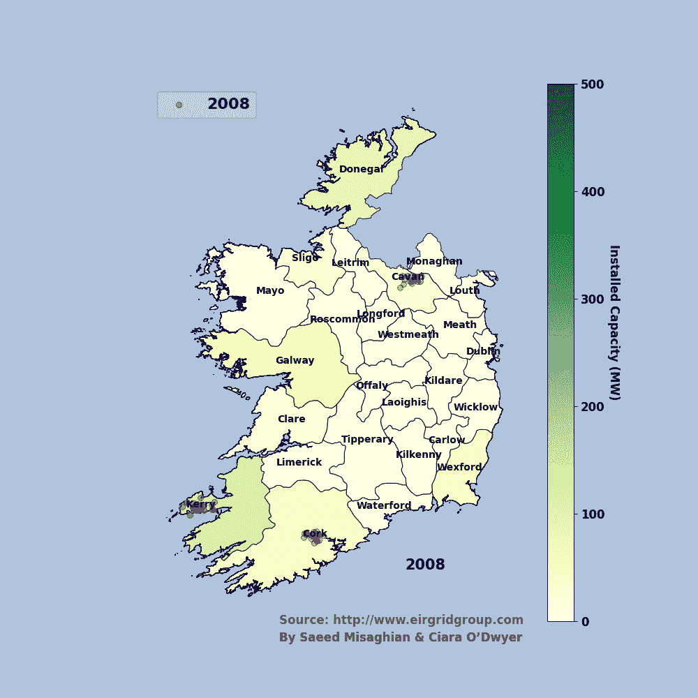
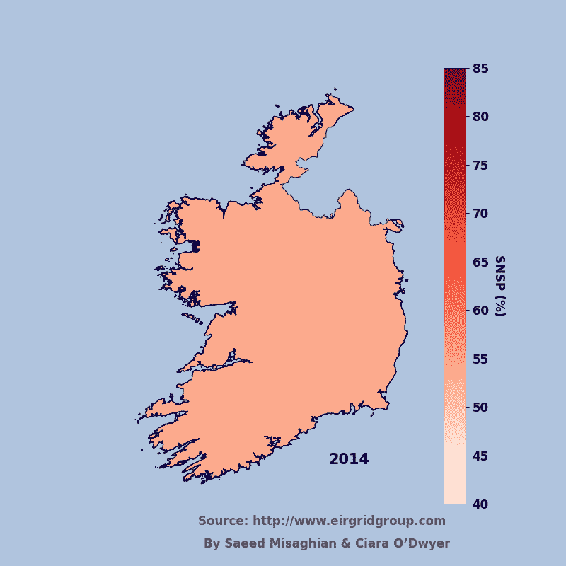

# 绿色如爱尔兰:爱尔兰风能的 Choropleth 地图

> 原文：<https://towardsdatascience.com/green-like-ireland-choropleth-map-of-irish-wind-energy-26603106fe3e?source=collection_archive---------25----------------------->

## 谈到可再生能源，爱尔兰有多大热情？

向基于可再生能源系统的中期过渡，爱尔兰普尔比都柏林(图片来源:Fatemeh Naderifar、Sara Pejhan 和 Saeed Misaghian)

# **简介**

应对气候变化的巨大挑战需要彻底转变，为子孙后代创造一个清洁、安全和可持续的社会。爱尔兰的全岛电力系统在脱碳方面处于领先地位，为 2030 年设定了雄心勃勃的目标，你可以在这里阅读更多。[爱尔兰共和国输电系统运营商 EirGrid](https://www.eirgridgroup.com/) ，负责向爱尔兰人民提供安全、可持续和绿色的电力，是实现电网去碳化的领跑者。让我们看看爱尔兰迄今为止在电力系统中容纳可再生能源方面有多成功。让我们快速看一下迄今为止的进展吧！

> “让他们[人民]迎接可持续发展目标的挑战，并采取行动，不是出于私利，而是出于共同利益。我非常清楚时间的宝贵。抓住时机。立即行动。''
> 
> 斯蒂芬·霍金，重大问题的简要回答

在详细介绍之前，我应该澄清一下，当我们谈论风力涡轮机或太阳能电池板等可再生能源时，我们可以谈论大型项目，这些项目需要被称为风力/太阳能农场的巨大土地，也可以谈论你可能在屋顶或花园中安装的较小设备。在这里，我们谈论的是大规模可再生能源发电机，它产生大量的电力。

# **准备数据**

EirGrid 在其[网站](http://www.eirgridgroup.com/)【1】上定期发布电力系统信息和技术报告。你还可以在 EirGrid 智能仪表盘上找到关于爱尔兰电力系统的有趣图表和数据，点击此[链接](http://smartgriddashboard.eirgrid.com)【2】。我从 Eirgrid 的网站上获得了数据(从 PDF 文档和 Excel 文件中)，并根据我的兴趣每年对它们进行修改，因为我想了解可再生能源发电在过去几年中取得了怎样的进步。

# **呈现数据**

技术上和细节上我都不想说。我只是想给那些可能有兴趣了解电网中可再生能源进展的人一些启示。作为工程师，我们正在努力寻找解决方案，以适应网络中越来越多的可再生能源份额。看看下面这张 GIF，展示了爱尔兰如何在生产方面容纳更多的风力发电变得更加绿色；绿色越深，风力发电在爱尔兰电网中的份额就越高。平均而言，2014 年，爱尔兰总需求量的 19.89%由风力提供，到 2020 年底，这一比例将跃升至约 38%。

爱尔兰风电在电网中的渗透率，占总需求的%

现在我想向你展示爱尔兰大多数风力涡轮机的位置。看下面的 GIF，显示了从 2008 年到 2020 年的风机安装进度，每个圆圈代表一个风机。红圈代表每年新增的风力涡轮机，蓝圈代表前几年累积的风力涡轮机。此外，地图的绿色背景显示了每个地区风力涡轮机的装机容量，颜色越深，该地区的装机容量越大。

> 作为一名在爱尔兰的国际居民，我总是听说爱尔兰西部的大风天气。使用数据集后，我现在对爱尔兰多风的地方有了很好的认识。此外，我应该承认，我认为我们没有任何城市比都柏林风更大！

看看西边的克里县、科克县和戈尔韦县，它们有多绿！它们是爱尔兰顶级风力涡轮机的家园，正在帮助爱尔兰电网变得更加绿色！

2008 年至 2020 年期间风力涡轮机装机容量和数量

但这并不是故事的全部。有许多技术和财务障碍阻止系统运营商容纳越来越多的可再生能源，这就是为什么我们称之为一个雄心勃勃的目标，在我们的电力网络中拥有大量的可再生能源，如风力涡轮机。具体来说，当我们谈到像爱尔兰这样的电网时，由于其地理位置，与其他欧盟国家相比，它与邻国的联系更少，这当然需要付出更大的努力来应对未来的技术挑战。

# **一点技术性的谈话**

对于那些可能有兴趣了解更多细节的人，我想谈谈术语 SNSP，即系统非同步穿透。简而言之，SNSP 实际上显示了与总电力需求相比，与转换器接口的发电机组(如 HVDC 互联器、电池、风能和太阳能电池板)的渗透水平，这是保护系统安全的一个代理。SNSP 限制的必要性是阻碍电力系统运营商接纳更多可再生能源的障碍之一，因为电力系统的安全性和可靠性受到非常高的威胁，而这始终是第一要务！SNSP 越高，系统对故障和断电的鲁棒性越差。爱尔兰最近达到了 2021 年 70%可变可再生电力瞬时目标，这确实是一个伟大的成就，这意味着该国可以通过可再生能源供应其 70%的电力需求！让我们来看看爱尔兰最近几年的 SNSP 比率。在下面的 GIF 中，我展示了每年的最大 SNSP。我们在这里选择最大值，因为它代表了系统的瞬时渗透率，以及 EirGrid 在管理系统安全性的同时拓展其边界以获得更多可再生能源的能力。今年的最大 SNSP 已经从 2014 年的 53.55%提高到 2020 年的 67.4%和 2021 年的 70%，这对爱尔兰来说是一个巨大的进步！

2014-2020 年间系统非同步渗透率

# **Python 代码**

你可能会对绘制 choropleth 图感兴趣，因为它们不仅具有说明性，而且非常漂亮，这是可视化数据的两个主要基础。在我的下一篇文章中，我将一步一步地解释如何用 Python 制作 choropleth 地图。值得注意的是，我受到了这两篇关于走向数据科学的文章[3，4]的启发。

# **贡献者**

希亚拉·奥德威博士通过对这项工作提出建议和意见，帮助准备了这篇简短的文章。

# **确认**

我要感谢 UCD 能源研究所和 ESIPP 集团对我的支持。另外，我推荐你看看我的同事们在这个[研究所](https://esipp.ie)的有趣作品。

# **免责声明**

这项工作只是基于显示爱尔兰电网在可再生能源方面改善的公共在线数据，作者并不保证这项工作的结果。

# **参考文献**

[1]:[https://www.eirgridgroup.com/](https://www.eirgridgroup.com/)

[2]:[http://smartgriddashboard.eirgrid.com](http://smartgriddashboard.eirgrid.com)

[3]:用 Python 创建 Choropleth 地图的完整指南，走向数据科学；2020 年 10 月 4 日[https://towards data science . com/a-complete-guide-to-creating-choropleth-maps-in-python-728 ee 2949 db4](/a-complete-guide-to-creating-choropleth-maps-in-python-728ee2949db4)

【4】我们来做个地图吧！利用 Geopandas、pandas 和 Matplotlib 制作 Choropleth 图；2018 年 6 月 25 日。[https://towards data science . com/let-make-a-map-using-geo pandas-pandas-and-matplotlib-to-make-a-chlorolethmap-dddc 31 c 1983d](/lets-make-a-map-using-geopandas-pandas-and-matplotlib-to-make-a-chloropleth-map-dddc31c1983d)