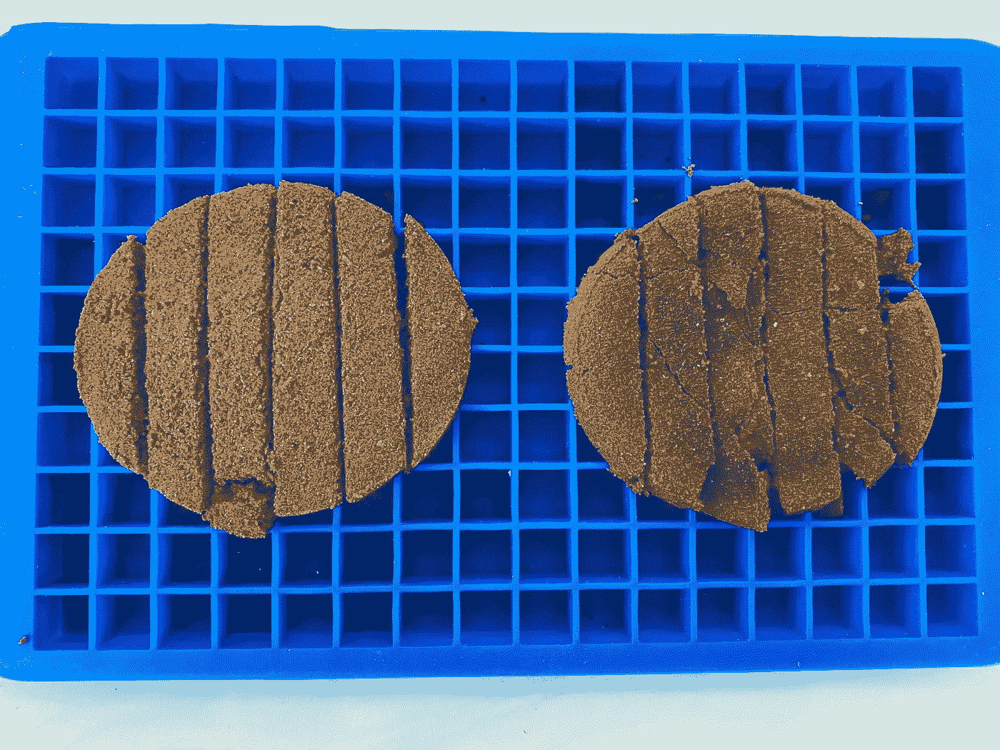
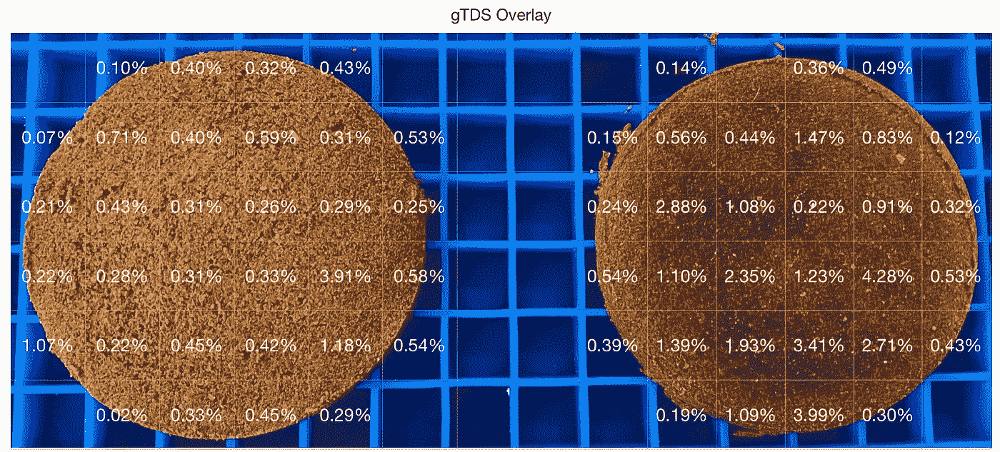

# 使用研磨 TDS 的浓缩咖啡圆盘的提取潜力

> 原文：<https://towardsdatascience.com/grounds-tds-across-the-espresso-puck-1581825ddcac?source=collection_archive---------26----------------------->

## 咖啡数据科学

## 探索一个用过的咖啡球

之前，我讨论过通过将咖啡渣(新鲜的或用过的)放入含有少量水的折光仪来测量 gTDS 或[渣 TDS](/other-coffee-measurements-using-a-refractometer-85d0fb28d3d7) 。为了进一步探索这个想法，我想在一个有问题的圆盘上进行空间测量。我想了解 GTD 中的黑点是如何测量的。

我拍了一个断续夯实的照片，我能够在顶部和底部分开冰球，因为我在两层之间有一个布过滤器。所以我有了一个有趣的方法来检查冰球上的 GTD。高 gTDS 意味着该区域在拍摄过程中没有被完全提取。圆盘上的不平整表明发生了沟道效应。

按作者分类的所有图像

我用一个橡胶小冰块托盘来帮助分割用过的冰球。

我用一把锋利的刀沿着网格线切割圆盘。

然后我横向切割。

然后我仔细检查并测量了每个样本的 GTD。这一过程需要一些时间，但通常样品测量比 TDS 测量更快。

我把尺寸放在这个格子里，我添加了一些颜色规则。上半部分和下半部分的颜色标准化是不同的。

让我感兴趣的是，在第 4 行第 5 列的顶部和底部有一个点，那里有一个高 gTDS。这意味着该区域的流动缓慢(顶部为 3.91%，底部为 4.28%)。

我将这些信息叠加到圆盘上，这样您就可以比较圆盘的颜色和 gTDS 值。和黑点不太吻合。事实上，对于上半部分，很难在整个圆盘上分辨出任何颜色差异。

我们可以看到 gTDS 顶部和底部的不同，这可以让我们了解当水通过圆盘时流量是如何变化的。

# 以更高的分辨率估算 gTDS

通过这些初始测量，我很好奇它们在获得整个图像的更高分辨率测量时会有多精确。首先，我计算了每个网格点的平均颜色值:

然后，我绘制了每个细胞的 gTDS 与强度(红色、蓝色和绿色的平均值)的关系。

顶部没有很好的趋势线 R，但底部有，所以我用了上下像素界限。然后，我根据圆盘底部的图像创建了一个估计的 gTDS 图像。

然后我形成了基于原始网格的估计 gTDS 来查看误差。

这是一个很大的偏差，可能是因为在 gTDS 较高的地方没有足够的样本。

我真的很喜欢用像 gTDS 这样的定量工具来看冰球后分析。通常，浓缩咖啡让人感觉如此神秘。很难看到冰球的内部，通常我们的理解来自于击球后的视觉证据或度量。我希望像 gTDS 这样的东西可以帮助检查视觉上没有这个不同的冰球，但这个例子通过数据告诉我们，外表可能具有欺骗性。

如果你愿意，可以在 Twitter 和 YouTube 上关注我，我会在那里发布不同机器上的浓缩咖啡视频和浓缩咖啡相关的东西。你也可以在 [LinkedIn](https://www.linkedin.com/in/robert-mckeon-aloe-01581595?source=post_page---------------------------) 上找到我。也可以关注我[中](https://towardsdatascience.com/@rmckeon/follow)。

# [我的进一步阅读](https://rmckeon.medium.com/story-collection-splash-page-e15025710347):

[浓缩咖啡系列文章](https://rmckeon.medium.com/a-collection-of-espresso-articles-de8a3abf9917?postPublishedType=repub)

[工作和学校故事集](https://rmckeon.medium.com/a-collection-of-work-and-school-stories-6b7ca5a58318?source=your_stories_page-------------------------------------)

[个人故事和关注点](https://rmckeon.medium.com/personal-stories-and-concerns-51bd8b3e63e6?source=your_stories_page-------------------------------------)

[乐高故事启动页面](https://rmckeon.medium.com/lego-story-splash-page-b91ba4f56bc7?source=your_stories_page-------------------------------------)

[摄影启动页面](https://rmckeon.medium.com/photography-splash-page-fe93297abc06?source=your_stories_page-------------------------------------)

[改进浓缩咖啡](https://rmckeon.medium.com/improving-espresso-splash-page-576c70e64d0d?source=your_stories_page-------------------------------------)

[断奏生活方式概述](https://rmckeon.medium.com/a-summary-of-the-staccato-lifestyle-dd1dc6d4b861?source=your_stories_page-------------------------------------)

[测量咖啡磨粒分布](https://rmckeon.medium.com/measuring-coffee-grind-distribution-d37a39ffc215?source=your_stories_page-------------------------------------)

[咖啡萃取](https://rmckeon.medium.com/coffee-extraction-splash-page-3e568df003ac?source=your_stories_page-------------------------------------)

[咖啡烘焙](https://rmckeon.medium.com/coffee-roasting-splash-page-780b0c3242ea?source=your_stories_page-------------------------------------)

[咖啡豆](https://rmckeon.medium.com/coffee-beans-splash-page-e52e1993274f?source=your_stories_page-------------------------------------)

[浓缩咖啡用纸质过滤器](https://rmckeon.medium.com/paper-filters-for-espresso-splash-page-f55fc553e98?source=your_stories_page-------------------------------------)

[浓缩咖啡篮及相关主题](https://rmckeon.medium.com/espresso-baskets-and-related-topics-splash-page-ff10f690a738?source=your_stories_page-------------------------------------)

[意式咖啡观点](https://rmckeon.medium.com/espresso-opinions-splash-page-5a89856d74da?source=your_stories_page-------------------------------------)

[透明 Portafilter 实验](https://rmckeon.medium.com/transparent-portafilter-experiments-splash-page-8fd3ae3a286d?source=your_stories_page-------------------------------------)

[杠杆机维护](https://rmckeon.medium.com/lever-machine-maintenance-splash-page-72c1e3102ff?source=your_stories_page-------------------------------------)

[咖啡评论与思考](https://rmckeon.medium.com/coffee-reviews-and-thoughts-splash-page-ca6840eb04f7?source=your_stories_page-------------------------------------)

[咖啡实验](https://rmckeon.medium.com/coffee-experiments-splash-page-671a77ba4d42?source=your_stories_page-------------------------------------)