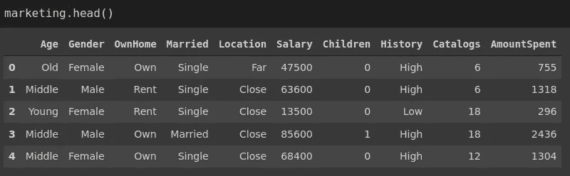
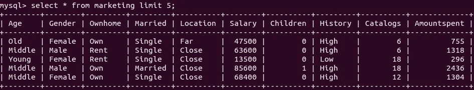

# 熊猫、SQL 和 NoSQL 中的分组依据

> 原文：<https://towardsdatascience.com/group-by-in-pandas-sql-and-nosql-db60ce730437?source=collection_archive---------25----------------------->

## 数据分析中普遍存在的操作


马库斯·斯皮斯克在 [Unsplash](https://unsplash.com/s/photos/different-colors?utm_source=unsplash&utm_medium=referral&utm_content=creditCopyText) 上的照片

group by 操作通常用于探索性数据分析。几乎每个数据分析工具和框架都提供了 group by 操作的实现。

group by 操作包括根据离散或分类变量的值对数值进行分组，然后应用某种形式的转换或聚合。

例如，查找一个城市不同社区的平均房价是一个分组操作。价格根据邻近区域进行分组，并应用均值函数。

下图说明了典型的 group by 操作是如何执行的。


按操作分组(图片按作者)

在本文中，我们将看到如何在 Pandas、SQL 和 MongoDB (NoSQL 数据库)中完成 group by 操作。每个工具都有一个单独的部分，我们将在每个部分中做相同的示例。

## 熊猫

Pandas 是一个非常流行的 Python 数据分析和操作库。groupby 操作是使用“group by”函数完成的。

数据集存储在名为 marketing 的数据框架中。



(图片由作者提供)

我们先来算一下每个年龄段的平均消费金额。我们选择要聚合的列和要用于分组的列。分组列被传递给 groupby 函数。然后，我们应用期望的集合函数，在这种情况下是均值函数。

```
marketing[['Age','AmountSpent']].groupby('Age').mean() AmountSpent                 
Age     
---------------------                         
Middle    1501.690945                 
Old       1432.126829                 
Young      558.623693
```

平均而言，中年顾客往往花费最多。

我们可以按多列分组。group by 函数接受列表中的多列。让我们也在组中添加性别列，使前面的例子更加详细。

```
marketing[['Age','Gender','AmountSpent']]\
.groupby(['Age','Gender']).mean() AmountSpent                 
Age          Gender
-------------------------------------                             
Middle       Female       1301.339806                 
               Male       1638.354305                 
Old          Female       1279.310078                 
               Male       1691.513158                 
Young        Female        501.257310                 
               Male        643.189655
```

似乎在所有年龄组中，男性的花费都比女性多。

我们已经看到了用于分组的多个列。另一种常见的情况是聚合多个列。例如，我们可以计算“自己的家”列中类别的平均工资和总支出金额。

完成这项任务有多种方法。最简单的一个如下:

```
marketing[['OwnHome','Salary','AmountSpent']]\
.groupby('OwnHome').agg({'Salary':'mean', 'AmountSpent':'sum'}) Salary     AmountSpent                 
OwnHome 
---------------------------------------                                   
Own        69758.720930          796258                 
Rent       41546.280992          420512
```

我们向 agg 函数传递一个字典，指示应用于每一列的聚合。但是，我们不能从结果中判断出哪个聚合函数应用于列，因为它只显示列名。

解决这个问题的一个方法是使用 NamedAgg 方法。

```
marketing[['OwnHome','Salary','AmountSpent']]\
.groupby('OwnHome').agg( avgSalary = pd.NamedAgg('Salary','mean'),
     totalSpent = pd.NamedAgg('AmountSpent','sum')
) avgSalary     totalSpent                 
OwnHome 
---------------------------------------                                   
Own        69758.720930          796258                 
Rent       41546.280992          420512
```

## 结构化查询语言

SQL 是一种用于管理关系数据库中的数据的编程语言。它允许以高效和通用的方式过滤、转换和分析存储在数据库中的数据。

有许多关系数据库管理系统使用 SQL。尽管它们之间的大多数 SQL 语法是相同的，但可能会有一些小的差异。我将使用 MySQL。

数据集存储在名为 marketing 的表中。



(图片由作者提供)

第一个示例包括在 age 列中查找类别的平均花费金额。我们将 select 语句与 group by 子句一起使用。首先选择列。选择列时指定了聚合函数。然后，我们将 group by 与 age 列一起使用。

```
mysql> select Age, avg(AmountSpent)
    -> from marketing
    -> group by Age;+--------+------------------+
| Age    | avg(AmountSpent) |
+--------+------------------+
| Middle |        1501.6909 |
| Old    |        1432.1268 |
| Young  |         558.6237 |
+--------+------------------+
```

在第二个示例中，我们添加了另一个用于分组的列。对于 SQL，我们向 group by 子句添加多个列，用逗号分隔。

```
mysql> select Age, Gender, avg(AmountSpent)
    -> from marketing
    -> group by Age, Gender;+--------+--------+------------------+
| Age    | Gender | avg(AmountSpent) |
+--------+--------+------------------+
| Middle | Female |        1301.3398 |
| Middle | Male   |        1638.3543 |
| Old    | Female |        1279.3101 |
| Old    | Male   |        1691.5132 |
| Young  | Female |         501.2573 |
| Young  | Male   |         643.1897 |
+--------+--------+------------------+
```

第三个示例包括多个聚合。我们计算“自己的家”列中类别的平均工资和总支出金额。

```
mysql> select OwnHome, avg(Salary) as avgSalary,
    -> sum(AmountSpent) as totalSpent
    -> from marketing
    -> group by OwnHome;+---------+------------+------------+
| OwnHome | avgSalary  | totalSpent |
+---------+------------+------------+
| Own     | 69758.7209 |     796258 |
| Rent    | 41546.2810 |     420512 |
+---------+------------+------------+
```

对于 Pandas，我们使用了 NamedAgg 方法来重命名聚合列。对于 SQL，我们可以使用“as”关键字来更改名称。

## NoSQL 数据库

NoSQL 指的是非 SQL 或非关系数据库设计。NoSQL 也提供了一种有组织的方式来存储数据，但不是以表格的形式。

数据科学生态系统中使用了几个 NoSQL 数据库。在本文中，我们将使用 MongoDB，它将数据存储为文档。MongoDB 中的文档由字段-值对组成。文档被组织在一个称为“集合”的结构中。打个比方，我们可以把文档想象成表格中的行，把集合想象成表格。

数据集存储在一个名为 marketing 的集合中。这是 marketing 集合中的一个文档，它表示一个观察(即表中的一行)。

```
> db.marketing.find().limit(1).pretty()
{
 "_id" : ObjectId("6014dc988c628fa57a508088"),
 "Age" : "Middle",
 "Gender" : "Male",
 "OwnHome" : "Rent",
 "Married" : "Single",
 "Location" : "Close",
 "Salary" : 63600,
 "Children" : 0,
 "History" : "High",
 "Catalogs" : 6,
 "AmountSpent" : 1318
}
```

数据库指的是当前数据库。我们需要在点号后指定集合名称。

MongoDB 为过滤、转换、过滤等数据分析操作提供了聚合管道。对于 group by 操作，我们在聚合管道中使用“$group”阶段。

第一个例子是计算每个年龄组的平均消费金额。

```
> db.marketing.aggregate([
... { $group: { _id: "$Age", avgSpent: { $avg: "$AmountSpent" }}}
... ]){ "_id" : "Old", "avgSpent" : 1432.1268292682928 }
{ "_id" : "Middle", "avgSpent" : 1501.6909448818897 }
{ "_id" : "Young", "avgSpent" : 558.6236933797909 }
```

用于分组的字段(即表中的列)通过关键字“_id”传递到分组阶段。我们为每个包含要聚合的字段和聚合函数的聚合指定一个名称。

下一个示例包含两个用于分组的字段。我们用关键字“_id”指定这两个字段，如下所示:

```
> db.marketing.aggregate([
... {
...   $group:
...    {
...      _id: {OwnHome: "$OwnHome", Gender: "$Gender"},
...      avgSpent: { $avg: "$AmountSpent" }
...    }
... }
... ]).pretty(){
 "_id" : {
  "ownhome" : "Rent",
  "gender" : "Male"
 },
 "avg_spent" : 996.1238532110092
}{
 "_id" : {
  "ownhome" : "Own",
  "gender" : "Male"
 },
 "avg_spent" : 1742.0036231884058
}{
 "_id" : {
  "ownhome" : "Own",
  "gender" : "Female"
 },
 "avg_spent" : 1314.4375
}{
 "_id" : {
  "ownhome" : "Rent",
  "gender" : "Female"
 },
 "avg_spent" : 764.5
}
```

最后一个示例包含两个要聚合的字段。我们在小组阶段分别指定如下。

```
> db.marketing.aggregate([
... { 
...   $group:
...     {
...       _id: "$OwnHome",
...       avgSalary: { $avg: "$Salary" },
...       totalSpent: { $sum: "$AmountSpent" }
...     }
... }
... ]){ "_id" : "Own", "avgSalary" : 69758.72093023256, "totalSpent" : 796258 }
{ "_id" : "Rent", "avgSalary" : 41546.28099173554, "totalSpent" : 420512 }
```

## 结论

我们已经做了三个例子来演示如何在 Pandas、SQL 和 MongoDB 中进行分组。本文的目标是介绍 group by 操作背后的思想，并涵盖每个工具的基本语法。

对于每个工具，我们可以执行更复杂的分组操作。例如，可以基于聚合列对结果进行排序。所有的工具都提供了一种很好的方式来按照操作对组的结果进行排序。

感谢您的阅读。如果您有任何反馈，请告诉我。