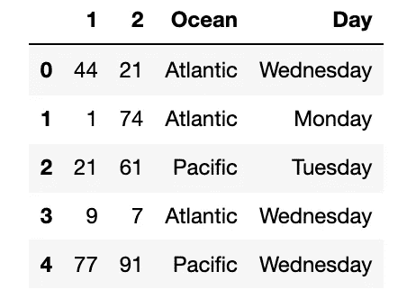
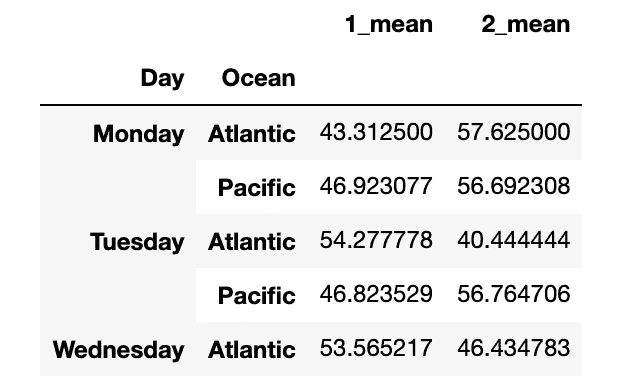
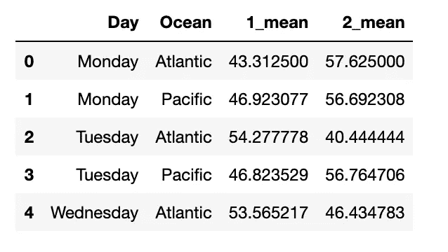

# 使用 Python 而不是 SQL 进行分组

> 原文：<https://towardsdatascience.com/group-by-in-python-not-sql-dfdc31db77b4?source=collection_archive---------39----------------------->

## 意见

## 数据科学家如何整合他们的数据


Jefferson Santos 在[Unsplash](https://unsplash.com/collections/3445447/vacancies?utm_source=unsplash&utm_medium=referral&utm_content=creditCopyText)【1】上拍摄的照片。

# 目录

1.  介绍
2.  SQL vs Python
3.  Python 数据帧创建
4.  Python 分组依据
5.  摘要
6.  参考

# 介绍

数据科学家通常在学习 SQL 之前先学习 Python，因此 SQL 要么让人不知所措，要么只是一种不受欢迎的不同体验。当 SQL 和 Python 中有相似的函数时，了解哪种方法最适合使用是很重要的。最终，这将取决于您的偏好，而且，如果您是 Python 鉴赏家，使用 Python 对您的数据进行分组或聚合可能会更有好处。为了知道为什么 Python 比 SQL 更好用，我们将首先研究如何在 SQL 中对数据进行分组。然后，我们将探索如何创建一个示例数据集，以便您可以遵循本 Python 教程。最后，也是最重要的，我们将讨论如何在 Python 中分组或聚合数据，这将在 Jupyter 笔记本中举例说明。如果你想知道为什么以及如何在 Python 中分组，请继续阅读。

# SQL vs Python


照片由[卡斯帕·卡米尔·鲁宾](https://unsplash.com/@casparrubin?utm_source=unsplash&utm_medium=referral&utm_content=creditCopyText)在[Unsplash](https://unsplash.com/s/photos/sql?utm_source=unsplash&utm_medium=referral&utm_content=creditCopyText)【2】上拍摄。

我的首选当然是 Python，但是 SQL 仍然有用，而且执行分组非常简单。然而，当查询变长，分组列的数量增加，并且很难看到分组的确切依据时，SQL 可能会更令人头疼。

```
**-- 1 = name of a numeric column
-- 2 = name of another numeric column****SELECT** Day, Ocean, *AVG*(1), AVG(2)
**FROM** df_example
**GROUP BY Day**, **Ocean**
```

> 当您想使用 SQL 而不是 Python 时

*   当您有针对数据科学模型的定型查询，并且不想在查询后对数据进行特殊预处理时
*   当您有一个整体较小的查询时
*   如果您喜欢 SQL 格式

> 当您想在 SQL 上使用 Python 时

*   当您已经有了来自非 SQL 查询的数据集时
*   当您想更清楚地了解分类列如何对数字数据进行分组时
*   如果您喜欢 Python 格式

# Python 数据帧创建



示例数据帧。作者截图[3]。

首先，我们将使用 Python、pandas 和 numpy 在 Jupyter 笔记本中创建一个数据帧。我将包括 2 个代码块，它们解释相同的代码，但是，第一个代码块更容易复制，第二个代码块版本更容易直观地看到 Python 代码及其各自的格式。请记住，这只是随机创建的数据，有两个类别列简单地显示示例`string`值，以及随机生成的数值列的数值( *1 和 2* )。

首先，我们将导入必要的库。接下来，我们创建具有从 1 到 100 的随机整数值的数字列。然后，我们将创建分组依据的分类列，它们是列`Ocean`和`Day`。这些将有一组类别(*例如:* `*Atlantic*` *和* `*Monday*`)，我们将通过以下的`mean`对数值进行分组:

```
# import libraries
import pandas as pd
import numpy as np# creating numeric data for columns "1" and "2"df_example = pd.DataFrame(np.random.randint(0,100,size=(100, 2)), columns=list('12;))# creating your categorical columns that will be grouping byoceans = ['Pacific','Atlantic'] 
days = ['Monday', 'Tuesday', 'Wednesday']
df_example['Ocean'] = np.random.choice(list(oceans), len(df_example))
df_example[‘Day’] = np.random.choice(list(days), len(df_example))# displaying your data
df_example.head()
```

# Python 分组依据



重置最终分组数据帧的索引之前和之后。作者截图[4]。

用 Python 聚集你的熊猫数据框架可能会涉及更多的代码，但是，我相信它比 SQL 提供了更多的可见性。它还可以为向同一组代码添加不同的聚合值提供更多的空间。例如，您可以将`min`作为聚合函数，而不是使用`mean`或`AVG`。

首先，我们将隔离我们想要使用的列，然后我们将选择我们想要应用的聚合类型。接下来，我们将重命名这些列，以便知道我们是根据什么对它们进行分组的。在上面左边的截图中，我们看到了`Day`和`Ocean`列及其各自的数字平均值。在右边的截图中，我们可以看到重设索引后最终的熊猫数据帧是什么样子。这个 dataframe 版本可以用于您为您公司的数据科学模型选择的任何机器学习算法。或者，这些数据可以简单地用于数据分析和洞察。

```
# what columns you want to group by
cols = ['Day', 'Ocean']# picking the aggregation type ex: 'mean'
group = df_example.groupby(cols).agg({
 '1': ['mean'],
 '2: ['mean']})# rename the column names with their respective aggregation type
group.columns = ["_".join(x) for x in group.columns.ravel()]# look at the groupings
group.head()# see how it looks on the original dataframe level 
grouped_df = group.reset_index()
grouped_df.head()
```

# 摘要

SQL 与 Python 函数可以用多种方式量化，比如速度和成本。然而，有时偏好可以赢得使用哪一个和何时使用的战斗。我们展示了如何首先在 SQL 中对数据进行分组，然后在 Python 中进行分组。该数据是随机/示例数据，因此您可以将该代码重新应用于您的特定数据及其各自的分类和数值字段。无论是 SQL 还是 Python，这种分组或聚合代码对于数据的探索性数据分析(如构建洞察力)或创建最终将在数据科学模型中获取的数据集都非常有用。

> 总而言之，在考虑 Python 优于 SQL 时，我们考虑了以下几点:

```
*** SQL vs Python** - benefits of one over the other*** Python Dataframe Creation** - for tutorial purposes*** Python Group By** - code to aggregate your pandas dataframe
```

由于本文展示了如何主要基于偏好执行 Python 聚合，为什么 ***you*** 想要使用 SQL 呢？我们还可以在 SQL 和 Python 代码之间做什么比较？你更喜欢哪一个？我希望你觉得这篇文章既有趣又有用。感谢您的阅读！*作者代码。*

*请随时查看我的* [*个人资料*](https://medium.com/@datascience2)*——*[马特·普日比拉](https://medium.com/u/abe5272eafd9?source=post_page-----dfdc31db77b4--------------------------------)、*等文章，也可以在 LinkedIn 上联系我。*

# 参考

[1]照片由 [Jefferson Santos](https://unsplash.com/@jefflssantos?utm_source=unsplash&utm_medium=referral&utm_content=creditCopyText) 在[Unsplash](https://unsplash.com/collections/3445447/vacancies?utm_source=unsplash&utm_medium=referral&utm_content=creditCopyText)(2017)拍摄

[2]照片由 [Caspar Camille Rubin](https://unsplash.com/@casparrubin?utm_source=unsplash&utm_medium=referral&utm_content=creditCopyText) 在 [Unsplash](https://unsplash.com/s/photos/sql?utm_source=unsplash&utm_medium=referral&utm_content=creditCopyText) 上拍摄，(2017)

[3] M.Przybyla，示例数据帧截图，(2021 年)

[4] M.Przybyla，在重置您的最终分组数据帧截图的索引之前和之后，(2021)