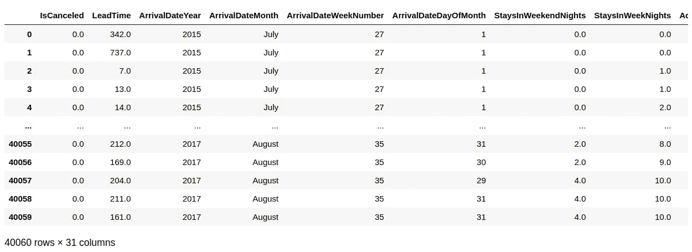

# Pandas 和 SQL 中的日期分组

> 原文：<https://towardsdatascience.com/grouping-dates-in-pandas-and-sql-5d067ab52b99?source=collection_archive---------21----------------------->

## 如何使用 Python 和 SQL 对数据进行分组


来源:图片由[tiger ly 713](https://pixabay.com/users/tigerlily713-194784/)发自 [Pixabay](https://pixabay.com/photos/calendar-date-time-month-week-660670/)

使用数据集时，经常会出现数据格式不适合进行适当分析的情况。

例如，如果我们希望进行时间序列预测，但在同一时间段内存在许多数据点，该怎么办？

在本例中，我们将使用 Antonio、Almeida 和 Nunes 的[酒店预订需求数据集](https://www.sciencedirect.com/science/article/pii/S2352340918315191) (2019)来探索如何使用 Python 的 pandas 和 PostgreSQL 将各个数据点分组到一个时间序列中。

# 熊猫

在这个特定的数据集中，每个预订酒店的客户都有单独的条目，提供了到达的年份和星期:



来源:Jupyter 笔记本输出

此外，当滚动到数据集的右侧时，我们会看到平均日费率(ADR)或客户每天支付的平均费率也显示出来:


来源:Jupyter 笔记本输出

考虑一下这个场景。假设我们希望获得所有客户每周的平均 ADR。我们将如何在熊猫身上实现这一目标？

我们要做的第一件事是[连接](https://datatofish.com/concatenate-values-python/)到达的年份和星期的值。

```
>>> df1 = df['ArrivalDateYear'].map(str) + df['ArrivalDateWeekNumber'].map(str)>>> print (df1)>>> df1=pd.DataFrame(df1)0        201527
1        201527
2        201527
3        201527
4        201527
          ...  
40055    201735
40056    201735
40057    201735
40058    201735
40059    201735
Length: 40060, dtype: object
```

ADR 值数组存储在单独的数据帧中:

```
df2 = DataFrame(c, columns= ['ADR']) 
df2
```


来源:Jupyter 笔记本输出

这两个数据帧又可以连接成一个新的数据帧:

```
df3=pd.concat([df1, df2], axis = 1)
df3
df3.columns = ['FullDate', 'ADR']
df3.sort_values(['FullDate','ADR'], ascending=True)
```


来源:Jupyter 笔记本输出

现在， **groupby** 可用于计算 FullDate 变量的所有相同条目的平均值；即具有相同年数和周数的那些。

```
df4 = df3.groupby('FullDate').agg("mean")
df4
df4.sort_values(['FullDate'], ascending=True)
```


来源:Jupyter 笔记本输出

我们现在有了一个可以用于预测目的的每周时间序列！

# 一种数据库系统

现在，假设我们想使用 PostgreSQL 完成同样的事情。我们将如何着手实现这一目标？

为此，我们将首先在 PostgreSQL 中创建一个表，然后从 CSV 文件中导入相关变量(只有相关变量保存在 CSV 文件中)。

注意，在下面的代码中，ADR 最初被指定为一个 **decimal(4，2)** 数据类型。但是，发现某些值需要比 decimal(4，2)更大的存储空间。

因此，使用如下 ALTER TABLE 将数据类型修改为 **decimal(6，2)** 。

```
hotel=# create table h1 (
hotel(# IsCanceled int,
hotel(# ArrivalDateYear int,
hotel(# ArrivalDateMonth varchar(10),
hotel(# ArrivalDateWeekNumber int,
hotel(# ADR decimal(4,2));
CREATE TABLEhotel=# alter table h1 alter column ADR type decimal(6,2);
ALTER TABLE
hotel=# copy h1 (IsCanceled, ArrivalDateYear, ArrivalDateMonth, ArrivalDateWeekNumber, ADR)
hotel-# from 'H1.csv'
hotel-# DELIMITER ','
hotel-# CSV HEADER;
COPY 40060
```

与 Python 不同，不需要将年份和周数连接起来。相反，我们可以简单地按年份分组并按周数排序，如下所示:

```
select arrivaldateweeknumber, avg(adr) from h1 where arrivaldateyear='2015' group by arrivaldateweeknumber order by arrivaldateweeknumber limit 5;
```


来源:PostgreSQL 输出

假设我们现在希望按 2016 年的所有周分组。我们可以这样做:

```
select arrivaldateweeknumber, avg(adr) from h1 where arrivaldateyear='2016' group by arrivaldateweeknumber order by arrivaldateweeknumber limit 5;
```


来源:PostgreSQL 输出

现在，我们已经用和在 pandas 中一样的方式在 SQL 中形成了时间序列。在现实世界中，人们可以选择使用熊猫来操纵数据。但是，如果从 SQL 数据库导入，这将需要从表中提取过多的数据。

在这种情况下，可以使用 SQL 简单地执行原始数据格式化，然后使用 SQLAlchemy 之类的库进行导入，以便在 Python 中进行进一步的分析。

# 结论

在本文中，您已经看到:

*   如何使用熊猫连接
*   如何将 CSV 数据集导入 PostgreSQL
*   在 PostgreSQL 中使用 GROUP BY 和 ORDER BY 来形成时间序列

非常感谢您的宝贵时间，非常感谢您的任何问题或反馈。

*免责声明:本文是在“原样”的基础上编写的，没有任何担保。它旨在提供数据科学概念的概述，不应被解释为专业建议。本文中的发现和解释是作者的发现和解释，不被本文中提到的任何第三方认可或隶属于任何第三方。作者与本文提及的任何第三方无任何关系。*