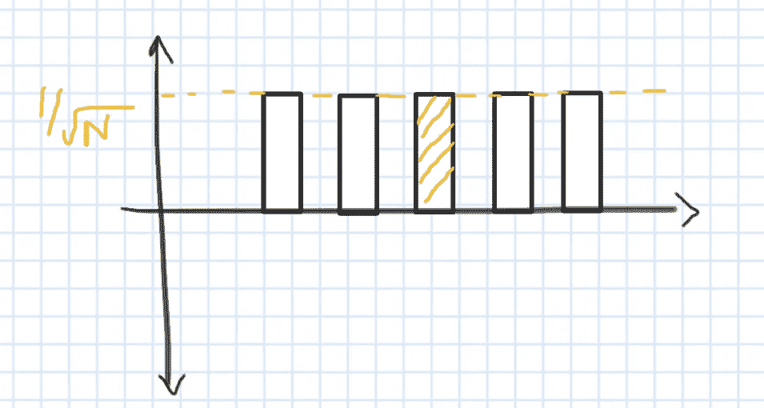
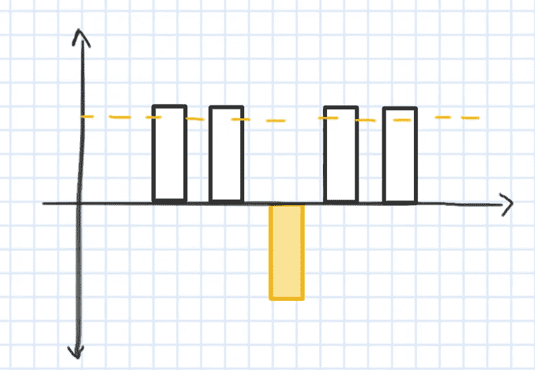
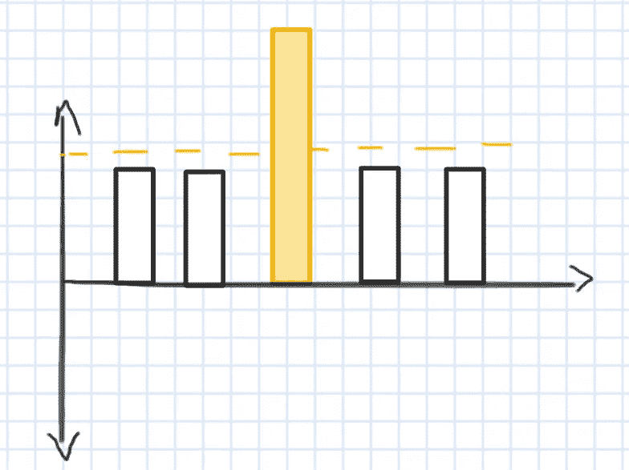

# Grover 算法:数据库搜索的银弹

> 原文：<https://towardsdatascience.com/grovers-algorithm-a-silver-bullet-for-database-search-e30bec4d227?source=collection_archive---------24----------------------->

## 一种量子算法，对非结构化数据库搜索非常有效

由 [Unsplash](https://unsplash.com?utm_source=medium&utm_medium=referral) 上的[克里斯托佛罗拉](https://unsplash.com/@krisroller?utm_source=medium&utm_medium=referral)拍摄的照片

还记得旧的电话号码簿吗？

如果有人问你 XYZ 先生的电话号码。

你将直接进入索引页，搜索姓名以 X 开头的页码，然后按升序搜索 XY，再搜索 XYZ。

没那么糟吧。

但是，如果有人给你电话号码，并要求从同一个电话号码簿中查找那个人的名字，那该怎么办呢？

照片由[亚历山大·克里维茨基](https://unsplash.com/@krivitskiy?utm_source=medium&utm_medium=referral)在 [Unsplash](https://unsplash.com?utm_source=medium&utm_medium=referral) 上拍摄

你的第一反应会是 OMG(天啊)。

这是一个艰难的选择。

有点像大海捞针。

在非结构化数据库中搜索非常相似。

将上面的表格视为 N 个条目的数字干草堆。

你在寻找那个绿色的条目。

经典算法在最坏的情况下(假设绿条在末尾)，将花费 O(N)次来搜索该绿条，如果它尝试随机搜索，则可能花费 O(N/2)次来搜索该条目。

这是一个巨大的数字大海。

科迪·多尔蒂在 [Unsplash](https://unsplash.com?utm_source=medium&utm_medium=referral) 上拍摄的照片

如果我告诉你有一种量子算法，可以让你的速度提高一倍。

是的，有一种叫做**格罗弗搜索算法**的算法可以在 O(N^.5).进行搜索

因此，如果任何经典算法需要 100 万次来搜索一个特定的结果，格罗弗的算法只需要 1000 次。

[萨夫](https://unsplash.com/@saffu?utm_source=medium&utm_medium=referral)在 [Unsplash](https://unsplash.com?utm_source=medium&utm_medium=referral) 上拍摄的照片

似乎印象深刻，对吧！

# 但是格罗弗的搜索算法是什么呢？

这个算法是根据创作者 **Lov Kumar Grover 命名的。**

简单来说，该算法包括两个步骤:

1.  相转化
2.  均值反演

并且这些步骤应该在迭代中执行。一次迭代由这两个步骤组成。

# 但是这是如何工作的呢？

最初考虑将所有数据项叠加到量子电路中。它们都有相同的振幅。

现在，oracle 或函数知道我们的搜索结果是那个黄色条目。

所以现在就出现了基于格罗弗算法的电路的作用。

第一步是相位反转，即在轴上反转特定输入的幅度。

先别庆祝:)

然后下一步是平均反转，有时称为振幅放大。数学上，每个条目(或上图中的条形)可以表示为:

平均值+(平均值-振幅)

它是所有条目的平均值的两倍减去每个条目的幅度。

所以我们寻找的入口的振幅被放大了。

这是一次迭代，即:

相位反转+平均反转

像这样，需要执行多次迭代。直到我们的搜索结果的幅度达到 1 除以 2 的平方根。

概率是振幅的平方，也就是 1/2。

现在是庆祝的时候了。

伊恩·斯托弗在 [Unsplash](https://unsplash.com?utm_source=medium&utm_medium=referral) 上拍摄的照片

是的，最终我们得到了预期的搜索结果。

Grover 的算法是解决 NP 完全问题的福音，在这里我们可以找到一个模式。

# 什么模式？

假设有一个函数 f:{0，1，2，…n-1} → {0，1}

其中 f(x) = 1，求 x。

这个 x 可能是一个非常复杂的模式，比方说一个非常非常复杂的布尔模式。

照片由[迭戈 PH](https://unsplash.com/@jdiegoph?utm_source=medium&utm_medium=referral) 在 [Unsplash](https://unsplash.com?utm_source=medium&utm_medium=referral) 拍摄

在这种情况下，格罗弗的算法可以发挥神奇的作用。

# 最后的想法

Grover 算法的应用在于约束满足问题，例如八皇后难题、数独、类型推理、数字矩阵和其他逻辑问题陈述。

格罗弗的算法被认为是量子计算的一大成就，并吸引公司将其视为计算的未来趋势之一。

在像这样的用例中，量子计算机肯定可以对经典计算机说:“拿着我的啤酒！”