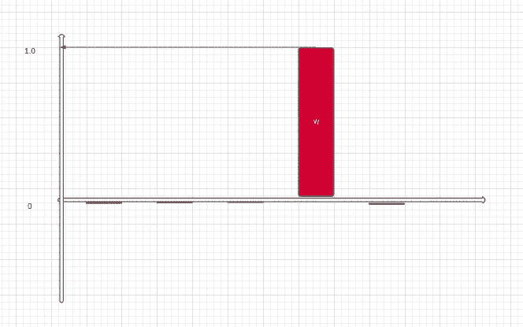

# 格罗弗搜索算法|简化

> 原文：<https://towardsdatascience.com/grovers-search-algorithm-simplified-4d4266bae29e?source=collection_archive---------11----------------------->

## 在这篇博客中，我将试图让你明白格罗弗的搜索算法到底是如何工作的，以及它与经典计算算法的不同之处

量子计算

参观:[amitnikhade.com](https://amitnikhade.com/)

> 当你改变看待事物的方式时，你看待的事物也会改变。**——马普**

照片由[迈克尔·泽兹奇](https://unsplash.com/@lazycreekimages?utm_source=unsplash&utm_medium=referral&utm_content=creditCopyText)在 [Unsplash](https://unsplash.com/s/photos/quantum?utm_source=unsplash&utm_medium=referral&utm_content=creditCopyText) 上拍摄

> 我试着将算法简化到最大程度，让初学者也能理解。

## 介绍

就解决复杂问题的速度而言，量子计算已经击败了经典计算机。量子计算机利用量子物理学的现象来存储数据和执行计算。量子记忆的基本单位是量子比特，类似于经典计算机中的比特 0 和 1。但是，仍然存在经典计算机击败量子计算机的问题，所以根据计算需要使用它们将是加速计算的一种优越组合。

让我们深入了解量子计算中最重要的算法之一 [Lov Kumar Grover](https://en.wikipedia.org/wiki/Lov_Grover) ，他在 1996 年发现了 Grover 的搜索算法，这位印度科学家被称为印度最杰出的计算机科学家之一。

## 算法

Grover 算法，即量子算法，解决了计算领域中的一个复杂场景。这是为量子计算提出的第二个主要算法。它解决了搜索非结构化数据的问题。让我们再深入一点。

让我们考虑这样一种情况，你有一个未排序的数 N 的列表，如下图所示，你想从中找出一个值 w(红框),它具有一些独特的属性。那么你怎么能找到 w 呢？

图 1n 个数字列表

经典方法:在经典计算中，我们必须检查列表中平均 N/2 的项目。简单地说，你必须一个接一个地验证它们，这需要 N 个步骤，即 O(N)。如果添加随机访问和预排序来对有序数据实现二分搜索法，则需要 log(N)个步骤，即 O(log(N))。然而，使用量子算法大约需要√N 步，即 O(√N)为了找到 w，例如，我们有一个 25 个元素的列表，我们想从列表中搜索一个值，传统上需要 N 步，而使用量子算法需要√N 步，即传统上需要 25 步，平方需要√25=5 步。

它利用叠加和相位干涉来改进搜索。在搜索我们想要的元素时，振幅放大起着非常重要的作用。让我们想象一下振幅放大。

振幅放大是增加要搜索的值的概率振幅并减少其余概率振幅的过程

考虑下面的 Kets ( *k1，k2，k3，…..kn* )在平衡叠加中，我们想要搜寻 *kw* ，因此通过执行振幅放大，我们和当 kets 被发送用于放大过程时，第一个先知将 *kw* ket 从 0 . 0 到 0 . 5 的概率颠倒为负相位，这将其与其他 kets 分开。

图 2 甲骨文

第二个神谕通过计算其平均值(即平均值)来反演所有振幅。这导致振幅 *A∉千瓦的减少。*并增加 *kw* ket，使 *kw* 变为 1，其余 ket 变为 0

图 3 扩散器

在最后阶段，用与列表中的项目相关的编码值来测量来自第二个预言的状态。并将结果状态映射回数据库。如果答案不正确，重复这些步骤。错误概率为 O(1/N)。

*   这里你可以假设 oracle 和 diffuser 只是两个黑盒，它们对量子位执行特定的操作。

首先将 oracle 表示为 Uf，第二个表示为 Uφ，这是 Grover 的扩散算子。这些神谕重复√N 次。如果匹配是 m 的倍数，那么神谕被重复√(N/t)次。Grover 搜索也可以用于搜索多个元素。

图 4 格罗弗算法电路[ [来源](https://upload.wikimedia.org/wikipedia/commons/thumb/a/ae/Grovers_algorithm.svg/500px-Grovers_algorithm.svg.png)

上图是遵循下面算法的格罗弗算法电路。

让我们快速浏览一下格罗弗的量子算法

该算法总结如下:

1.  从量子位中选择一个你想搜索的随机值。
2.  将所有的量子位传递到 Hadamard 门 h，使其叠加。

1.  构造翻转待搜索对象的[振幅](https://www.britannica.com/science/amplitude-physics#:~:text=Amplitude%2C%20in%20physics%2C%20the%20maximum,length%20of%20the%20vibration%20path.)的 oracle f。
2.  构建围绕平均值反转的扩散器。

1.  对单个目标重复 oracle √N 次，对多个目标重复√(N/t)。
2.  最后，用数据库中的值验证状态。
3.  喝一口咖啡。你完了。

*   **叠加**是量子系统同时处于多个状态的能力

**注意:如果增加迭代次数，性能会下降。**

## 事实

1.  量子电路对电磁场、碰撞、空气分子和热量很敏感，这些都会导致量子位失去量子属性
2.  量子计算机被保存在极其寒冷的环境中，因为亚原子粒子必须尽可能接近静止状态。

## 结论

Grover 算法通过二次加速已经优于经典的搜索方法。量子计算机具有在极短的时间内完成复杂计算的趋势，与经典计算机相比，这需要数年时间。

## 参考

这些链接对我理解算法帮助很大，请访问它们。

 [## Qiskit

### Qiskit 是一个开源软件开发包(SDK ),用于 OpenQASM 和 IBM Q quantum 处理器…

qiskit.org](https://qiskit.org/)  [## 格罗弗算法-维基百科

### 在量子计算中，格罗弗算法，也称为量子搜索算法，指的是一种用于…

en.wikipedia.org](https://en.wikipedia.org/wiki/Grover%27s_algorithm) 

## 关于我

 [## Amit Nikhade - JSPM 拉贾什胡莎工程学院-马哈拉施特拉邦阿科拉

### 在我的杯子里装了很多咖啡，为普通智力革命而工作。我是一个热爱享受的人…

www.linkedin.com](https://www.linkedin.com/in/theamitnikhade/)  [## AmitNikhade -概述

### 这是我的方式或没有办法🂮 |人工智能和机器人爱好者|机器学习，深度学习，NLP，物联网…

github.com](https://github.com/AmitNikhade)  [## 米特尼克哈德-中等

### “计算机视觉”是人工智能的一个领域，它帮助机器将这个美丽的…

amitnikhadeofficial.medium.com](https://amitnikhadeofficial.medium.com/?source=your_stories_page-------------------------------------)