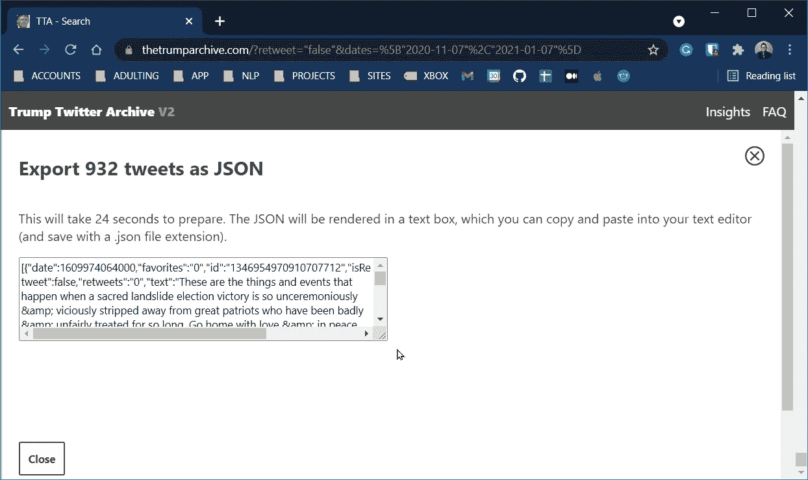
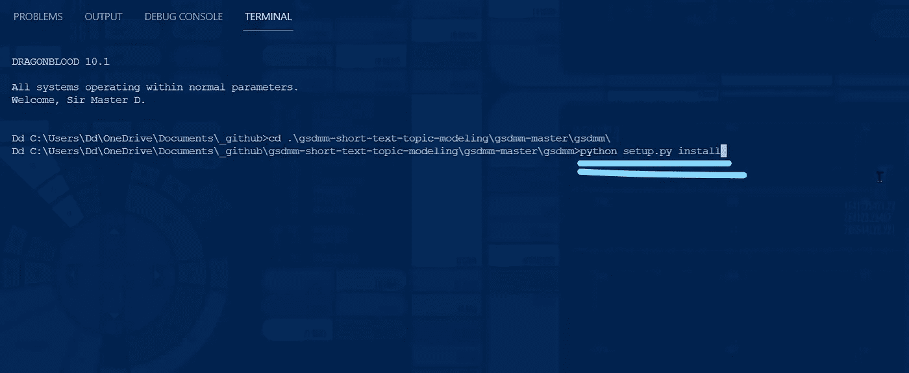

# GSDMM:社交媒体帖子和评论的主题建模

> 原文：<https://towardsdatascience.com/gsdmm-topic-modeling-for-social-media-posts-and-reviews-8726489dc52f?source=collection_archive---------8----------------------->

## 自然语言处理

## 面向大胆的 NLP 初学者的实践教程


比诺勒在 [Unsplash](/s/photos/chucks?utm_source=unsplash&utm_medium=referral&utm_content=creditCopyText) 上拍摄的照片

***警告！*** *这是一篇史诗般的帖子。我真的希望读者能够按照本文概述的步骤，从头到尾重复这个过程。我附上了很多截图，让事情变得清晰易懂。*

在本帖中，我们将查看一组推文，并尝试确定其主题。但首先，有一点背景。

# 什么是主题建模？

正如 [yamini5](https://www.analyticsvidhya.com/blog/author/yamini5/) 在 [Analytics Vidhya](https://www.analyticsvidhya.com/blog/2021/05/topic-modelling-in-natural-language-processing/) 上所写的，“主题建模*【原文】*指的是识别最能描述一组文档的主题的任务。”简单地说，主题建模指的是摄取一堆非结构化和无标签的文本数据，然后将它们分类到它们所代表的不同主题中的过程。例如，我们可能有艾米莉·狄金森的诗集。当我们试图对它们进行分类时，我们可能会以生命、死亡和爱情为主题。主题建模指的是计算机如何使用一些奇特的数学来完成所有这些(我们不会谈论这些，LOL)。

一种流行的主题建模算法是 LDA 或潜在的狄利克雷分配。然而，LDA 有两个主要限制:1)它假设文本是主题的混合，2)它在短文本(< 50 个单词)上表现不佳。

进入我们的主角:GSDMM。

GSDMM 是 Gibbs Sampling Dirichlet Multinomial Mixture 的缩写，是由尹建华和王建勇提出的比 vanilla LDA 更好的模型。它假设一个文档只涉及一个主题，对于像 tweets 和电影评论这样的短文本非常有用。如果你想要算法背后的直觉，Matyas Amrouche 有一篇[很棒的文章](/short-text-topic-modeling-70e50a57c883)。或者，如果你愿意，你可以在这里阅读原文。

</short-text-topic-modeling-70e50a57c883>  <https://dl.acm.org/doi/10.1145/2623330.2623715>  

# 数据

今天，我们将采用前总统唐纳德·特朗普的一系列推文，并尝试应用主题建模。这个实践教程旨在为前总统特朗普的每一条推文分配一个主题。

让我们开始吃吧。


首先，转到[thetrumparchive.com](https://www.thetrumparchive.com/)，点击“转发过滤器”和“隐藏转发”按钮，从我们的分析中排除这些转发。


然后，点击“日期过滤器”,设置日期范围从 2020 年 11 月 7 日到 2021 年 1 月 7 日。


接下来，我们将把 tweets 导出到一个 json 文件中。点击“导出”按钮。


单击“开始导出”继续该过程。


这是你在处理过程中看到的。


完成后，单击出现的框的右下角，并将其向右拖动，使其更大，更容易看到。


单击文本框内的某个位置，然后按 CTRL+A(同时按下 CTRL 键和键盘上的字母“A ”)来选择文本框内的所有内容。



一旦选择了所有内容，框内的所有内容都将高亮显示。


将光标放在蓝色突出显示区域上，然后右键单击。选择“复制”复制所有突出显示的内容。


接下来，打开你最喜欢的文本编辑器(Notepad，Sublime，notepad++)，创建一个新文档，粘贴所有内容。


接下来，点击主菜单中的文件并选择“另存为…”


然后，将文件保存为 json 文件。


下一步，我们将下载并设置 GSDMM。

# GSDMM 设置

对于这一步，让我们来看看 Ryan Walker 在 [Github](https://github.com/rwalk/gsdmm) 上实现的 GSDMM。


找到标有“Code”的绿色按钮，单击它以显示下拉面板。寻找“下载 ZIP”并点击它。


将 zip 文件保存在工作文件夹中。


然后，提取其内容。


有时我喜欢保持简单，所以我将子文件夹重命名为“gsdmm ”,如下所示:


不要忘记注意到目前为止你的目录/文件夹结构。


在这种情况下，文件“setup.py”位于目录“GSD mm-short-text-topic-modeling \ GSD mm-master \ GSD mm”下，因此我在那里安装了 cd 并执行了下面一行:

```
python setup.py install
```



现在我们已经准备好用 Python 摇滚了！

# 代码

让我们启动 jupyter 笔记本，开始编码吧！

首先，让我们完成所有的导入并设置笔记本环境。

然后，让我们从之前保存的 json 文件中引入数据。

下面是一些用于预处理文本的函数。在这里，我们清理特殊字符，删除停用词，并堵塞令牌。然后，我们在一个名为 docs 的列表中逐个添加清理过的单词(或记号)。

在下面的要点中，我们将调用 MovieGroupProcess 来为我们进行主题聚类。

这就是奇迹发生的地方。要记住的一件事是将 *alpha* 和 *beta* 值调整到最适合数据的值。此外，将 *n_iters* 调整到一个足够高的数值，以使模型收敛并稳定。最后，将 *K* 调整到一个足以覆盖您认为将要拥有的集群数量的数字。在这种情况下，我们从 15 个集群开始，到最后的 7 个集群结束。


让我们看看我们有什么。

下面的数组表示分配给每个 *K* 主题的文档(或 tweets)数量。我们有 15 个，但注意到有些是 0。我们只关心那些不是 0 的主题。


让我们按照重要性的顺序重新排列集群。

下面，第九个簇(或索引 8)是最重要的，因为它内部有 606 个文档。第二重要的是第一个集群(索引 0 ),它有 239 个文档。


让我们试着弄清楚这些主题群是关于什么的！

如上所述，下面的函数调用产生每个主题群中出现的顶部单词。


接下来，我们将集群重命名为主题#1 到主题#15，主题#1 最重要，主题#15 最不重要。

下面的代码片段定义了一个函数，该函数将使用原始文本及其指定的主题创建一个 dataframe。

在上述功能中，未达到 0.3 阈值的主题将被合并到“其他”类别中。


做一个快速的 value_counts，我们会看到每个主题的分布。


瞧啊。

就这样，伙计们！我们已经成功地为数据集中的每条推文分配了一个主题。

谢谢你过来看我的帖子。我希望它能激发你学习更多关于 GSDMM 的知识，并在其他社交媒体帖子和评论中试用它:-)。

*如果你想了解更多关于我从懒鬼到数据科学家的旅程，请查看下面的文章:*

</from-slacker-to-data-scientist-b4f34aa10ea1>  

*如果你正在考虑改变方向，进入数据科学领域，现在就开始考虑重塑品牌:*

</the-slackers-guide-to-rebranding-yourself-as-a-data-scientist-b34424d45540>  

*敬请期待！*

你可以在 Twitter 或 LinkedIn 上找到我。