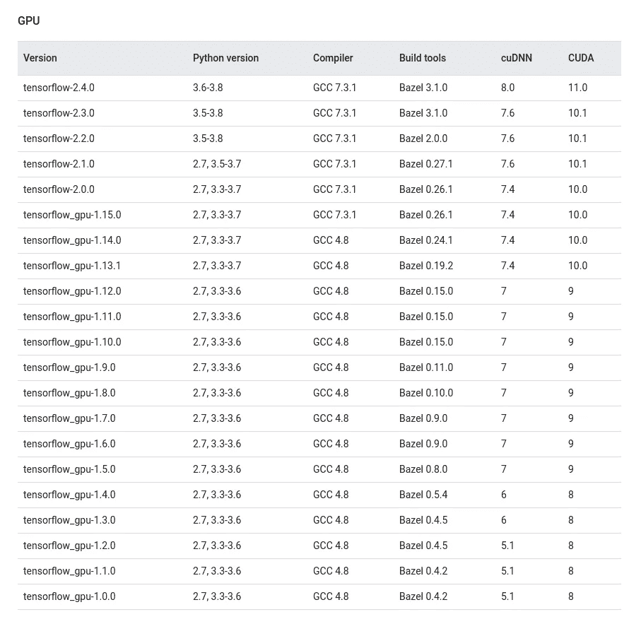
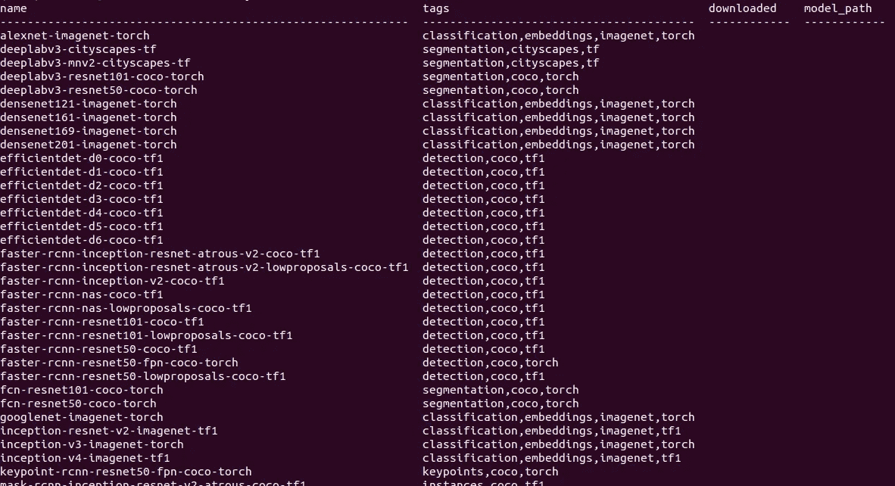
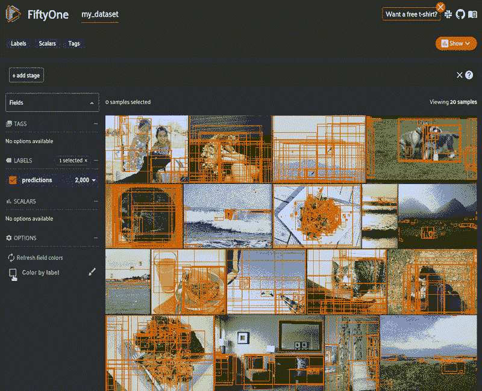
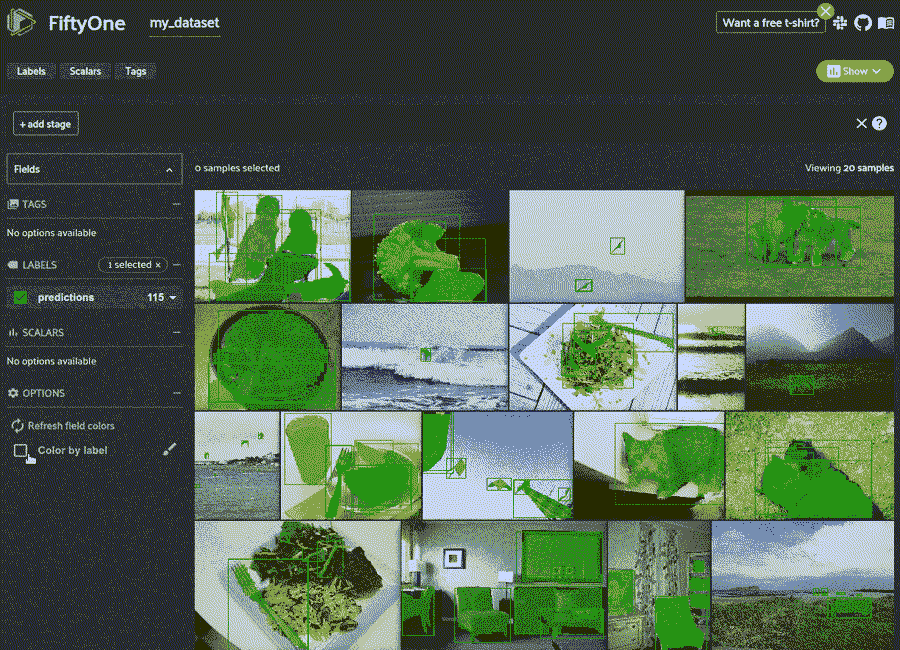
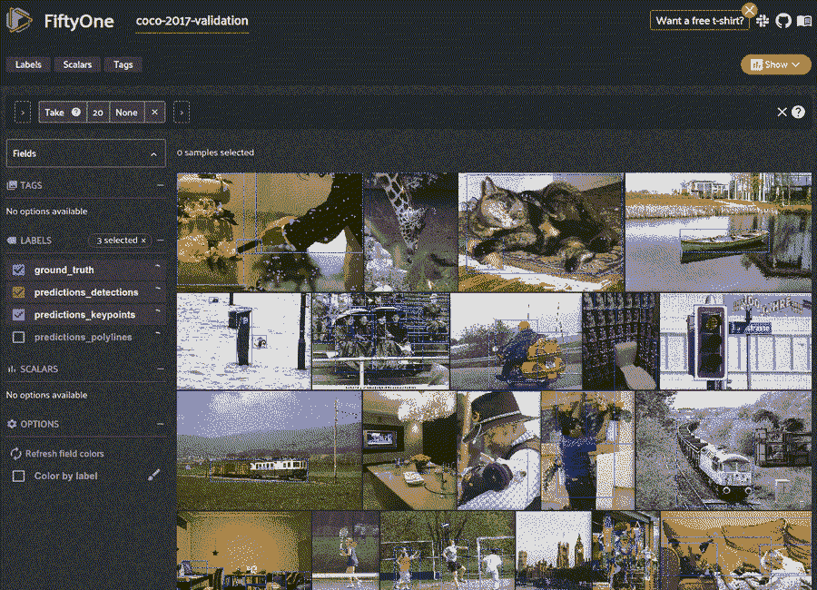

# TensorFlow 和 PyTorch 的 Conda 指南

> 原文：<https://towardsdatascience.com/guide-to-conda-for-tensorflow-and-pytorch-db69585e32b8?source=collection_archive---------4----------------------->

## 了解如何为不同版本的 CUDA、TensorFlow 和 PyTorch 设置 anaconda 环境


维多利亚[博物馆](https://unsplash.com/@museumsvictoria?utm_source=medium&utm_medium=referral)在 [Unsplash](https://unsplash.com?utm_source=medium&utm_medium=referral) 上拍摄的照片

真的很遗憾，大多数人对深度学习的第一次体验是不得不花几天时间试图找出为什么他们从 GitHub 下载的模型就是…不能…运行…

当试图运行现成的模型时，依赖性问题非常普遍。其中最大的问题是需要为 TensorFlow 安装正确版本的 CUDA。TensorFlow 多年来一直很突出，这意味着即使是新发布的模型也可以使用旧版本的 TensorFlow。除了感觉 TensorFlow 的每个版本都需要一个特定版本的 CUDA，而其他任何版本都不兼容之外，这不是一个问题。可悲的是，在同一台机器上安装多个版本的 CUDA 真的很痛苦！



[TensorFlow CUDA 版本匹配](https://www.tensorflow.org/install/source#gpu)

经过多年的头痛，感谢 Anaconda 的帮助，我终于意识到安装 TensorFlow 和正确的 CUDA 版本可以像下面这样简单:

```
conda create --name tf
conda activate tf
conda install tensorflow-gpu
```

# Conda 与 pip 虚拟环境

由于对`pip`和`conda`之间的区别理解错误，我之前只用过`pip`。真的只是知道`pip`是“官方”的 Python 包管理器。

两者之间的主要区别是`conda`环境不仅仅是针对 Python 包的。像 CUDA 这样的库可以安装在您的隔离环境中。另一方面，有些包在`conda`中不存在，你必须通过`pip`安装它们，这是人们可能会偏离`conda`的一个原因。同时使用`conda`和`pip`有时会很棘手，但是我会在这篇文章的后面提供一些技巧来解决这个问题。

如果您想开始使用`conda`，请遵循链接中的 [anaconda 安装说明。在`pip`和`conda`之间，创建、激活和删除环境的基本命令非常相似。](https://docs.anaconda.com/anaconda/install/)

## 创造环境

```
*# pip* virtualenv env_name*# conda* conda create --name env_name
```

## **激活环境**

```
*# pip* source /path/to/env_name/bin/activate*# conda* conda activate env_name
```

**注意**:安装 anaconda 后，它会自动创建并激活一个基础环境。建议您自己创建新环境。使用以下命令关闭自动激活:

```
conda config --set auto_activate_base false
```

## 删除环境

```
*# pip* cd /path/to/env_name
rm -rf env_name*# conda* conda env remove -n env_name
```

# 例子

下面是一些如何加载存在于[五十一模型动物园](https://voxel51.com/docs/fiftyone/user_guide/model_zoo/index.html)中的 TensorFlow 和 PyTorch 模型的例子。 [FiftyOne](https://voxel51.com/docs/fiftyone/index.html) 是一款开源工具，用于机器学习工程师以一种易于修改、可视化和分析的方式存储他们的数据、标签和模型预测。包含在[51](https://voxel51.com/docs/fiftyone/index.html)中的是一个计算机视觉模型的动物园，它们只有一行代码，将用于轻松测试我们的`conda`环境设置。



第五十一模型动物园中的模型子集(图片由作者提供)

**注**:安装带 GPU 功能的 TensorFlow 需要支持 CUDA 的卡。[这里是一个支持 CUDA 的 GPU 列表](https://developer.nvidia.com/cuda-gpus)。

## 使用 Tensorflow 2。x 型号

```
conda create --name tf2
conda activate tf2
conda install tensorflow-gpu
```

[FiftyOne 支持各种格式的图像和视频数据集](https://voxel51.com/docs/fiftyone/user_guide/dataset_creation/index.html#loading-datasets)。在这些例子中，我只有一个图像目录，我将把它加载到 FiftyOne 来生成模型预测。如果您传入`/path/to/dataset`并指定您使用的数据集类型为`fiftone.types.ImageDirectory`，那么您可以使用自己的图像目录。

这个例子中的大部分工作，我使用的是[51 命令行界面(CLI)](https://voxel51.com/docs/fiftyone/cli/index.html) 。

```
pip install fiftyone*# Create a dataset from the given data on disk*
fiftyone datasets create \
    --name my_dataset \
    --dataset-dir /path/to/dataset \
    --type fiftyone.types.ImageDirectory
```

我可以下载我想要使用的模型，然后检查它是否满足要求。

```
*# Download a model from the zoo* fiftyone zoo models download centernet-hg104-512-coco-tf2*# Ensure you installed all requirements* fiftyone zoo models requirements \
    --ensure centernet-hg104-512-coco-tf2*# This model is from the TF2 Model Zoo which must be installed*
eta install models
```

然后，我会将该模型应用到数据集，以生成预测并在 FiftyOne 应用程序中可视化它们。

```
*# Apply a model from the zoo to your dataset*
fiftyone zoo models apply \
    centernet-hg104-512-coco-tf2 \  
    my_dataset \                    
    predictions *# Launch the FiftyOne App to visualize your dataset*
fiftyone app launch my_dataset
```



查看带有来自 centernet-Hg 104–512-coco-tf2 的预测的数据集(图片由作者提供)

## 使用 TensorFlow 1。x 型号

```
conda create --name tf1
conda activate tf1
```

您可以搜索可用的软件包，然后选择要安装的 TensorFlow 版本。这将在您的`conda`环境中安装相应的 CUDA 版本。

```
conda search tensorflow-gpu
conda install tensorflow-gpu=1.15
```

除了使用 TensorFlow 1 的模型之外，我将使用与 TensorFlow 2 示例中相同的过程。

```
pip install fiftyone*# Download a model from the zoo* fiftyone zoo models download mask-rcnn-resnet101-atrous-coco-tf*# Create a dataset from the given data on disk*
fiftyone datasets create \
    --name my_dataset \
    --dataset-dir /path/to/dataset \
    --type fiftyone.types.ImageDirectory*# Apply a model from the zoo to your dataset*
fiftyone zoo models apply \
    --error-level 1 \
    mask-rcnn-resnet101-atrous-coco-tf \     
    my_dataset \                              
    predictions *# Launch the FiftyOne App to visualize your dataset*
fiftyone app launch my_dataset
```



查看带有 mask-rcnn-resnet 101-atrous-coco-TF 预测的数据集(图片由作者提供)

## 使用 PyTorch 模型

安装 PyTorch 稍微容易一点，因为它是用多个版本的 CUDA 编译的。这给了我们使用任何版本 CUDA 的自由。撰写本文时(2021 年 1 月)的默认安装说明推荐 CUDA 10.2，但 PyTorch 有一个 CUDA 11 兼容版本。

```
conda create --name pyt
conda activate pyt
conda install pytorch torchvision torchaudio cudatoolkit=10.2 \
    -c pytorchpip install fiftyone
```

对于这个例子，我将使用 Python API 来执行与我们之前使用命令行几乎相同的步骤。唯一的区别是我们使用的模型，我们正在从[51 数据集动物园](https://voxel51.com/docs/fiftyone/user_guide/dataset_zoo/index.html)加载数据集。



查看来自 key point-rcnn-resnet 50-fpn-coco-torch 的带有预测的数据集(图片由作者提供)

**注意**:如果你用的是 Mac，需要 GPU 支持，从源码安装 PyTorch。

# 常见问题

当我从`pip`切换到`conda`时，出现了三个问题，这需要一点时间来解决。

## 1) Pip 可以在 conda 内部运行

如果您想要使用的包只存在于`pip`中，您可以使用`pip`将其安装在您的`conda`环境中。然而，`pip`和`conda` [在一起并不总是打得好](https://www.anaconda.com/blog/using-pip-in-a-conda-environment)。

主要问题是`conda`不能控制它没有安装的包。因此，如果在`conda`环境中使用`pip`，那么`conda`不会意识到这些变化，可能会破坏环境。

当一起使用`pip`和`conda`时，请遵循张克帆·赫尔默斯的提示:

*   **千万不要在** `**pip**`后使用 `**conda**` **。用`conda`安装你能安装的所有东西，然后用`pip`安装剩余的软件包**
*   创造新的`conda`环境。使用`pip`会导致环境崩溃，所以在安装`pip`包之前，一定要创建一个新的隔离的`conda`环境。
*   如果你在使用了`pip`之后需要安装一个`conda`包，最好是创建一个新的环境，并按照正确的顺序重新安装所有的东西。

## 2)康达环境并不是全球孤立的

创建`pip`虚拟环境时的默认行为是，在新环境中，您不能访问全局安装的`pip`包。如果您想要访问全局包，您需要使用以下内容初始化您的虚拟环境:

```
virtualenv env --system-site-packages
```

另一方面，`conda`允许您默认访问全局系统软件包。如果您希望环境与这些全局包完全隔离，就像使用`pip`一样，您可以基于一个空的 `pip` virtualenv 的克隆来创建`conda` [环境。](https://github.com/conda/conda/issues/7173)

```
virtualenv empty_env
conda create -n env --clone empty_env
```

理想情况下，你应该避免安装全局`pip`包，所以这不应该是一个问题。

## 3)需要指定 CUDA 路径

如果您在系统范围内安装了 CUDA，那么在您的`conda`环境中安装 CUDA 后，`LD_LIBRARY_PATH`环境变量可能会指向错误的位置。

要解决这个问题，当您进入您的`conda`环境时，您需要更新`LD_LIBRARY_PATH`以指向在`conda`中包含`cuda`的目录(通常该目录是`/path/to/conda/pkgs/`)。然后，当您离开`conda`环境时，您会希望将它指向 CUDA 的系统级安装。

首先，导航到您的`conda`环境位置并创建以下文件和文件夹:

```
cd /path/to/anaconda/envs/my_env
mkdir -p ./etc/conda/activate.d
mkdir -p ./etc/conda/deactivate.d
touch ./etc/conda/activate.d/env_vars.sh
touch ./etc/conda/deactivate.d/env_vars.sh
```

在`activate.d/env_vars.sh`中添加以下几行。用在您的`conda`环境中安装 CUDA 的路径替换`/your/path`。

```
#!/bin/bashexport OLD_LD_LIBRARY_PATH=${LD_LIBRARY_PATH}
export LD_LIBRARY_PATH=/your/path:${LD_LIBRARY_PATH}
```

一般来说，这个`/your/path`应该是这样的:

```
export LD_LIBRARY_PATH=/home/user/conda/pkgs/cudatoolkit-10.2/lib:${LD_LIBRARY_PATH}
```

然后在`deactivate.d/env_vars.sh`中添加以下几行:

```
#!/bin/bashexport LD_LIBRARY_PATH=${OLD_LD_LIBRARY_PATH}
unset OLD_LD_LIBRARY_PATH
```

# 摘要

用`conda`只用几个命令就能安装非 Python 包，比如 CUDA，这简直是天赐之物。结合使用`conda`和[51 模型动物园](https://voxel51.com/docs/fiftyone/user_guide/model_zoo/index.html)意味着你可以在几分钟内从几十个模型中生成预测。然而，如果您没有做好准备，从`pip`虚拟环境切换到`conda`环境可能会导致一些意想不到的行为。