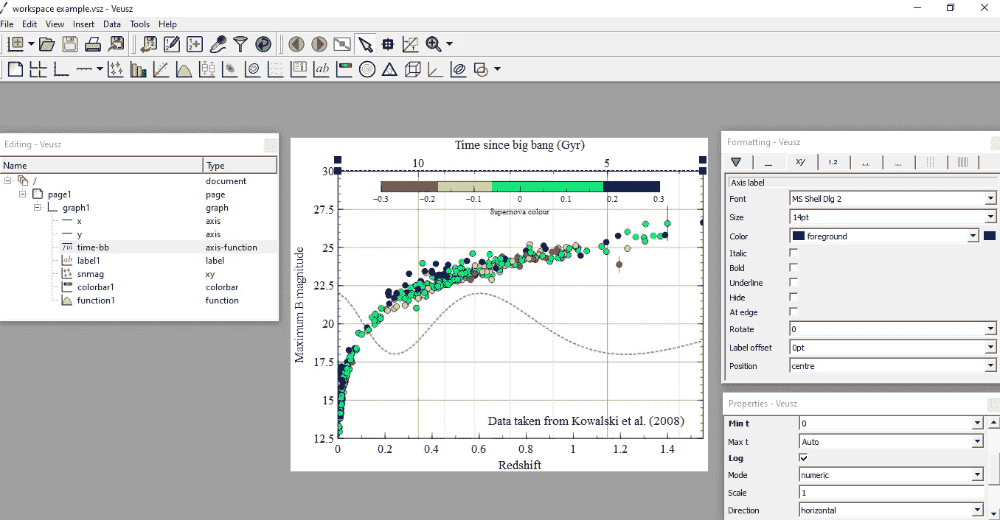
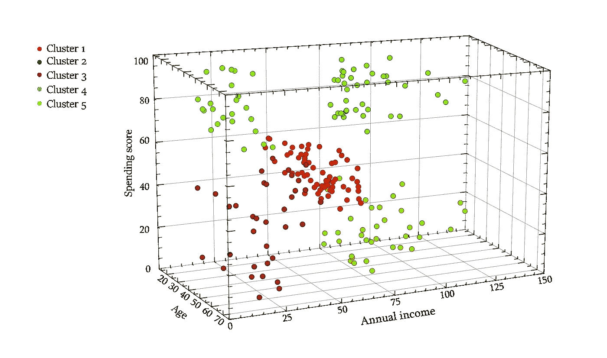
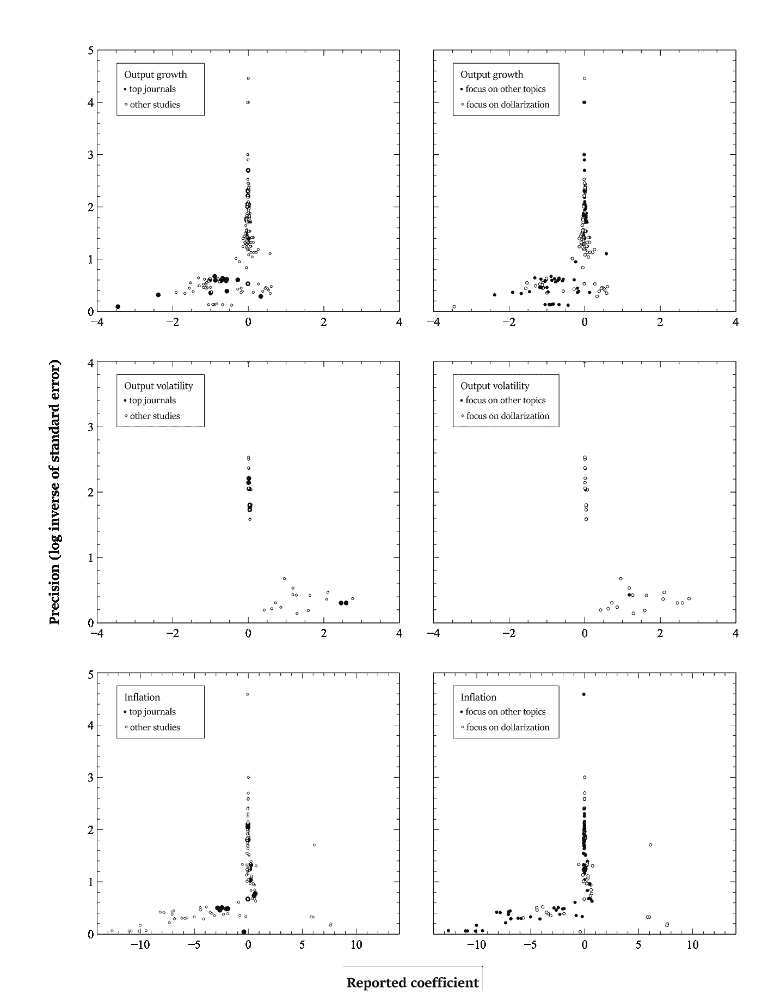

# 在 Veusz 中创建科学地块的指南

> 原文：<https://towardsdatascience.com/guide-to-creating-scientific-plots-in-veusz-cb843e68bd59?source=collection_archive---------31----------------------->

## [实践教程](https://towardsdatascience.com/tagged/hands-on-tutorials)

## 为 Veusz 的专业和学术期刊创建图表的综合指南。


由[迪诺·瑞奇穆斯](https://unsplash.com/@dinoreichmuth?utm_source=medium&utm_medium=referral)在 [Unsplash](https://unsplash.com?utm_source=medium&utm_medium=referral) 上拍摄的照片

eusz 是一个图形程序，旨在为学术和专业期刊制作出版就绪的图形。它是免费提供的，并与 Python 很好地集成在一起。凭借创建 2D 和 3D 图形的强大能力，Veusz 帮助研究人员可视化他们在社会科学、工程、生物、医学等领域使用的所有类型的数据结构。

在学术期刊中，编辑需要高度发展的图表，但是一些统计程序并不能提供高质量的图表在像样的期刊上发表。Veusz 是一个简单而强大的工具，用于准备高质量的图形，研究人员可以使用它来可视化他们的结果。尽管有这些好处，但数据科学家和研究人员似乎并没有很好地意识到 Veusz 提供的所有可能性。因此，这篇文章表明:

*   Veusz 工作空间简介
*   一些不太常见的图表示例
*   与其他程序相比，使用 Veusz 的好处。

最后，我还将提到用户在使用该程序时会发现的一些缺点。

# Veusz 工作空间

Veusz 允许以三种方式格式化图表:

*   在 Veusz GUI 中手动格式化
*   命令行
*   用作 Python 模块。

手动格式化包括导入数据和手动编辑图表以构建 2D 或 3D 产品。在 Veusz 中，通过构建绘图小部件、特定元素(图表、轴、文本标签等)来创建绘图。)用户在编辑窗口中添加或移除。小部件的属性在属性窗口中编辑，它们的外观和形式(字体、轴线颜色、标签颜色等。)在格式化窗口中。

以下是 Veusz GUI 的外观:



来源:自己的工作与一个 [Veusz 的例子。](https://veusz.github.io/examples/)

## 命令行界面

控制 Veusz 的另一种方法是通过它的命令行界面。因为 Veusz 是用 Python 编程的，所以它使用 Python 作为它的脚本语言。因此，您可以在命令行中自由混合使用 Veusz 和 Python 命令。当命令在 Veusz 窗口的命令提示符中输入时，它支持简化的命令语法，其中命令名称后面的括号可以由 Veusz 命令中的空格替换。

Veusz 还可以从文件中读取 Python 脚本。NumPy 包已经导入到命令行界面中。

## 用作 Python 模块

Veusz 可以用作绘制数据的 Python 模块。因此，标准 python 库(如 Matpotlib、Seaborn 或 Plotly)又多了一个竞争对手。例如，这段代码构建了一个简单的 x 平方图，它变成了 x 立方图(引用自[官方文档](https://veusz.github.io/docs/manual/api.html#using-veusz-from-other-programs)):

```
**import** **veusz.embed** **as** **veusz**
**import** **time***#  open a new window and return a new Embedded object*
embed = veusz.Embedded('window title')*#  make a new page, but adding a page widget to the root widget*
page = embed.Root.Add('page')*#  add a new graph widget to the page*
graph = page.Add('graph')*#  add a function widget to the graph.*
function = graph.Add('function', function='x**2')function.function.val = 'x**3'
```

图形导出可能包括 TIFF 格式和其他标准格式(JPG、PNG 和其他几种格式)。

# **维尤兹的精彩剧情**

## 三维绘图

与其他一些图形软件包相比，Veusz 最大的竞争优势可能是它能够绘制复杂的 3D 图形。让我们用一个简单的例子来演示一下。

K-means 聚类算法通常用于将客户群聚类为具有相似特征的离散客户组。类似地，它可以将国家、家庭或其他单位聚集成更一致的组。聚类通常出现在 2D 散点图中。为了让它更有趣，我添加了 *Z-* 轴，其中包含了回答者的年龄。

Veusz 提供了输出数据的出色的 3D 可视化。作为一个例子，我使用的是商场客户细分数据集，该数据集可从 Kaggle 免费获得，用于学习目的:

<https://www.kaggle.com/vjchoudhary7/customer-segmentation-tutorial-in-python>  

彩色 3D 散点图显示:

*   客户在 *X-* 轴上的消费得分
*   *Y-* 轴上的客户年收入
*   *Z* 轴上的客户年龄
*   使用 K-means 识别客户群。



来源:自己的作品。

这个图是彩色的，但是编辑通常想要灰度图。例如，通过使用主 GUI 中的格式化窗口，它可以被快速转换成灰度图像。

## Matlab 漏斗图

漏斗图是一种图表，用于检查系统综述和荟萃分析中是否存在发表偏倚。这是一个 2D 图，在 *x* 轴上绘制了调查研究的回归系数，在 *y* 轴上绘制了观察数量(或估计的标准误差)。

大多数在经济研究中使用元分析的文章都在 STATA 中格式化他们的图表，这产生了相当平均质量的漏斗图。另一方面，Veusz 制作的漏斗图看起来更整洁、更精致。它们类似于 Matlab 图形，我认为这是学术期刊绘图质量的黄金标准。

以下漏斗图显示了 Veusz 在为系统评价和荟萃分析准备图表方面的可能性。他们揭示了一篇文章中的出版偏见，这篇文章现在正在一家高级期刊上进行修订。



资料来源:Koráb，Fidrmuc，Dibooglu (2021 年)，正在修订中。

# 缺点和局限性

由于 Veusz 是一个免费提供的程序，它有几个缺点值得一提:

*   几个情节没有实现，或者他们的制造是费时的。例如，这些可能是小提琴图或简单的热图
*   我没有找到一些基本的功能，比如在 *Y* 轴上的水平编号。这可能有点令人沮丧，但我总能找到一些变通方法来根据需要准备图表
*   有些功能可能不是很直观，所以需要一些时间来学习所有必要的细节。

# 结论

Veusz 是一个简单但功能强大的工具，用于可视化数据并为学术和专业期刊准备出版就绪的图。与其他类似的软件包相比，如[适马图](https://systatsoftware.com/downloads/download-sigmaplot/)，Veusz 是免费的，它也定期更新新的功能和图表类型。它需要一些初始时间投资，但最终，它会带来回报，并创建非常好的图形。使用 Veusz 的一大好处是主 2D 和 3D 图表已经[准备好了](https://veusz.github.io/examples/)，可供任何用户使用。只需导入您的数据，稍作编辑，图表就完成了。尽管有几个缺点，用户可以利用许多格式选项和“玩”图形，直到他们得到完美的结果。

顺便说一下，它的名字应该读作“views”…

*PS:你可以订阅我的* [*邮件列表*](https://medium.com/subscribe/@petrkorab) *在我每次写新文章的时候得到通知。如果你还不是中等会员，你可以在这里加入*<https://medium.com/@petrkorab/membership>**。**