# ggplot2 数据可视化指南

> 原文：<https://towardsdatascience.com/guide-to-data-visualization-with-ggplot2-in-a-hour-634c7e3bc9dd?source=collection_archive---------16----------------------->


扬·巴布拉克在 [Unsplash](https://unsplash.com?utm_source=medium&utm_medium=referral) 上拍摄的照片

# 介绍

我一直是 Matplotlib 和 Seaborn 的忠实用户，因为它们在创建漂亮的图形方面简单方便，满足了您在传达想法方面的期望。在 R 里，我找到了一个类似的包，是 ggplot2。它漂亮的默认图表选项给我留下了深刻的印象，帮助我减少了大量定制可视化的时间，只需专注于创建最能表达数据信息的图表。关于 ggplot2 的另一个有趣的地方是，一旦理解了它在图形设计中的逻辑，学习起来并不困难。在今天的这篇文章中，我将帮助您了解 ggplot2 的概况。

# 资料组

对于数据可视化示例，我将使用 dplyr 包中的默认数据集。您可以安装 dplyr 包，并获得如下代码所示的数据:

```
install.packages(dplyr)
library(dplyr)
data = storms
```

# 了解图层

ggplot2 在层中构建图形是您需要了解的第一件也是最重要的事情。您可以从显示原始数据的层开始，然后继续添加其他元素以生成您想要的图形。这种方法将帮助你缩小你头脑中的预期结果和现实中的图表之间的差距。

## Ggplot

ggplot 函数包含两个主要部分，分别是:

*   数据:您想要可视化的信息
*   映射:变量如何映射到可视属性(映射在 aes 函数中)

```
install.packages("ggplot2")
library(ggplot2)# specify dataset and mapping
ggplot(data = data,
       mapping = aes(x = pressure y = wind))
```

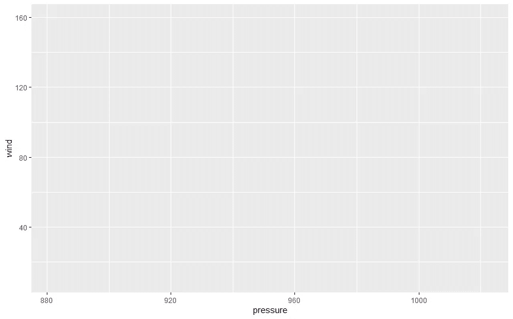

图 1:指定数据框架

我确定了 x 和 y 是什么，但是我没有指定如何绘制图形。因此，图 1 仍然是空的。现在，我将继续向我的图表添加下一个元素。

## Geoms

几何图形是几何对象(例如:线、条等。)来决定如何呈现观察结果。图层通常从创建几何图形开始。

这是一个带有 geom_point 的散点图示例。

您还可以创建

*   带**的条形图*geom _ bar()***
*   带有 ***geom_path()*** 和 ***geom_line()*** 的线图
*   带有***geom _ box plot()***的方框图
*   一个带有***geom _ histogram()***和***geom _ freqply()***的直方图

注意，在代码中，我使用“+”来连接最终图形的元素。

```
ggplot(data = data,  
       mapping = aes(x = pressure, y = wind)) +
 geom_point()
```

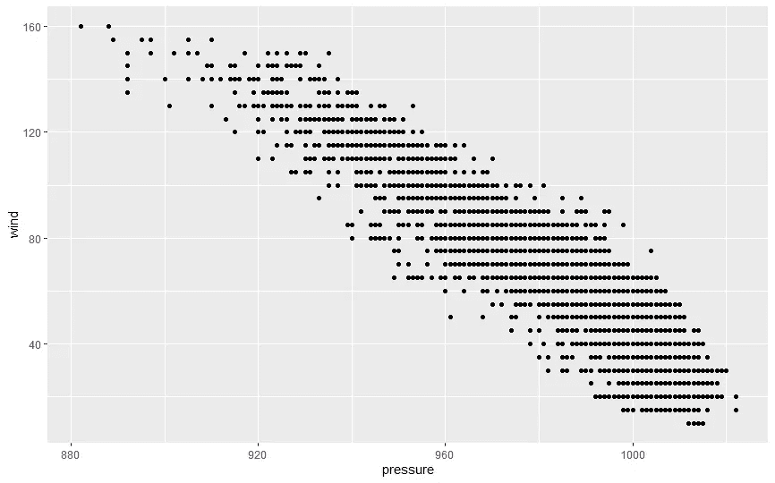

图 geoms 散点图

我可以在 ***geom_ponit*** 中用不同的属性自定义我的图形。其他控件属性包括大小、颜色、形状、alpha 等。让我们将它们添加到我们的图表中，看看有什么不同。

```
ggplot(data = data,
       mapping = aes(x = pressure, y = wind)) +
  geom_point(color = "pink", 
             alpha = .9,     
             size = 2)
```

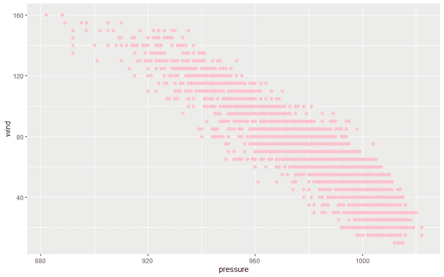

图 3:定制后的散点图

Alpha 控制图形的透明度，其范围从 0(完全透明)到 1(完全不透明)。可以通过调整透明度来可视化重叠点。

## 面状

分面是一种有助于显示变量的每个类的技术。我将尝试使用 ***facet_wrap*** 属性在图形中显示每种风暴的压力和风力。

```
ggplot(data = data,
       mapping = aes(x = pressure, y = wind)) +
  geom_point(color = "blue", 
             alpha = .9,
             size = 2) +
  facet_wrap(~status)
```

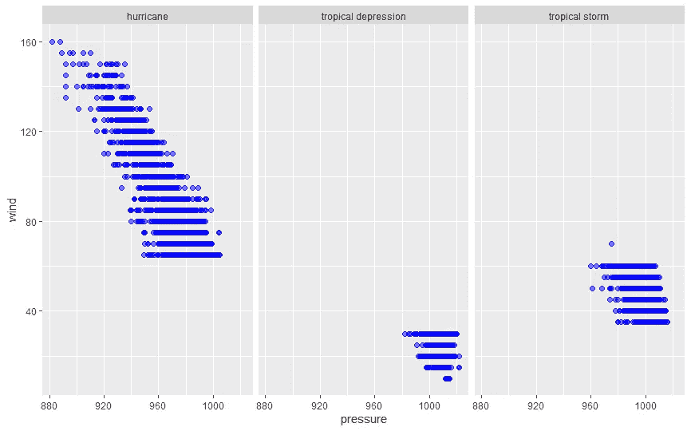

图 4:具有 facet_wrap 属性的图形

## 流畅的

在许多情况下，您的数据有很多噪音，很难观察到模式。您可以选择在图表中添加一条平滑线。

例如:

```
ggplot(data = data,
       mapping = aes(x = pressure, y = wind)) +
  geom_point(color = "blue", 
             alpha = .5,
             size = 2) +
  geom_smooth(span = 1)
```

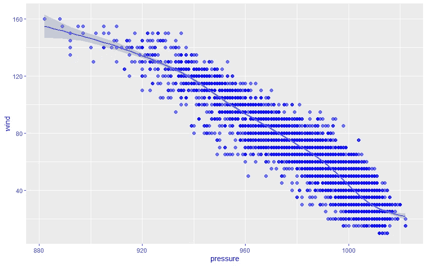

图 5:跨度= 1 的平滑线

根据 ***跨度*** 参数(0–1)的范围决定线的抖动。 ***geom_smooth()*** 中另一个有趣的事情是，你可以陈述用来拟合平滑曲线的方法。在下图中，我使用了***【lm】***的方法，这是线性模型，给出了最佳拟合的线。

```
ggplot(data = data,
       mapping = aes(x = pressure, y = wind)) +
  geom_point(color = "blue", 
             alpha = .5,
             size = 2) +
  geom_smooth(method = "lm")
```

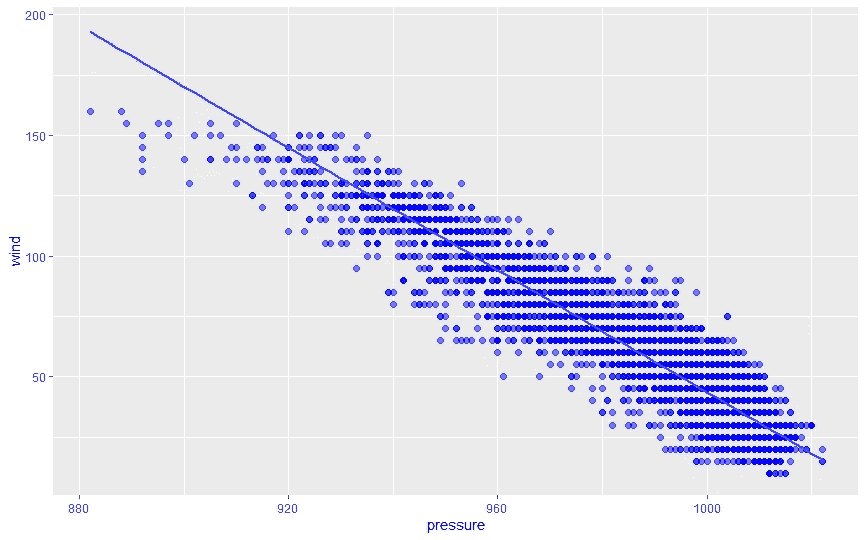

图 6:使用线性方法平滑线条

还有 method =***【rlm】***类似于***【lm】***但是忽略了离群值的影响。

## 组

变量也可以映射到不同的颜色。在下面的代码中，我在 ***aes*** 属性中给我的变量分配了颜色。

```
ggplot(data = data,
       mapping = aes(x = pressure, y = wind, color = status)) +
  geom_point( alpha = 0.3,
              size = 2)
```

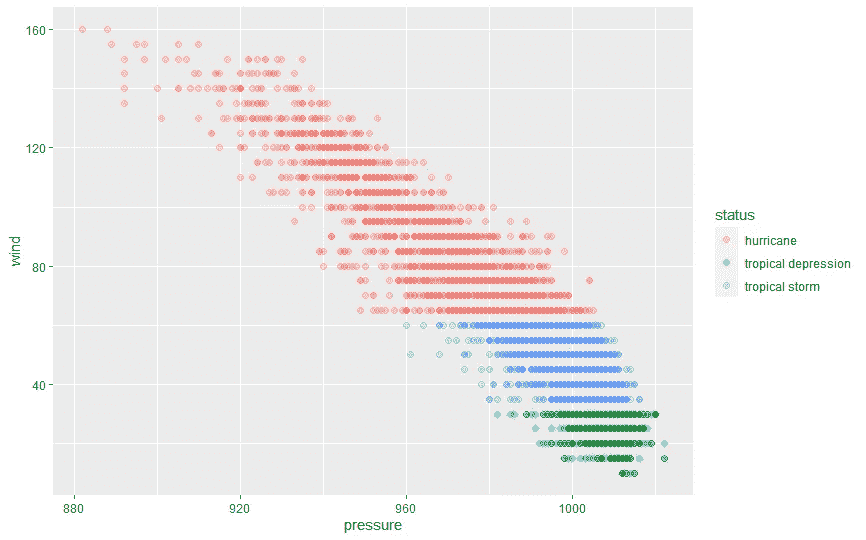

图 7:给组分配颜色

## 标签和主题

为了有一个完整的图形，定制主题和标签是必不可少的步骤。我们可以通过控制各种元素来调整视觉效果的主题，比如字体、网格线、图例位置等。此外，自定义标题、副标题和题注可以用功能 ***labs()修改。***

```
ggplot(data = data,
       mapping = aes(x = pressure, y = wind, color = status)) +
  geom_point(alpha = 0.3,
             size = 2) +
  labs(title = "Relationship Between Wind and Pressure of Storms",
       subtitle = "By Chi Nguyen",
       caption = "Source: dplyr package",
       x = " Pressure",
       y = "Wind",
       color = "Type of Storms") + 
  theme_set(theme_bw())
```

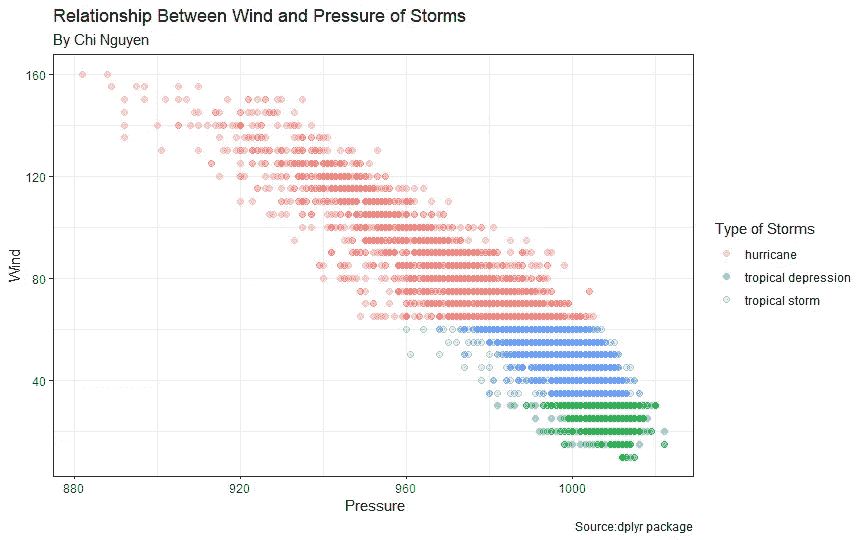

图 8:调整图表的主题和标签

# 熟悉一些基本的图表

基本上，当你记住了这些元素后，你就可以轻松地为自己绘制一个漂亮的图形。现在，让我们看看该怎么做。

## 折线图

前面说过，我们可以用 geom_line 来画折线图。这是计算每年风暴数量的代码。

```
count_storms <- 
  data %>%
  group_by(year) %>%
  summarise(number_of_storms = n())ggplot(data = count_storms,
        mapping = aes(x = year, y = number_of_storms)) +
  geom_line(size = 1.5,
            color = 'pink') +
  geom_point(size = 2,
             color = 'black') +
  labs(title = "Number of Storms by Years",
       subtitle = "By Chi Nguyen",
       x = "Year",
       y = "Number of Storms") + 
  theme_set(theme_bw())
```

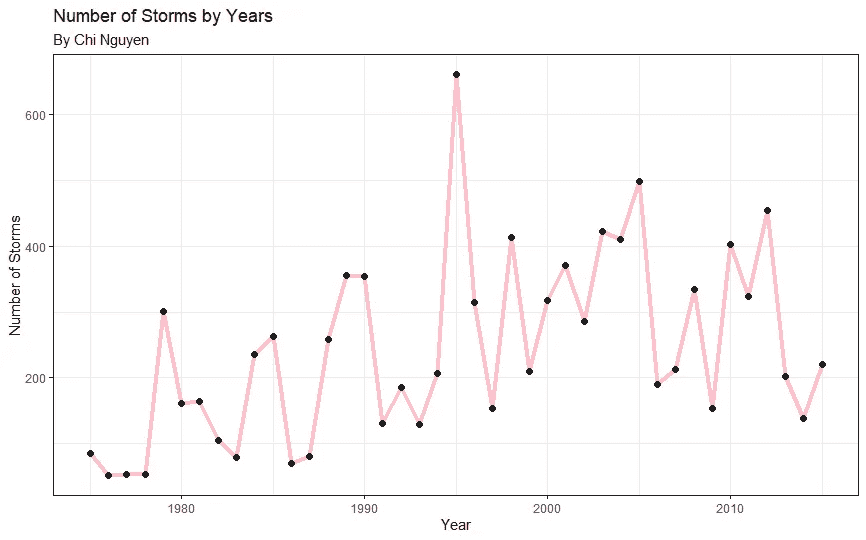

图 9:每年的风暴数量

## 条形图

从 1975 年到 2015 年的 40 年间，让我们看看每年有多少风暴发生。我们将使用 ***geom_bar()*** 来创建图表。

```
storms_no <-  
  data %>%
  group_by(status) %>%
  summarise(number_of_storms = n()) %>%
  arrange(desc(number_of_storms)) %>%
  mutate(prop = round(number_of_storms * 100 / count(status), 1))ggplot(storms_no, 
       aes(x = reorder(status,number_of_storms),
           y = number_of_storms)) + 
  geom_bar(stat = "identity", 
           fill = "indianred3", 
           color = "black") +
  geom_text(aes(label = number_of_storms), 
            vjust = -0.25) +
  labs(x = "Types of Storms", 
       y = "Number of Storms", 
       title  = "Number of Storms During The Period of 40 Years")
```

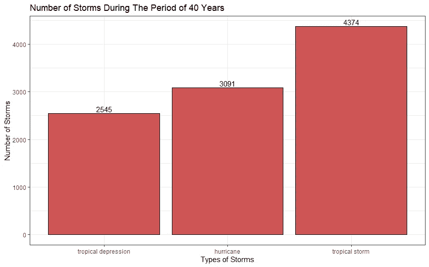

图 10:条形图

如果想要有水平条形图，我们可以添加***【coord _ flip()】***来变换图形。

```
ggplot(storms_no, 
       aes(x = reorder(status,number_of_storms),
           y = number_of_storms)) + 
  geom_bar(stat = "identity", 
           fill = "indianred3", 
           color = "black") +
  geom_text(aes(label = number_of_storms), 
            vjust = +0.25,
            hjust = 0
           ) +
  labs(x = "Types of Storms", 
       y = "Number of Storms", 
       title  = "Number of Storms During The Period of 40 Years") +
  coord_flip()
```

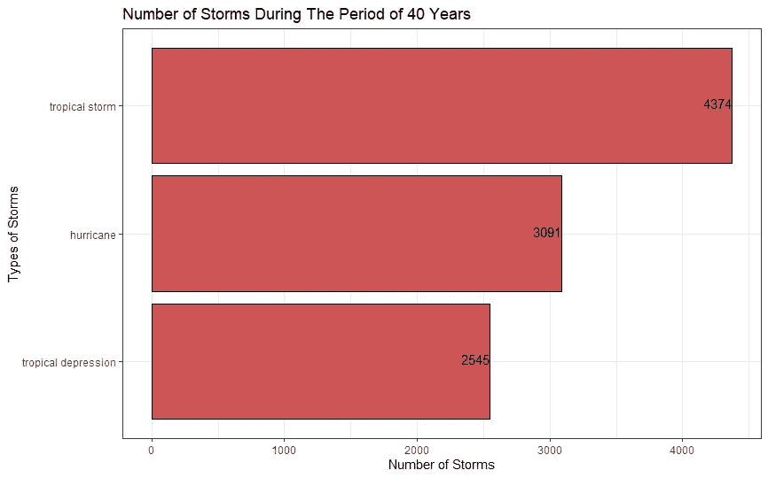

图 11:水平条形图

## 圆形分格统计图表

现在，我要用饼状图计算 1975 年发生的每种风暴的百分比。

```
count_storm_75 = length(data$status[which(data$year == '1975')])#Calculate the percentage
storm_pct = 
  data %>%
  filter(year == '1975') %>%
  select(status) %>%
  group_by(status) %>%
  summarise(number_of_storms = n()) %>%
  arrange(desc(number_of_storms)) %>%
  mutate(pct = round(number_of_storms * 100 / count_storm_75, 1))#Plot the Pie chart
ggplot(storm_pct, 
       aes(x = "", 
           y = pct, 
           fill = status)) +
  geom_bar(width = 1, 
           stat = "identity", 
           color = "black") +
  coord_polar("y", 
              start = 0, 
              direction = -1) +
  ggtitle("Percentage of Storms Happened in 1975")+
  theme(plot.title = element_text(hjust = 0.5))+
  guides(fill=guide_legend(title="Types of Storms")) +
  theme_void()
```

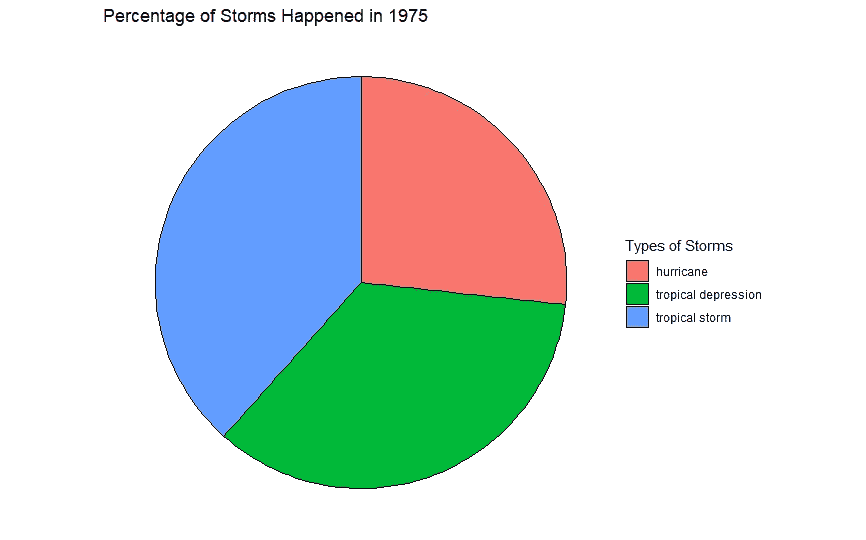

图 12:饼图

# 结论

我自己发现与 Python 中的其他包相比，ggplot 很容易上手。通过学习这个包的基础知识，您可以根据自己的喜好定制图形，而不必过多考虑从哪里开始以及如何编写代码。此外，我认为这也是可视化统计报告并获得有用见解的有力工具。虽然我已经知道它几天了，但我发现它很方便，并决定在未来进一步了解它。你也可以和我一起阅读下面的文档:

[](https://ggplot2-book.org/annotations.html) [## 8 注释| ggplot2

### 构建数据可视化时，通常需要对显示的数据进行注释。概念上…

ggplot2-book.org](https://ggplot2-book.org/annotations.html) 

祝你好运！