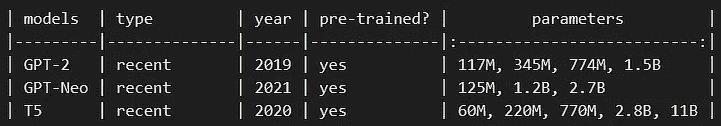
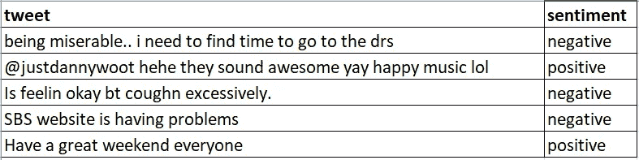
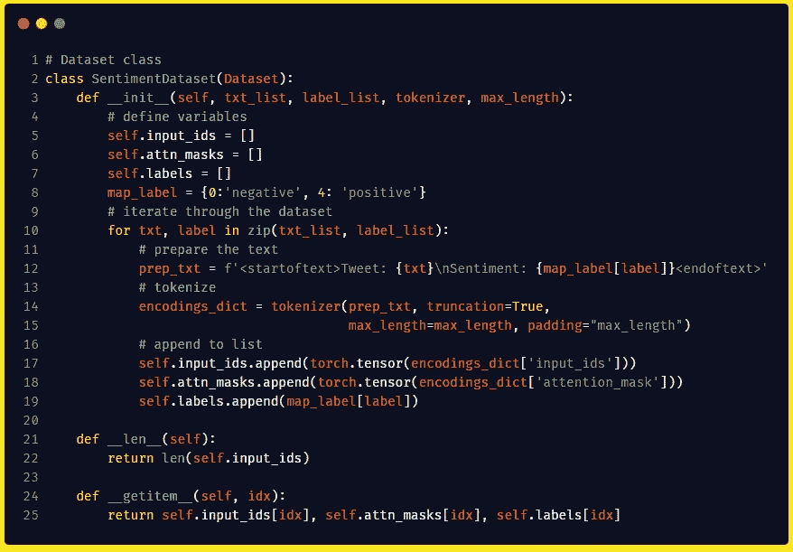
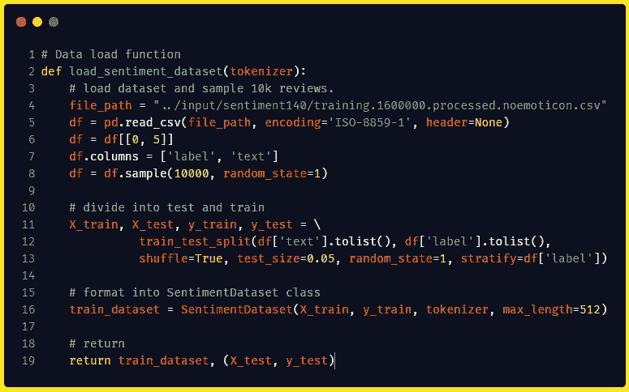
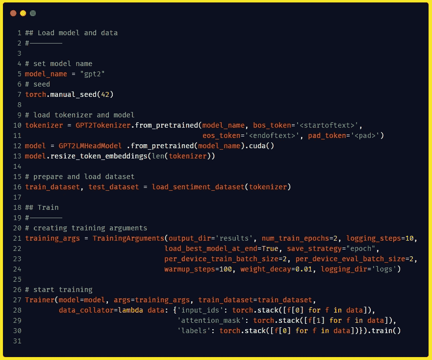
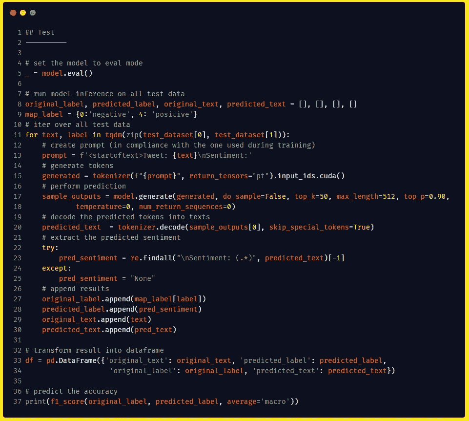
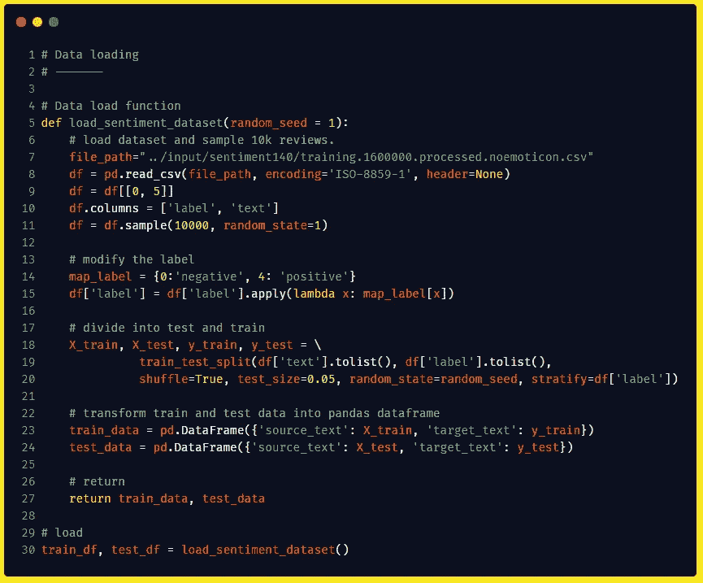
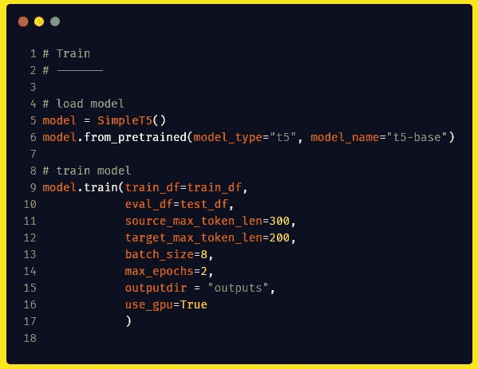
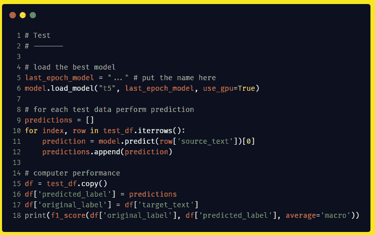
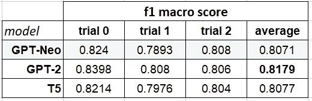

# 文本生成模型微调指南:GPT 新协议、GPT 新协议和 T5

> 原文：<https://towardsdatascience.com/guide-to-fine-tuning-text-generation-models-gpt-2-gpt-neo-and-t5-dc5de6b3bc5e?source=collection_archive---------1----------------------->

## 通过大规模语言模型的基础，我们了解了不同的开源模型，然后通过针对情感检测任务对每个模型进行微调来比较它们。


照片由 [Marija Zaric](https://unsplash.com/@simplicity?utm_source=medium&utm_medium=referral) 在 [Unsplash](https://unsplash.com?utm_source=medium&utm_medium=referral) 上拍摄

> *本文使用的代码可以在这里找到——*<http://mohitmayank.com/a_lazy_data_science_guide/natural_language_processing/GPTs/#finetuning-gpt-2-for-sentiment-classification>**和* [*T5*](http://mohitmayank.com/a_lazy_data_science_guide/natural_language_processing/T5/#t5-finetuning) *。要阅读更多关于文本生成模型的内容，请参见*<http://mohitmayank.com/a_lazy_data_science_guide/natural_language_processing/text_generation/>**。更多此类文章请访问我的网站*<https://mohitmayank.com/blog/>**或者看看我的* [*最新数据科学简书*](http://mohitmayank.com/a_lazy_data_science_guide/) *。也可以在*[*LinkedIn*](https://www.linkedin.com/in/imohitmayank/)*上和我联系。****

# **介绍**

**最近在自然语言处理方面的研究导致了多个大规模预训练文本生成模型的发布，如 GPT-{1，2，3}，GPT-{Neo，J}和 T5。如果观众(包括你和我)对他们的可调参数大小达到数十亿没有印象，我们会被他们可以轻松地用于一个全新的看不见的任务而着迷，而无需任何训练！虽然这对于快速实验来说是可以的，但是对于任何实际的生产部署来说，仍然建议为特定的任务进一步训练模型。这被称为微调，在本文中，我们将实际学习微调一些目前可用的最好的语言模型的方法。我们还将通过在 Twitter 情感检测数据集上进行微调来比较它们的性能。我们开始吧！**

# **文本生成模型**

**在 NLP 中，文本生成是一项有趣的任务，其目的是在输入提示时生成文本。通常，我们应用某种形式的序列到序列模型来完成这项任务。它们被称为语言模型，因为它们可以用来根据前面的句子预测下一个单词。最近对该领域的兴趣激增是由于两个主要原因，(1)几个高性能预训练模型的可用性，以及(2)很容易将大量基于 NLP 的任务转换为文本输入文本输出类型的问题。T5 作者非常直观地展示了这一点，他们可以使用相同的模型进行语言翻译、文本回归、摘要等。**

****

**T5 文本到文本框架示例。来源:[谷歌 AI 博客](https://ai.googleblog.com/2020/02/exploring-transfer-learning-with-t5.html)**

**在本文中，我们将关注以下模型，**

*   ****GPT-2:** 是 [OpenAI](https://en.wikipedia.org/wiki/OpenAI) 发布的原系列语言模型的第二次迭代。事实上，这一系列的 GPT 模型使语言模型出名了！GPT 代表“生成式预训练变压器”，目前我们有 3 个版本的模型(v1，v2 和 v3)。其中只有 GPT 1 号和 GPT 2 号是开源的，因此我们将选择最新的版本进行实验。在技术方面，GPT-2 的体系结构由变压器体系结构的解码器部分组成。**
*   ****GPT-尼奥:**该模型由 [EleutherAI](https://www.eleuther.ai/) 发布，以对抗未开源的 GPT-3 模型。该架构与 GPT-3 非常相似，但训练是在 825 GB 大小的文本数据集[上进行的。](https://pile.eleuther.ai/)**
*   ****T5:** 代表“文本到文本转换转换器”，是谷歌对开源语言模型的回应。T5 论文展示了使用完整的编码器-解码器架构(变压器的)比仅使用解码器(如 GPT 系列所做的)更好，因此他们保持了原始变压器架构的真实性。**

**不同型号的简要比较如下所示。需要注意的一点是，每个模型根据可调参数大小进一步发布了几个版本。对于这篇文章，我们将选择 117 米大小的 GPT-2，125 米大小的 GPT-Neo 和 220 米大小的 T5。**

****

**比较不同的文本生成模型。来源:[ [一个懒惰的数据科学指南](http://mohitmayank.com/a_lazy_data_science_guide/natural_language_processing/text_generation.html#comparing-models-basic-details)**

# **情感检测任务和数据集**

**为了测试不同语言模型的性能，我们将在一个简单的任务——情感检测上进行微调后，比较模型的准确性。这里，我们将使用 Twitter 情感数据集，可以从[这里](https://www.kaggle.com/kazanova/sentiment140)下载。它总共包含超过 160 万条推文，他们的情绪可能是积极的，也可能是消极的。为了提高计算效率，我们将对 10k 条 tweetss 进行采样，这些 tweet 的情感类别分布几乎相等。然后，我们将使用 95%的数据训练模型，将剩余的 5%用于测试目的。为了公平比较，我们将对所有三个模型使用相同的测试和训练分割。最后，我们将执行 3 次分割和训练每个模型的试验——这是一种复制 3 重验证测试的方法。我们将报告单独的和合计的(平均)f1 宏观分数，该分数可用于模型的性能比较。**

****

**Twitter 情感数据集示例。按作者。**

**现在，下一个明显的问题应该是，我们如何将情感检测任务转换为文本生成任务？答案很简单，我们所要做的就是创建一个直观的提示(带有数据的模板),它可以反映类似的表示如何出现在 web 上。让我们这样理解吧，我们希望提供 tweet 作为输入，希望将情绪作为输出。因此，在我们的提示中，我们应该在`Tweet:` 前缀后传递一条 tweet，并期望模型预测`Sentiment:` 前缀后下一行的情绪。这种创建有效提示的过程被称为提示工程，事实证明，仅仅通过改变提示，语言模型就能表现得更好！对于我们的用例，我们可以从一个非常简单的提示格式开始。我们将有两个不同的提示，一个用于培训，一个用于测试。示例如下所示。**

****训练提示(就像我们希望模型学习这种“模式”来解决“任务”)****

```
**Tweet: I am not feeling well.
Sentiment: Negative**
```

****测试提示(现在我们希望模型已经学习了“任务”，因此可以完成“模式”)****

```
**Tweet: I am feeling well.
Sentiment:** 
```

**因此，在测试过程中，我们将提取前缀`Sentiment:`后由模型预测的单词，并将该单词视为预测的情感标签。现在让我们深入到实现中！**

# **微调 GPT 2 号和 GPT 近地天体**

**需要注意的一点是——GPT-2 和 GPT-近地天体共享几乎相同的架构，因此大部分微调代码保持不变。因此，为了简洁起见，我将只分享 GPT-2 的代码，但我会指出使其适用于 GPT-近地天体模型所需的更改。好了，让我们从处理数据集开始，为此我们将从创建 Pytorch `Dataset`类开始，它定义了我们如何为训练准备数据。**

****

**这包括 3 个模块:**

*   **`__init__`:我们基本上标记和存储数据的地方。**
*   **`__len__` :这里我们返回总数据集的长度。这是每个时期内步长计算所需要的。**
*   **`__getitem__` :获取一个数据，然后返回。**

**一些附加点— (1)在第 8 行，我们定义了用于将原始数字情感标签转换为文本标签的映射，(2)在第 12 行，我们将数据转换为我们决定的训练提示，以及(3)在第 14 行，我们执行了标记化(将 tweet 拆分为标记+用它们唯一的 id 替换它们)。**

****

**接下来，我们用`Dataset`类连接数据。代码分解如下所示，**

*   **`Line 4-8:`我们从加载数据集开始。你可以从[这里](https://www.kaggle.com/kazanova/sentiment140)下载，并在第 4 行修改本地路径。接下来，我们只需对相关的列进行子集划分，并对它们进行重命名。在第 8 行，我们为这个实验采样了 10k 条 tweets。**
*   **`Line 10–13:`我们将数据拆分为训练和测试，分别有 95%和 5%的拆分。我们使用`stratify`标志，使得分裂在情感类别分布中是均匀的。**
*   **`Line 16:`我们将列车数据传递给`SentimentDataset`类。注意，我们可以对测试数据做同样的事情，但是我只是以原始形式返回测试数据。**

****

**现在我们将为模型的训练做准备。代码分解如下:**

*   **我们加载标记器，添加一些特殊的标记来表示 tweets 的不同部分，最后加载模型。注意，`model_name` 是在第 5 行定义的。还要注意的是，我们添加了特殊的标记，以便模型知道提示的开始和结束。这将有助于稍后的测试阶段，因为我们不希望模型继续写下一个单词，但它应该知道何时停止这个过程。这可以通过设置`eos_token` 并训练模型在标签后预测它来完成，如这里所做的。**
*   **`Line 16:`使用我们之前定义的函数加载并准备数据集。**
*   **`Line 21–24:`我们为培训流程设置配置。简而言之，我们用`batch_size`、`warmup_steps` 和`weight_decay`定义了在哪里和什么时候保存模型、训练多长时间和在哪里保存日志以及训练策略。**
*   **`Line 27–31:` 我们通过将模型与训练数据集相连接来开始训练。我们还定义了如何在`data_collator`中处理训练数据。排序器中的前两个元素是`input_ids` —标记化的提示和`attention_mask` —一个简单的 1/0 向量，表示标记化向量的哪一部分是提示，哪一部分是填充。最后一部分非常有趣，我们将输入数据作为标签传递，而不仅仅是情感标签。这是因为我们正在训练一个语言模型，因此我们希望模型学习提示的模式，而不仅仅是情感类。在某种意义上，模型学习预测输入 tweet +提示中结构化的情感的单词，并在这个过程中学习情感检测任务。**

**这将开始训练。根据您的计算机规格，这可能需要一些时间。**

****

**最后，我们定义测试块，在这里我们获取训练好的模型，并将其应用于保留的测试数据。代码细分如下:**

*   **`Line 5:`我们打开模型上的评估模式。**
*   **`Line 8–15:`对于每个测试数据，我们首先准备提示，但有一个很大的不同，我们不包括情绪标签，因为这是我们希望模型预测的。此外，记住`eos_token`——我们希望模型能够预测情感标签，然后通过打印`eos_token`来中断操作。最后，我们对测试提示进行标记。**
*   **`Line 17:`我们采用测试提示，预测下一组单词。这个函数中有很多参数定义了如何预测下一个单词。关于它们中每一个的详细内容，请参考[这个](https://huggingface.co/transformers/main_classes/model.html)，或者为了更好地理解下一个单词预测的不同策略，请参考[这个](https://huggingface.co/blog/how-to-generate)。**
*   **`Line 20–30:`我们从解码预测文本开始，即将预测标记 id 重新转换为文本。然后，我们提取预测的情感标签并将所有相关信息存储到列表中。**
*   **`Line 33–37:`我们首先将所有提取的信息合并到一个 pandas 数据帧中以获得更好的可读性，然后使用 sklearn 包中的`f1_score` 函数来计算整个模型的性能。**

**在运行 GPT-2 的代码并在数据集分割代码中使用不同的`random_state`执行该操作三次时，我们观察到该模型实际上能够如预期的那样完美预测。它能够预测标签，然后使用`eos_token`中断标签的执行。f1 宏观表现平均分 **81.7%** ！这与我们预期的专用情感检测模型的表现相当，并且这继续强调了在 NLP 中使用文本生成模型进行迁移学习是多么容易。**

****符合 GPT-尼奥标准的代码****

**为了使 GPT-2 号代码适用于 GPT-近地天体，我们必须做以下修改，**

*   **进口`GPTNeoForCausalLM`**
*   **将`model_name` 设置为`"EleutherAI/gpt-neo-2.7B"` *(从任何可用尺寸型号中选择)***
*   **加载模型时，使用`GPTNeoForCausalLM` 代替`GPT2LMHeadModel`。**

**就是这样！在运行 GPT-尼奥的修改代码，并遵循相同的训练策略时，平均 f1 宏观性能得分为 **80.7%** ！**

# **微调 T5**

**T5 的架构不同于 GPT 模型，因为它保持了原始变压器的架构，而 GPT 模型只保留了解码器部分。对于培训 T5，我们将使用一个名为 [SimpleT5](https://github.com/Shivanandroy/simpleT5) 的优秀包装器包，它从培训阶段移除了大部分样板文件。现在请记住，虽然培训的语法会发生变化，但总体流程和直觉保持不变。先说数据部分。**

****

**这里，大部分代码与我们之前为 GPT 模型所做的一样。一个主要的变化是我们不需要`Dataset`类，因为 SimpleT5 直接在 pandas 数据帧上工作。因此，我们加载数据，做一些初步的预处理，分割数据，并返回熊猫数据帧。*(无需令牌化，创建* `*Dataset*` *类，这不是很棒吗！？)***

**还有一点需要注意的是，我们不需要为这个包创建提示格式。这样，我们可以将输入的 tweet 和情感标签分离到不同的列中，这里分别是`source_text` 和`target_text`。**

****

**加载和训练模型也非常简单，只需 3 行代码*(如果你可以忽略我漂亮的换行)。***

****

**接下来，我们在测试数据集上测试微调后的 T5 模型。如你所见，推理部分也非常简单，在第 11 行，我们使用了`predict` 函数，只需传递`source_text` 就可以得到预测的情感标签。我们稍后将它与`original_label` 进行比较，以在第 18 行生成性能分数。**

**在运行 T5 代码并遵循与之前相同的训练策略时，f1 宏观表现的平均得分为 **80.7%** ！**

# **结果**

**将所有结果合并到一个表中，我们得到，**

****

**GPT-2、GPT-尼奥和 T5 在情感探测任务上的比较。**

**我想讨论的一点是，我根本没有玩过超参数。除此之外，prompt 工程方法学，我认为仅仅通过研究这两个方面，我们就可以进一步提高所有模型的性能指标。我会把它留给读者做练习*(如果你得到了更好的分数，一定要让我知道！)***

# **结论**

**虽然 GPT-2 可能赢得了这一轮，但结果表确实显示了文本生成模型的整体实力。他们所有人在情感检测任务上都表现得非常好，所需要的只是几个时期的训练。即使这个实验是为一个单一的任务而做的，我希望这有助于展示使用 TG 模型来完成全新的任务是多么容易。在某种程度上，如果我们可以将 NLP 问题转化为文本生成问题，请放心，预先训练的模型不会失败，至少不会彻底失败:)这使得它们成为许多任务的完美基线，如果不是最先进的。**

# **参考**

*   **科林·拉弗尔，诺姆·沙泽尔，Adam Roberts，凯瑟琳·李和莎兰·纳朗。用统一的文本到文本转换器探索迁移学习的局限性。2020. [arXiv:1910.10683](https://arxiv.org/abs/1910.10683)**
*   **亚历克·拉德福德、杰弗里·吴、雷文·柴尔德、大卫·栾、达里奥·阿莫代伊、伊利亚·苏茨基弗等。语言模型是无人监督的多任务学习者。 *OpenAI 博客*，1(8):9，2019。**
*   **[GPT 近地天体](https://github.com/EleutherAI/gpt-neo)**
*   **Ashish Vaswani、Noam Shazeer、Niki Parmar、Jakob Uszkoreit、Llion Jones、Aidan N. Gomez、Lukasz Kaiser 和 Illia Polosukhin。你需要的只是关注。2017. [arXiv:1706.03762](https://arxiv.org/abs/1706.03762) 。**

**干杯。**