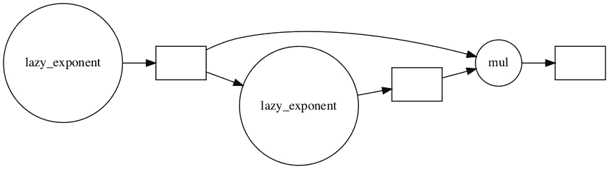

# 热切的数据科学家用 Dask 评估懒惰的指南

> 原文：<https://towardsdatascience.com/guide-to-lazy-evaluation-with-dask-543b48a0aa74?source=collection_archive---------59----------------------->


在 [Unsplash](https://unsplash.com/s/photos/lazy?utm_source=unsplash&utm_medium=referral&utm_content=creditCopyText) 上由 [Manja Vitolic](https://unsplash.com/@madhatterzone?utm_source=unsplash&utm_medium=referral&utm_content=creditCopyText) 拍摄的照片

懒惰评估不必令人困惑或复杂——在本指南中，学习入门所需的基本概念！

> 声明:我是 Saturn Cloud 的一名高级数据科学家，Saturn Cloud 是一个支持使用 Dask 对 Python 进行简单并行化和扩展的平台。如果你想了解更多关于土星云的信息，请登陆[网站 www.saturncloud.io](https://www.saturncloud.io) 访问我们。

# Dask 是什么？

[Dask 是一个开源框架，支持 Python 代码的并行化。](https://dask.org/)这可以适用于各种 Python 用例，不仅仅是机器学习。Dask 设计用于单机设置和多机集群。您可以将 Dask 与 pandas、NumPy、scikit-learn 和其他 Python 库一起使用。

# 为什么要并行？

对于机器学习，Dask 并行化在几个领域可能有助于我们更快更好地工作。

*   加载和处理大型数据集(尤其是当它们太大而无法保存在内存中时)
*   同时快速运行时间或计算繁重的任务(例如，考虑超参数调整或集合模型)

# 延迟任务

**并行计算使用所谓的“懒惰”评估。这意味着您的框架将把转换或计算集合排队，以便它们准备好以后并行运行。这是一个你会在很多并行计算框架中发现的概念，包括 Dask。你的框架不会评估请求的计算，直到被明确告知。这不同于“急切”评估函数，后者在被调用时立即计算。许多非常常见和方便的函数被移植到 Dask 中，这意味着它们将是懒惰的(延迟计算),甚至不需要你去问。**

然而，有时您会有用 pandas、scikit-learn 甚至是基本 python 编写的复杂的定制代码，而这些代码在 Dask 中是不可用的。其他时候，如果需要利用原生 Dask 元素进行编辑，您可能没有时间或精力将代码重构为 Dask。

如果是这种情况，你可以用`@dask.delayed`修饰你的函数，它会手动建立函数应该是懒惰的，直到你告诉它才求值。您可以用下一节中描述的过程`.compute()`或`.persist()`来告诉它。

# 示例 1

```
def exponent(x, y):
    '''Define a basic function.'''
    return x ** y# Function returns result immediately when called
exponent(4, 5)
```

> *1024*

```
import dask@dask.delayed
def lazy_exponent(x, y):
    '''Define a lazily evaluating function'''
    return x ** y# Function returns a delayed object, not computation
lazy_exponent(4, 5)
```

> *延迟(' lazy _ exponent-05d 8b 489–554 c-44 E0–9a2c-7a 52 b 7 B3 a 00d ')*

```
# This will now return the computation
lazy_exponent(4,5).compute()
```

> *1024*

# 示例 2

我们可以利用这些知识并扩展它——因为我们的惰性函数返回一个对象，我们可以对它赋值，然后在以后以不同的方式将它链接在一起。

这里我们从第一个函数返回一个延迟值，并将其称为 x。然后我们第二次将 x 传递给该函数，并将其称为 y。最后，我们将 x 和 y 相乘以产生 z。

```
x = lazy_exponent(4, 5)
y = lazy_exponent(x, 2)
z = x * y
z
```

> *延迟(' mul-2257009 fe1a 612243 C4 b 28012 eddd 1 ')*

```
z.visualize(rankdir="LR")
```



作者

```
z.compute()
```

> *1073741824*

# 持久与计算

我们应该如何指示 Dask 运行我们已经懒洋洋地排队等候的计算？我们有两个选择:`.persist()`和`.compute()`。

# 计算

如果我们使用`.compute()`，我们要求 Dask 对我们排队等候的数据进行所有的计算和调整，然后运行它们，并把它们全部带到这里。

这意味着如果它是分布式的，我们现在就想把它转换成一个本地对象。如果它是一个 Dask 数据帧，当我们调用`.compute()`时，我们说“运行我们排队的转换，并立即将它转换成 pandas 数据帧。”但是要小心——如果你的数据集非常大，这可能意味着你没有足够的内存来完成这个任务，你的内核可能会崩溃！

# 坚持

如果我们使用`.persist()`，我们要求 Dask 对我们排队的数据进行所有的计算和调整，并运行它们，但是对象将保持分布式，并将驻留在集群上(如果您在一台机器上，则为 LocalCluster)，而不是 Jupyter 实例或其他本地环境上。

因此，当我们使用 Dask 数据帧执行此操作时，我们会告诉我们的集群“运行我们已排队的转换，并将其作为分布式 Dask 数据帧。”

因此，如果您想处理应用于 Dask 对象的所有延迟任务，这两种方法都可以。区别在于你的对象最后会住在哪里。

理解这一点真的有助于告诉你什么时候`.persist()`可能有意义。考虑这样一种情况，您加载数据，然后将数据用于许多复杂的任务。如果您使用从磁盘上的 CSV 加载的 Dask 数据帧，您可能希望在将该数据传递给其他任务之前调用`.persist()`,因为其他任务将在每次引用它时反复运行数据加载。如果您首先使用`.persist()`，那么加载步骤只需要运行一次。

# 分布式数据对象

除了延迟单个函数之外，我们还需要讨论另一个工作领域——这就是 Dask 数据对象。其中包括 Dask bag(一个基于列表的并行对象)、Dask array(一个基于 NumPy 数组的并行对象)和 Dask Dataframe(一个基于 pandas Dataframes 的并行对象)。

为了展示这些对象能做什么，我们将讨论 Dask 数据帧。

假设我们有很多年的相同数据，我们想一次加载所有数据。我们可以用 Dask 轻松地做到这一点，这个 API 非常像 pandas API。Dask 数据帧包含许多 pandas 数据帧，它们分布在集群中。


作者

# 示例 3

```
import dask
import dask.dataframe as dd
df = dask.datasets.timeseries()
```

这个数据集是 dask 安装附带的示例之一。请注意，当我们查看它时，我们只获得了部分信息！

```
df
```

这是因为我们的 dask 数据帧分布在我们的集群中，直到我们要求它被计算。但是我们仍然可以将延迟的计算排队！让我们使用我们的熊猫知识来应用一个过滤器，然后按一列对数据进行分组，并计算另一列的标准偏差。

请注意，这些代码在常规 pandas 数据帧的计算中不会出现任何问题。

```
df2 = df[df.y > 0]
df3 = df2.groupby('name').x.std()
df3
```

> *Dask 系列结构:
> npartitions = 1
> float 64
> …
> 名称:x，dtype: float64
> Dask 名称:sqrt，157 任务*

这返回给我们的不是熊猫系列，而是 Dask 系列。这里有一个分区，所以它不会被不同的工人分割。它很小，所以这对我们来说没问题。

如果我们在上面运行`.compute()`会发生什么？

```
computed_df = df3.compute()
type(computed_df)
```

> *pandas . core . series . series*

这使得我们的结果成为熊猫系列，因为它不再是一个分布式对象。结果内容实际上是什么样的？

```
computed_df.head()
```

> *姓名
> 爱丽丝 0.579278
> 鲍勃 0.578207
> 查理 0.577816
> 丹 0.576983
> 伊迪丝 0.575430
> 姓名:x，dtype: float64*

# 实例 4

让我们回到上一个例子中使用的 df 对象。这里我们将使用`npartitions`属性来检查我们的数据帧被分成了多少部分。

```
import dask
import dask.dataframe as dd
df = dask.datasets.timeseries()
df.npartitions
```

所以我们的 Dask 数据帧有 30 个分区。因此，如果我们在这个数据帧上运行一些计算，我们仍然有一个具有许多分区属性的对象，我们可以检查它。我们将对其进行过滤，然后使用 groupby 进行一些汇总统计。

```
df2 = df[df.y > 0]
df3 = df2.groupby('name').x.std()
print(type(df3))
df3.npartitions
```

现在，我们已经将对象简化为一个系列，而不是一个数据帧，因此它更改了分区号。

如果我们想的话，我们可以看这个系列！

```
df4 = df3.repartition(npartitions=3)
df4.npartitions
```

如果我们在这些对象上使用`.persist()`或`.compute()`会发生什么？

正如我们下面看到的，`df4`是一个 Dask 系列，有 161 个排队任务和 3 个分区。我们可以在同一个对象上运行两个不同的计算命令，并看到不同的结果。

```
df4
```

> *Dask 系列结构:
> npartitions = 3
> float 64
> …
> …
> …
> 名称:x，dtype: float64
> Dask 名称:重新分区，161 任务*

```
%%timedf4.persist()
```

> *CPU 时间:user 1.8 s，sys: 325 ms，total:2.12s
> Wall time:1.25s
> Dask 系列结构:
> npartitions = 3
> float 64
> …
> …
> …
> Name:x，dtype:float 64
> Dask Name:repartition，3 tasks*

那么，当我们运行`.persist()`时，发生了什么变化？请注意，我们从屏幕底部的 161 项任务减少到只有 3 项。这表明每个分区都有一个任务。

现在，我们来试试`.compute()`。

```
%%time
df4.compute().head()
```

> *CPU 时间:user 1.8 s，sys: 262 ms，total:2.06s
> Wall time:1.2s
> Name
> Alice 0.576798
> Bob 0.577411
> Charlie 0.579065
> Dan 0.577644
> Edith 0.577243
> Name:x，dtype: float64 【T36*

我们得到的是熊猫系列，而不是 Dask 对象。

# 结论

至此，您已经有了使用 Dask 所需的基本概念！

*   您的定制代码可以通过`@dask.delayed`实现并行化
*   Dask 的生态系统对 pandas、NumPy 和 scikit-learn 功能提供了强大的本地支持，赋予了它们并行化能力
*   Dask 数据对象可以使你的数据分布，防止数据过多/内存过少的问题

通过结合这些强大的特性，您可以使用我们用于 pandas、NumPy 和 scikit-learn 的相同 API 来生成强大的、生产质量的数据管道。要了解 Dask 的更多功能，[请访问我们的 Saturn Cloud，了解我们的客户在 Dask 上取得的成功！](https://www.saturncloud.io/s/blog/)