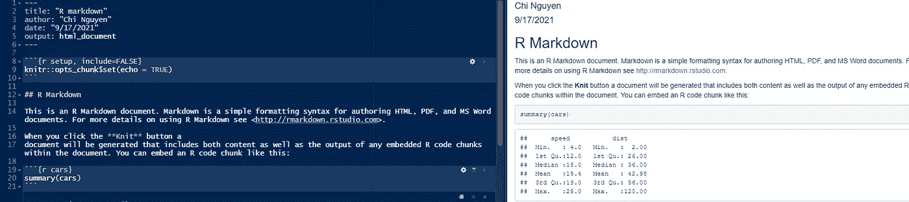
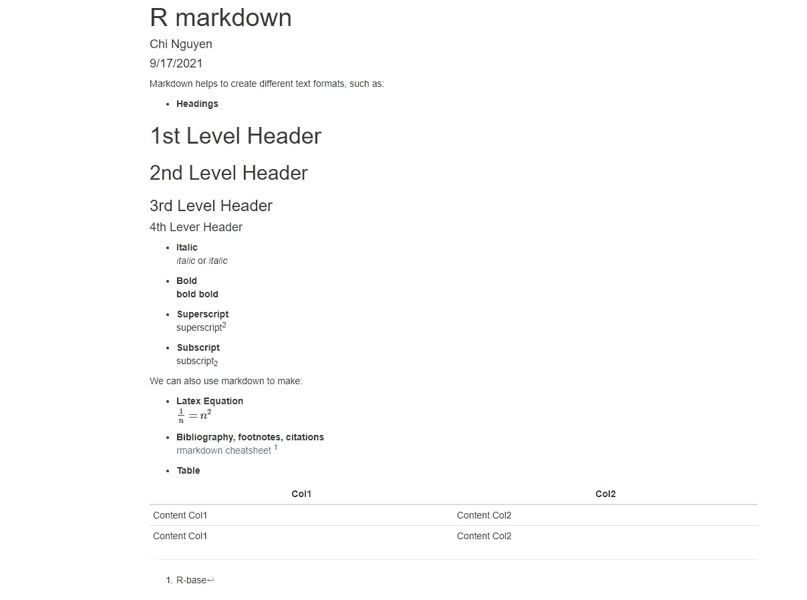
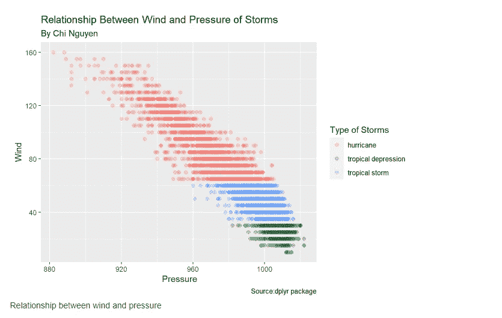
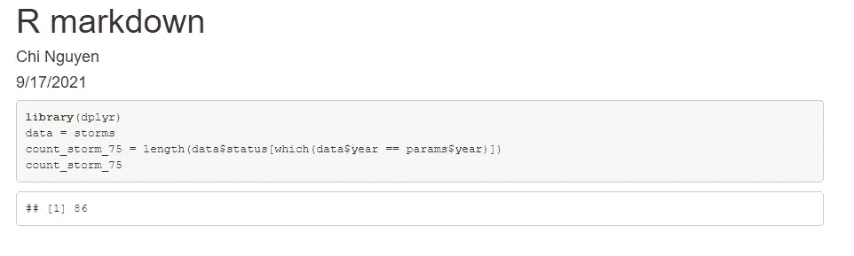
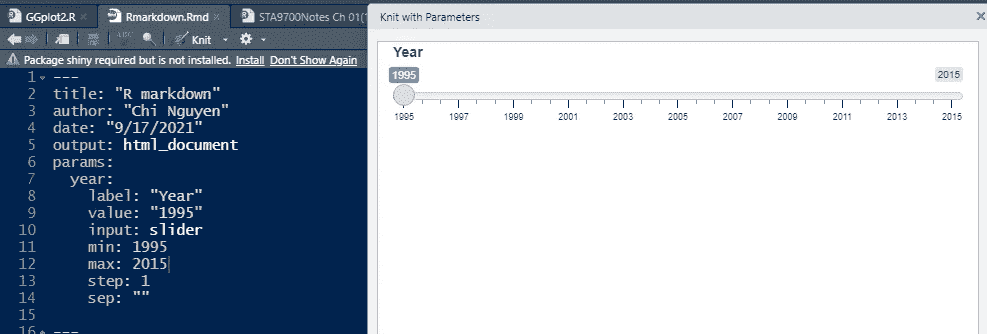

# R 降价指南

> 原文：<https://towardsdatascience.com/guide-to-r-markdown-8468e6464bb4?source=collection_archive---------20----------------------->

## 如果你正在寻找一个工具来呈现一个整洁有效的报告，R markdown 是一个理想的选择！


科琳·库兹在 [Unsplash](https://unsplash.com?utm_source=medium&utm_medium=referral) 上的照片

# **简介**

为了我的研究，我已经做了很多报告，包括用 R 编码和注释我的代码。R markdown 是完成这些报告的一个很好的支持工具。它可以把你的代码、结果和你的评论放在一个地方。然后，只需点击一个按钮，它就可以帮助以 pdf、Word 等不同格式呈现输出。

除了是我研究的一个很好的工具，R markdown 也是决策者的理想选择，他们希望从结果中寻求洞察力，但不想深入研究背后的代码。因此，在本文中，让我们来探索这个方便的工具。

# 如何开始

您可以创建一个新的。RStudio 中的 Rmd 文件，方法是转到文件>新建文件> R Markdown。

# 降价基础

如果您理解了下面的基础知识，那么您已经成功地生成了第一个 R markdown 文件:

1.  代码块
2.  不同类型的文本格式:标题、字体等。

HTML 格式的降价示例如下:



图 1:来自 RStudio 的默认 R markdown 文件

现在，让我们进入每一部分。

## 文本格式

```
Markdown helps to create different text formats, such as:- **Headings**# 1st Level Header
## 2nd Level Header
Markdown helps to create different text formats, such as:- **Headings**# 1st Level Header
## 2nd Level Header
### 3rd Level Header
#### 4th Lever Header- **Italic**  
*italic* or _italic_- **Bold**  
**bold**   __bold__- **Superscript**  
superscript^2^- **Subscript**  
subscript~2~We can also use markdown to make:- **Latex Equation**  
$\frac{1}{n} = n^{2}$- **Bibliography, footnotes, citations**  
[rmarkdown cheatsheet]([https://rmarkdown.rstudio.com/authoring_quick_tour.html#Overview](https://rmarkdown.rstudio.com/authoring_quick_tour.html#Overview)) [^1][^1]: R-base- **Table**Col1          | Col2
------------- | -------------
Content Col1  | Content Col2
Content Col1  | Content Col2
```

***输出:***



图 1

更多参考，可以在这个[链接](https://rpubs.com/svcuonghvktqs/366237)了解。

## 代码块

要添加新的代码块，您可以使用 Ctrl + Alt + I 或通过以下方式手动创建它:

```
```{r}
code
```
```

若要执行此代码，请单击“运行”或按 Ctrl + Shift + Enter。

代码块有以下本地选项:

`include = FALSE`不允许代码及其结果出现在最终文件中。R Markdown 仍然运行代码片段中的代码，并且结果可以被其他代码片段使用。

`echo = FALSE`不允许代码，但允许结果出现在最终文件中。

`message = FALSE` 不允许代码生成的消息出现在最终文件中。

`warning = FALSE` 不允许代码生成的警告出现在最终文件中。

`fig.cap = "..."`给最终图形添加标题。

我将向您展示所有这些是如何工作的示例。

```
```{r,fig.cap = "Relationship between wind and pressure",  echo = FALSE, message = FALSE}library(dplyr)
library(ggplot2)data = stormsggplot(data = data,
       mapping = aes(x = pressure, y = wind, color = status)) +
  geom_point( alpha = 0.3,
              size = 2) +
  labs(title = "Relationship Between Wind and Pressure of Storms",
       subtitle = "By Chi Nguyen",
       caption = "Source:dplyr package",
       x = " Pressure",
       y = "Wind",
       color = "Type of Storms") + 
  theme_set(theme_bw())```
```



图 2:大块代码

# 使用 R 参数

R Markdown 文档可能包括许多在报告时设置的参数。当您想要使用新的输入值重新呈现类似的报表时，参数非常有用，例如:

*   运行特定于部门或地理区域的报告。
*   运行涵盖特定时间段的报告。
*   等等。,

例如，在下面的减价中，`params`年= 1975 年。然后，在格式`params$<paramname>`下的代码中使用。

```
---
title: "R markdown"
author: "Chi Nguyen"
date: "9/17/2021"
output: html_document
params: 
  year: '1975'
---```{r, message = FALSE}library(dplyr)
data = storms 
count_storm_75 = length(data$status[which(data$year == params$year)])
count_storm_75 ```
```



图 3:使用参数

您还可以为参数设置约束:



图 4:为参数设置约束

# 结论

R markdown 中有大量有趣的特性，你可以在这本有用的食谱[链接](https://bookdown.org/yihui/rmarkdown-cookbook/how-to-read-this-book.html)中详细阅读它们。R markdown 可以执行很多其他语言的代码，比如 Python、SQL、Bash、Rcpp、Stan、JavaScript、CSS 等。我觉得这是一个很好的学习工具，以后一定会帮助你完成很多工作。