# Python 中海量三维点云实时可视化指南

> 原文：<https://towardsdatascience.com/guide-to-real-time-visualisation-of-massive-3d-point-clouds-in-python-ea6f00241ee0?source=collection_archive---------0----------------------->

## 3D Python

## Python 中大点云数据的高级可视化和交互教程。(奖金)学习如何创建一个交互式分割“软件”。

数据可视化是一个大难题🌶️:通过使用可视元素制作信息的图形表示，我们可以最好地呈现和理解数据中的趋势、异常值和模式。你猜对了:对于表示真实世界形状的 3D 点云数据集，这是强制性的🙂。


本文中处理和可视化的无人机 3D 点云。您将学习特征提取、交互式和自动分割，同时实时可视化和创建动画。F. Poux

然而，当从激光扫描仪或 3D 重建技术(如[摄影测量](https://learngeodata.eu/))收集时，点云对于经典渲染来说通常过于密集。在许多情况下，数据集将远远超过 1000 万大关，这使得它们对于经典的可视化库(如 Matplotlib)来说不切实际。

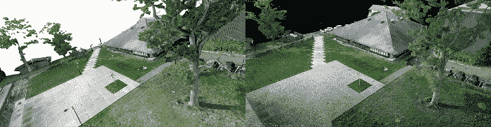

你可以注意到左边(Open3D)比右边(PPTK)慢多了，后者使用八叉树结构来加速可视化。Matplotlib 会更糟😅。F. Poux

这意味着我们经常需要跳出 Python 脚本(因此使用 I/O 函数将数据写入文件)并在外部可视化它，这可能会成为一个超级麻烦的过程🤯。我不会说谎，我在论文的第一年就是这么做的，试图猜测特定 algorithms🥴.的结果

在你的脚本中直接可视化这些点云不是很好吗？更好的是，将视觉反馈与脚本联系起来？想象一下，现在有了 iPhone 12 Pro 有了激光雷达；您可以创建一个完整的在线应用程序！好消息是，有一种方法可以在不脱离 Python 环境和 IDE 的情况下实现这一点。☕准备好了吗？

# 步骤 1:启动您的 Python 环境。

在下面的前一篇文章中，我们看到了如何使用 Anaconda 轻松地设置环境，以及如何使用 IDE Spyder 管理您的代码。如果你准备成为一名完全成熟的 python 应用程序开发人员，我建议你继续这样做😆。

[](/discover-3d-point-cloud-processing-with-python-6112d9ee38e7) [## 使用 Python 探索 3D 点云处理

### 教程简单地设置 python 环境，开始处理和可视化 3D 点云数据。

towardsdatascience.com](/discover-3d-point-cloud-processing-with-python-6112d9ee38e7) 

如果您使用 Jupyter Notebook 或 Google Colab，脚本可能需要一些调整，以使可视化后端工作，但提供不稳定的性能。如果您想继续使用这些 IDE，我建议您看看第 4 步中给出的库的替代品。

# 步骤 2:下载点云数据集

在之前的教程中，我展示了通过使用[摄影测量](https://learngeodata.eu/)和来自[开阔地形的航空激光雷达获得的 3D 数据集上的点云处理和网格划分。](https://www.opentopography.org/)我将跳过下面文章中涉及的激光雷达 I/O 细节，直接使用高效的。las 文件格式。

[](/how-to-automate-lidar-point-cloud-processing-with-python-a027454a536c) [## 如何使用 Python 自动处理激光雷达点云

### 使用 Python 从头开始点云子采样的终极指南。它涵盖了激光雷达输入/输出，三维体素网格处理…

towardsdatascience.com](/how-to-automate-lidar-point-cloud-processing-with-python-a027454a536c) 

只是这一次，我们将使用空中无人机数据集。它是通过摄影测量获得的，让一架小型 DJI 幻影 Pro 4 在我们的大学校园内飞行，收集一些图像，并进行摄影测量重建，如这里所解释的。

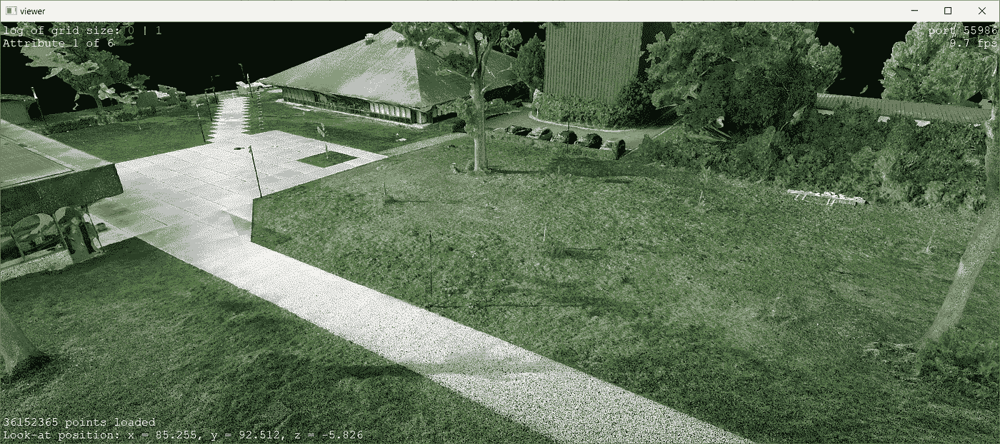

以下链接提供的 3D 点云来自 DJI Phantom 4 飞行，随后是摄影测量重建过程。F. Poux

🤓 ***注意*** *:* 对于这个操作指南，你可以使用[这个库](https://drive.google.com/file/d/1DUEy-gayYudkuJUou_cfNmPAmwdbbgml/view?usp=sharing)中的点云，我已经过滤和转换过了，这样你就处于最佳状态了。如果你想在不安装任何东西的情况下预先可视化并使用它，你可以查看一下 [webGL 版本](https://www.flyvast.com/flyvast/app/page-snapshot-viewer.html#/379/f6e0963b-db5d-aa3c-a541-32e3a0ead5ff)。

# 步骤 3:在脚本中加载点云

我们首先在脚本中导入必要的库(NumPy 和 LasPy)，并加载。las 文件中一个名为`point_cloud`的变量。

```
import numpy as np
import laspy as lp
input_path="D:/CLOUD/POUX/ALL_DATA/"
dataname="2020_Drone_M"
point_cloud=lp.file.File(input_path+dataname+".las", mode="r")
```

很好，我们差不多准备好了！最棒的是，LasPy 库还为变量`point_cloud`提供了一个结构，我们可以使用简单的方法来获取，例如，X、Y、Z、红色、蓝色和绿色字段。让我们这样做来分离坐标和颜色，并把它们放在 NumPy 数组中:

```
points = np.vstack((point_cloud.x, point_cloud.y, point_cloud.z)).transpose()
colors = np.vstack((point_cloud.red, point_cloud.green, point_cloud.blue)).transpose()
```

🤓

# **步骤 4(可选):最终预处理**

**如果您的数据集太大，或者您想在二次抽样版本上进行试验，我建议您查看下面的文章，它给出了实现这一任务的几种方法:**

**[](/how-to-automate-lidar-point-cloud-processing-with-python-a027454a536c) [## 如何使用 Python 自动处理激光雷达点云

### 使用 Python 从头开始点云子采样的终极指南。它涵盖了激光雷达输入/输出，三维体素网格处理…

towardsdatascience.com](/how-to-automate-lidar-point-cloud-processing-with-python-a027454a536c) 

或以下形成广泛的点云训练:

[](https://learngeodata.eu/point-cloud-processor-formation/) [## 点云处理在线课程- 3D 地理数据学院

### 编队学习先进的点云处理和三维自动化。开发新的 python 地理数据技能和开源…

learngeodata.eu](https://learngeodata.eu/point-cloud-processor-formation/) 

为了方便起见，如果您有超过 1 亿个点的点云，我们可以使用以下方法快速切片您的数据集:

```
factor=10
decimated_points_random = points[::factor]
```

🤓 ***注意*** *:* 运行这个将每 10 行保留 1 行，从而将原始点云的大小除以 10。

# 第五步:选择你的观想策略。

现在，让我们选择如何可视化我们的点云。老实说，虽然可视化本身可以避免繁琐的 I/O 操作，但是能够在 Python 中包含一些可视化交互和处理工具是一个很好的补充！因此，我推荐的解决方案是使用一个点云处理工具包，它可以实现这一点甚至更多。如果你想探索其他的可能性，我还是会给你其他的选择，⚖️.

## 解决方案 A(保留):PPTK

PPTK 包有一个三维点云查看器，它直接将一个 3 列的 NumPy 数组作为输入，可以交互式地可视化 1 千万到 1 亿个点。它通过使用八叉树来剔除视见体外部的点并将远处的点组近似为单个点，从而减少了每帧中需要渲染的点的数量。

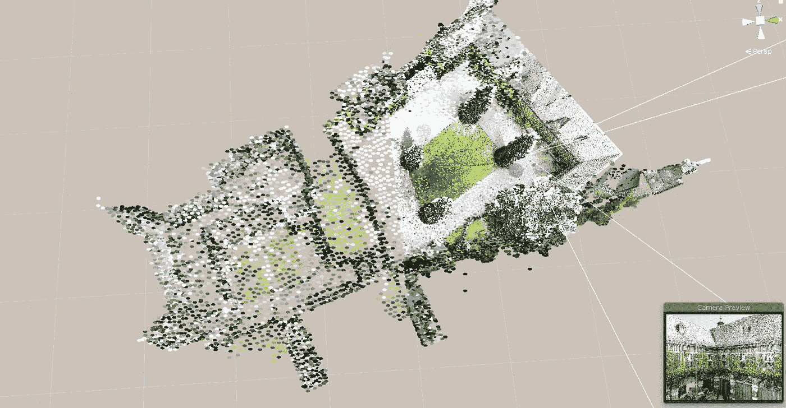

模拟八叉树结构中的平截头体剔除。[来源:虚拟现实(VR)环境下海量 3D 点云的分类与集成。](https://orbi.uliege.be/handle/2268/242146)

首先，您可以使用 Pip 管理器简单地安装该库:

```
pip install pptk
```

然后，您可以通过输入以下命令，从点云中可视化您之前创建的`points`变量:

```
import pptk
import numpy as np
v = pptk.viewer(points)
```

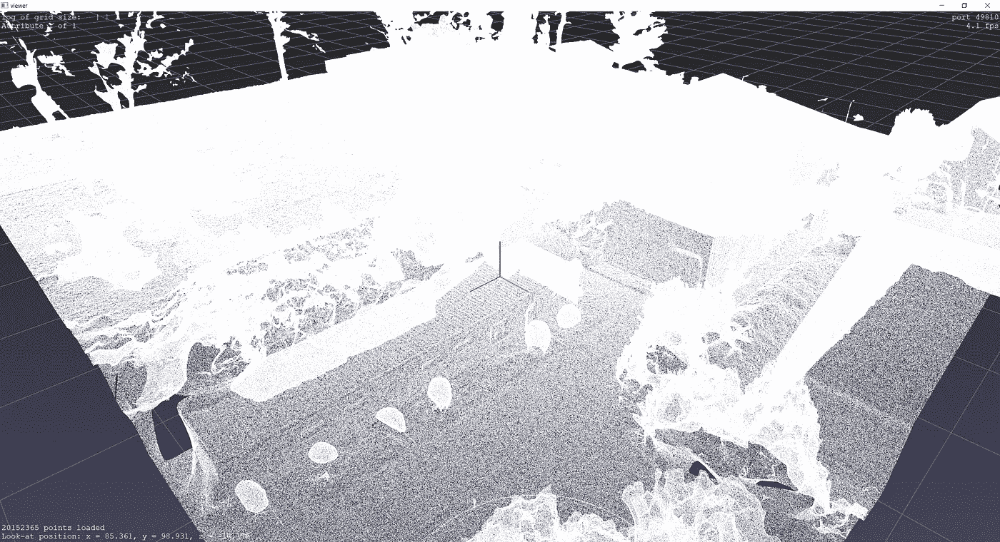

在启动时，查看器将输入点组织成八叉树。当视点被操纵时，八叉树被用于将远处的点组近似为单个点，并在视见平截头体之外剔除点，从而显著减少了被渲染的点的数量。一旦视点不再有变化，观察者就开始执行更耗时的点的详细渲染。F. Poux

你不认为我们漏掉了一些颜色吗？让我们通过在控制台中键入以下命令来解决这个问题:

```
v.attributes(colors/65535)
```

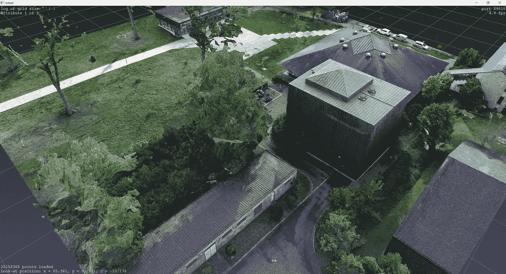

PPTK 查看器中带有颜色信息的 3D 点云。F. Poux

🤓 ***注*** *:* 我们的颜色值是从。las 文件。我们需要[0，1]区间内的值；因此，我们除以 65535。

这是更好的方式！但是，如果我们也想可视化额外的属性呢？嗯，你只要把你的属性链接到你的路径上，它就会动态更新。

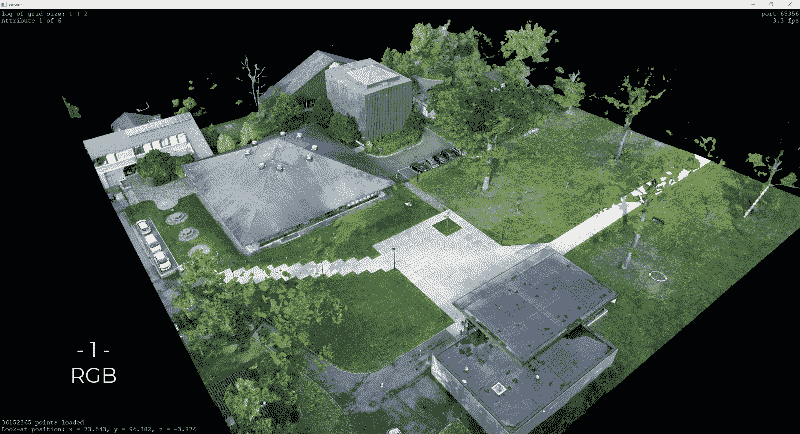

预先计算的几个属性的可视化示例。

💡 ***提示:*** *不要最大化窗口大小，以保持 30 FPS 以上的良好帧率。目标是拥有最好的执行运行时，同时拥有可读的脚本*

您还可以将窗口参数化，以显示与特定色带相关的每个属性，管理点大小，将背景设为黑色，不显示网格和轴信息:

```
v.color_map('cool')
v.set(point_size=0.001,bg_color=[0,0,0,0],show_axis=0,show_grid=0)
```

## 备选方案 B:开放 3D

对于想用 Python 读取和显示点云的优秀替代方案的人，我推荐 Open3D。您也可以使用 Pip 软件包管理器来安装必要的库:

```
pip install open3d
```

如果您想扩展 3d 网格操作的知识，我们已经在下面的教程中使用了 Open3d:

[](/5-step-guide-to-generate-3d-meshes-from-point-clouds-with-python-36bad397d8ba) [## 使用 Python 从点云生成 3D 网格的 5 步指南

### 生成 3D 网格的教程(。obj，。ply，。stl，。gltf)自动从三维点云使用 python。(奖金)…

towardsdatascience.com](/5-step-guide-to-generate-3d-meshes-from-point-clouds-with-python-36bad397d8ba) 

这将在您的机器上安装 Open3D，然后您将能够通过执行以下脚本来读取和显示您的点云:

```
import open3d as o3dpcd = o3d.geometry.PointCloud()
pcd.points = o3d.utility.Vector3dVector(points)
pcd.colors = o3d.utility.Vector3dVector(colors/65535)
pcd.normals = o3d.utility.Vector3dVector(normals)o3d.visualization.draw_geometries([pcd])
```

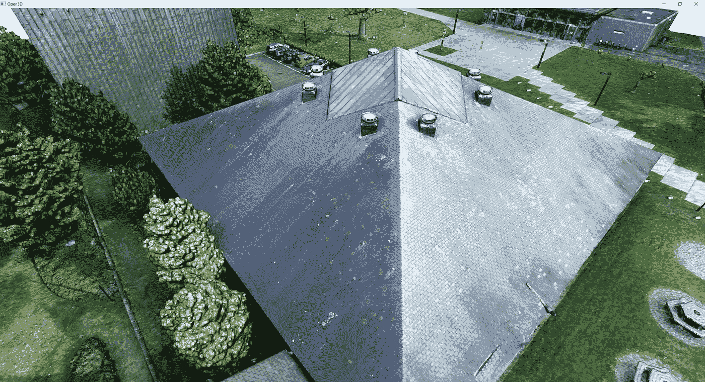

在 Open3D 中可视化的三维点云。请注意法线是如何很好地用来增强几何图形的视觉效果的。F. Poux

Open3D 实际上正在发展，您可以通过一些有趣的方式来显示点云，以填充最终的孔洞，如创建体素结构:

```
voxel_grid = o3d.geometry.VoxelGrid.
create_from_point_cloud(pcd,voxel_size=0.40)o3d.visualization.draw_geometries([voxel_grid])
```

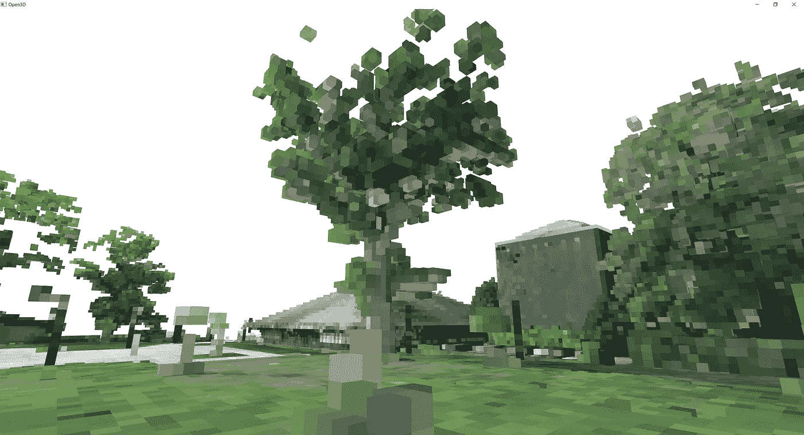

点云的 3D 体素表示，其中每个体素表示一个 40×40cm 的立方体。F. Poux

🤓 ***注*** *:* 为什么 Open3d 不是此时的选择？如果您处理的数据集少于 5000 万个点，那么这就是我推荐的。如果您需要这个阈值以上的交互式可视化，我建议要么出于可视化目的对数据集进行采样，要么使用 PPTK，这对于可视化更有效，因为您已经为此目的创建了八叉树结构。

## 其他(对 Colab 友好的)替代品:Pyntcloud 和 Pypotree

如果您希望能够对点云数据进行简单和交互式的探索，而不管使用哪种传感器来生成它，也不管用例是什么，我建议您查看 [Pyntcloud](https://pyntcloud.readthedocs.io/en/latest/) 或 [PyPotree](https://pypi.org/project/pypotree/) 。这些将允许你在你的笔记本上观想点云，但是要小心表演！Pyntcloud 实际上依赖于 Matplotlib，PyPotree 要求 I/O 操作；因此，两者实际上都不是超高效的。尽管如此，我还是想提到它们，因为对于小的点云和 Google Colab 中的简单实验，你可以整合可视化。一些例子:

```
### PyntCloud ###
conda install pyntcloud -c conda-forge
from pyntcloud import PyntCloudpointcloud = PyntCloud.from_file("example.ply")
pointcloud.plot()### PyntCloud ###
pip install pypotreeimport pypotree 
import numpy as np
xyz = np.random.random((100000,3))
cloudpath = pypotree.generate_cloud_for_display(xyz)
pypotree.display_cloud_colab(cloudpath)
```

# 步骤 6:与点云交互

回到 PPTK。要进行交互式选择，比如停车场上的汽车，我将移动我的相机俯视图(快捷键是`7`)，我将拖动一个矩形选择按住`Ctrl` + `LMB`进行选择。

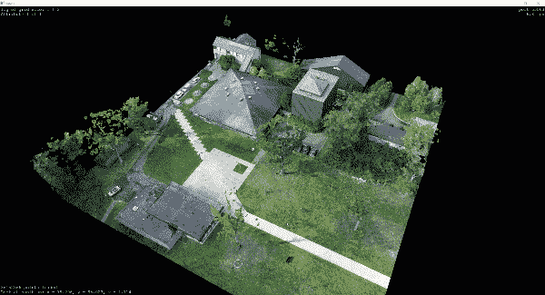

💡 ***提示:*** *如果您对选择不满意，一个简单的* `RMB` *将擦除您当前的选择。是的，您可以进行多项选择*😀。

做出选择后，您可以返回 Python 控制台，然后获取赋值的点标识符。

```
selection=v.get('selected')
```

这实际上会返回一个 1D 数组，如下所示:


选择是一个数组，包含每个选定点的索引。F. Poux

您实际上可以扩展这个过程，一次选择多个元素(`Ctrl` + `LMB`)，同时细化选择，删除特定的点(`Ctrl` + `Shift` + `LMB`)。

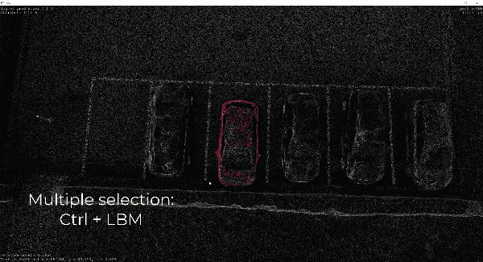

从点云创建多个选择。F. Poux

在此之后，在保存所选点索引的`selection`变量上交互应用一系列过程变得毫不费力。

让我们复制一个场景，其中您自动在地面和非地面元素之间优化您的初始选择(汽车)。

# 步骤 7:走向自动分段

在包含完整点云的查看器中，存储在变量`v`中，我做出如下选择`selection=v.get('selected')`:

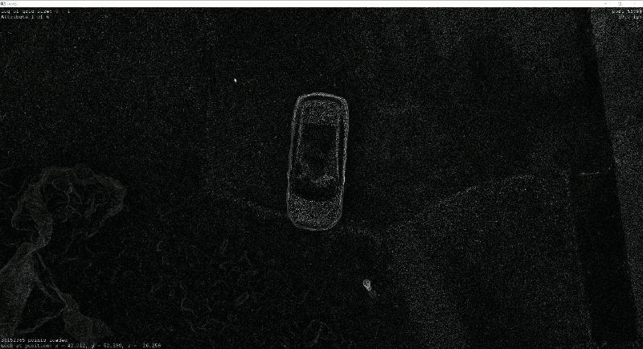

步骤 1:我们从初始三维点云中选择点。F. Poux

然后计算每个点的法线。为此，我想说明使用 PPTK 的另一个关键要点:函数`estimate_normals`，它可用于基于半径搜索或 k 最近邻获得每个点的法线。不用担心，我将在另一个指南中深入说明这些概念，但目前，我将使用 6 个最近的邻居来运行它，以估计我的法线:

```
normals=pptk.estimate_normals(points[selection],k=6,r=np.inf)
```

💡 ***提示:*** *记住* `selection` *变量保存点的指数，即点云中的“线号”，从 0 开始。因此，如果我只想在这一点子集上工作，我将把它作为* `points[selection]`传递给*。然后，我为每个点选择仅使用 6 个最近邻居的 k-NN 方法，通过也将半径参数设置为* `np.inf` *，这确保我不使用它。我也可以同时使用这两个约束，或者将 k 设置为* `-1` *，如果我想进行纯半径搜索的话。*

这将基本上返回以下内容:

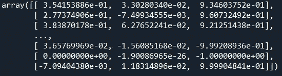

每个点的法线示例。F. Poux

然后，我要对**和**进行过滤，返回法线与 Z 轴不共线的原始点的指数。我建议使用以下代码行:

```
idx_normals=np.where(abs(normals[...,2])<0.9)
```

🤓 ***注释****:The*【，是 NumPy 的一种说法，说我只在我的 3×n 点矩阵的第三列工作，持有法线的 Z 属性。它相当于 `normals[:,2]` *。然后，因为我的法线没有取向(因此可以指向天空或地心)，所以我以绝对值作为比较点，并且将使用功能`np.where()`仅保持符合条件* `<0.9`的那个。

为了使结果可视化，我创建了一个新的查看器窗口对象:

```
viewer1=pptk.viewer(points[idx_normals],colors[idx_normals]/65535)
```

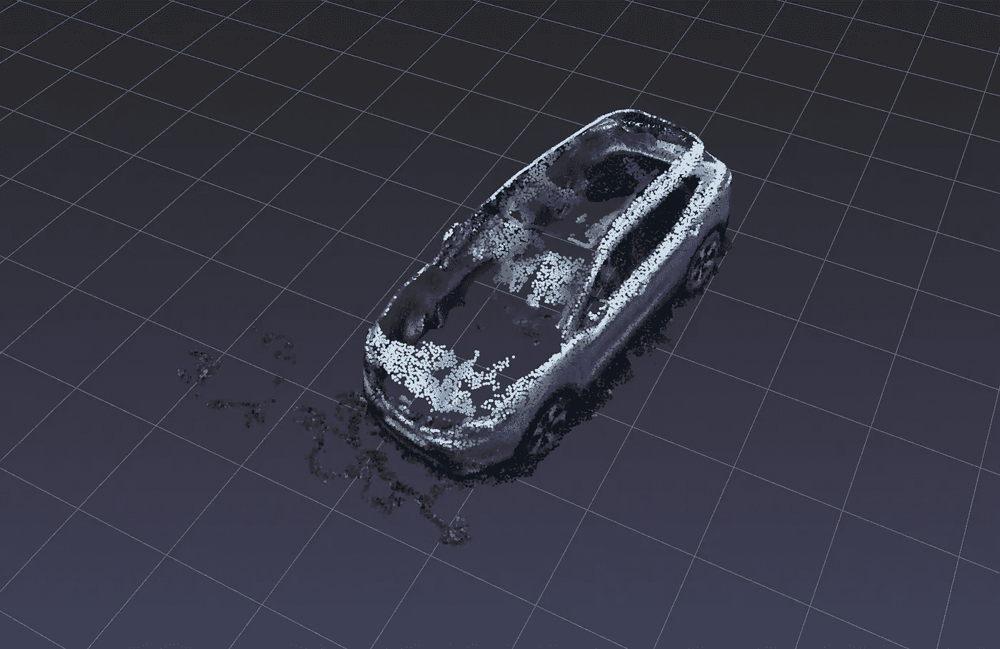

自动正常过滤后的 3D 点云段。看看有些点是怎么在车顶和整个汽车结构上掉下来的。F. Poux

可以看出，我们还过滤了一些点部分的汽车。这可不好🤨。因此，我们应该将该过滤与另一个过滤相结合，以确保仅选择接近地面的点作为法线过滤的主体:

```
idx_ground=np.where(points[...,2]>np.min(points[...,2]+0.3))
idx_wronglyfiltered=np.setdiff1d(idx_ground, idx_normals)
idx_retained=np.append(idx_normals, idx_wronglyfiltered)viewer2=pptk.viewer(points[idx_retained],colors[idx_retained]/65535)
```

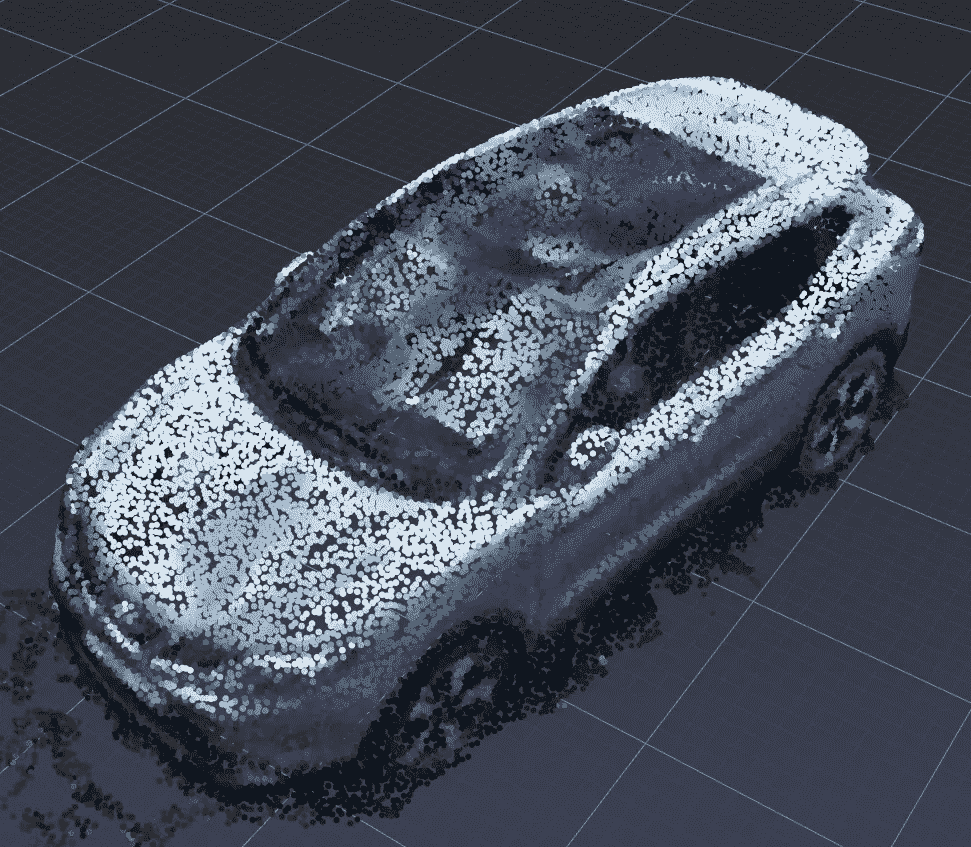

3D 点云会针对垂直法向接近初始段的最低 Z 值的点进行过滤。F. Poux

这真好！现在，您可以探索这种强大的思维方式，并结合任何过滤(例如在 RGB 上播放以消除剩余的草……)来创建一个完全交互式的分割应用程序。更好的是，可以结合 3D 深度学习分类！吼吼。但那是以后的事了😉。

# 步骤 8:用函数打包你的脚本

最后，我建议把你的脚本打包成函数，这样你就可以直接重用其中的一部分作为块。我们可以首先定义一个`preparedata()`，它将把任何`.las`点云作为输入，并格式化它:

```
def preparedata():
    input_path="D:/CLOUD/OneDrive/ALL_DATA/GEODATA-ACADEMY/"
    dataname="2020_Drone_M_Features"
    point_cloud=lp.file.File(input_path+dataname+".las", mode="r")
    points = np.vstack((point_cloud.x, point_cloud.y, point_cloud.z) 
    ).transpose()
    colors = np.vstack((point_cloud.red, point_cloud.green,
    point_cloud.blue)).transpose()
    normals = np.vstack((point_cloud.normalx, point_cloud.normaly, 
    point_cloud.normalz)).transpose()
    return point_cloud,points,colors,normals
```

然后，我们编写一个显示函数`pptkviz`，它返回一个查看器对象:

```
def pptkviz(points,colors):
    v = pptk.viewer(points)
    v.attributes(colors/65535)
    v.set(point_size=0.001,bg_color= [0,0,0,0],show_axis=0,
    show_grid=0)
    return v
```

此外，还有一个额外的好处，这里有一个函数`cameraSelector`，可以从打开的浏览器中获取相机的当前参数:

```
def cameraSelector(v):
    camera=[]
    camera.append(v.get('eye'))
    camera.append(v.get('phi'))
    camera.append(v.get('theta'))
    camera.append(v.get('r'))
    return np.concatenate(camera).tolist()
```

我们定义了`computePCFeatures`函数来自动细化您的交互式分割:

```
def computePCFeatures(points, colors, knn=10, radius=np.inf):
    normals=pptk.estimate_normals(points,knn,radius)
    idx_ground=np.where(points[...,2]>np.min(points[...,2]+0.3))
    idx_normals=np.where(abs(normals[...,2])<0.9)
    idx_wronglyfiltered=np.setdiff1d(idx_ground, idx_normals)
    common_filtering=np.append(idx_normals, idx_wronglyfiltered)
    return points[common_filtering],colors[common_filtering]
```

好了😁现在，您只需启动包含上述功能的脚本，并开始使用`computePCFeatures`、`cameraSelector`和更多您的作品与您的选择进行交互:

```
import numpy as np
import laspy as lp
import pptk*#Declare all your functions here*if __name__ == "__main__":
    point_cloud,points,colors,normals=preparedata()
    viewer1=pptkviz(points,colors,normals)
```

然后很容易调用脚本，然后使用控制台作为实验的工作台。例如，我可以保存几个摄像机位置并创建一个动画:

```
cam1=cameraSelector(v)
*#Change your viewpoint then -->* cam2=cameraSelector(v)
*#Change your viewpoint then -->* cam3=cameraSelector(v)
*#Change your viewpoint then -->* cam4=cameraSelector(v)poses = []
poses.append(cam1)
poses.append(cam2)
poses.append(cam3)
poses.append(cam4)
v.play(poses, 2 * np.arange(4), repeat=True, interp='linear')
```

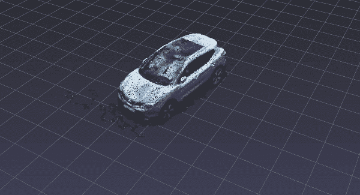

点云 PPTK 内 4 个关键帧之间的线性插值。F. Poux

# 结论

您刚刚学习了如何导入、可视化和分割由 3000 多万个点组成的点云！干得好！有趣的是，直接在 GPU 上执行的点云片段和单个点的交互选择现在可以用于点云实时编辑和分割。但这条路并没有到此为止，未来的帖子将更深入地探讨点云空间分析、文件格式、数据结构、分割[2–4]、动画和深度学习[1]。我们将特别关注如何管理大点云数据，如下面的文章中所定义的。

[](/the-future-of-3d-point-clouds-a-new-perspective-125b35b558b9) [## 三维点云的未来:一个新的视角

### 被称为点云的离散空间数据集通常为决策应用奠定基础。但是他们能不能…

towardsdatascience.com](/the-future-of-3d-point-clouds-a-new-perspective-125b35b558b9) 

我的贡献旨在浓缩可操作的信息，以便您可以从零开始为您的项目构建 3D 自动化系统。你可以从今天开始在[地理数据学院](https://learngeodata.eu/)参加一个编队。

[](https://learngeodata.eu/point-cloud-processor-formation/) [## 点云处理在线课程- 3D 地理数据学院

### 编队学习先进的点云处理和三维自动化。开发新的 python 地理数据技能和开源…

learngeodata.eu](https://learngeodata.eu/point-cloud-processor-formation/) 

# 参考

1. **Poux，F.** ，& J.-J Ponciano。(2020).三维室内点云实例分割的自学习本体。*国际摄影测量与遥感学会。拱门。Pho 的。&雷姆。B2，309–316；[https://doi . org/10.5194/ISPRS-archives-XLIII-B2–2020–309–2020](http://dx.doi.org/10.5194/isprs-archives-XLIII-B2-2020-309-2020)*

2. **Poux，F.** ，& Billen，R. (2019)。基于体素的三维点云语义分割:无监督的几何和关系特征与深度学习方法。ISPRS 国际地理信息杂志。8(5), 213;[https://doi.org/10.3390/ijgi8050213](https://doi.org/10.3390/ijgi8050213)

3. **Poux，F.** ，纽维尔，r .，纽约，g .-a .&比伦，R. (2018)。三维点云语义建模:室内空间和家具的集成框架。*遥感*、 *10* (9)、1412。[https://doi.org/10.3390/rs10091412](https://doi.org/10.3390/rs10091412)

4. **Poux，F.** ，Neuville，r .，Van Wersch，l .，Nys，g .-a .&Billen，R. (2017)。考古学中的 3D 点云:应用于准平面物体的获取、处理和知识集成的进展。*地学*， *7* (4)，96。[https://doi.org/10.3390/GEOSCIENCES7040096](https://doi.org/10.3390/GEOSCIENCES7040096)**