# Python 环境设置指南&理解 Python IDLE

> 原文：<https://towardsdatascience.com/guide-to-setup-python-environment-understanding-python-idle-7ff3e00941d6?source=collection_archive---------12----------------------->

## 为您的第一个 Python 代码创建环境并开始编码

照片由 [Hitesh Choudhary](https://unsplash.com/@hiteshchoudhary) 拍摄自 [Unsplash](https://unsplash.com/)

## 介绍

在您的计算机上设置 python 环境是启动第一个 Python 脚本的第一步。有许多方法可以开始设置和安装，但是在本文中，我们将通过从官方 python 发行版—【python.org】下载来学习设置我们的 Python 环境。在设置好我们的 Python 环境之后，我们将会了解更多与 Python 安装捆绑在一起的 Python IDLE。( **本教程使用的操作系统是 Windows 上的*)

## 让我们开始设置我们的 Python 环境！

第 1 步—导航至 Windows 的[python.org](https://www.python.org/downloads/windows/)下载页面。

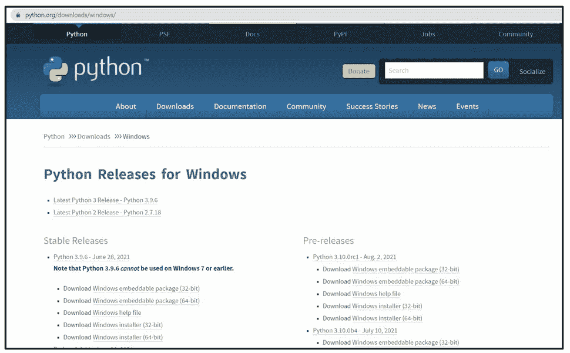

用于 Windows 的 Python 下载页面

步骤 2 —选择最新的 Python 3 版本(*截止到本文，最新的 Python 版本是 Python 3.9.6* )

选择最新的 Python 3 版本

第 3 步—滚动到页面底部，选择并下载 64 位 Windows x86–64 可执行安装程序(*如果您的电脑使用 32 位，则选择 32 位 Windows x86 可执行安装程序*)

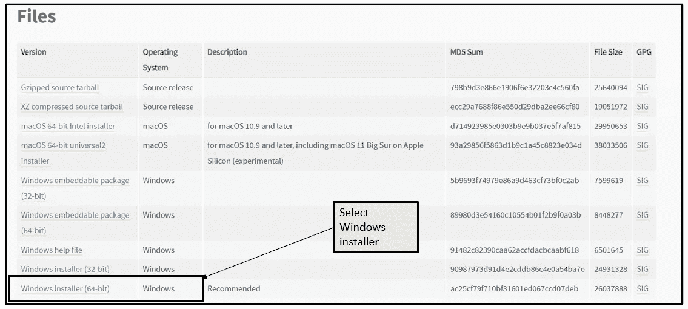

选择并下载 Windows Installer

第 4 步—双击下载的文件运行安装程序

*   运行 Python windows 安装程序后会弹出一个对话框

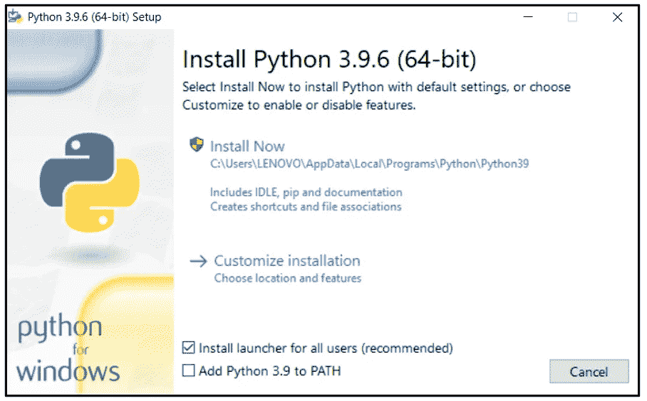

Python 安装-对话框

*   勾选**“将 Python 3.9 添加到路径中”** *(此框默认未勾选)*

通过将 Python 添加到 PATH，您可以从命令提示符(cmd)运行 Python。总之，您可以通过在命令提示符下键入“python”来运行 Python 脚本。

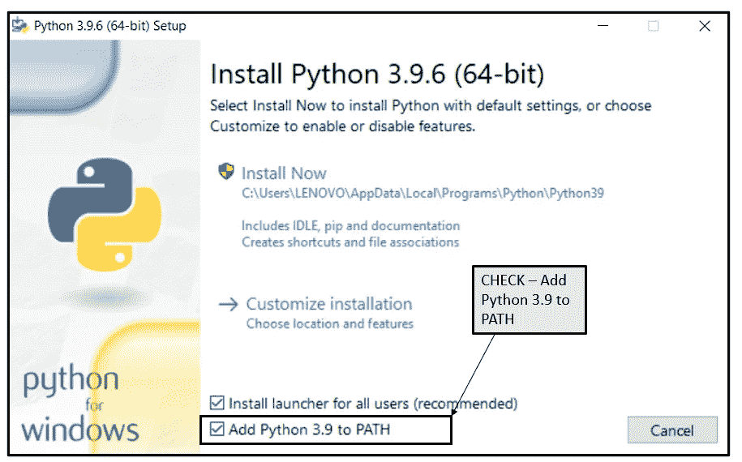

选中选项-将 Python 添加到路径

第 5 步—单击“立即安装”

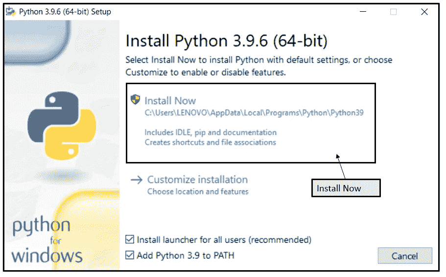

Python 安装

如果安装成功，您将收到消息“安装成功”

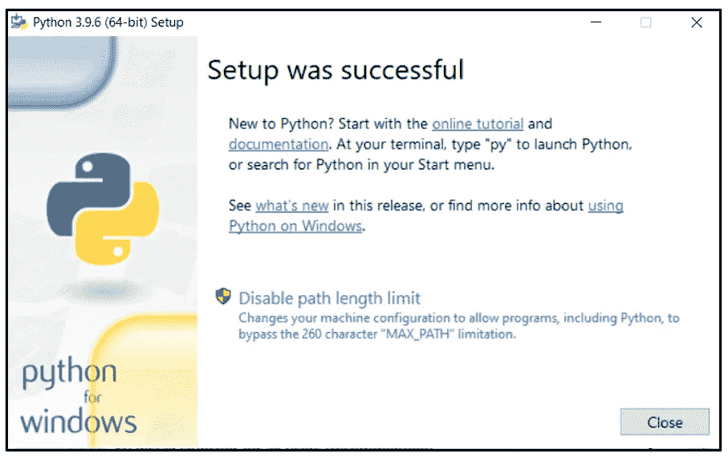

Python 安装-设置成功消息

步骤 6-在 Windows 搜索栏下，输入“Python”并选择“IDLE (Python 3.9 64 位)”

Windows 搜索栏:python

空闲的 shell 窗口将会打开，您可以开始编写您的第一个 Python 脚本。

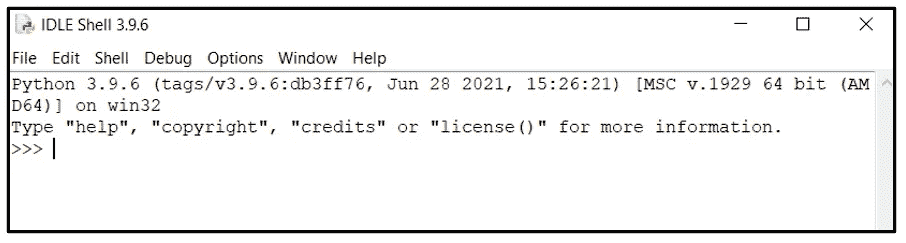

Python 空闲外壳

步骤 7 —编写您的第一个 Python 脚本(“Hello，World！”)

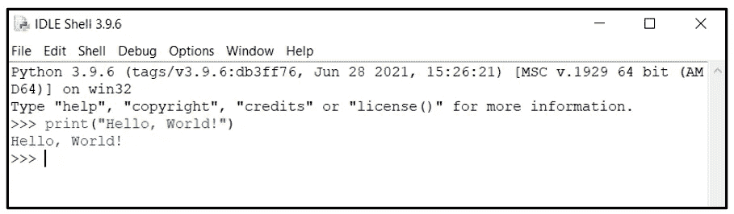

打印“你好，世界！”在 Python 空闲 shell 上

干得好！现在，您已经在计算机上安装了 Python 环境，并编写了第一个 Python 剪贴画。在本文的下一部分，我们将了解更多关于 Python IDLE 的内容。

## Python 空闲是什么？

Python IDLE 是一个 Python 开发和学习环境，IDLE 代表:

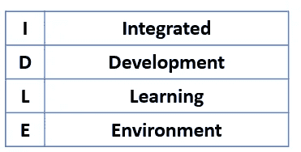

有两个主要窗口，即“外壳窗口”和“编辑器窗口”。“外壳窗口”提供对 python 交互模式的访问，“编辑器窗口”允许您创建或编辑现有的 Python 文件。让我们首先看看如何配置我们的 Python 空闲环境。

在您的空闲 shell 环境中，导航到选项→配置空闲。

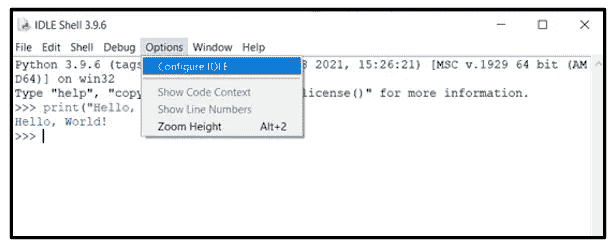

配置空闲

“设置”菜单将弹出，标签“字体/标签”显示一个字体列表，您可以为您的 Python 空闲环境选择字体和字体大小。

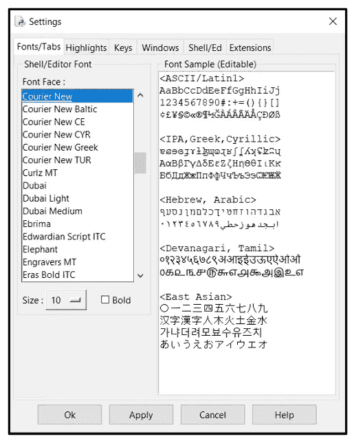

空闲-设置菜单:字体/标签

在“Highlights”选项卡上，您可以为 Python 空闲环境选择一个主题。例如，我会换成深色的，因为这样对我们的眼睛更舒服。

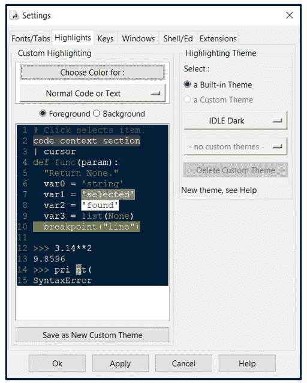

空闲—设置菜单:突出显示

在“窗口”选项卡中，您可以指定您的窗口首选项，如宽度、高度等。但是让我们注意一下启动时的窗口首选项，默认情况下是“打开 Shell 窗口”。

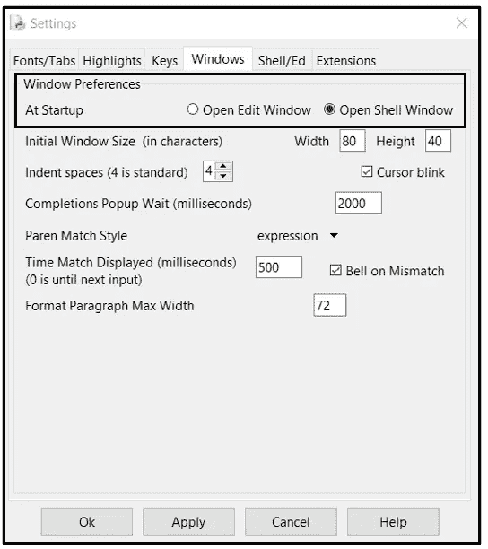

空闲-设置菜单:窗口

在前面的部分中，我们从窗口搜索栏中打开了“ **IDLE (Python 3.9 64 位)】**，默认情况下，当设置中默认选择了选项“ **Open Shell Window** ”时，会打开空闲的“Shell Window”。但是如果选择了选项“**打开编辑窗口**，会发生什么呢？—让我们尝试选择此选项，并观察不同之处。

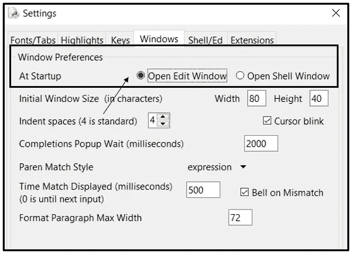

空闲-设置菜单:窗口-切换到“打开编辑窗口”

观察在“外壳窗口”中选择“打开编辑窗口”选项时的区别。“外壳窗口”显示关于安装的 Python 版本和操作系统的信息，而“编辑窗口”是一个空文件。

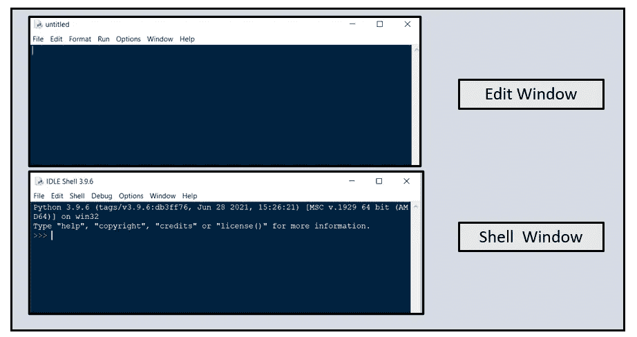

Python 空闲的“外壳窗口”和“编辑窗口”

“外壳窗口”是一个交互式环境，当您只需要执行一行命令时非常有用，但是如果您正在编写一个完整的 python 程序，它就不实用了。因此,“编辑窗口”将会更有用，因为您可以编写 Python 脚本并保存代码。让我们看一个打印“Hello，World！”使用“编辑窗口”的消息。

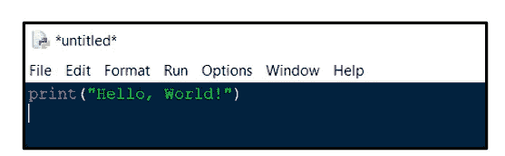

Python 空闲的“编辑窗口”

请注意,“编辑窗口”不会在输入时运行脚本。要运行该脚本，您需要导航到运行→运行模块。

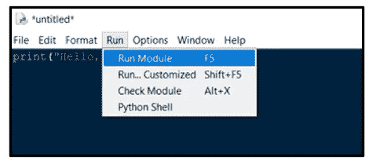

Python 空闲“编辑窗口”——运行模块

将弹出一条对话框消息，要求必须保存文件。用您喜欢的文件名*保存 Python 文件(确保用。py 扩展)*。保存后，将执行您的 Python 文件，并将结果打印在一个空闲的“Shell 窗口”中

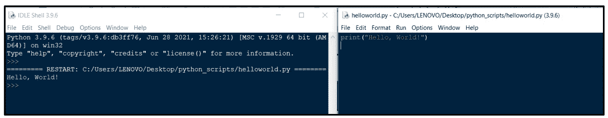

空闲“外壳窗口”中显示的 Python 脚本的结果

## **结论:**

建立自己的 Python 环境很容易，只需要几个步骤，您就可以开始编写第一个 Python 脚本了。作为一个初学 Python 的人，Python IDLE 是开始你的旅程的好地方。然而，随着您的深入，您将会探索其他工具，如 Pycharm、Eclipse、Microsoft Visual Studio 等。尽管如此，祝贺你第一次探索 Python！

## 参考和链接

[1][https://realpython.com/installing-python/](https://realpython.com/installing-python/)

[2]https://realpython.com/python-idle/

[3]https://geek-university.com/python/idle-editor/