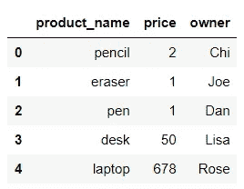
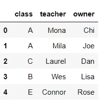

# Python 中的 SQL 及其等效命令指南

> 原文：<https://towardsdatascience.com/guide-to-sql-and-its-equivalent-commands-in-python-445e134adaba?source=collection_archive---------9----------------------->

## 对于那些想将 SQL 代码转换成 Python 中的等效命令的人来说，这是一个快速而详细的备忘单！


照片由[洛佩兹罗宾](https://unsplash.com/@lopezrobin?utm_source=medium&utm_medium=referral)在 [Unsplash](https://unsplash.com?utm_source=medium&utm_medium=referral) 拍摄

# 介绍

从头开始学习从来都不是一件容易的事情。原因之一是我们不知道自己不知道的事情。当我第一次学习 Python 的时候也是这样。我对它的逻辑、语法等感到沮丧，因为要记住它们太难了。最后，我发现了自己学习 Python 的方法，那就是通过 SQL。由于 SQL 是我在日常工作中经常使用的工具，我试图将我在 SQL 中学到的一切应用到 Python 中。这种学习方式帮助我同时研究、练习和记忆。

在本文中，我将向您展示一些重要的 SQL 查询和它们在 Python 中的对等物，具体来说是 Pandas。这被认为是对那些想用和我一样的方法学习 Python 的人的一个指导。希望它能成为那些想买熊猫的人的有用的小抄。

# 数据

我将创建一个简单的数据集如下:

```
data = {'product_name': ['pencil', 'eraser', 'pen', 'desk', 'laptop'],
        'price': [2, 1, 1, 50, 678], 
        'owner': ['Chi','Joe','Dan','Lisa','Rose']}
df = pd.DataFrame(data) 
```



图 1:测向数据集

现在，让我们开始吧！

# **选择**

下面是 SQL 的一些简单的`select`语句和 Python 中的等效命令。

您可以通过调用数据集的名称(在我的示例中为 ***df*** )来轻松选择所有的列和行。

在另一种情况下，您只需要从数据中提取特定的列，您可以考虑一些简单的方法，例如使用`loc` & `iloc.`进行切片和索引。在我下面的示例中，我向您展示了从 ***df*** 数据集获取列 ***owner*** 的三种不同方法。

如果我想查看我的数据中存在的独特产品？很简单，只需从 ***df*** 数据集提取 ***product_name*** 列，并应用`unique()`函数即可。

# **带条件选择**

在 Pandas 中，有几种方法可以选择特定的条件行。我们可以用 Python 的切片方法，索引，应用查询函数或者 lambda。

在下面的例子中，我将向您展示一些解决方案，通过对列值的一个或多个约束来获得所需的数据。通常，当在条件论元中处理数值数据时，我们必须处理不同的比较(例如:col_number > 2，total_people ≥ 10 等)。作为参考，在 Python 中，对数值数据的比较运算符描述如下:

*   等于`==`
*   不等于`!=`
*   大于`>`
*   不到`<`
*   大于或等于`>=`
*   小于或等于`<=`

此外，如果您想要提取特定类别等于字符串或对象的行，您应该用`==`操作符指定它。我选择所有***product _ name****为 pen 的行的情况如下表所示。让我们来看看。*

# *选择其值与特定模式相似的行*

*假设您在一个数据中有数千个产品列表，但您只想选择产品名称与 ***笔*** 相关的数据。在这种情况下，使用`contains()`功能是一个很好的选择。*

*有时，当您确切地知道所需类别的开始和结束字符时，您可以借助于功能`startswith()`或`endswith()`来指定它。*

# *选择其值在确定集合中的行*

*如果要选择特定列值在某个范围或集合内的行。`isin()`命令可以帮你做到。例如，我想选择 ***product_name*** 为钢笔或铅笔的数据。我将调用如下命令:*

# *计算函数*

*与 SQL 类似，Python 也提供不同的函数来计算聚合或生成描述性摘要。*

*在我的例子中，我只用一行代码就可以很容易地找到产品的总数、所有产品的总价格、产品价格的范围(例如:最大值、最小值、中间值等)。*

# *分组依据*

*Group by 很简单。只需在想要分组的列上使用`groupby()`功能。例如，从我的 ***df*** 数据中，为了计算每个人为他/她的产品支付的钱，我将数据按每个人的名字分组，然后计算相应的产品价格总额。*

# ***排序值***

*基本上，`sort_values`默认按升序排列值。因此，如果您想按降序排列值，只需在`sort_values()`参数中声明`ascending = 'FALSE'`。*

*为了查看谁付了最多的钱，我用`groupby()`和`sum()`函数计算每个人付的钱，然后按降序排列价格总和。*

# *加入*

*我将创建另一个名为 df2 的数据帧来描述`join`命令。*

```
*data1 = {'class': ['A','A','C','B','E'],
        'teacher':['Mona','Mila','Laurel','Wes','Connor'], 
        'owner': ['Chi','Joe','Dan','Lisa','Rose']}
df2 = pd.DataFrame(data1)*
```

**

*图 2:数据帧 df2*

*基本**连接**包括左连接、右连接、外连接和内连接。在不同的情况下，根据我们的需要，我们可以选择合适的`join.`*

*让我们看看如何用四种类型的`join.`转换我们的数据*

# *结论*

*通过与你熟悉的东西联系起来，我认为你可以更好地学习和记忆新的东西。我希望这些技巧能够在将来当你开始钻研 Python 中的数据操作时作为有用的备忘单。祝你好运！*