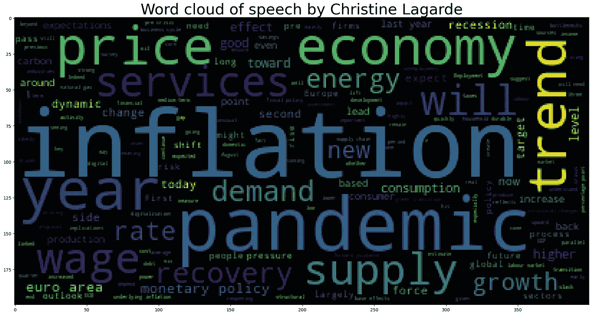
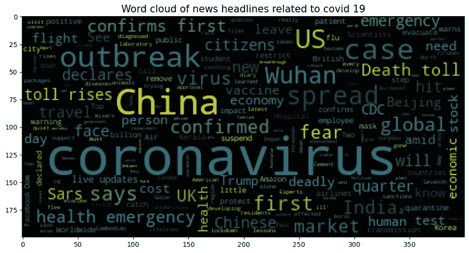
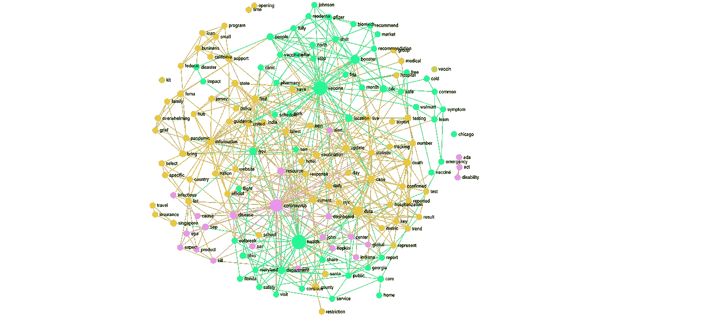

# 应用研究设计用词云指南

> 原文：<https://towardsdatascience.com/guide-to-using-word-clouds-for-applied-research-design-2e07a6a1a513?source=collection_archive---------18----------------------->

## 发现文本数据可视化在应用研究中的基本应用，并将其用于您的项目

作者图片

作者:**彼得·科拉布** *(布拉格，Lentiamo 德国齐柏林大学)*、**雅尔科·菲德姆克** *(德国齐柏林大学)*和**大卫·什特尔巴** *(布拉格兰蒂莫)*

# 介绍

在应用经济研究中，经常分析各种形式的文本数据，包括陈述、演讲、公告及其效果。由于文本可以量化并用于建模和预测，研究人员使用各种技术来钻取它并将其用于他们的实证设计。

更具体地说，单词 cloud 是一个简单但广泛使用的图形，用于显示和理解文本数据的结构。所有主要的统计程序如 [R](https://www.r-graph-gallery.com/wordcloud.html) 、 [SPSS](https://github.com/IBMPredictiveAnalytics/Word_Cloud_Visualization) 、 [Python](https://pypi.org/project/wordcloud/) 、 [STATA](https://www.statajournal.com/article.html?article=dm0094) 、 [MATLAB](https://www.mathworks.com/help/matlab/ref/wordcloud.html) 以及商业智能工具如 [Tableau](https://kb.tableau.com/articles/howto/creating-a-word-cloud) 、 [Looker](https://medium.com/r?url=https%3A%2F%2Fdocs.looker.com%2Fexploring-data%2Fvisualizing-query-results%2Fword-cloud-options) 、 [Power BI](https://appsource.microsoft.com/en-us/product/power-bi-visuals/WA104380752?src=office&tab=Overview) 都包含一个 word cloud 实现。Word clouds 还开发了更具吸引力的功能，包括各种形状和背景。

这个简短的指南将向您介绍 word cloud 在设计应用研究和数据科学项目中的四个主要应用，以及一个 Python 实现。您将学习如何:

*   使用词云理解数据的结构
*   选择模型的基本特征
*   理解文本数据中的上下文
*   用词云让数据讲故事

# 什么是词云？

词云是由特定文本中使用的词组成的图像，其中每个词的大小表明其频率或重要性。这是一个在商业和学术界经常使用的简单图表。从技术上来说，词云是基于计算语言学中的 *n 元语法*和来自文本或语音样本的 *n* 项的概率场序列。这些项目可以是音节、字母或单词。

使用拉丁数字前缀，大小为 1 的 *n* 克被称为**“一元格】，**大小为 2 的是**“二元格”，**大小为 3 的是**“三元格”**。**当 *N=1* 时，单字实质上就是句子中的单个单词。例如，在句子“牛跳过月亮”中，如果 *N = 2* ，那么 N 个字母组是:“牛”、“牛跳”、“跳过”、“越过”等。若 *N = 3* ，则 N 个字母组分别为:“牛跳”、“牛跳”、“跳过”和“跳过月亮”。**

**许多数据应用程序实际上都使用克数。其中之一是[Google Books Ngram Viewer，](https://books.google.com/ngrams)这是一个在线搜索引擎，它使用在 Google Books 的数字化资源库中找到的 n-gram 的年度计数来绘制任何一组搜索字符串的频率。**

**在学术界，研究人员最近使用词云来显示文本数据中的频率。在金融领域， [Feldkircher 和他的同事们](https://www.suerf.org/suer-policy-brief/30483/whats-the-message-interpreting-monetary-policy-through-central-bankers-speeches)收集了欧洲各国央行行长的讲话，并对其内容进行了分析。在《经济文献杂志》的文章中，鲍尔斯和卡林用文字云来说明经济学教学改革的必要性。早在 2018 年，[艾伦和麦卡里尔](https://link.springer.com/article/10.1007%2Fs11192-018-2847-y)就探索了关于全球变暖、气候变化和天气的 Twitter 数据，并使用词云来绘制美国前总统唐纳德·特朗普发布的推文中最突出的词。**

# **数据汇总**

**词云旨在总结文本数据。让我们用欧洲央行(ECB)行长克里斯蒂娜·拉加德(Christine Lagarde)在 2021 年 9 月央行行长论坛上的一次演讲来证明这一点。该讲座可在欧洲央行的网站上获得。即使不读书，我们也能一眼看懂欧洲央行行长的话题。为了实现这一点，**的关键问题**是:**

*   **数据的结构是什么？**
*   **数据中需要重点关注的关键话题是什么？**

**我们将使用 Python 的 *matplotlib* 和 *wordcloud* 库:**

**文章文本被复制到一个字符串变量:**

**最后，我们用摘要文本生成一个词云。**

**通过几行代码，我们看到欧洲央行行长主要关注通胀，而通胀与疫情、复苏、衰退、工资和供给有关。这些显然是欧洲经济在科维德危机两年后面临的话题。**

****

**作者图片**

**这个词云应用的好处随着数据量的增加而显著增加。如果数据集包含几十或几百 MB，那么读取这样的文本会消耗大量时间。另一方面，运行 python 脚本只需几秒钟，可以自动化，并为潜在决策提供最相关的信息。**

# **F **特征选择****

**超越简单的数据汇总，但遵循相同的原则，我们可以选择最关键的因素，并将其用于进一步建模。特征选择是机器学习中常用的术语，指的是为模型选择必要的变量。词云显示词频(或 *n* -1 克)或词共现(高阶*n*-克)，它们本质上对文本数据也是如此。**

****关键问题**在这里:**

*   **与特定主题相关的最重要的因素是什么？**

**这个例子的数据集是*冠状病毒新闻标题数据集*，可以在 Kaggle 免费获得[。在这里，更具体地说，我们可以讨论以下问题:](https://www.kaggle.com/sagunsh/coronavirus-news-headline?select=corona_news.csv)**

*   **在新冠肺炎疫情期间，讨论最多的话题是什么？**

**我们只从包含 Covid 危机开始的数据集中选取前 2000 个标题。这个子集就是上一个例子中相同 python 代码的源数据。**

****

**作者图片**

**我们可以看到，Covid 19 爆发后，媒体关注的是它的起源:中国，武汉，以及它向其他国家的传播。任何关注 Covid 危机开始的社会和经济研究都应该反映这些关键因素。**

# ****动画词云****

**词云通常表现为没有时间维度的**的静态图。另一方面，动画单词云将动态特征添加到分析中，并有助于讲述有关数据的故事。将数百张图片组合成一个 MP4 视频，我们可以看到**话题随着时间的发展所具有的意义。******

**[迈克尔·凯恩和他的同事](http://www.thisismikekane.com/view_projects?filter=lab,pubs,people,research,energy,wireless,scm,automation,personal,teaching,hacks,fun,outdoors,photos)引入了这种原始的方法，收集了在*科学*杂志摘要中发现的 250 个最常用的单词，并开发了一个名为 **the Word Swarm 的动态版本的单词云。**Python 代码可以从他们的 [GitHub](https://github.com/thisIsMikeKane/WordSwarm) 中免费获得。**

**我们优化了 Python 3.8 的原始代码。并用它来分析发表在五个最著名的经济期刊上的文章标题。我们的数据由从这些期刊的文章标题中构建的词频(即单字)组成。动画单词云以激动人心的视频演示方式展示了数据中的研究趋势。文章可从[这里](https://python.plainenglish.io/animated-word-cloud-a-novel-way-for-the-visualization-of-word-frequencies-6505418acbb3)获得。**

**资料来源: [Koráb、trba、Fidrmuc (2021 年)。一种新颖的词频可视化方法。In: Python 直白的英语。](https://python.plainenglish.io/animated-word-cloud-a-novel-way-for-the-visualization-of-word-frequencies-6505418acbb3)**

# ****文字网络可视化****

**词云用于生成文本数据的可视摘要；然而，他们可能会忘记上下文。存在得到错误结果和对基础数据做出错误假设的风险。文本网络分析通过考虑“单词”的共现(即高阶 *n* -grams)来解决这个问题，并提出了一种不同的文本思维方式:不是概念云，而是概念之间关系的云[**。**](https://noduslabs.com/cases/generate-word-cloud-context/)**

****[**InfraNodus**](https://infranodus.com/) 是另一个以文本网络分析为核心框架进行文本挖掘和文本数据分析的工具。文本网络方法可以概括为以下步骤:****

*   ****从各种来源导入数据****
*   ****生成网络结构****
*   ****创建一个与其他相关主题相关的单词云****

****我们之前的文章提供了对 InfraNodus 的详细介绍，包括在新冠肺炎危机期间对 google 查询的深入分析。要了解更多详细信息，也请阅读 [InfraNodus 文档](https://infranodus.com/#demos)和一个 [word cloud 案例研究。](https://noduslabs.com/cases/generate-word-cloud-context/)****

********

****资料来源:[科拉布(2021 年)。InfraNodus:文本数据分析的优秀工具。In:走向数据科学。](/infranodus-excellent-tool-for-textual-data-analysis-2b4839e6cd10)****

# ****结论****

****互联网和其他数字数据源提供了大量的文本信息。例如，政策制定者的演讲可以在网上免费获取，既面向公众，也面向投资者和研究人员等决策者。处理和可视化这些标准方法无法处理的大量信息(阅读和手动总结)变得非常重要。****

****本文提出了词云在静态、动态和文本网络形式的应用研究设计中的三种应用。我们证明了这些方法对于在早期阶段设计研究或者在后期阶段展示结果是非常有用的。它们还可以用于各种使用文本数据的数据科学项目，无论是在公司还是在其他地方。在不久的将来，工具的数量及其在各个领域的应用肯定会增加。****

*****PS:你可以订阅我的* [*邮件列表*](https://medium.com/subscribe/@petrkorab) *在我每次写新文章的时候得到通知。如果你还不是中等会员，你可以在这里加入***。******