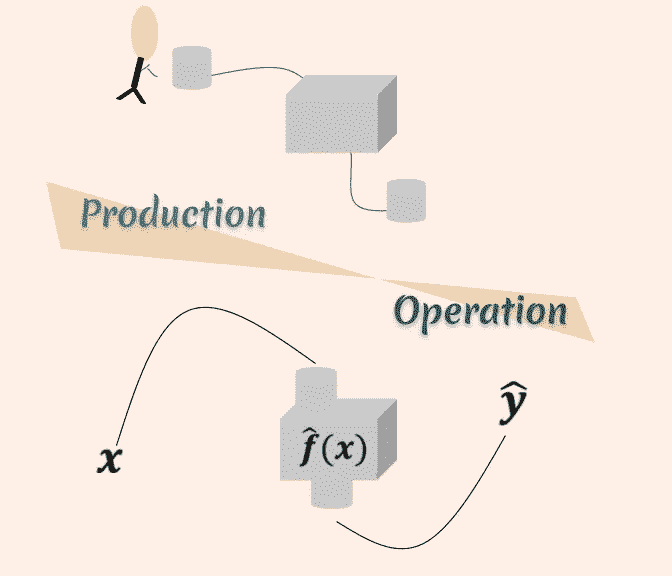

# 图形用户界面或编码:生产与操作

> 原文：<https://towardsdatascience.com/guis-or-coding-production-vs-operation-fc1de9e483a8?source=collection_archive---------42----------------------->

## 随着我们更深入地进入数据和计算机科学的时代，一场关于我们使用的工具的辩论开始了，是关于 GUI 软件还是编码软件。到底应该用哪一个？

许多从未想过处理数据和分析的研究人员或专业人士在过去几年中发现自己陷入了这一不断扩展的数据科学学科。即使是上个世纪的科学研究也需要许多学术研究人员在小得多的规模上处理数据分析，对于他们来说，构建甚至简单的线性模型都不是一项直观的任务，而是为他们自己提供了一系列 GUI 软件选项来执行这些任务。

由于我们对数据科学的知识从未像现在这样扎实，我们还发现自己在开发数据科学项目时，澄清了执行分析任务的心态和我们的文化。这就是选择使用 GUI 构建我们的分析还是对它们进行编码的时候了。

用户友好的软件从它自己的名字中发现了它的优点，它是为那些没有扎实编程背景的研究人员设计的，以使他们能够执行分析任务。在数据科学中，它可以包括一个漂亮的可视化或者一个汇总表。然而，当谈到数据科学时，我们不再意味着只提供一个数字或一个表格，我们指的是构建管道，对输入观察执行一系列不同的任务。在这方面，我们的最终产品是复杂的，因此我们构建产品的工具也需要健壮。

使用 GUI 软件没有什么本质上的错误，但是我们需要理解它什么时候可以使用，什么时候不满足健壮性。

数据科学的生产与运营。(图片由作者提供)

**用户友好的软件不是一个强大的生产环境**

在讨论 GUI 软件的使用与编码时，需要考虑的主要区别是**开发/生产**一个分析管道和**操作**一个已建成的管道或将其投入使用之间的区别。对于 DevOps 实践下的计算机科学家和软件开发人员来说，这种区别在历史上一直非常明显，现在是时候开始为数据科学家/统计学家或任何发现自己正在进行数据分析的研究人员澄清这一点了。

为了使用一个数据分析实例，我们可以考虑构建一个预测模型。处理线性模型以发布 p 值的经典统计学家或研究人员可以将自己置于此处，因为计算 p 值是构建线性模型的副产品。构建模型需要多种方法，例如清理数据、过滤信息、测试不同的模型架构、可能在不同标准下进行优化等。许多 GUI 软件都包含执行这项任务的工具，不同方面的面板，不同选项的下拉菜单，最后，由用户测试(许多)不同的选项并保存输出以做出最终决定。

上面描述的场景相当于在高速公路旁边建一辆汽车，上面有一个帐篷，可以存放所有必要的工具。类似的是在办公室的办公桌上搭建一台电脑。这是可以做到的，但应该这样做吗？在这两个例子中，很容易区分这两种环境:有一个**生产环境**，它通常根据构建它的任务(构建片段、集合等)被分成不同的环境。)，还有一个**操作**环境，就是高速公路或者办公室的办公桌。

**编程是每个人的**

即使一个模型的生产可以很好地在 GUI 软件中进行，这也不能破坏我们通过编程构建分析工具时的健壮性和准确性。随着计算和数据科学的飞速发展，编程或编码正成为本世纪的一项必要技能。为数据分析构建我们的模型或管道需要开始从他们的操作环境中获得独立的位置。我们越是致力于一个清晰和健壮的环境来生产我们的模型，我们将为以后的部署构建更精确的机器。

> 制作一个模型并不是一个用户友好的任务，但是操作它肯定是。

尽管编程对于许多专业人士来说仍然是一个难以理解的概念，但这个概念现在比以往任何时候都更加用户友好。像 Python 和 R 这样的编程语言在语法和范式上都非常容易理解，更不用说开放访问设施了。它们不是轻轻一点就能出现的，但与学习 c 等低级语言相比，它们付出的努力要少得多。请注意，这里的“显著”没有 p 值来证明。

**GUI:操作环境**

因此，并不是说图形用户界面一点用都没有。用户友好的软件，正如它的名字所声明的，是用来完成用户友好的任务的。制作一个模型并不是一个用户友好的任务，但是操作它肯定是。从这个角度来看，我们可以并且可能仍然应该依赖 GUI 作为我们的模型或数据科学管道的部署模式。

GUI 在编码方面无法超越的一个方面:再现性

讨论中不能忽略的另一个方面是再现性原则，这在通过计算机发展的科学中特别重要。再现性是学术界和工业界许多领域讨论的一个新兴话题。在不同的讨论中，我们发现关于[对人工智能](/the-reproducibility-crisis-and-why-its-bad-for-ai-c8179b0f5d38)来说可再现性意味着什么、[科学](https://book.fosteropenscience.eu/en/02OpenScienceBasics/04ReproducibleResearchAndDataAnalysis.html)和[它所代表的价值](/on-the-value-of-reproducibility-ea6907aaa9a3)的争论。尽管[一种编码文化并不能保证流畅的可再现性，因为还需要更多的东西，但是它确实克服了 GUI 的缺点，比如完全依赖于用户。](/why-git-and-git-lfs-is-not-enough-to-solve-the-machine-learning-reproducibility-crisis-f733b49e96e8)

随着我们渴望成为更好的数据科学家，以及该领域的持续增长，特别是以如此高的速度增长，事实证明有必要为发展新技能腾出空间，并将我们的工作文化从更快的生产结果转变为数据科学的稳健生产环境。