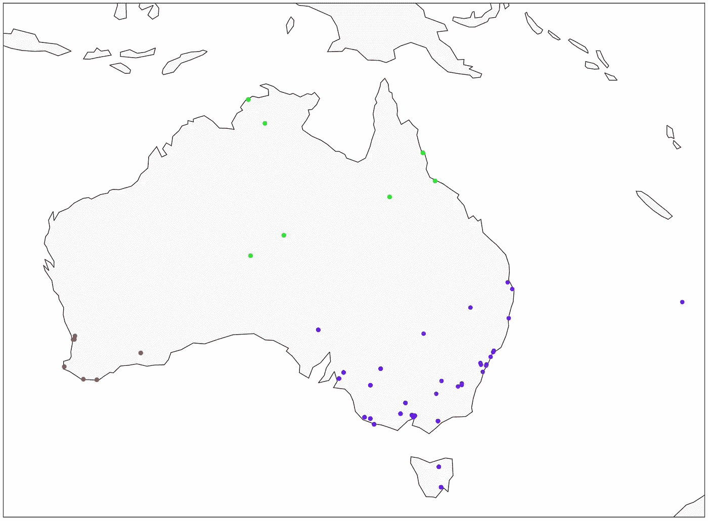

# HAC:层次凝聚聚类——比 K-Means 更好吗？

> 原文：<https://towardsdatascience.com/hac-hierarchical-agglomerative-clustering-is-it-better-than-k-means-4ff6f459e390?source=collection_archive---------8----------------------->

## 机器学习

## HAC 算法的详细介绍，以及 Python 代码和几个有用的图表

层次凝聚聚类(HAC)。图片由[作者提供。](https://solclover.com/)

# 介绍

如果你想成为一名成功的数据科学家，了解不同的机器学习算法是如何工作的是至关重要的。

这个故事是解释每个算法的细微差别的系列的一部分，并提供了一系列 Python 示例来帮助您构建自己的 ML 模型。

# 故事涵盖以下主题:

*   层次凝聚聚类(HAC)属于算法的范畴。
*   HAC 算法如何工作的细节。
*   Python 示例，使用 HAC 对澳大利亚城市进行聚类。

# 层次凝聚聚类属于哪一类算法？

答案就藏在它的名字里。由于 HAC 是一种聚类算法，它位于机器学习的**无监督**分支之下。

无监督技术，尤其是聚类，通常用于细分分析，或作为更复杂项目的起点，这些项目需要了解数据点之间的相似性(例如，客户、产品、行为)。

下面的图表是我对各种不同算法进行分类的尝试。在许多情况下，一个算法可以用来解决多种类型的问题。例如，由于神经网络独特的机器学习方法，我将神经网络归为一类。然而，神经网络可以用于广泛的问题，如分类，回归，或作为强化学习的一个组成部分。

下图是**互动，**所以请点击不同类别**放大并展示更多**👇。

机器学习算法分类。由[作者](https://solclover.com/)创建的互动图表。

***如果你喜欢数据科学和机器学习*** *，请* [*订阅*](https://solclover.com/subscribe) *每当我发表一个新的故事，你都会收到一封电子邮件。*

# 分层凝聚聚类(HAC)算法是如何工作的？

## 基础知识

HAC 不像 K-Means 那样广为人知，但它非常灵活，通常更容易解释。它使用“自下而上”的方法，这意味着每个观察从它自己的集群开始，随着一个集群在层次结构中向上移动，集群对被合并。

为了帮助说明这一点，我制作了一些图表。第一个演示了该算法如何一步一步地合并最近的点，直到只剩下一个聚类。

等级凝聚聚类(HAC)的作用。图片由[作者](https://solclover.com/)提供。

注意，上面的 HAC 实现使用了“平均”链接，我将在本节稍后解释这一点。

第二张图被称为**树状图**。它给出了所采取的路径的全貌，从所有单独的点(图形的底部)移动到一个单独的点/簇(图形的顶部)。

层次凝聚聚类(HAC)树状图。图片由[作者](https://solclover.com/)提供。

注意，我添加了一条水平虚线来表示我选择的集群的数量。一般来说，一个好的经验法则是确定 y 轴上没有垂直线与任何水平线相交的最大部分。让我进一步解释一下。

y 轴上的值是点/簇之间接近程度的度量。水平线表示那些点/簇被合并的地方。

上图表明您可能需要考虑 2 个集群，因为没有集群合并的最大距离在 24 和 30 之间(30–24 = 6)。

然而，在这种情况下，我决定选择 4 个集群，这是一个稍微不太理想的解决方案(大约。19.5–14.5=5).因此，我的集群是红色，亮绿色，蓝色，诺福克岛独自坐在角落里。

这是星团在地图上的样子:

用 HAC 算法进行澳大利亚城市聚类。图片由[作者](https://solclover.com/)提供。

## 链接类型

有多种方法将这些点连接在一起。我在上面的例子中使用了“平均”链接，因为它易于说明和理解。但是，熟悉其他链接类型也很重要。注意，本文末尾的 Python 部分将向您展示如何指定您想要使用的链接方法。

*   **‘Average’:**使用两个集合的每个观察值的距离的平均值，即找到观察值之间的中点(如图所示)。
*   **“Single”:**使用两个集合的所有观察值之间的最小距离，即在该阶段的点群中寻找最近的点(而不是“average”中使用的群中点)。
*   **“完整”或“最大”:**使用两组所有观察值之间的最大距离。例如，如果该点比聚类 B 的最远点更接近聚类 A 的最远点，则这样的点将被添加到聚类 A 中
*   **‘Ward’:**最小化被合并的聚类的方差。这非常类似于 K-Means 使用的最小化类内平方和(WCSS)。

沃德连杆通常是最常用的一种。它也是 sklearn 实现 HAC 的默认选项，我们将在下面的 Python 部分中探讨。

## HAC 优于 K 均值聚类

使用 HAC 最吸引人的部分是分析树状图的能力，它提供了对任意两个数据点之间相似性水平的洞察。

只需看一眼树状图，就能看出皮尔斯-布斯布鲁克离诺福克岛很“远”，而悉尼和悉尼机场离得很近。鉴于我们的位置数据，这是相当明显的，当我们使用更抽象的属性时，它变得非常有益。

一般来说，您可以使用 HAC 和 K-Means 生成非常相似的聚类，但是能够查看每个数据点的路径，使得 HAC 在分析各个数据点或聚类之间的相似性和差异时更有用。

# 使用澳大利亚城市位置数据的 Python 中的层次凝聚聚类(HAC)

## 设置

我们将使用以下数据和库:

*   来自 Kaggle 的澳大利亚天气数据
*   [Scikit-learn 库](https://scikit-learn.org/stable/index.html)执行 [HAC 聚类](https://scikit-learn.org/stable/modules/generated/sklearn.cluster.AgglomerativeClustering.html?highlight=agglomerative%20clustering#sklearn.cluster.AgglomerativeClustering)
*   [Scipy 库](https://docs.scipy.org/doc/scipy/reference/index.html)创建[树状图](https://docs.scipy.org/doc/scipy/reference/generated/scipy.cluster.hierarchy.dendrogram.html)
*   用于数据可视化的 [Plotly](https://plotly.com/python/) 和 [Matplotlib](https://matplotlib.org/)
*   [熊猫](https://pandas.pydata.org/docs/)用于数据操作
*   [地理坐标](https://geopy.readthedocs.io/en/stable/)，[进度条](https://pypi.org/project/progressbar/)，采集澳大利亚城市坐标的时间

让我们导入所有的库:

然后我们从 Kaggle 获取澳大利亚的天气数据，你可以按照这个链接下载:[https://www . ka ggle . com/jsphyg/weather-dataset-rattle-package](https://www.kaggle.com/jsphyg/weather-dataset-rattle-package)。

我们接收数据并派生出一些新的变量，比如 Location2，它具有使用 Geopy 提取城市坐标的正确格式。

经过一些修改的 [Kaggle 的澳大利亚天气数据](https://www.kaggle.com/jsphyg/weather-dataset-rattle-package)片段。图片由[作者](https://solclover.medium.com/)提供。

因为我们的原始数据只包含位置(城市)名称而不包含坐标，所以我们将使用 Geopy 的名称来获取这些坐标。请注意，我们在每次调用之间添加了 1 秒钟的睡眠时间，以避免服务器过载。

这是我们得到的回报片段:

澳大利亚城市坐标。图片由[作者](https://solclover.com/)提供。

让我们在地图上标出这些城市:

地图上的澳大利亚城市。图片由[作者](https://solclover.com/)提供。

## HAC 聚类—树状图

为了决定聚类的数量，我们将首先绘制一个类似于我们前面分析的树状图。请注意，我们将绘制其中两个，一个使用“平均”链接，另一个使用“沃德”链接，这样您就可以看到结果的差异。

**平均联动:**

使用**平均**联动的 HAC 树状图(同上)。图片由[作者](https://solclover.com/)提供。

**病房联动:**

HAC 树状图使用 **ward** 联动。图片由[作者](https://solclover.com/)提供。

如你所见，当使用“ward”链接时，我们得到了完全不同的结果。之前的蓝色星团已经一分为二，孤独的诺福克岛已经并入紫色星团。

## HAC 聚类—生成聚类标签

既然我们已经决定有 4 个聚类，让我们运行 scikit learn 的 HAC 算法来为“平均”和“区”链接方法生成聚类标签。

附加了聚类标签的位置数据片段。图片来自[作者](https://solclover.com/)。

最后，让我们在地图上画出结果。

**平均联动:**

使用**平均**链接的澳大利亚城市 HAC 聚类(同上)。图片由[作者](https://solclover.com/)提供。

**病房联动:**

为了使用' ward '绘制聚类，我们使用了与上面相同的 Python 代码，只是我们将第 5 行和第 8 行中的' Clusta4 '更改为' Clustw4 '。

使用 **ward** 链接的澳大利亚城市 HAC 聚类。图片由[作者](https://solclover.com/)提供。

# 结论

分层凝聚聚类的好处在于，它让您可以通过树状图了解所有数据点的接近程度。当您通过使用两个以上的属性将聚类带到多维空间时，这变得更加重要。

总结一下，我想重申我在 K-Means 文章里说过的话:**聚类很少是你分析的终点；通常，这只是一个开始。**因此，一定要探索如何使用新创建的聚类来提高对数据的理解，并了解它如何帮助开发其他类型的模型。

祝您在项目中使用 HAC 愉快，如果您有任何问题或建议，请随时告诉我！

干杯！👏
T3【索尔·多比拉斯】T4

***如果你已经花光了这个月的学习预算，下次请记得我。*** *我的个性化链接加入媒介是:*

 [## 通过我的推荐链接加入 Medium 索尔·多比拉斯

### 作为一个媒体会员，你的会员费的一部分会给你阅读的作家，你可以完全接触到每一个故事…

solclover.com](https://solclover.com/membership) 

如果您喜欢这篇文章，您可能也会喜欢对其他类型的聚类算法的内部工作原理的详细解释:

 [## K-Means 聚类——在 Python 中成功使用的综合指南

### 用真实数据的 Python 演示解释 K-Means 算法

towardsdatascience.com](/k-means-clustering-a-comprehensive-guide-to-its-successful-use-in-python-c3893957667d)  [## DBSCAN 聚类算法——如何构建强大的基于密度的模型

### 对有噪声的应用程序使用基于密度的空间聚类的详细指南

towardsdatascience.com](/dbscan-clustering-algorithm-how-to-build-powerful-density-based-models-21d9961c4cec)  [## GMM:高斯混合模型——如何成功地使用它对你的数据进行聚类？

### GMM 的直观解释和有用的 Python 示例

towardsdatascience.com](/gmm-gaussian-mixture-models-how-to-successfully-use-it-to-cluster-your-data-891dc8ac058f)