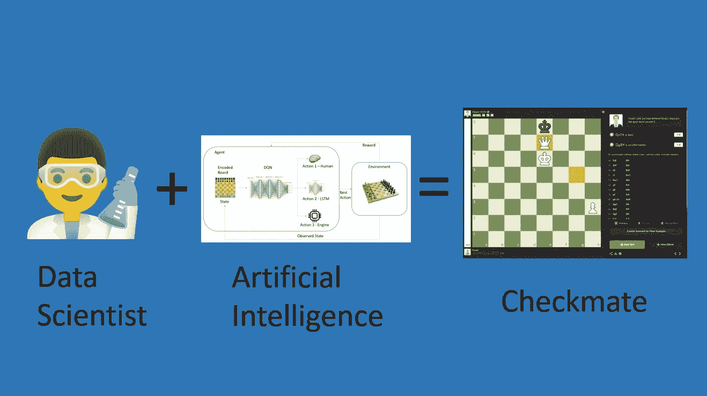
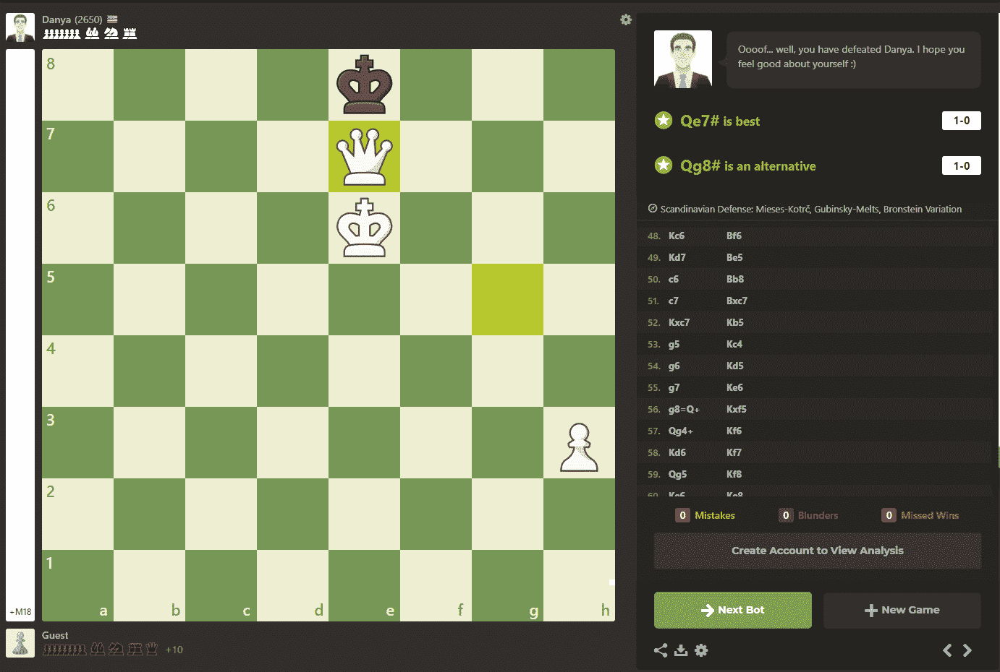
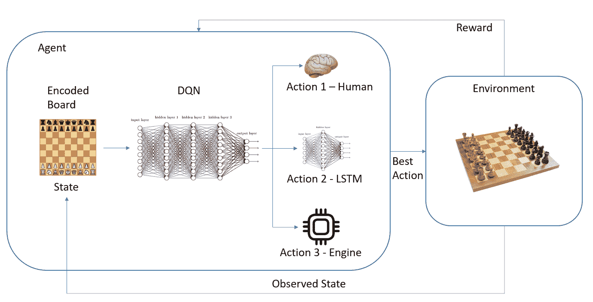
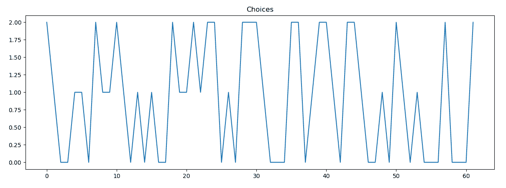

# 决策深度强化学习下象棋

> 原文：<https://towardsdatascience.com/hacking-chess-with-decision-making-deep-reinforcement-learning-173ed32cf503?source=collection_archive---------12----------------------->

## 用机器学习创造国际象棋冠军

作者图片

下图是人工智能算法在 Chess.com 引擎上应用的将死棋，该引擎模拟了 2650(这是相当高的)特级大师——丹尼尔·纳罗迪茨基“丫蛋”。

在本文中，我将介绍为这种深度强化学习算法开发的概念，以及它如何赢得这场激烈的机器大战！

作者图片:查尔斯·谢赛 x·丫蛋——将军

> “呜..你打败了丫蛋。希望你自我感觉良好:)”——丫蛋发动机

国际象棋是一种非常古老的战略棋类游戏，它的传统已经将它转变为一项运动、一门艺术，最终成为一门科学。

由于其复杂性，人类多年来一直试图创建模型来破解国际象棋，并一劳永逸地找到一种变得不可战胜的方法。今天，随着计算的巨大进步，我们有了可以提前几个步骤计算并取得优异结果的模型，如谷歌的 alpha-zero 模型。

我对国际象棋充满热情，没有谷歌的巨大资源，现在是我展示对国际象棋知之甚少但对算法知之甚多的时候了，我们可以创造一个国际象棋冠军，并尝试挑战该领域一些最强的算法。

# 决策深度强化学习

决策深度强化学习是一个概念，它使用深度强化学习通过先前定义的策略来优化决策。主要的想法是，从一组不同的好策略中，算法可以为面临的每种情况选择最佳策略。

深度强化学习模型观察环境中的每个状态，并使用神经网络来选择特定的动作。然后在被改变的环境中采取这个动作，然后代理对新状态进行新的观察并准备下一个动作。每个行为都会给代理人带来一个奖励，代理人的目标总是选择一个行为，使每个状态下的奖励最大化。

作者图片:CharlesChessAI 建筑

> 随着国际象棋游戏、深度 Q 学习、LSTM 和引擎的混合，CharlesChessAI 诞生了！

# 模拟环境——Python Chess 和 Gym-AI

第一步是创建一个模拟环境，以便模型可以观察状态并采取行动，基本上是一个下棋的操场。为此，我使用了 Python 中的几个库:chess、gym 和 gym chess。这些库允许我复制和观察棋盘上的所有移动，模拟一场比赛，除了获得分析分数和状态和移动的良好定义，还有检查，将死，可能的移动等等。

# Charles chesai——智慧

CharlesChessAI 的智能基于 3 个预定义的策略:

*   id:0——人类长期记忆:使用人类玩的 20，000 个游戏的序列，仅过滤在将死中完成的游戏。这个选项着眼于长远，因为它总是以算法的将死而告终。
*   id:1-人类短期记忆:LSTM 的下一个单词预测器先前在大型游戏基础上训练，考虑 10 个移动的序列。该模型使用国际象棋运动作为字符串，并将游戏中的运动解释为句子中的单词。国际象棋表现得像玩家之间的对话。这种选择着眼于短期，因为它基于最后 10 个步骤，只产生下一个步骤。
*   id: 2 —引擎:引擎 Stockfish 的使用。Stockfish 是一个免费的开源国际象棋引擎，它分析游戏并提前计算一些走法以选择最佳走法。

# 夏尔·谢赛十世·丫蛋

下面是一段完整的视频，展示了 CharlesChessAI 在对阵丫蛋的比赛中的所有动作，这场比赛持续了大约 60 个动作 10 分钟。

查尔斯·谢赛 x·丫蛋——作者视频

在与 Danny 的比赛中，该模型存储了他的所有决定，我们可以在下图中分析这些决定，并了解比赛中的行为和决策。

作者图片:CharlesChessAI Choices

在游戏的开始，直到第 25 步，我们看到这个模型在策略之间做了很好的平衡切换，但是在 LSTM 身上使用了很多短期记忆策略。在游戏的中间，直到第 45 步，我们看到模型比开始时更多地使用引擎，更多地与长期人类记忆交替，这保证了良好的移动将游戏带到有利的结局。在游戏的最后，我们看到这个模型使用了大量的人类记忆选项来将死。

仍在开发中的代码在下面我的 GitHub 库中:

<https://github.com/octavio-santiago/CharlesChess_Reinforcement_Learning>  

# 结论

决策模型使算法为每种游戏情况选择最佳策略，多样化策略的组合为一个引擎带来了来自伟大玩家的额外创造力，这是人和机器之间的一种优秀组合。这种算法也是非常动态和自适应的，因为根据玩更多游戏和面对新情况的模型，它学习如何针对每种情况优化决策。

以同样的方式，这种类型的模型应用于国际象棋，它可以应用于其他不同的决策环境。

我留给你们另一个国际象棋游戏，它是在 CharlesChessAI(白棋)和一个名为 Chess Lv100 的 Windows 应用程序引擎之间进行的，难度最大。现在这个模型在与引擎和人类的比赛中都是不败的，我会与他们进行更多的比赛，并在同一频道上发布。“塔之舞”是这场比赛的好名字，你可以更好地跟随视频。

查尔斯想要赢！

我希望这是一本好书！我将提供更多的信息和 CharlesChess 匹配，并将在 LinkedIn 上联系:[https://www.linkedin.com/in/octavio-b-santiago/](https://www.linkedin.com/in/octavio-b-santiago/)