# 带有 GCP Dataproc 的 Hadoop

> 原文：<https://towardsdatascience.com/hadoop-with-gcp-data-proc-3c402065f769?source=collection_archive---------11----------------------->

## Hadoop、其服务和架构简介


理查德·雅各布斯在 [Unsplash](https://unsplash.com/) 上的照片

今天，大数据分析是世界上发展最快的领域之一，因为人们可以从中获得大量好处。随着其巨大的增长和大量的好处，也带来了自己的一系列问题。存储大数据的一个主要问题是，您需要一个大空间来存储数千万亿字节的数据，这是您无法通过个人计算机实现的。即使你设法存储了大数据的一部分，也需要数年时间来处理它。作为对此的解决方案，Hadoop 是由 Apache 软件基金会开发的。

# 介绍

先说:Hadoop 是什么？

Hadoop 是一个开源的**框架**，为**存储**和**处理大数据**而设计。

因此，Hadoop 提供了两个主要功能，**存储大数据**和**处理大数据**。我们使用 HDFS (Hadoop 分布式文件系统)存储大数据，使用 MapReduce 处理大数据。在本文的其余部分，我们将更多地讨论 HDFS。

在谈论 HDFS 之前，让我们先来看看 DFS。在分布式文件系统(DFS)中，您将数据分成小块，分别存储在几台机器上。

> **HDFS** 是专门设计的分布式文件系统，用于在商用硬件集群中存储大型数据集。

*注:商品硬件是廉价硬件。比如你日常使用的笔记本电脑就是商品硬件。*

一般来说，你把文件和目录存储在电脑的硬盘上。一个 HD 分为磁道，然后是扇区，最后是块。通常，硬盘中一个这样的块的大小是 4 KB。

*注意:块是操作系统可以指向的一组扇区。*


大小为 500 GB 的硬盘中的一组块(*图片由作者提供)*

如果我想在硬盘上存储一个大小为 2 KB 的文件，它会存储在一个块中，但是会有剩余的 2 KB 空间。HD 无法将剩余空间再次用于其他文件。因此，该空间将被浪费。

现在，在这个硬盘之上，我们将安装带有 HDFS 的 Hadoop。

在 Hadoop 2.x 中，HDFS 的块大小默认为 128 MB(在 Hadoop 1.x 中为 64 MB)

如果我想在 HDFS 存储一个大小为 300 MB 的文件( *example.txt* )，它将跨三个块存储，如下所示。在块 3 中，将只使用 44 MB。它将有 84 MB 的可用空间，剩余的空间将被释放出来供其他文件使用。

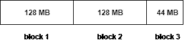

Hadoop 中 300 MB 大小文件的数据分布(*作者图片)*

因此，Hadoop 比 HD 更有效地管理数据存储。

*注意:这里我取了一个 300 MB 大小的文件，仅仅是为了解释这个概念。通常，Hadoop 处理的是太字节大小的非常大的文件！*

# HDFS 服务

HDFS 有两个主要的服务，即 **NameNode** 和 **Datanode** 。

**NameNode** :运行在高端主机上的主守护进程。

**DataNode** :运行在商用硬件上的从守护进程。

*注意:我们为什么对 NameNode 使用高端机器是因为所有的元数据都存储在 NameNode 上。如果 NameNode 出现故障，我们将丢失有关文件每个部分存储位置的所有信息，这最终可能导致无法访问整个 Hadoop 集群。因此，即使数据节点处于活动状态，也不会再使用群集，因为我们将无法访问存储在那里的数据。为了解决这个问题，最常见的做法是使用第二个 NameNode 作为备份。*

## NameNode

*   主守护进程
*   维护和管理数据节点
*   记录元数据(例如，存储块的位置、文件的大小、权限、层次结构等。)
*   从所有数据节点接收心跳和数据块报告

*注意:Heartbeat 告诉* NameNode *这个 DataNode 还活着。*

## 数据节点

*   从属守护进程
*   存储实际数据
*   为客户端发出的读写请求提供服务

# HDFS 的街区复制

为了实现容错，Hadoop 在不同的数据节点上存储数据块的副本。默认情况下，复制因子为 3。也就是说，它将跨数据节点保留集群中任何数据块的三份拷贝。

让我们以之前的 300 MB 文件为例。

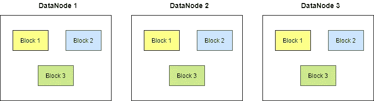

HDFS 数据块复制的高级表示(*图片由作者提供)*

**Hadoop 如何决定将创建的块的副本存储在哪里？**

它使用**机架感知算法。**

当客户端请求在 Hadoop 集群中进行读/写操作时，为了最大限度地减少流量，NameNode 会选择离它更近的 DataNode。这称为机架感知。

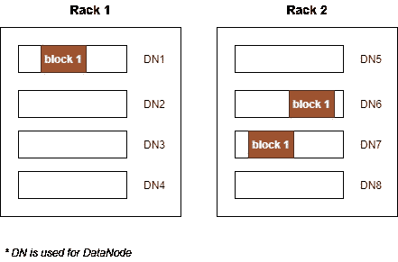

支持容错的块及其副本在机架中的分布(*作者图片)*

不应在原始拷贝所在的同一机架中创建数据块的副本。这里，不应在机架 1 中创建数据块 1 的副本。它们可以在机架 1 以外的任何其他机架中创建。如果我将数据块 1 的副本存储在机架 1 中，并且如果机架 1 出现故障，那么我将丢失数据块 1 中的数据。

*注意:机架是 30 或 40 个节点的集合，这些节点在物理上紧密地存储在一起，并且都连接到同一个网络交换机。机架中任意两个节点之间的网络带宽大于不同机架上两个节点之间的带宽。*

为什么将数据块 1 的两个副本存储在同一个机架(机架 2)上？

这有两个原因。首先，两个机架(机架 1 和机架 2)同时出现故障的可能性最小。其次，将数据文件从一个机架中的一个数据节点移动到同一机架中的一个数据节点所需的网络带宽比将数据文件从另一个机架中的一个数据节点移动要少得多。当不需要额外带宽时，消耗额外带宽是没有意义的。

# 写 HDFS 的建筑

再回到我们之前的例子，假设我们有一个客户想要存储一个名为 *example.txt* 的文件，大小为 300 MB。由于他在本地机器上没有足够的空间，他想把它放到 Hadoop 集群中，但是客户端不知道哪些数据节点有空闲空间来存储他的数据。所以客户端首先联系 NameNode。客户机向 NameNode 发送一个请求，说他想把 *example.txt* 文件放到集群中。

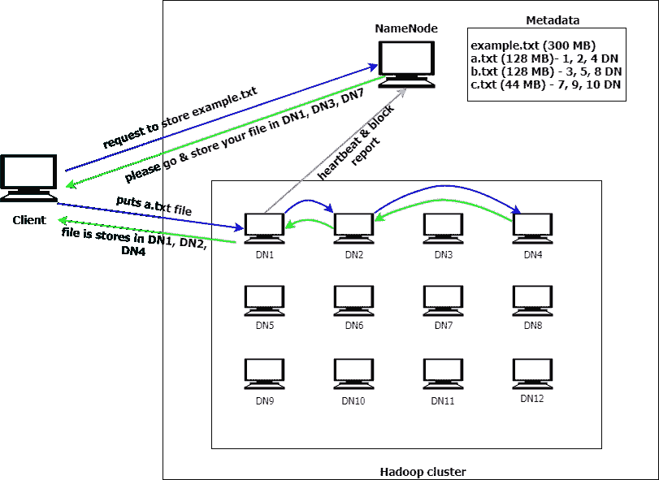

HDFS 书写体系结构的高级视觉表示(*作者图片)*

现在，NameNode 查看了 *example.txt* 的文件大小，计算了需要多少个块，以及如何将该文件分割成多个 128 MB 的块。因此，300 MB 的文件将被分成 3 个块，每个块分别容纳 128 MB、128 MB 和 44 MB。我们把文件的每一个拆分叫做 *a.txt* 、 *b.txt* 和 *c.txt* 。之后，NameNode 会快速检查哪些 DataNode 有空闲空间，然后向客户端返回一个响应，说请将 300 MB 的文件存储在 DataNode 1、3 和 5 中。

现在，客户端首先直接访问 DataNode1，在那里存储 *a.txt* 文件。默认情况下，集群会再保留两个 *a.txt* 的备份文件。一旦存储了 *a.txt* ，DataNode1 就将该文件的副本发送到另一个有一些空闲空间的 DataNode，比如 DataNode2。类似地，DataNode2 将该文件的副本提供给另一个 DataNode，比如 DataNode4。一旦 DataNode4 将该文件存储在他那里，他就向 DataNode2 发送一个确认，表示您发送的文件已经存储在我的本地 DataNode 中。同样，DataNode2 向 DataNode1 发出确认，表示您发送的文件已经存储在我的 DataNode2 和 DataNode4 中。现在，DataNode1 将向客户端返回一个确认，表示发送的文件已经存储在 DataNode1、2 和 4 中。

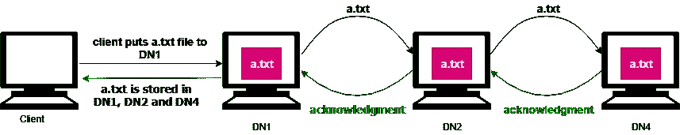

数据节点和客户端之间的相互通信(*作者图片)*

但是 NameNode 如何知道 *a.txt* 文件的确切存储位置呢？所有的 datanode 每隔一小段时间就向 NameNode 提供块报告，告诉 NameNode 在各自的 datanode 中有多少块被占用。

*注:A* *块报告* *包含服务器托管的每个块副本的块 ID、代戳和长度。*

通过这些块报告，NameNode 相应地更新元数据中的信息。同样的， *b.txt* 文件， *c.txt* 文件也会存储在集群中。

当一个 DataNode 关闭时会发生什么？

所有的 DataNode 不时地给 NameNode 一个**心跳**，这有助于 NameNode 判断 DataNode 是否还活着。如果任何一个 DataNode 没有给出正确的心跳，那么 NameNode 就认为这个 DataNode 死了。假设 DataNode1 死亡。然后 NameNode 会将它从元数据中的 *a.txt* 文件中删除，并将该文件分配给另一个有空闲空间的 DataNode。假设它被发送到 DataNode7。然后 DataNode7 向 NameNode 发回 block 报告，NameNode 会为 *a.txt* 更新元数据。

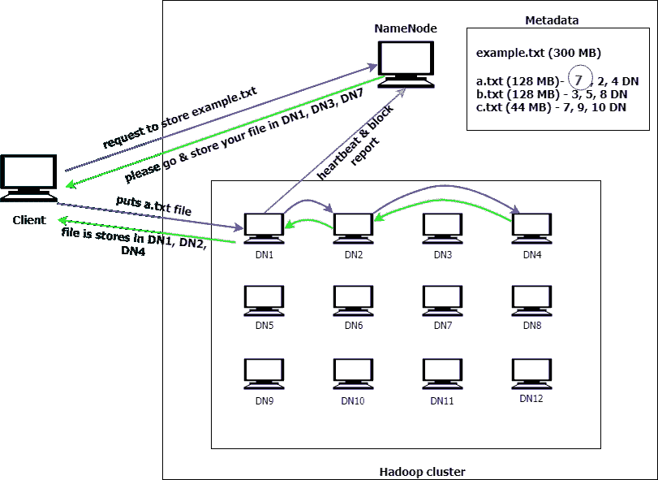

Heartbeat 如何在 Hadoop 集群中工作(*作者图片)*

# 阅读 HDFS 的建筑

假设客户想要读取他之前存储的 *example.txt* 文件。客户端首先联系 NameNode，说他想读取 *example.txt* 文件。NameNode 将查看它拥有的关于所述文件的元数据，选择每个存储的分割的最接近的副本给客户端，并且将那些数据节点的相关 IP 地址发送回客户端。然后，客户端将直接访问存储数据块的数据节点并读取数据。一旦客户端获得所有需要的文件块，它将组合这些块以形成文件， *example.txt* 。

*注意:当服务于客户端的读取请求时，HDFS 选择离客户端最近的副本。这减少了读取延迟和网络带宽消耗。*

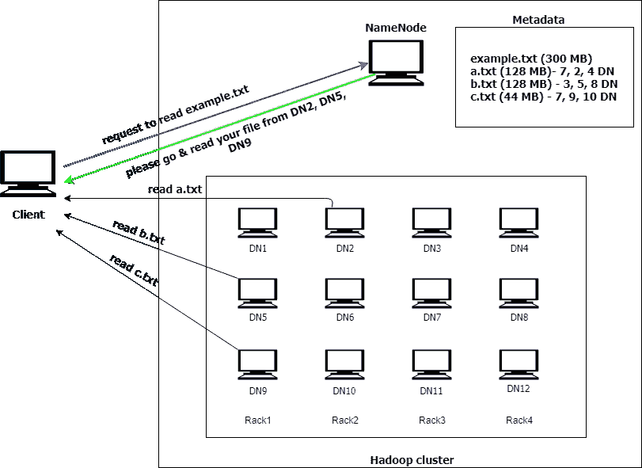

HDFS 里德建筑的高级视觉表现(*图片由作者提供)*

在开始动手操作之前，让我简要地告诉您关于 [Dataproc](https://cloud.google.com/dataproc) 的情况。

Dataproc 是用于运行 Hadoop & Spark 作业的托管服务(它现在支持 30 多种开源工具和框架)。可用于大数据处理和机器学习。

下面的实践是关于使用 GCP Dataproc 创建一个云集群并在其上运行 Hadoop 任务。

# 亲自动手

我将使用谷歌云平台和 Ubuntu 18.04.1 来实现这一点。

首先，您需要设置一个 Hadoop 集群。

*   选择或创建 Google 云平台项目
*   您需要创建一个云 Bigtable 实例。首先，启用[云 Bigtable 和云 Bigtable 管理 API](https://console.cloud.google.com/flows/enableapi?apiid=bigtable,bigtableadmin.googleapis.com&_ga=2.256366539.-1994314811.1556263678)
*   现在通过 GCloud shell 创建一个云 Bigtable 实例

```
gcloud bigtable instances create INSTANCE_ID \
    --cluster=CLUSTER_ID \
    --cluster-zone=CLUSTER_ZONE \
    --display-name=DISPLAY_NAME \
    [--cluster-num-nodes=CLUSTER_NUM_NODES] \
    [--cluster-storage-type=CLUSTER_STORAGE_TYPE] \
    [--instance-type=INSTANCE_TYPE]
```

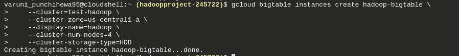

*通过 GCloud shell 创建 Bigtable 实例*

*注意:确保使用有云 Bigtable 的集群区域。*

*   启用[云 Bigtable、云 Bigtable Admin、云 Dataproc 和云存储 JSON APIs。](https://console.cloud.google.com/flows/enableapi?apiid=bigtable.googleapis.com,bigtableadmin.googleapis.com,dataproc.googleapis.com,storage-api.googleapis.com&_ga=2.51696745.-1994314811.1556263678)
*   通过运行 `gcloud components install gsutil`安装`gsutil`工具
*   安装 [Apache Maven](https://maven.apache.org/) ，它将用于运行一个示例 Hadoop 作业。
    `sudo apt-get install maven`
*   克隆 GitHub 存储库[Google Cloud platform/Cloud-bigtable-examples](https://github.com/GoogleCloudPlatform/cloud-bigtable-examples/)，其中包含一个使用云 Bigtable 的 Hadoop 作业的示例。 `git clone [https://github.com/GoogleCloudPlatform/cloud-bigtable-examples.git](https://github.com/GoogleCloudPlatform/cloud-bigtable-examples.git)`
*   现在创建一个云存储桶。Cloud Dataproc 使用一个云存储桶来存储临时文件。 `gsutil mb -p [PROJECT_ID] gs://[BUCKET_NAME]`

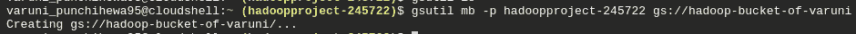

*创建云存储桶*

*注意:云存储桶名称在所有桶中必须是全局唯一的。请确保为此使用唯一的名称。如果您得到一个* `*ServiceException: 409 Bucket hadoop-bucket already exists,*` *，这意味着给定的 bucket 名称已经被使用。*

*   您可以通过运行`gsutil ls`来检查项目中创建的存储桶

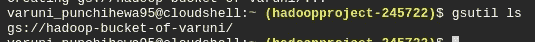

*检查创建的 Gcloud 存储桶*


*Gcloud 存储桶*

*   创建一个包含三个工作节点的云 Dataproc 集群。

转到导航菜单，在“大数据”组类别下，您可以找到“Dataproc”标签。单击它并选择“集群”。单击“创建集群”按钮。为您的集群取一个合适的名称，将 Worker nodes 改为 3。点击页面底部的“高级选项”，找到“云存储暂存桶部分”，点击“浏览”并选择您之前制作的桶。如果全部完成，单击“创建集群”并等待几分钟，直到集群创建完毕。

成功创建集群后，它将显示如下。


*创建一个 Dataproc 集群*

*   您可以进入创建的集群，然后单击“VM Instances”选项卡。在那里，您可以找到为集群创建的节点列表。

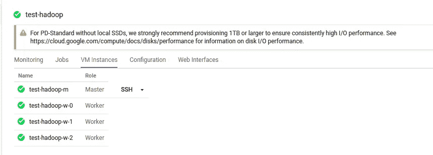

*集群中的主&工作者节点*

*   转到目录`java/dataproc-wordcount`
*   用 Maven 构建项目

```
mvn clean package -Dbigtable.projectID=[PROJECT_ID] \
    -Dbigtable.instanceID=[BIGTABLE_INSTANCE_ID]
```

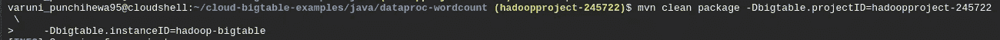

*用 Maven 建造*

*   项目完全构建完成后，您会看到一条“构建成功”的消息。
*   现在开始 Hadoop 作业 `./cluster.sh start [DATAPROC_CLUSTER_NAME]`

```
gcloud dataproc jobs submit pig --cluster test-hadoop --execute ‘fs -ls /’
```

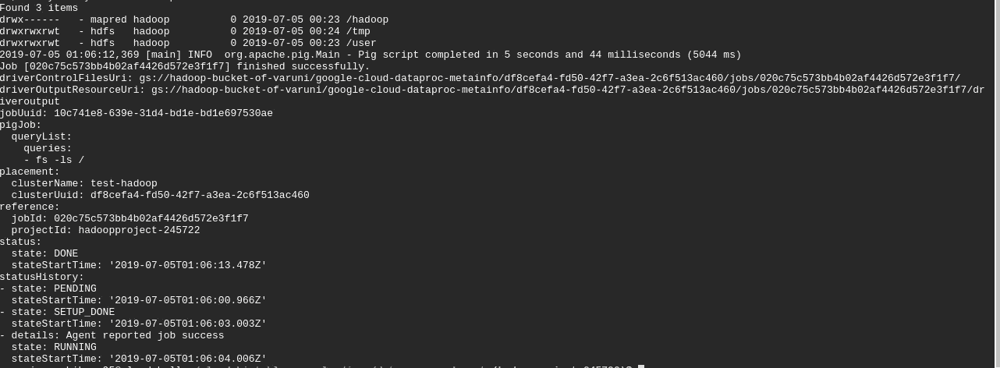

Hadoop 作业执行的详细信息

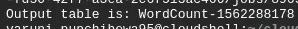

Hadoop 作业的输出

您可以通过以下方式删除云 Dataproc 集群

```
gcloud dataproc clusters delete [DATAPROC_CLUSTER_NAME]
```

# 资源

[1] [GCP Dataproc 文档](https://cloud.google.com/dataproc)

[2] [GCP 大表例题](https://github.com/GoogleCloudPlatform/cloud-bigtable-examples/)

干杯！🙂