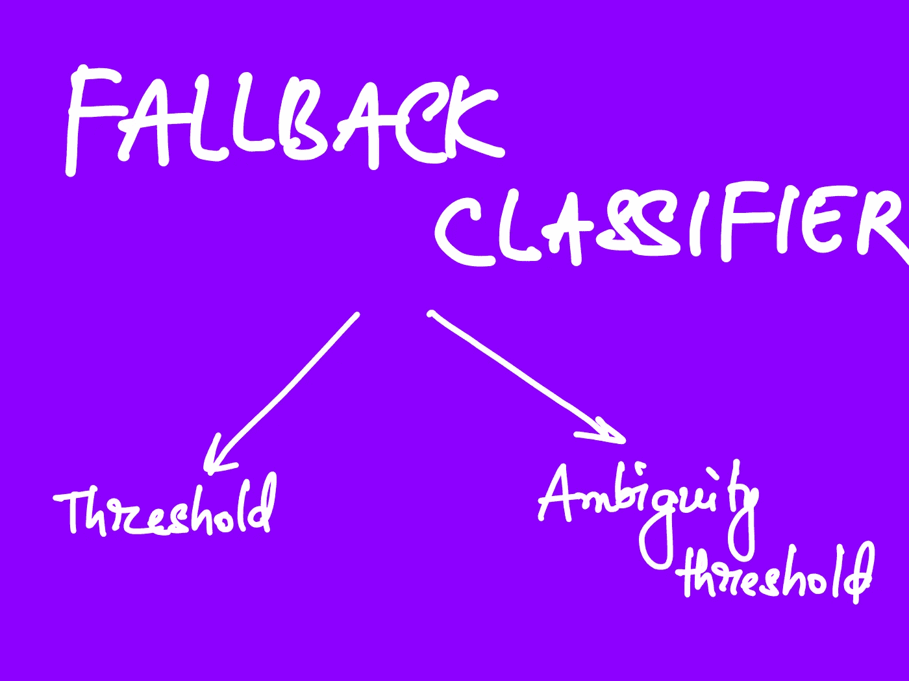
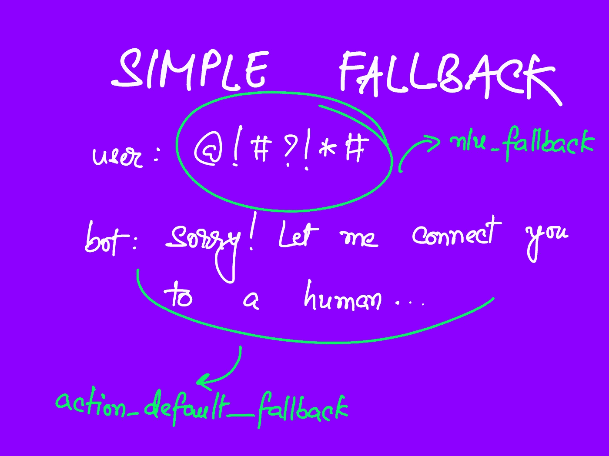
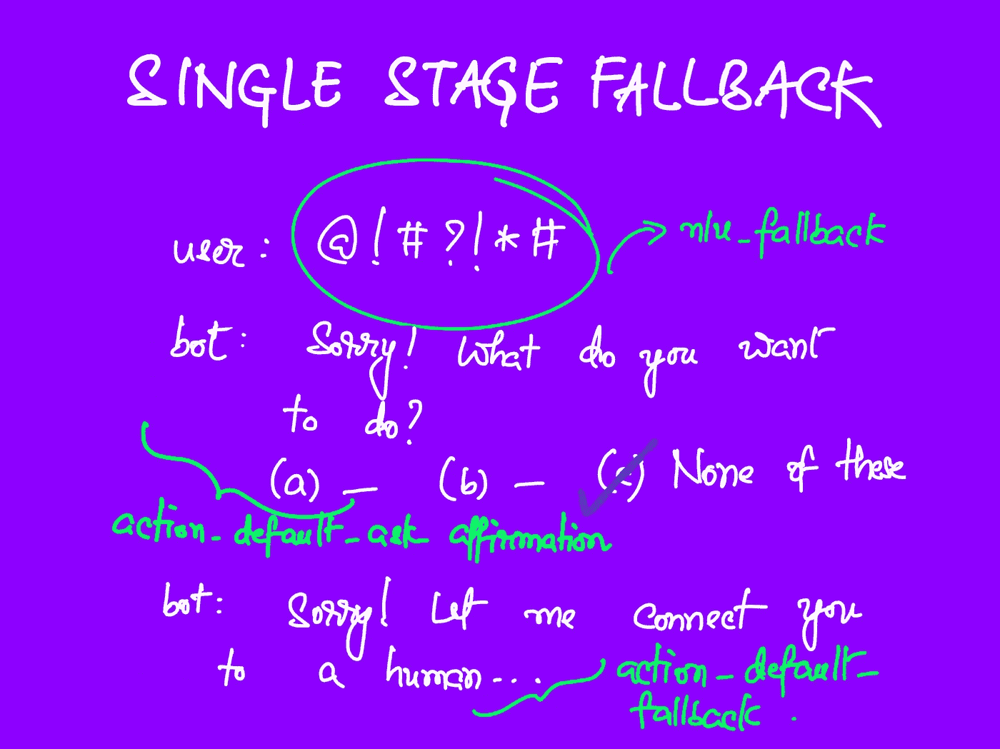
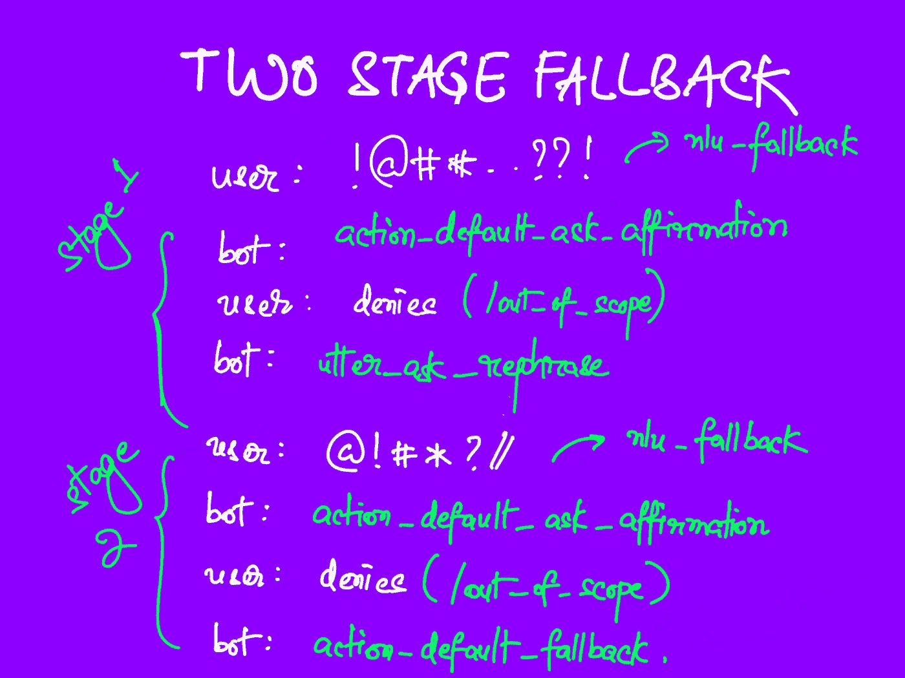

# 优雅地处理聊天机器人故障

> 原文：<https://towardsdatascience.com/handling-chatbot-failure-gracefully-466f0fb1dcc5?source=collection_archive---------3----------------------->

## 用 Rasa 构建聊天机器人——第三部分


作者图片

不管你训练 Rasa 聊天机器人有多好，总会有机器人不知道如何处理的情况。我们的目标不是制造一个完美的防故障聊天机器人，因为这甚至是不可能的。事实上，作为人类，我们自己也经常要求澄清。更确切地说，我们的目标是在事情变糟时让系统就位。

比起被误解，人们更喜欢被要求澄清。当然，要求用户重复五次并不理想，这也是为什么要有后备系统的原因。

在本帖中，我们将讨论如何处理你的机器人不太明白用户想说什么的情况。在 Rasa 术语中，这被称为回退。

**快速注释**

这是我关于 Rasa 系列的下一篇文章。您可以查看以下系列的前几篇文章:

[](/building-a-chatbot-with-rasa-3f03ecc5b324) [## 用 Rasa 构建聊天机器人

### 开始—第一部分

towardsdatascience.com](/building-a-chatbot-with-rasa-3f03ecc5b324) [](/are-slots-and-entities-the-same-f98a38ac328d) [## 插槽和实体是一样的吗？

### 用 Rasa 构建聊天机器人—第二部分

towardsdatascience.com](/are-slots-and-entities-the-same-f98a38ac328d) 

在那里，我们讨论了 Rasa 和聊天机器人的基本组成部分，如果你是 Rasa 新手，通读前两篇文章肯定会有所帮助。

## 目录

```
- An example
- The Fallback Classifier
- Simple Fallback
- Single-stage Fallback
- Two-stage Fallback
- Handling Human Handoff
```

# 一个例子

我们将看一个没有后备机制的简单例子，然后我们将从那里开始。

让我们继续使用本系列中使用的聊天机器人——它要求用户提供联系信息。我们将通过减少我们的`DIETClassifier`的训练次数来模拟回退场景，它试图理解用户在说什么。

缺省情况下，缺省配置文件(运行 rasa init 时获得)有一个`FallbackClassifier`组件。我们将在这里做两处更改:

*   我们将删除`FallbackClassifier`组件，看看会发生什么。
*   我们也将减少`DIETClassifier`到`2`的训练周期，所以模拟一个难以察觉的短语。

```
language: enpipeline:
- name: WhitespaceTokenizer
- name: RegexFeaturizer
- name: LexicalSyntacticFeaturizer
- name: CountVectorsFeaturizer
- name: CountVectorsFeaturizer
  analyzer: char_wb
  min_ngram: 1
  max_ngram: 4
- name: DIETClassifier
  **epochs: 2 # reduced epochs**
  constrain_similarities: true
- name: EntitySynonymMapper
- name: ResponseSelector
  epochs: 100
  constrain_similarities: true
**# removed the FallbackClassifier from here**policies:
- name: MemoizationPolicy
- name: TEDPolicy
  max_history: 5
  epochs: 100
  constrain_similarities: true
- name: RulePolicy
```

训练完机器人后，我们将使用

```
rasa shell --debug
```

对话大概是这样的:

```
user: Hi
bot: Sorry, you'll have to provide your information to proceed.
```

这完全没有意义。仔细查看调试日志，我们看到了以下内容:

```
Received user message 'hi' with intent '{'id': -4215159201959237708, 'name': 'deny', 'confidence': 0.37452369928359985}' and entities '[]'
```

机器人预测用户的消息“嗨”是一个`deny`意图，而不是`greet`意图。机器人的响应可能会让用户感到困惑，这在实际项目中会更加明显，在实际项目中，您通常会有许多意图和大量数据，在某些情况下，这些数据可能会有点相似。

现在，让我们看看当我们只在配置中包含`FallbackClassifier`而没有实际设置整个机制时会发生什么。

添加到管道末端:

```
- name: FallbackClassifier
  threshold: 0.5
  ambiguity_threshold: 0.1
```

和重新训练，当用户说“嗨”时，我们看到日志中的变化:

```
Received user message 'hi' with intent '{'name': 'nlu_fallback', 'confidence': 0.5}' and entities '[]'
```

它不再预测具有最高置信度的意图，即使它真的很低。现在，`FallbackClassifier`用`nlu_fallback`覆盖了这个意图。在我们继续回退机制之前，我们将讨论回退分类器。

# 回退分类器

回退分类器实现两个阈值:

*   民盟的退路`threshold`
*   而`ambiguity_threshold`



后退分类器阈值-按作者分类的图像

在您的配置文件中，它是在意图分类器之后定义的，如下所示:

```
language: en
pipeline:
   ..
   ..
   # intent classifier like DIETClassifier defined here
   - name: FallbackClassifier
         threshold: 0.7
         ambiguity_threshold: 0.1
```

## (NLU 回退)阈值

`threshold`键用于指定`config.yml`中 NLU 回退的阈值。如果 top intent 的置信度低于这个值，则回退分类器忽略它并继续进行`nlu_fallback`。

## 模糊阈值

该键指定了前两个意图的置信度应该是多少，以继续常规对话流。如果置信度得分的差值比这里指定的值少**或**，则不管是否满足`threshold`条件，回退分类器都使用`nlu_fallback`。

# 简单的退路



简单的退路——作者图片

这种回退是最基本的:当你的机器人预测用户的意图低于某个阈值(`nlu_fallback_threshold`)时，我们将简单地将聊天转移到一个人类代理。

现在，将聊天转移到人工代理的实际机制，称为“人工移交”，取决于您的聊天机器人部署的方式和位置。为了让这适用于每个人，我们将创建一个占位符自定义动作，该动作将返回一个`transferred_to_human`标志，只是为了让我们知道它正在工作。

我们来实施吧。

## 添加规则

我们首先需要定义一个`rule`，每当`nlu_fallback`被预测时，运行`action_default_fallback`。将此添加到`rules.yml`:

```
# simple fallback:
- rule: Implementation of the simple-Fallback
  steps:
  - intent: nlu_fallback
  - action: action_default_fallback
```

## 履行

接下来，我们将覆盖`action_default_fallback`。简单地将这个类添加到`actions.py`:

```
class ActionDefaultFallback(Action):def name(self) -> Text:
        return "action_default_fallback"def run(self, dispatcher, tracker, domain):
        # output a message saying that the conversation will now be
        # continued by a human.

 **message = "Sorry! Let me connect you to a human..."
        dispatcher.utter_message(text=message)**# pause tracker
        # undo last user interaction
        return [ConversationPaused(), UserUtteranceReverted()]
```

我们还将在`actions`字段下的域中定义它。

## 测试

我们现在有了更好的体验。

```
user: Hi
bot: Sorry, couldn't understand that! Let me connect you to a    
     human...
```

请记住，经过适当训练的机器人几乎肯定能够对“嗨”做出反应。在这里，我们只是模拟一个机器人无法理解的用户消息。

如果您查看日志，可以看到 Rasa 正确地应用了我们定义的规则。

```
**rasa.core.policies.rule_policy -** There is a rule for the next action 'action_default_fallback'.
```

# 单阶段回退



单阶段回退机制—图片由作者提供

简单的退路比继续进行几乎肯定会失败的对话要好。

但是我们可以做得更好。如果你的机器人不太确定用户想说什么，我们可以让机器人通过提供建议来澄清用户的意思，而不是仅仅执行移交。

当然，即使在这之后，如果机器人仍然没有得到用户想要说的话，我们可以进行切换。

这将更加有用，因为

*   它减轻了人类的负担
*   它让用户参与的时间更长，因为如果目前没有人可用，他们很可能没有耐心等待。

默认情况下，当请求澄清时，机器人会以最高的可信度暗示意图。

The utter_ask_rephrase response —图片作者使用 carbon.now.sh

您可能会注意到这里有两件事:

*   仅建议最高意图，而不是提供，比如说，前 3 个预测
*   使用 NLU 定义的意向名称。对用户来说不是一个很好的体验，特别是对于那些有更多隐晦措辞的意图。

我们可以通过覆盖一个叫做`action_default_ask_affirmation`的方法来解决这两个问题。

让我们实现这一点。

## 添加相关规则

这比前一个案子要复杂一点。我们将在这里定义两条规则。

**nlu_fallback →向用户提供建议**

一旦机器人无法理解用户，它将提供用户可能想要表达的意思的相关建议。这里，我们将执行被覆盖的`action_default_ask_affirmation`自定义动作，稍后我们将实现它。

```
- rule: Single stage fallback | ask user to choose what they meant
  steps:
  - intent: nlu_fallback
  - action: action_default_ask_affirmation
```

**用户不喜欢建议→人工交接**

第二个规则是当用户不想继续任何提供的建议并点击一个类似“这些都不要”的选项时(我们也将实现这个选项)。它被映射到默认的`out_of_scope`意图。

当这种情况发生时，我们希望将用户直接连接到人，所以我们将调用`action_default_fallback`。

```
- rule: Single stage fallback | call default fallback if user is not ok
  steps:
  - action: action_default_ask_affirmation
  - intent: out_of_scope
  - action: action_default_fallback
```

## 覆盖默认确认自定义操作

我们将做两件事来解决上面提到的问题:

*   在意图和易读的措辞之间建立一个映射。类似于:`supply_contact_info --> "Supply Contact Information"`
*   向用户提供前三个意向预测作为建议，而不仅仅是前一个，这样用户更有可能找到他们想要的。

```
class ActionDefaultAskAffirmation(Action):def name(self):
        return "action_default_ask_affirmation"async def run(self, dispatcher, tracker, domain):
 **# select the top three intents from the tracker**        
        **# ignore the first one -- nlu fallback**
        predicted_intents = tracker.latest_message["intent_ranking"][1:4]**# A prompt asking the user to select an option**
        message = "Sorry! What do you want to do?"**# a mapping between intents and user friendly wordings
**        intent_mappings = {
            "supply_contact_info": "Supply Contact Information",
            "affirm": "Agree",
            "deny": "Disagree",
            "goodbye": "End conversation"
        }**# show the top three intents as buttons to the user**
        buttons = [
            {
                "title": intent_mappings[intent['name']],
                "payload": "/{}".format(intent['name'])
            }
            for intent in predicted_intents
        ]**# add a "none of these button", if the user doesn't
        # agree when any suggestion**
        buttons.append({
            "title": "None of These",
            "payload": "/out_of_scope"
        })dispatcher.utter_message(text=message, buttons=buttons)return []
```

> **注意**对于某些意图，您可能不希望它们作为建议出现。“你想问候我吗？”听起来不错。如果这样的意图是前三个中的一个，可以添加一个简单的检查来确保用户不会把它看作是一个建议。

记得将`action_default_ask_affirmation`作为注册动作添加到您的域中。

## 测试

我们将尝试与之前相同的对话流程。

测试单级回退机制—图片由作者使用 carbon.now.sh 提供

这比以前好多了。现在让我们尝试第三种策略。

# 两阶段回退

两阶段回退是最近才引入的。它让用户两次阐明自己(通过向他们建议可能的行动),然后开始最终的后退。



两阶段回退机制—作者图片

虽然看起来很复杂，但是 Rasa 已经实现了，所以设置起来要容易得多，特别是因为我们已经用前两种方法完成了一半的工作。

## 添加要求用户重新措辞的响应

Rasa 提供了名为`utter_ask_rephrase`的默认响应。当然，还有一个名为`action_default_ask_rephrase`的默认自定义动作，您可以覆盖它来实现自定义行为，就像我们之前对`action_default_fallback`和`action_default_ask_affirmation`所做的那样。

现在，我们将只使用响应。我们将在`domain.yml`的`responses`字段下定义它。

```
utter_ask_rephrase:
  - text: I'm sorry, I didn't quite understand that. Could you rephrase?
```

## 添加两阶段回退规则

我们将用这个替换以前的单阶段回退方法的规则。

```
# two stage fallback:
- rule: Implementation of the Two-Stage-Fallback
  steps:
  - intent: nlu_fallback
  - action: action_two_stage_fallback
  - active_loop: action_two_stage_fallback
```

没有必要进行其他更改。

## 测试

流程是这样的:

测试两阶段回退策略—图片由作者使用 carbon.now.sh 提供

# 当人工交接不成功时你会怎么做？

有时，即使在用户多次澄清后，你的机器人可能不明白他们想说什么。在这种情况下，明智的做法是让用户知道他们现在将连接到一个人，然后将对话转移到一个人可以访问的地方。

发送跟踪器和帮助，因为人类现在已经有了对话的上下文，这意味着用户不必从头开始他们的请求。

即使在这之后，也可能没有人来照顾这个用户。可能用户处于不同的时区，或者所有客户服务代理都被占用。有时，将用户连接到代理的机制可能会中断。在这种情况下，与其让用户等待不知道如何继续，不如通知他们这个问题是有意义的。

除了一条简单的消息，说明人工代理目前不可用，以及一些功能，让用户留下消息或提供他们的联系方式，以便以后可以联系到他们。

# 示例代码

[](https://github.com/Polaris000/BlogCode/tree/main/FallbackExample) [## blog code/fallback 示例 Polaris000/BlogCode

### 示例代码来自我在 Medium 和我的个人网站上的博客文章。-blog code/fallback main 上的示例…

github.com](https://github.com/Polaris000/BlogCode/tree/main/FallbackExample) 

## 该系列的其他文章(这是第三篇)

> 第一部分:[用 Rasa 构建聊天机器人](/building-a-chatbot-with-rasa-3f03ecc5b324)
> 
> 第二部分:[槽和实体一样吗？](/are-slots-and-entities-the-same-f98a38ac328d)
> 
> 第四部分:[聊天机器人是如何理解的？](/how-do-chatbots-understand-87227f9f96a7)

# 结论

不管你的机器人有多好，总会有机器人不理解用户想说什么的情况，尤其是在开发的早期。你可能有很好的数据来训练你的机器人，但它可能不代表真实用户会如何交谈。

在构建聊天机器人时，学习如何优雅地失败是很重要的。毕竟，即使作为人类，由于从语言到糟糕的网络质量等过多的沟通问题，我们也可能经常不得不这样做。

最终，我写这篇文章的目的是让你知道在为你的机器人设计后备策略时可能会发生什么。

希望有帮助！

## 更新

> 20.3.2022

添加到系列中其他帖子的链接