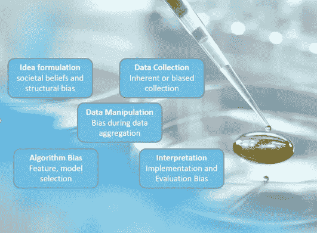
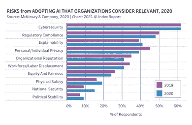

# 处理数据偏差

> 原文：<https://towardsdatascience.com/handling-data-bias-9775d07991d4?source=collection_archive---------29----------------------->

## 走向伦理人工智能的旅程

由[路易斯·里德](https://unsplash.com/@_louisreed?utm_source=medium&utm_medium=referral)在 [Unsplash](https://unsplash.com?utm_source=medium&utm_medium=referral) 上拍摄的照片，由作者编辑

如果你也有一个愿景，那就是确保你正在开发的产品遵循“人工智能永远有效”的所有书面规则，那么你肯定会遇到你的数据有偏差的情况。

有偏见的模型、有偏见的数据或有偏见的实现——是数据科学家生活中的典型悲哀。因此，首先我们需要理解并承认偏见的存在，并且可以采取任何形式。

是的，偏差是一个宽泛的术语，它可以出现在数据收集、算法中，甚至出现在 ML 输出解释阶段。

由作者使用 PowerPoint 创建

偏见为什么会伤人？

> *基于种族、年龄或性别等人类特征的偏见会导致不同的机会，应该予以制止*

根据斯坦福大学的人工智能指数报告，人工智能/人工智能组织认为以下风险在行业中普遍存在，并且正在努力减轻这些风险，因为它们对他们的业务和人类普遍有害。

[AI 指数报告](https://aiindex.stanford.edu/report/)

数据偏差可以有多种形式:

*   **结构偏差:**数据可能会有纯粹的偏差，因为它是由结构差异决定的。女性代表护士、厨师、教师，这显然是从社会结构中衍生出来的。一家电子商务巨头试图建立一个招聘工具，以获取他们现有员工的细微差别，这不用说，是有偏见的。许多属性，如运动、社交活动、成就等，都是由机器挑选的，这导致了一个偏向男性的工具。
*   **数据收集:**数据收集偏差的可能原因可能基于一天中的时间、人群的年龄组、原籍国、阶级阶层等。输入算法的数据应该不断更新，以反映我们生活的世界的真实情况，进而反映我们想要预测的世界的未来状态。
*   **数据操作:**更容易删除没有附加标签或缺少值的实例。但重要的是要检查被剔除的观察值是否会导致性别、种族、国籍和相关属性的错误数据。
*   **算法偏差:**算法将学习数据模式建议它学习的内容。该算法要么反映了普遍的偏见，要么放大了这些偏见，这是我们最担心的。如果判断偏向于特定人群，那么机器也会从训练数据中学习。算法中的偏差源于数据，这些数据要么不是正确的代表，要么是源于现存的偏见。如果输入数据是不平衡的，那么我们需要确保算法仍然看到足够多的少数类实例，以便对其执行良好。有多种方法可以实现数据重新平衡，主要方法包括创建合成数据，或者分配类权重，以便算法对少数类的每个错误预测施加更高的惩罚。
*   **实现偏差:**所有的 ML 模型都建立在训练和测试数据集应该属于相似分布的基本假设之上。根据夏季数据训练的模型可能具有不同的特征分布，因此不适合预测冬季的消费者行为。只有当新数据与过去观察到的数据相似时，该模型才会表现良好。不仅仅是执行，解释也可能有偏差。如果我们在分析算法输出的过程中，试图叠加我们的信念并支持我们的(有偏见的)观点，会怎么样呢？

虽然偏见是我们追求道德人工智能框架时需要改善的因素之一，但减轻它肯定不是小事。

构建“人工智能为善”生态系统的一些重要方面是:

*   数据收集者、开发人员和产品经理通常是在现场工作的人，他们更接近数据。对于组织来说，重要的是提高员工的敏感性，并传播对偏见的可能原因以及如何减轻偏见的认识
*   拥有一位擅长识别偏见来源的专家(人工智能伦理学家)可以帮助企业将他们的愿景与道德框架相一致
*   一个由来自不同团队的人组成的治理团队，如隐私、道德、合规、产品和工程，将有助于提供一个新的视角来识别可能被忽略的偏见。

没有一个规则手册可以立刻阅读和实施，它是一个不断发展的框架。

此外，值得称赞的是，维护一个不偏不倚、公平和可信的人工智能框架的努力不再被视为深奥的东西，而是在全世界范围内获得了正确的关注。