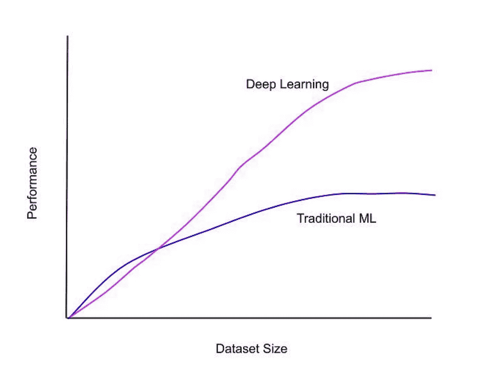
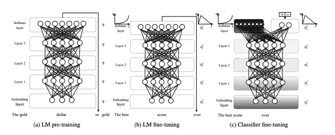

# 构建机器学习应用程序时处理数据稀缺

> 原文：<https://towardsdatascience.com/handling-data-scarcity-while-building-machine-learning-applications-e6c243b284b0?source=collection_archive---------16----------------------->

## 启动应用程序的实用技术

图 1 模型生长模拟:从幼苗到健康植物(图片来源: [Pixy](https://pixy.org/191894/)

数据稀缺是指 a)标记的训练数据数量有限或完全缺乏，或 b)与其他标签相比，某个标签缺乏数据(也称为数据不平衡)。较大的技术公司倾向于访问丰富的数据，尽管他们可能会遇到数据不平衡的问题。较小的技术公司通常会受到标记训练数据可用性有限的困扰。在这篇文章中，我将分享我如何处理可用训练数据量很低的情况的笔记。

当训练机器学习模型时，一般的经验法则是在你的数据集中每个自由度至少有 10 个例子([这篇文章](/dimensions-and-degrees-of-freedom-365461abcd5f)很好地概述了什么是自由度)。随着自由度的增加，对训练合理模型所需的数据量的需求也在增加。

此外，在选择模型类型时，考虑可用的训练数据量也很重要。图 2 比较了传统机器学习模型(示例:逻辑回归)v/s 深度学习方法的离线模型性能度量。当有更多训练数据时，深度学习的表现会好得多。另一方面，当数据量很小时，这种类型的模型过拟合的可能性很高。

图 2 深度学习 v/s 传统 ML 方法相对于数据集规模的性能。

让我们来看一些场景和适合它们的方法。

# 从启发式开始

图 3 一株幼苗(图片来源: [Freepik](https://www.freepik.com/premium-photo/young-plant-new-life-growing-garden-sunlight_3857824.htm) )

让我们考虑几个数据可用性可能较低的例子:1)一家初创公司正在尝试将机器学习模型添加到其产品中，2)一家大公司的团队创建了一个相当新的产品，并希望应用机器学习来优化某个问题。幼苗的比喻恰当地描述了这种情况(图 3)。在这种情况下，如何构建机器学习模型呢？经历过类似的情况后，我认识到从简单的启发式开始很有效。启发式有几个优点:

1.  它们不需要大量的数据，可以通过直觉或领域知识来创建。
2.  它们具有高度的可解释性。通常的问题是“为什么一个模型预测某个东西是垃圾邮件？”可以通过查看代码或记录给定查询触发的代码路径来回答。
3.  一般来说，它们不会遇到典型的机器学习流水线的问题和复杂性:数据偏斜、代码偏斜、模型陈旧、对特征分布变化的敏感性等。

为了进一步解释这一点，让我们更深入地研究一下这家初创公司的例子——假设这家初创公司的主要产品是一款移动应用程序，它可以根据设备的地理位置来获取相关的本地新闻。在这里建立一个机器学习模型会很难，因为没有带标签的数据。然而，启发式模型仍然是可能的。我们可以考虑几个信号来确定给定新闻文章的排名:1)地理位置匹配后的相关性分数(由底层 IR 系统如 [ElasticSearch](https://www.elastic.co/) 返回的分数)，2)基于发布时间的文章新近度，以及 3)发布者的预定流行度分数(假设范围是[1，5]，其中 5 是最受欢迎的，1 是最不受欢迎的)。这些信号可以用一个线性函数来组合:

w1 * f1 + w2 * f2 + w3 * f3

其中{w1，w2，w3}表示特定信号的强调(也称为权重)的数字概念，而{f1，f2，f3}是上面提到的 3 个信号。检索新闻文章并对其进行排名的逻辑可以用两个阶段来表达:

1.  检索给定地理位置的匹配新闻文章(及其相关性分数)。删除相关性分数低于阈值的文章(阈值可以使用轶事示例来选择)
2.  对新闻文章的结果集应用线性启发式模型以生成“分数”。根据该分数对文章进行排序，以生成最终结果。

启发式模型中的权重可以被适当地调整，直到新闻馈送的定性分析看起来是最优的。这种方法可以很好地将产品推出市场。随着更多的数据变得可用，直觉/领域知识可以与来自数据的洞察力相结合，以进一步调整启发式模型。一旦你有了足够的用户交互数据，你可以运行逻辑回归来找到正确的权重。接下来的步骤是建立一个模型再培训管道。您的设置越复杂，您就越需要关注数据质量、模型性能质量等。从这一节中要学到的**关键点**是**绝对可以接受用试探法**来优化某种产品体验，尤其是当数据量很低的时候。

# 外部 API

图 4 从农民手中购买水果(图片来源: [Pxhere](https://pxhere.com/en/photo/921012)

有些场景需要使用最先进的技术来解决特定产品的问题，而启发式方法不是开始的选择。例如，图像中的对象识别——给定一张图像，识别人、动物、建筑物、车辆等。在这种情况下，有几个 API 提供者: [AWS Rekognition](https://aws.amazon.com/rekognition/) ， [Google Cloud 的 Vision AI](https://cloud.google.com/vision) 仅举几个例子，它们提供的 API 可以用来检测图像中的对象，执行人脸识别，检测图像中的文本等。**用一种可以利用这些 API 的方式来分解你的问题可能是一个起步的好方法。图 4 为这种情况提供了一个类比:你可以从农民那里购买水果，而不是自己种植。这里举个例子:你想构建一个应用程序，识别一个图像中人穿的鞋的具体品牌(让我们把品牌限定为 Adidas、Nike 和 Puma)。设计这个问题的解决方案的一种方法是使用视觉 API 来检测图像中的鞋子以及鞋子上的文本。您可以使用结果信息(鞋上的文本加上检测到的鞋对象)来推断鞋属于特定品牌。与另一种方法相比，这种方法更容易实现，后者需要建立一个模型，在给定输入图像的情况下，直接检测特定品牌的鞋子。考虑到流行的 API 提供商提供的免费层的可用性，成本影响通常很小。**

# 综合数据

图 5 施于土壤以帮助植物生长的肥料(图片来源: [Pixabay](https://pixabay.com/photos/tractor-field-agriculture-landscape-4543124/)

解决标签数据缺乏的一个方法是为你的特定问题人工制造合成数据。在机器学习中使用合成数据来捕捉在训练数据集中看不到但理论上可能存在的示例。例如，在构建对象识别应用程序时，用户可能会将相机以某个角度指向某个对象(比如一只鹿)，而不是直接指向它。为了正确识别对象，可以旋转原始对象图像，并将其作为具有相同标签的新示例插入到数据集中。这将有助于模型了解在不同角度拍摄的图像对应于同一物体。

合成数据有用的另一种情况是当数据集严重不平衡时，即与其他类相比，某个特定类的代表性过高。这方面的一个例子是垃圾邮件检测问题，其中正面例子的数量比负面例子少(垃圾邮件令人讨厌但很少)。通常，垃圾邮件占整个数据集的 0.1%到 2%。在这种情况下，使用类似于 [SMOTE](https://arxiv.org/pdf/1106.1813.pdf) 的技术对于在您的数据集中生成更多稀有标签示例非常有用。但是，这样做也有不好的一面-生成的数据可能不代表真实世界的数据，这可能会导致模型性能出现问题。

# 迁移学习

图 6 嫁接樱桃树(图片来源:[维基百科](https://commons.wikimedia.org/wiki/File:Cherry_tree_grafting_4.jpg))

如果您可以使用大量可用的非特定领域数据，并训练一个能够为特定领域任务工作的模型，这不是很神奇吗？这可以通过迁移学习来实现。这项技术本身就值得写一整篇博文，但是我将在这里提供一个简要的概述。

考虑一个例子:你想训练一个分类器，将一条推文分为积极、消极或中性情绪。你只有为数不多的 100 条正面、负面和中性的推文，这些推文是你手动标记的(由你自己或使用外部标记服务，如[亚马逊土耳其机械](https://www.mturk.com/))。你的目标是训练一个与最先进的情感分类模型不相上下的模型。

在这种情况下，你可以利用在 [ULMFiT](https://arxiv.org/pdf/1801.06146.pdf) 论文中描述的迁移学习技术(我过去也使用过 ULMFiT)。这个想法是首先学习一个基础语言模型。语言模型本质上是在给定单词输入序列的情况下预测序列中下一个单词的概率的模型。维基百科数据集可以用来训练语言模型(截至 2021 年 1 月，[的最新数据集](https://en.wikipedia.org/wiki/Wikipedia:Size_of_Wikipedia#Yearly_statistics)拥有超过 37 亿个单词)。在第一步中，生成的语言模型学习通用领域(维基百科)中的语言表示。第二步是“微调”目标数据集上的第一个模型(使用您的 100 个 tweet 示例)。微调步骤包括与第一步相同的设置(语言建模),不同之处在于模型现在被训练以捕捉目标数据集(tweets)中的特质。这里的直觉是推文中的语言不同于维基百科文章中的语言，因此有必要捕捉这种差异。第三步也是最后一步是训练微调后的模型能够对情绪进行分类，而不是预测下一个单词。一种方法是删除微调模型的最终分类层，代之以用于特定任务的分类层——情绪预测，由用于多类分类问题的 [Softmax](https://en.wikipedia.org/wiki/Softmax_function) 层处理。图 7(取自 ULMFiT 论文的图像)显示了训练神经网络的 3 个步骤。更多细节请参考[论文](https://arxiv.org/pdf/1801.06146.pdf)【1】。

图 7 乌尔姆菲特的三个阶段(图片来源:[乌尔姆菲特论文](https://arxiv.org/pdf/1801.06146.pdf)【1】)

研究表明，迁移学习有助于大幅度提高目标任务的准确性。直觉上，这是有道理的。一个类比是，一个知道如何走路/跑步的人可以比一个试图直接学习如何滑冰/滑雪的人更快地学习如何滑冰/滑雪。

最后，以一个植物类比来结束，图 6 显示了一棵樱桃树被[嫁接](https://en.wikipedia.org/wiki/Grafting)。嫁接具有类似的优点:a)增强植物对某些疾病的抵抗力 b)通过利用适应的宿主植物等使品种适应不利的土壤或气候条件。

# 结论

总之，以下是我在处理少量训练数据时遵循的一组通用步骤:

1.  尽可能使用启发式方法。例如，由领域专家手动调整权重来优化项目排名是一个良好的开端。
2.  如果可能的话，委派。以一种可以利用外部 API 的方式分解问题。
3.  试验合成数据，尤其是在数据集严重不平衡的情况下。
4.  尝试迁移学习。要知道这一步的时间投入可能很高。

你如何处理数据稀缺的问题？请随意留下你的想法。

# 参考

1.  霍华德，j .，&鲁德，S. (2018)。用于文本分类的通用语言模型微调。 *arXiv 预印本 arXiv:1801.06146* 。https://arxiv.org/abs/1801.06146v5