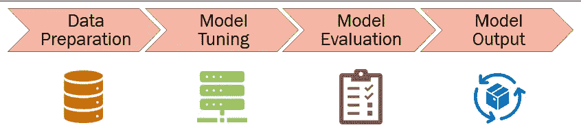
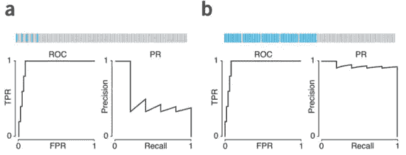
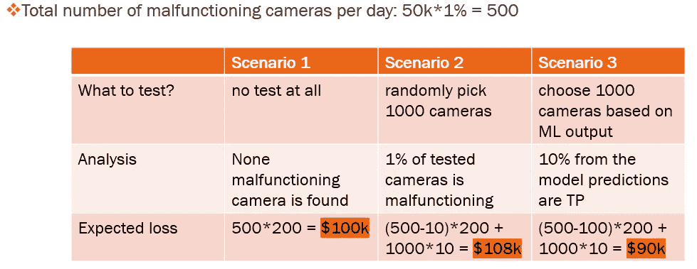
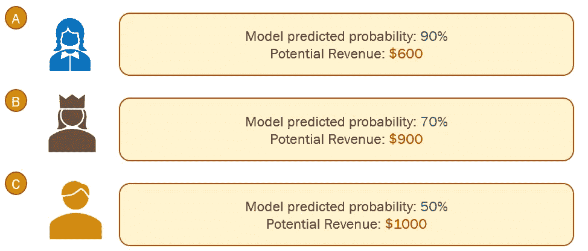
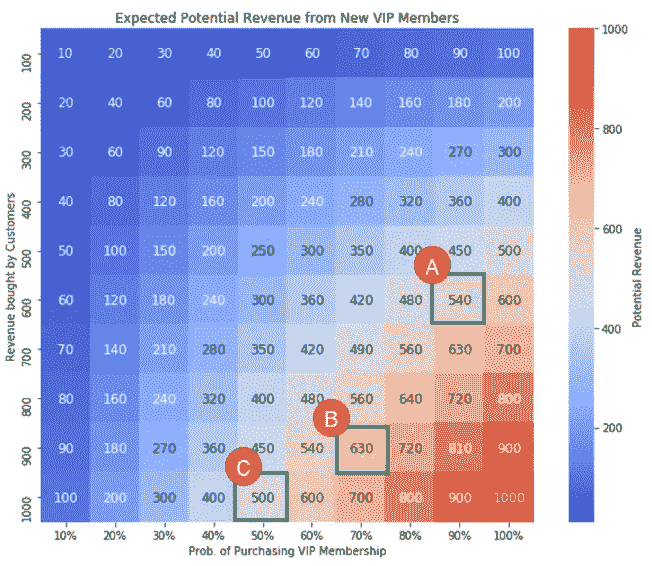

# 从业务驱动的角度处理不平衡的数据分类

> 原文：<https://towardsdatascience.com/handling-imbalanced-data-classification-with-business-driven-perspectives-6132cc23bd9f?source=collection_archive---------46----------------------->


Elena Mozhvilo 在 [Unsplash](https://unsplash.com?utm_source=medium&utm_medium=referral) 上的照片

我认为数据科学家应该获得的一项关键技能是将实际业务问题转化为数据科学问题的能力。了解所有的机器学习(ML)技术是一件重要的事情；而知道如何将商业洞察力注入 ML 建模则是另一回事。到目前为止，我已经从事了几个不平衡数据集的数据科学项目，我想与您分享一些我从最佳实践中学到的策略。

我注意到许多关于不平衡数据分析的在线资源(博客和教程)主要集中在技术技巧上，包括采样、参数调整和 ML 模型的选择。因此，在这篇博客中，我将更多地从 **DS 生产的角度**来谈论，并重点关注**商业知识将如何帮助建模**。我希望你会喜欢阅读它！

# 1.商业世界中的不平衡数据建模

不平衡的数据集在商业世界中并不少见。通常，在对大目标人群中的低概率事件建模时，会出现这种不平衡。一些例子包括欺诈检测、缺陷产品识别、保险索赔等。大部分不平衡是**内在**造成的，这是由事件的性质造成的(即像欺诈这样的自然低概率事件)。然而，由于收集数据时的限制，一些数据集可能具有**外部**不平衡。例如，如果数据收集设备仅限于在白天工作，那么即使事件在白天以恒定的频率发生，在晚上收集的数据观察值也会少得多。

在没有商业知识的情况下，数据科学家通常会开发旨在优化 F1 分数、ROC- AUC、混淆矩阵、精确度和召回率的机器学习模型。然而，在处理业务问题时，实际上，包括成本和/或收入在内的业务背景知识可能会改变游戏规则。考虑到时间、成本等因素和限制，平衡**假阳性(1 型错误)和假阴性(2 型错误)**可能非常复杂。然而，利用业务知识可以帮助处理不平衡的数据建模。

# 2.处理模型开发过程中的不平衡

通常，我们可以通过以下步骤开发 ML 模型:



作者图片

实际上，业务驱动视角可以应用于**所有的步骤**。在接下来的部分中，我将介绍如何使用业务知识来创建一个更好的具有不平衡数据的 ML 模型。

## 2.1 数据准备

在训练模型之前，我们需要很好地理解数据结构。数据操作和特征工程对模型开发至关重要。对于不平衡数据，我们可以考虑**潜在分割**。这包括以下方面的细分:

**1)响应变量**

如果响应变量的一个类是多数类，而其他类都是少数类，我们可以考虑合并少数类。例如，当预测一个月内严重龙卷风的数量时，我们可能会看到大多数数据条目有 0 个龙卷风，少数数据条目有 1、2 或 3 个龙卷风。在这种情况下，我们可以通过预测是否会有严重的龙卷风，将响应变量从多类分类变量变为二元变量。

**2)独立变量**

探究数据总体，找出导致不平衡的原因。例如，如果年轻员工比年长员工更有可能离开公司，我们可以尝试根据年龄对员工进行细分。

除了分段，另一种预处理数据的技术是执行**采样**方法。你可能已经知道**欠采样**、**过采样、**以及其他一些方法，比如 **SMOTE(合成少数过采样技术)**。在对数据进行抽样时，了解业务知识，如**假阴性(FN)** 和**假阳性(FP)** 的成本，可以帮助确定**抽样权重**。基本上，较高的权重将给予少数阶级，而较低的权重将给予多数阶级。

*例如:*

*   假设在原始数据中，正负比例为 1:100
*   假设 FP 的成本:10 美元，FN 的成本:100 美元
*   当执行欠采样时，我们可以使用 1:10 的正负权重来表示成本

## 2.2 模型调整

一些 ML 方法库提供了与权重相关的参数进行调整。例如，在 Python 中，随机森林分类器的一个常用参数是“class_weight”。通过设置' class_weight='balanced '，模型使用 y 值来自动调整与类频率成反比的权重。或者，我们可以再次使用成本数据，通过惩罚模型中的分类错误来设置权重。与选择采样权重的想法类似，我们希望调整模型，使其符合降低成本和/或增加潜在收入的现实考虑。

## 2.3 模型评估

对于不平衡数据，在比较模型性能时，使用**精确召回(PR)曲线**优于 ROC AUC 曲线(参考文献 1):



从上图可以看出，虽然 **a** 和 **b** 具有相同的 ROC 曲线，但是 **b** 的 PR 曲线要比 **a** 的好很多，说明 **a** 使用的模型在 **a** 数据不平衡的情况下并没有很好的表现。

此外，我强烈建议分析**混淆矩阵**，计算**预期损失和/或收入**，如果相关业务知识可用的话。同时处理 FP 和 FN 总是困难的，但是分析预期的损失/收益可以将这种权衡情况变成一个**优化**问题。下面是一个使用商业知识评估模型的二元分类示例:

**故障摄像机示例分析**

* **问题描述:**

项目目标:摄像机的故障检测

二进制响应变量:1 有故障，0 无故障

不平衡数据集: **1%** 的摄像机出现故障(响应变量= 1)

* **业务背景:**

**日产 50k** 摄像机，测试产能为 **1k** 摄像机

每台摄像机的测试费用: **$10** ，

检测失败时的损失: **$200**

* **车型性能:**

召回=0.1，因此该模型可以在 1000 个预测中正确检测出 100 个故障摄像机

**业务信息如何影响建模？**

如上所述，根据现有的业务背景，我们可以通过计算**预期损失**来回答这个问题，这是我们希望**最小化**的目标。下表计算了 3 种情况下的预期损失:



作者图片

通过**将场景 3 与场景 1(基线)**进行比较，可以看出，该模型使用这种 ML 模型可以节省 100k-90k = **10k** 。因此，如果我们已经训练了多个 ML 模型，我们可以通过**减少这里计算的预期损失**来比较它们的性能**。**

从给定的商业信息中，我们还能了解到什么？

值得注意的是**测试容量**是 **1k** 相机。有了建模结果，只有预测为阳性的相机才会被测试(这就是使用 ML 模型的目的)。所以测试容量实际上决定了 **FP+TP** 的上限，也就是模型预测的阳性**数**。选择< = 1k 预测阳性的型号是有意义的，因为我们被限制测试**最多** 1k 摄像头。如果模型预测超过 1k 个阳性，我们将没有能力在现实中测试所有预测的相机。

## 2.4 模型输出

我个人认为交付模型输出是最需要与业务伙伴合作努力的阶段，尤其是当数据科学模型导致一个产品的时候。模型的最终输出应该满足我们想要实现的业务目标。

一般来说，业务背景主要在以下几个方面影响模型输出和后处理:

## **2.4.1 输出格式**

根据模型用户是谁，对输出格式的要求可能会有所不同。就分类而言，交付模型输出的常见格式是**类别标签**和**被分配到某个标签的概率**。有时候模型用户只需要知道给出了哪个标签，但是在某些情况下知道概率是必要的，尤其是结果需要**排名**。

## **2.4.2 成绩排名**

受时间、资源和成本的限制，交付按**优先级**排序的模型结果更有意义。同样，这也是 DS 和业务合作伙伴应该讨论的地方 1)什么是**限制**和 2)什么是**优先级**。

**会员制营销实例分析:**

* **问题描述:**

项目目标:接触有可能购买 VIP 会员资格的客户

二元响应变量:1 潜在客户，0 非潜在客户

不平衡数据集: **10%** 的客户愿意购买(响应变量= 1)

* **商业背景:**

不同的客户如果加入会员，带来的收益量是不一样的，所以要对模型输出进行排序，使收益最大化。

* **先联系谁？**

假设我们有以下 3 个客户的示例模型输出，我们如何**根据预测的概率和业务知识对他们**进行排序？



作者图片

由于**的目标是最大化收益**，我们可以根据建模结果计算预期收益。这里我建议一个 EDA 是**热图**图。在本例中，预期潜在收入的计算方法是模型给出的概率乘以客户购买的收入。下面是基于玩具收入数据创建热图的 python 代码。

```
```python
import pandas as pd
import numpy as np
import seaborn as sns
import matplotlib.pyplot as plt
prob = np.arange(0.1, 1.1, 0.1)
col_prob = ['10%','20%','30%','40%','50%','60%','70%','80%','90%','100%',]
revenue = np.arange(100, 1100, 100)
df = pd.DataFrame(np.outer(prob, revenue), columns=col_prob)
df.index = revenue.copy()
a4_dims = (11.7, 8.27)
fig, ax = plt.subplots(figsize=a4_dims)
ax = sns.heatmap(df.astype('int32'),
                cmap='coolwarm',
                annot=True,
                fmt="d",
                annot_kws={'size':12},
                cbar_kws={'label':'Potential Revenue'},
                square=True)
plt.title('Expected Potential Revenue from New VIP Members')
ax.set(xlabel='Prob. of Purchasing VIP Membership', ylabel='Revenue bought by Customers')
```
```



作者图片

从这张热图中，我们可以清楚地看到，虽然客户 A 加入 VIP 俱乐部的概率最高，客户 C 带来的潜在收入最多，但我们想先接触客户 B！

* **进一步的想法**

显然，这里给出的例子是从真实的业务问题中简化而来的。实际上，在绘制热图和排列模型输出时，可能需要更多的考虑。例如，如果接触客户的成本不同，那么这个成本应该是预期收入分析中涉及的另一个因素。

# 3.摘要

用不平衡的数据集建模从来都不是一件容易的事情。但幸运的是，在商业世界中，我们可以注入商业见解，以多种方式帮助模型开发过程。除了你已经尝试过的提高模型性能的所有技术策略之外，我希望这篇博客从不同的角度来看是有用的。感谢阅读！

## 💖喜欢这个故事吗？请随时[订阅 DS 和 ML 粉丝的邮件列表](https://mingjie-zhao.medium.com/subscribe)，并且[成为会员](https://medium.com/@mingjie-zhao/membership)！🤩

## 这篇博客最初发表在我的个人网站上。

**参考**
【1】Lever 等人(2016) Nat 方法:分类器性能的图形表示避免了对结果设置精确的阈值，但可能对数据的重要方面不敏感。