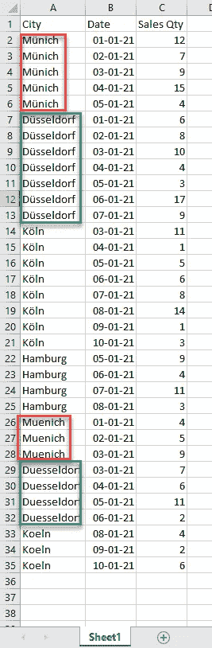
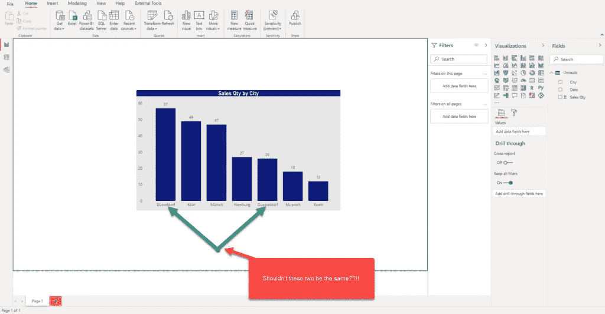
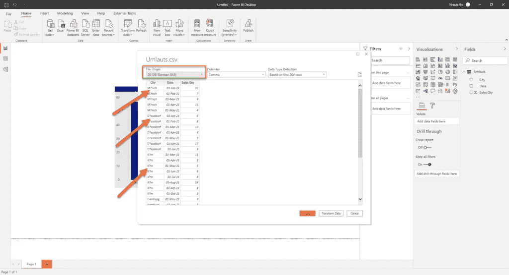
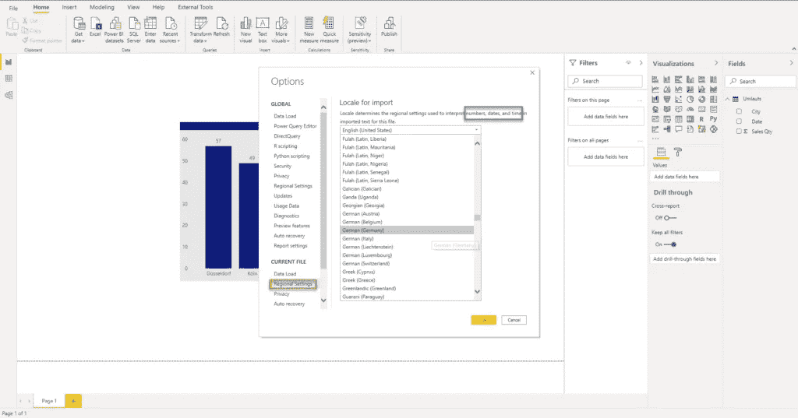
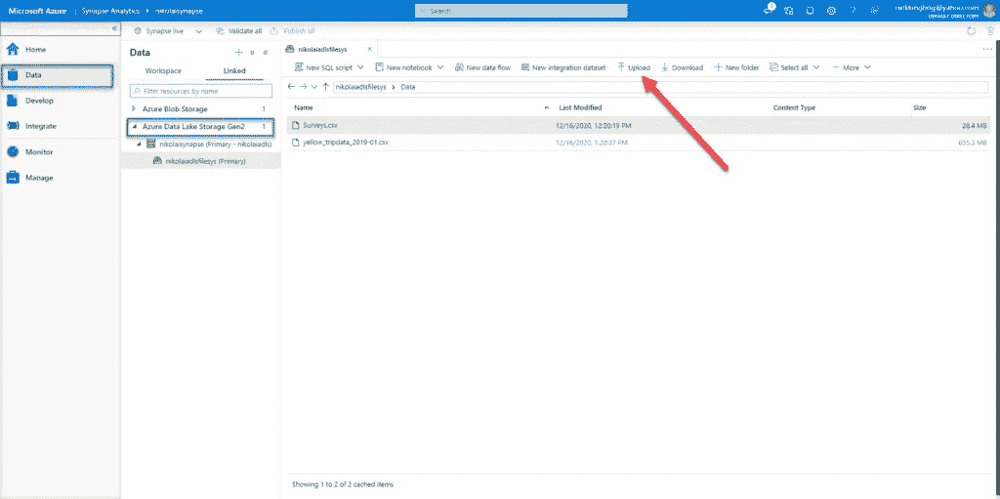
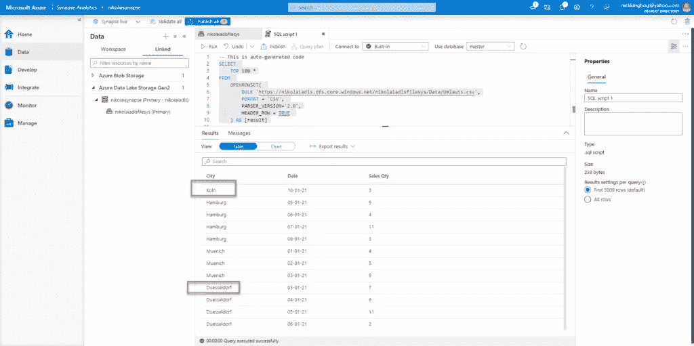
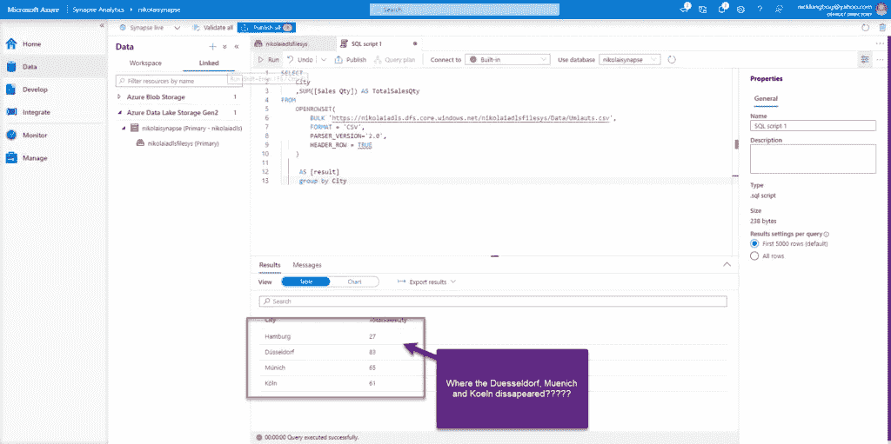
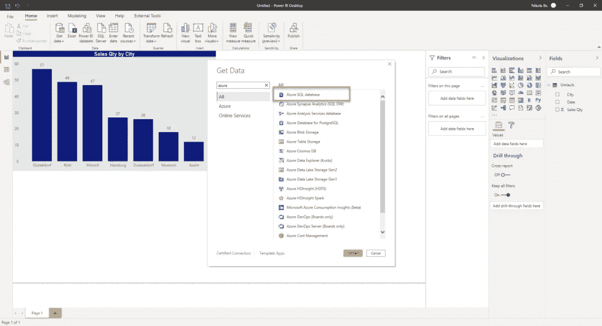
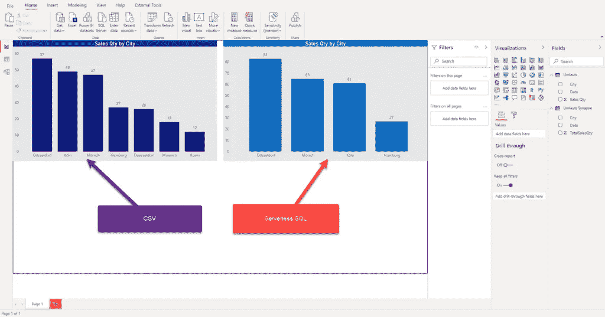

# 使用 Synapse SQL 处理 Power BI 中的区域设置字母

> 原文：<https://towardsdatascience.com/handling-locale-letters-in-power-bi-using-synapse-sql-336113b34f76?source=collection_archive---------52----------------------->

## 在 Power BI 中，特殊的字母表字母可能很难处理。还是没有？使用 Synapse 无服务器 SQL 池检查这个简单的解决方案！


[https://unsplash.com/photos/lNpo-WNqBo0](https://unsplash.com/photos/lNpo-WNqBo0)

如果你经常关注我的博客，你已经意识到我更喜欢描述现实生活中的用例，而不是写一些纯理论的东西……不要误解我的意思——当然，在投入真正的乐趣之前，你应该能够理解特定解决方案背后的核心理论和概念基础，但是解决现实世界的问题最终是有价值的。

## 方案

由于我生活在一个除了“常规”字母表之外还有特殊字符的语言区(对于那些不知道的人，我住在奥地利，那里讲德语)，我最近在为一个客户创建 Power BI 报告时遇到了一个有趣的问题。

这个“问题”与德语“元音字母”的具体处理有关，这些字母是特殊的字母 ***、ü、o、*** ，它们是德语字母表的“版本”所特有的。事情是这样的，这些字母有时是按“原样”写的，但有时是按发音写的:ae，ue，oe，ss(例如，奥地利汽车驾驶员协会叫做 AMTC，但他们的网站是[https://www . OEA MTC . at](https://www.oeamtc.at)——只是为了说明我的意思)。


[https://unsplash.com/photos/MP88Ac7oOqU](https://unsplash.com/photos/MP88Ac7oOqU)

回到客户最初的请求:他们正在分析奥地利和德国不同城市的特定商店的汽车销售情况。数据被收集到一个 CSV 文件中(我知道，我知道:)，然后送到 Power BI 进行进一步分析。

为了清楚起见，这个 CSV 文件只是最终报告中不同数据源之一。

然而，具有挑战性的部分来了:有时，城市名称使用“元音字母”书写，有时使用“发音”逻辑——例如——münich 和 Muenich 杜塞尔多夫和杜塞尔多夫等。

下面是我为本文准备的简化文件中的数据:



作者图片

现在，当我在 Power BI 中导入这个 CSV 文件时，我得到的结果如下:



作者图片

如您所见，Power BI 对数据进行了“原样”解释:这意味着，即使实际上在杜塞尔多夫销售了 83 辆汽车，我们也无法在报告中看到这一数字，因为它是在杜塞尔多夫和杜塞尔多夫之间划分的！同样的情况也适用于名字中包含“元音字母”的其他城市。只有汉堡的结果是正确的，因为这个城市的名称中没有特殊字符。

## 尝试在 Power BI 中寻找解决方案

Power BI Desktop 为您的数据提供了很多设置和调整功能。然而，没有(或者至少我不知道)一个选项来以适当的方式处理这些特殊字符。

在将数据导入 Power BI 桌面之前，我曾尝试将文件来源更改为德语，但发生的情况是元音字母被问号替代:



作者图片

然后，我试图调整当前文件的区域设置，却发现只有数字、日期和时间会受到此设置的影响！



作者图片

我这边有一个重要的声明:我绝不是超级查询专家，也许 PQ 中有一个变通的解决方案来处理这个挑战，但是我在网上找不到任何类似的东西…

因此，看起来我的客户需要清理源端的数据(这当然是所有情况下可能的最佳解决方案，并且应该尽可能地应用)，但是现实是残酷的，客户通常希望您代替他们做所有艰苦的工作:))

## Synapse 无服务器 SQL 拯救您！

在为这个问题绞尽脑汁的时候，我决定尝试在 Synapse 无服务器 SQL 池中处理数据。我已经写了这个集成分析平台提供的的[巨大可能性，特别是在与 Power BI](https://datamozart.medium.com/power-bi-synapse-part-1-the-art-of-im-possible-aee1cec5ebfa) 的[协同中，所以让我们看看是否可以利用 Synapse 无服务器 SQL 来解决我们的“变音”问题！](/power-bi-synapse-part-2-what-synapse-brings-to-power-bi-table-4592a03b1b74)

由于它利用常规的 T-SQL 语法从多个不同的源(如 CSV、Parquet 文件或 Cosmos DB)中检索数据，因此无服务器 SQL 带来的一个好处是(几乎)拥有“普通”SQL Server 中的全部功能。

在“普通的”SQL Server 中，可以通过更改数据库排序规则来处理类似的请求，以便能够“识别”德语中的特殊字符。更多关于校勘本身和具体校勘类型可以在[这里](https://docs.microsoft.com/en-us/sql/relational-databases/collations/collation-and-unicode-support?view=sql-server-ver15)找到。

由于我的客户已经在使用 Azure Synapse Analytics 处理各种数据工作负载，并且激活了一个无服务器 SQL 池，因此我决定冒险使用与本地 SQL Server 类似的策略！

但是，首先，我已经从 Synapse Studio 中将我的 CSV 文件上传到 Azure Data Lake Storage Gen2 帐户:



作者图片

如果我从 Synapse Studio 运行以下脚本…

```
SELECT
    TOP 100 *
FROM
    OPENROWSET(
        BULK 'https://nikolaiadls.dfs.core.windows.net/nikolaiadlsfilesys/Data/Umlauts.csv',
        FORMAT = 'CSV',
        PARSER_VERSION='2.0',
        HEADER_ROW = TRUE
    ) AS [result]
```

我会得到和以前完全一样的结果…



作者图片

因此，让我们更改数据库的排序规则，以便能够识别德语字母:

```
ALTER DATABASE CURRENT collate German_PhoneBook_100_CI_AI_SC_UTF8;
```

让我们看看在我运行以下脚本后是否发生了变化:

```
SELECT
    City
    ,SUM([Sales Qty]) AS TotalSalesQty
FROM
    OPENROWSET(
        BULK 'https://nikolaiadls.dfs.core.windows.net/nikolaiadlsfilesys/Data/Umlauts.csv',
        FORMAT = 'CSV',
        PARSER_VERSION='2.0',
        HEADER_ROW = TRUE
    )

     AS [result]
     GROUP BY City
```

以下是结果…



作者图片

瞧啊。！！这看起来正是我想要实现的！让我们在该数据集上创建一个视图，并在 Power BI Desktop 中使用该视图:



作者图片

现在，当我将两个视图放在一起时——一个基于直接来自 CSV 文件的数据，另一个基于 Synapse 无服务器 SQL 池中“整理”的数据，我得到以下结果:



作者图片

不需要说哪个视觉提供了正确的和预期的结果！

## 结论

正如您所看到的，您不需要使用 Synapse Analytics 和其中的无服务器 SQL 池来管理一些常见的通用任务，例如查询来自各种不同来源的数据(CSV、JSON、Parquet 文件；Cosmos DB 火花表)。

您可以充分利用无服务器 SQL 池的特性来解决一些特殊的挑战，比如我最近在现实生活中遇到的这个问题！

当然，我的场景需要找到德语“元音变音”的特定解决方案，但是如果您正在处理斯堪的纳维亚语、土耳其语或世界上任何包含非标准字母的字母表，您可以执行相同的方法！您只需要为正在处理的各个字符集找到合适的排序规则。

现在，我的问题解决了，客户满意了，所以我可以享受一品脱明希纳啤酒了:)！

感谢阅读！