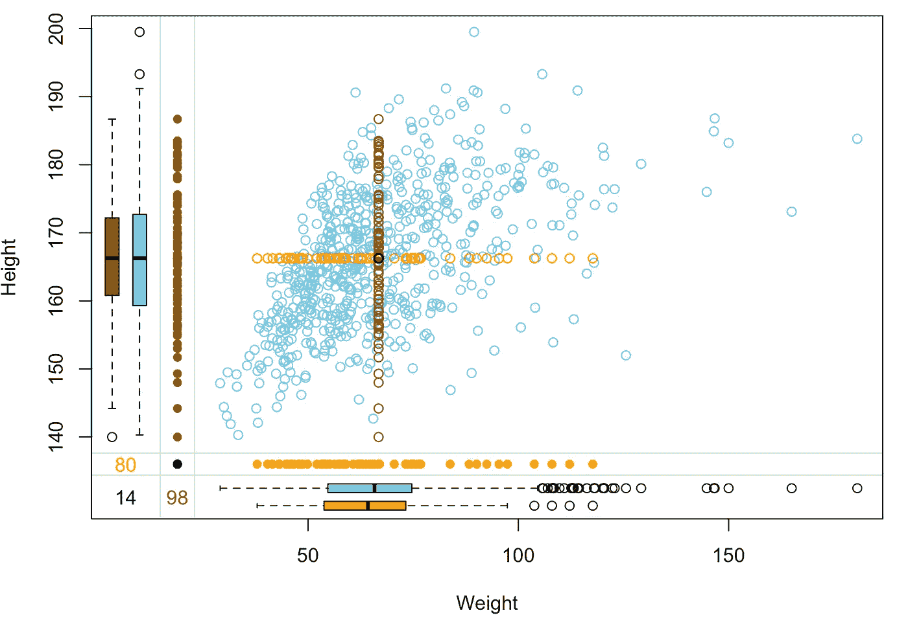
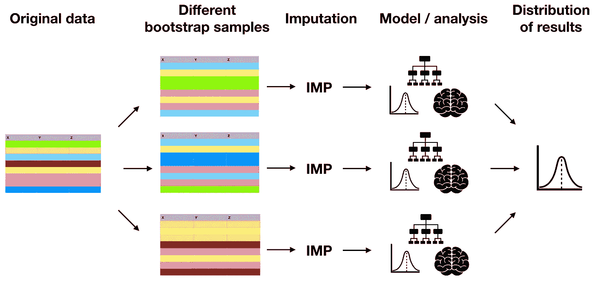

# 处理缺失数据

> 原文：<https://towardsdatascience.com/handling-missing-data-5be11eddbdd?source=collection_archive---------33----------------------->

## 一个统计学家关于如何(不)做它来保持你的机器学习工作流程的观点。

劳尔·纳杰拉在 [Unsplash](https://unsplash.com?utm_source=medium&utm_medium=referral) 上的照片

最近，我不禁注意到一些关于流行的机器学习书籍的惊人之处。即使是在解释算法及其应用方面做得很好的最好的标题，也往往会忽略一个重要的方面。在需要统计的严格性来正确做事的情况下，他们经常建议危险的过度简化的解决方案，给像我这样的训练有素的统计学家带来严重的头痛，并对机器学习工作流产生不利影响。

> 即使是最好的机器学习书籍也往往会忽略需要统计严密性才能正确做事的主题，而是提出危险的过于简化的解决方案。

几周前，我写了一篇关于数据测量水平的文章，解释了一种经常被推荐的分类变量编码方式如何与统计理论形成对比，从而导致模型可解释性和易学性的潜在问题。不要犹豫走弯路:

</data-measurement-levels-dfa9a4564176>  

还有一个:处理丢失的数据。平视:拜托，不要吝啬——估算，不要落下不完整的观察！

## 不要删除不完整的行

由于大多数机器学习算法不接受 NaN 输入，许多文本建议简单地从数据中删除包含缺失值的行。只要你有大量的数据，也就是说。如果是这样的话，去掉几行就解决问题了，不会有太大影响吧？不对！我敢说，大错特错。

第一，良性原因。不完全完整的行通常也不是完全 NaN。删除它们是摆脱坏 nan 的捷径，但同时也删除了一些非常有效的数据点。一个数据科学家究竟为什么要扔掉有用的数据？

第二，恶性原因。这与所谓的*缺失数据机制有关。*在统计学理论中，它们是遗漏的可能原因。有三种情况:数据可能完全随机丢失(MCAR)、随机丢失(MAR)和非随机丢失(MNAR)。如果你对数据中包含它们的含义以及如何区分它们感到好奇，看看我在 DataCamp 上教的[处理缺失数据的课程](http://datacamp.com/courses/handling-missing-data-with-imputations-in-r)。这里重要的是，只有当数据是 MCAR 时，才能删除不完整的行，这意味着绝对不会影响丢失的数据点。如果数据不是 MCAR(当一个变量中的缺失可以用其他变量来预测时，就会发生这种情况)，丢弃不完整的行会给数据带来偏差，这种偏差会转移到基于这些数据构建的任何机器学习模型。

> 如果遗漏的原因不完全是随机的，丢弃不完整的行会给数据带来偏差，这种偏差会转移到基于这些数据建立的任何机器学习模型。

区分 MCAR 和其他机制并不简单。有一些统计测试，人们也需要大量的领域知识。但是为了安全起见，最好完全放弃删除不完整行的做法。

## 不意味着-估算

在顶级机器学习书籍中经常找到的另一个建议是，用这个变量的观察值的平均值来替换每个变量中所有缺失的值。其背后的逻辑是，通过输入平均值，我们不会对模型产生太大影响。拜托，千万别这么做！通过均值估算，我们产生了两个问题:我们减少了均值估算变量的方差，破坏了这些变量与其余数据之间的相关性。

> 通过均值估算，我们产生了两个问题:我们减少了均值估算变量的方差，破坏了这些变量与其余数据之间的相关性。

考虑下面的散点图。它根据健康调查数据显示了人们的身高(厘米)和体重(千克)。这两个变量显然是正相关的，但两者都有一些缺失值。让我们用平均身高(166 cm)来估算所有缺失的身高，用平均体重(67 kg)来估算所有缺失的体重。估算的数据点以橙色显示。

图片来自作者在 DataCamp 教授的 R 课程[用插补处理缺失数据。](http://datacamp.com/courses/handling-missing-data-with-imputations-in-r)

这里发生了什么事？估算值通常是异常值。任何在这些数据上训练的机器学习模型都会被它们忽悠，会产生有偏差的结果。机器学习就是在数据中寻找模式。均值插补通常是在数据中引入人为的错误模式。他们应该如何携手共进？

> 机器学习就是在数据中寻找模式。均值插补通常是在数据中引入人为的错误模式。它们并不齐头并进。

改做什么？这取决于你有多少时间和计算资源。

## 当你有时间的时候做些什么

如果时间和计算资源都很充足，你能做的最好的事情就是运行多重插补。实现这种技术的一种方法是自举。我们来看看是怎么做到的。下图最能说明这一过程:

图片来自作者在 DataCamp 教授的 R 课程中的[用插补处理缺失数据。](http://datacamp.com/courses/handling-missing-data-with-imputations-in-r)

首先，我们通过替换从数据行中取样来创建许多(比如说一千个)数据副本。这叫做自举。然后，我们对每个拷贝应用插补算法。常用的插补算法有 kNN、随机森林或基于迭代模型的插补。这样，我们就有了一千份不同的、完全完整的数据集。接下来，我们对每个副本的原始数据做任何我们想做的事情:训练一个模型，计算一些汇总统计数据，你能想到的。最后，不管我们最后的结果是什么(模型预测，一个描述性统计？)，我们对所有自举和估算数据集的值进行平均，以获得结果的分布。

这可能看起来有点让人不知所措，但实际上实现起来相当容易，Python 和 R 中都有包可以做到这一点。查看[我的课程](http://datacamp.com/courses/handling-missing-data-with-imputations-in-r)，学习如何自己动手。

在多重插补的诸多优点中，最重要的一个优点是您可以获得结果的概率分布，这允许量化您的模型或分析的不确定性，包括插补的不确定性(毕竟，插补只是一个有根据的猜测，而猜测伴随着不确定性)。我在这里写了更多:

</uncertainty-from-imputation-8dbb34a19612>  

多重插补的缺点是速度会很慢。如果没有那么多时间呢？

## 当你没有时间的时候，该做些什么

一个快速但合理的解决方案是所谓的热卡插补。要估算变量中的缺失值，您可以选择一个或多个与所讨论的变量相关的其他变量。然后，通过这些选定的变量对数据集的行进行排序。最后，从上到下循环遍历这些行，用同一个变量中以前的非缺失值替换每个缺失值。

这样，从中借用值的行与粘贴值的行相似。这避免了均值插补的大部分缺点，而且速度也相当快。

感谢阅读！如果您有兴趣了解关于缺失数据、各种插补方法以及如何将插补不确定性纳入建模的更多信息，请查看 DataCamp 上的 [**我的课程**](https://datacamp.com/courses/handling-missing-data-with-imputations-in-r) 。

如果你喜欢这篇文章，为什么不 [**订阅邮件更新**](https://michaloleszak.medium.com/subscribe) 我的新文章呢？并且通过 [**成为媒介会员**](https://michaloleszak.medium.com/membership) ，可以支持我的写作，获得其他作者和我自己的所有故事的无限访问权限。

需要咨询？你可以问我任何事情，也可以在这里 为我预约 1:1 [**。**](http://hiretheauthor.com/michal)

也可以试试 [**我的其他文章**](https://michaloleszak.github.io/blog/) 中的一篇。不能选择？从这些中选择一个:

</monte-carlo-dropout-7fd52f8b6571>  </calibrating-classifiers-559abc30711a>  </working-with-amazon-s3-buckets-with-boto3-785252ea22e0> 