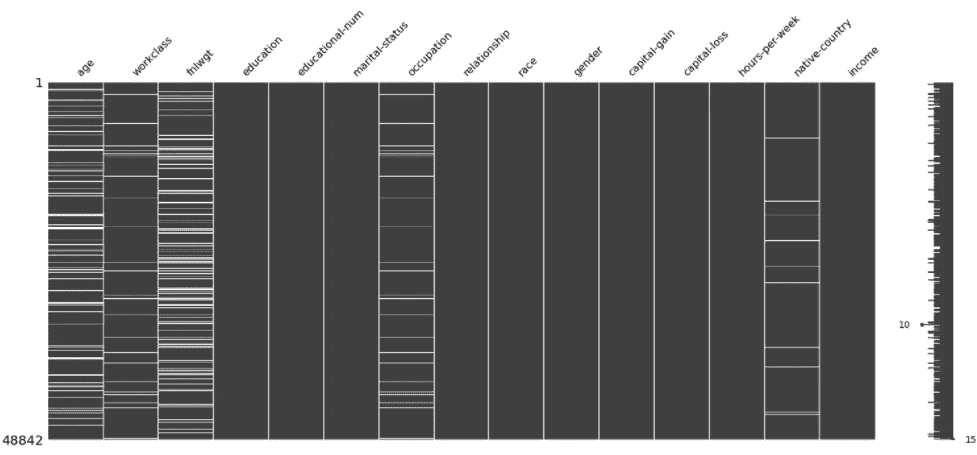
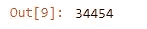
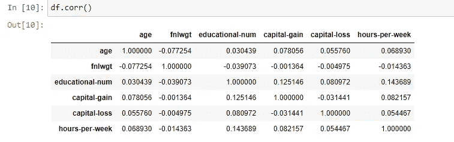

# 像专家一样处理“缺失数据”——第 1 部分——删除方法

> 原文：<https://towardsdatascience.com/handling-missing-data-like-a-pro-part-1-deletion-methods-9f451b475429?source=collection_archive---------15----------------------->

## 数据科学。分析。统计学。Python。

## 面向 21 世纪数据科学家的基本和高级技术


艾米丽·莫特在 [Unsplash](https://unsplash.com?utm_source=medium&utm_medium=referral) 上的照片

正如我们在致力于缺失数据系列的[第一篇文章](/the-three-types-of-missing-data-every-data-professional-should-know-d988e17d6ace)中提到的，关于“缺失”的机制或结构的知识是至关重要的，因为我们的反应将依赖于它们。

虽然处理缺失数据的技术越来越多，但我们在下面讨论一些最基本到最著名的技术。这些技术包括数据删除、常数单和基于模型的插补，等等。

在我们开始讨论它们之前，请注意这些技术的应用需要数据科学家的洞察力。即使我们可以确定遗漏的机制，也需要其他信息，如数据收集和方法学来选择最合适的技术。

因为我们将要讨论的技术范围相当广泛，所以让我们把它们分割开来，使它们更容易理解。对于文章的这一部分，我们将关注:**删除方法**。

# 成人收入数据集

为了加强我们的理解，让我们使用一个数据集，特别是来自 [UCI](https://archive.ics.uci.edu/ml/datasets/adult) 的成人收入数据集。

在我们开始之前，为这个数据集执行 EDA 是很重要的。变量密度的知识将在选择合适的技术时派上用场。[关于这个](/dramatically-improve-your-exploratory-data-analysis-eda-a2fc8c851124)见我的文章。

## 预赛

```
import random
import numpy as np
import pandas as pd#For data exploration
import missingno as msno #A simple library to view completeness of data
import matplotlib.pyplot as pltfrom numpy import random
%matplotlib inline
```

## 加载数据集

```
df = pd.read_csv('data/adult.csv')
df.head()
```


通过缺失 no 包实现完整性可视化。我们的数据在分类变量中缺少一些值。

## 模拟失踪

让我们模拟一些连续变量的缺失:*年龄*和 *fnlwgt* 。注意，这里的收入是目标变量，是分类变量。

```
#Random Seed
random.seed(25)#Percentage Missing
percentage_missing_1 = 0.15
percentage_missing_2 = 0.10#Number of Observations
obs = df.shape[0]#Simulation
df["fnlwgt"] = random.binomial(1,(1-percentage_missing_1), size=obs)*df['fnlwgt']
df["age"] = random.binomial(1,(1-percentage_missing_2), size=obs)*df['age']
df["fnlwgt"] = df["fnlwgt"].replace(0, np.nan)
df["age"]= df["age"].replace(0, np.nan)msno.matrix(df)
```



在我们模拟了一些缺失数据后的完整性可视化。

“最终重量”变量的缺失数据最多。这与我们的缺失数据模拟是一致的。请注意，我们采用的机制仅仅是 MCAR。

“最终重量”变量的缺失数据最多。这与我们的缺失数据模拟是一致的。

既然我们有了丢失数据的数据集，我们现在可以继续检查我们的不同技术如何影响数据集，以及使用这样的数据集的结果。

# 数据删除方法

所有数据科学博客(*甚至一些发表的文章*)中最简单的数据处理方法是数据删除。但是正如我们在引言中提到的，数据删除会降低我们的模型的有效性，特别是如果丢失的数据量很大的话。


缺失数据的数据删除方法总结

## 列表法\完全案例法

从名称本身来看，只要缺少一个值，listwise 或 complete 方法就会删除一个观察值。如果应用不小心，回顾一下这是如何减少我们的观察的:

```
df1 = df.copy()
df1.dropna(inplace=True)
df1.shape[0]
```



我们的观察失去了 30%的原始价值。

我们失去了 30%的观测数据，这是一个很大的数字！这是显而易见的，因为整个数据集中使用的 *dropna()* 会丢弃所有的观察值，只要有一列丢失。

这种方法有一些优点，例如简单高效，但请注意，这种方法仅适用于 MCAR 数据集。

**应用列表删除前**

在决定如何处理缺失数据之前，尤其是如果您计划应用列表式删除，您需要首先确定研究的相关变量。

如果不需要该变量，则特定项是否丢失并不重要，并且应该在应用列表式删除之前将其排除在 dataframe 的子集中。

例如:如果我们认为最终权重与我们的研究无关(例如*预测收入等级*)，我们可以将其从我们的特征数据框架中排除。

```
df2 = df.copy()
df2 = df2.loc[:, df2.columns != 'fnlwgt']
```


排除一个变量只会导致总观察值的 17%下降。

通过这一额外的步骤，我们能够从浪费的删除中节省额外的 6，182 个观察值。对于一些研究来说，这一小步可能是你所追求的目标精确度的差异制造者。

列表删除主要用于 MCAR 数据。由于数据是以完全随机的方式丢失的，假设我们没有删除大量的观测数据，那么我们可以假设删除操作几乎没有丢失任何信息。

列表删除在大多数回归和监督学习方法中使用，包括主成分分析。(PCA)

## 成对删除\可用案例方法

与列表删除相比，可用案例方法使用所有可用的观察值。也就是说，如果观察的特征/变量丢失，使用该特征/变量的方法或技术仅丢弃具有丢失信息的变量，而不是整个观察。

例如，如果我们的数据框架中的上述观察值不包含“最终重量”值，则不会为该观察值计算需要最终重量值的测量/指标或参数。其他一切都将继续利用这个观察。

这种方法如此不受重视，以至于大多数人都没有意识到这是相关性分析中使用的方法。要了解这一点，请访问:



请注意，我们使用了带有缺失值的原始数据帧，并且仍然可以计算相关性。

除了相关性分析，成对方法还用于因子分析。对于那些正在计算的人

## **可用项目**

用于复合变量的**创建的方法是可用项方法。这种方法与可用案例方法一样，使用所有可用的信息。**

可用项目方法通过以下方式汇总**相关项目**:

1.  首先应用标准化方法，例如 z 分数。
2.  此后，**变换后的变量不是被相加，而是对每个观察值进行平均。**

因此，现在可以创建一个综合分数。

现在，这被称为删除方法，因为**它没有试图替换丢失的值。**

如果您计划创建综合分数，可以简单地应用此算法。

# 结束语

本文介绍了用于处理缺失数据的第一类技术——删除。

删除的主要优点是简单，而主要缺点是失去了统计能力。但正如我们将在下一篇文章中看到的，另一类技术，即插补，在某些情况下也有缺点，即缺失数据专家宁愿使用删除方法。

最后，我们上面提到的任何技术的应用，需要由研究者的目标、数据收集方法和遗漏的潜在机制所引导的判断。

在下一篇文章中，我们将讨论插补方法。

[像专家一样处理“缺失数据”——第 2 部分:插补方法](/handling-missing-data-like-a-pro-part-2-imputation-methods-eabbf10b9ce4)

[像专家一样处理“缺失数据”——第 3 部分:基于模型的&多重插补方法](/handling-missing-data-like-a-pro-part-3-model-based-multiple-imputation-methods-bdfe85f93087)

# 参考

麦克奈特，P. E. (2007)。*缺失数据:温柔的介绍*。吉尔福德出版社。