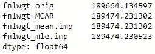
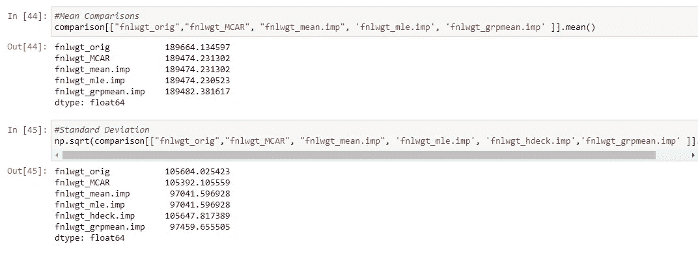

# 像专家一样处理“缺失数据”第 2 部分:插补方法

> 原文：<https://towardsdatascience.com/handling-missing-data-like-a-pro-part-2-imputation-methods-eabbf10b9ce4?source=collection_archive---------4----------------------->

## 数据科学。分析。统计学。Python。

## 面向 21 世纪数据科学家的基本和高级技术


乔恩·泰森在 [Unsplash](https://unsplash.com?utm_source=medium&utm_medium=referral) 上的照片

正如我们在致力于缺失数据系列的[第一篇文章](/the-three-types-of-missing-data-every-data-professional-should-know-d988e17d6ace)中提到的，关于“缺失”的机制或结构的知识是至关重要的，因为我们的反应将依赖于它们。

在[像专家一样处理“缺失数据”——第 1 部分——删除方法](/handling-missing-data-like-a-pro-part-1-deletion-methods-9f451b475429)中，我们已经讨论了删除方法。

对于文章的这一部分，我们将关注**插补方法**。我们将比较对数据集的影响，以及每种方法的优缺点。

# 加载数据集并模拟缺失

加载成人数据集并模拟这篇文章[中的 MCAR 数据集。](/handling-missing-data-like-a-pro-part-1-deletion-methods-9f451b475429)

# 插补方法

现在我们有了一个数据集来实践我们的插补，让我们开始讨论这些是什么。

以下是我们在研究中可以采用的现代插补方法的总结:


现代缺失值插补的技术类别和方法

当我们将讨论背后的理论和概念时，让我们使用 *Scikit-learn* 来为我们做脏活。

## 常数替换方法

常数插补是处理缺失数据时最常用的单一插补方法。

常数插补方法在替换观察中的缺失数据时插补一个常数值。很简单，这种技术有各种各样的变化，数据科学家也有一些方法让这种技术更有效。

**表示替换**

对于平均值替换，缺失值将替换为要素的算术平均值。

```
#Import the imputer
from sklearn.impute import SimpleImputer
#Initiate the imputer object
imp = SimpleImputer(missing_values=np.nan, strategy='mean')
#Isolate the columns where we want to import
X = df[['age', 'fnlwgt']]#Fit to learn the mean
imp.fit(X)#Impute
imp.transform(X)
```


向量间的平均插补比较


均值插补保留缺失值数据集的均值。然而，这种方法的一个很大的缺点是降低了方差。


估算数据集的方差显著较低。

均值插补保留了缺失值数据集的均值，正如我们在上面的例子中看到的。然而，只有当我们假设我们的数据是正态分布时，这才是合适的，因为通常假设大多数观察值都在平均值附近。对于少量丢失数据的情况，这也非常有用。

均值插补的主要缺点是，它往往会对某些参数，尤其是方差产生有偏估计。这个事实影响了置信区间的构建，这对于一些研究人员来说是一个严重的问题。

有一种方法可以稍微弥补这一点，这适用于所有的常数替换方法:人们可以为不同的子群估算不同的平均值。例如，对于“年龄”值插补，您可以选择为所有缺少年龄值且属于男性组类的观察值插补男性的平均年龄。

**注意，对于用整数表示的变量，如年龄，您可以在插补后向上或向下取整**。

**最大似然均值替代**

最大似然(ML)法是一项惊人的技术，它具有最大的**恢复真实总体参数**的能力。

ML 方法被高度赞扬和使用，因为它们利用数据集的每一个观察来估计总体参数。**因此，如果您的数据集是 MCAR，它具有最大的收敛概率。**

我们将在“基于模型的”数据扩充文章中详细讨论这一点及其背后的数学原理，但现在，让我们来计算数据集的最大似然均值。

```
from scipy import stats
from scipy.optimize import minimizedef fnlwgt_ML_mean(params):
    mean = params[0]   
    sd = params[1]# Calculate negative log likelihood
    nll = -np.sum(stats.norm.logpdf(df['fnlwgt'].dropna(), loc=mean, scale=sd))return nllinitParams = [7, 12]fnlwgt_results = minimize(fnlwgt_ML_mean, initParams, method='Nelder-Mead')
mle_fnlwgt = fnlwgt_results.x[0]
```

这导致对平均值和标准偏差的以下估计:


看估算；它们是我们完整数据集的近似估计。

如果你比较一下我们所拥有的:



这些估计值可以与 MCAR 数据集的估计值进行比较。这种差异是由于我们过于简化的分布假设(回想一下，年龄变量是右偏的)。

对于较小的数据集，只要我们得到正确的分布假设，那么均值的最大似然估计实际上可能比普通均值估计更好。

得到估计值后，你可以把它作为常数代入估算值。

使用最大似然法的一个特别的缺点是我们需要假设数据的分布。在这方面，预先了解发行版或一些初步的 EDA 可能会有所帮助。此外，与平均值和中值常数替换不同，对每个特征进行单独的 MLE 计算。

**中位数替代**

对于中位数替代，中位数而不是平均值被用作缺失观察值的替代值。

```
#Median Imputer
imp = SimpleImputer(missing_values=np.nan, strategy='median')
imp.fit(X)
```

中位数替代虽然可能是偏斜数据集的一个好选择，但会使数据集的均值和方差都有偏差。因此，这将是研究者需要考虑的因素。

**零插补**

对于某些类型的研究，更自然的做法是将缺失变量估算为零(“0”)。零分对于本质上是社会性的变量来说可能是有意义的，比如“兴趣的消退”，或者对于那些在考试中没有出现的人来说，他们自然得到了零分。

当然，只有零是有效值的变量才有可能，所以这对于参与者不是真正的新生儿的年龄变量是不可能的。

**模式插补**

从名称本身来看，模式插补估算特定变量的“最频繁”值，对于正态分布变量来说，这可能是一个不错的方法选择。

## 随机替换方法

与常量值替换方法相反，随机替换方法用随机生成的值替换丢失的数据。

有两种方法可以实现这一点:

1.  **使用经验数据**——如果你熟悉 bootstrap 方法，那么你可以把这个看作类似于那个。这意味着用于替换缺失值的观测值来自数据集本身的可用数据。
2.  **使用统计分布** —如果我们知道一个变量的分布，我们可以从理论/统计分布中抽取样本(又称为*参数化*)。为此，我们可以用最大似然估计代替参数，因为它们被认为更稳健。

下面我们试着讨论一下*经验*随机替换的一些方法。

**热甲板法**

热卡方法是用从当前数据集中随机选择的值替换缺失值的方法。这与冷盘方法形成对比，在冷盘方法中，您可能有一个单独的数据集可以从中随机提取值。

例如，对于我们的成人数据集，如果一个人忘记报告他/她的年龄，这种方法将从那些已经报告了年龄的数据中选取一个随机值。

```
random.seed(25)
df4 = df.copy()#For Weight
df4.loc[:,'fnlwgt'] = [random.choice(df4['fnlwgt'].dropna()) if np.isnan(i) else i for i in df4['fnlwgt']]df4.loc[fnlwgt_missing,'fnlwgt']
```


该算法使用从该变量的可用数据中随机选择的方法来估算缺失值。


热卡插补可能导致标准差高于原始值。

热卡插补可能导致标准差高于(或低于)我们的完整数据集，当然，这并不比用于置信区间构建的低估(或高估)值更好。

与均值插补一样，您可以使用亚组进行热卡插补(例如，不是从整个数据集，而是从该数据集的子集，如男性亚组、25-64 岁亚组等，进行随机选择插补。).

**冷甲板方法**

可以从一个单独的数据集中引入一个替换值，该替换值类似于带有缺失值的数据集。

例如，您可能想要研究两个群体，其中的人口是同质的，但您只是碰巧将他们分成两组(例如，星期一组和星期二组)。如果您有星期二组的缺失值，比如说年龄，*，前提是两个组都是同质的并且随机分配*，那么可以使用来自星期一组的随机选择的年龄值来填充缺失的年龄。

可以使用训练数据集的两个子组来实现冷甲板，正如我们对验证所做的那样。注意不要使用测试数据集中的数据，以避免数据泄漏。

## 基于模型的替换方法

基于模型的替换方法用于生成参数估计，条件是我们拥有的给定数据、观察到的变量之间的关系以及基础分布所施加的约束。

因为我们利用了底层的分布，我们称这些方法为“基于模型的”。

基于模型的方法包括马尔可夫链蒙特卡罗(MCMC)、最大似然、期望最大化算法和贝叶斯岭。

也可以使用决策树和额外的树，尽管它们没有包含在原始方法中(那些严重依赖数据分布的方法)。我们将在这里包括这些，因为它们无论如何都是机器学习中的有效模型。

由于这些都是美丽而复杂的技术，我们需要在一篇单独的文章中讨论它们，这样我们才能更深入地欣赏它们。

## 非随机替换:一个条件

**组均值/组中值**

我们已经在常数替换方法一节中讨论了非随机替换。

对于组均值和组中值，我们不是为所有缺失值输入单个值(均值或中值),而是将观察值分成子组，并为这些子组中的缺失值输入均值/中值。

性别分组的例子有男性和女性分组，对于年龄变量(*，正如我们所看到的可能是正偏态的*)，我们可以使用定制的年龄组。

例如，如果我们示例中的最终权重值缺失，那么我们可以将子组划分为工作类别，获得相应的平均值/中值，并分别估算子组中缺失的值。

```
df5 = df.copy()#Accomplish Using Transform Method
df5["age"] = df5['age'].fillna(df.groupby('workclass')['age'].transform('mean'))df5["fnlwgt"] = df5['fnlwgt'].fillna(df.groupby('workclass')['fnlwgt'].transform('mean'))
```


使用“工作类别”变量，您可以获得每个工作类别的平均值，并将平均值“年龄”或“fnlwgt”替换为这些类别的缺失值。

使用 *groupby()* 方法，您可以创建多个分组级别，比如在工作班之后，您可以进一步按教育级别分组。

只要有助于你的研究，你可以在小组讨论中发挥创造力和探索性。

**上次观察结转(LOCF)**

对于一些时间序列数据，丢失数据的主要原因是“损耗”。例如，假设你正在研究一个特定人的减肥计划的效果。如果在最后一次观察之前，您看到了持续的改进，那么第一次遗漏的观察可以假定为与最后一次观察值大致相同。这里的自然减员是因为那个人已经达到了他/她的理想体重。

假设您的行是每年排列的:

```
#Just assuming the the variable below is a time series data
#df['column'].fillna(method='ffill')#Another implementation but combined with groupmeans method
#df['age'] = df.groupby(['workclass'])['age'].ffill()
```

如果您将此方法应用于非时间序列数据集，则此方法被视为“热卡”方法，因为它使用数据集的实际观测值。然而，应小心谨慎，因为这可能并不完全适用于许多情况，因为它已被证明会使参数估计产生偏差并增加 1 类误差。



组均值插补的均值和标准差计算。

**下一次观测向后进行(NOCB)**

在精神上类似于 LOCF，“下一个观察结转(NOCB)”携带随后的值，但不是向前，而是向后。如果你听说过术语“回填”，这基本上就是那个过程。

如果你仔细想想，有很多这样的例子。比方说，你正在研究不同测试对象的工资增长。如果你知道公司在某一年没有给员工加薪(例如，在 T2 的 COVID-疫情法案期间)，你可以用当年的工资来填充过去的几年。

与 LOCF 一样，这适用于时间序列数据，但也有同样的缺点。

```
#Assuming a time-series variable
df['variable'].fillna(method='backfill')#Another implementation but combined with groupmeans method
#df['age'] = df.groupby(['workclass'])['age'].ffill()
```

## 非随机替换:多个条件

**平均先前/平均后续观察值**

在某些情况下，我们可以做的不是只依赖于一个先前的或一个向后的观察，而是对几个观察进行平均。

例如，对于涉及股票或证券价格的研究，这无疑是首选。

假设您想要计算三(3)个周期的平均值并将其结转，您应该使用的代码是:

```
df6[['age', 'fnlwgt']]= df6[['age', 'fnlwgt']] = df6[['age', 'fnlwgt']].fillna(df6[['age', 'fnlwgt']].rolling(3,min_periods=0).mean())
```

相反，如果我们想要回填的三(3)个周期的平均值:

```
df7 = df.copy()#Rough codes as I can't find a more elegant solution to thisdf7[['age', 'fnlwgt']] = df7[['age', 'fnlwgt']].iloc[::-1].rolling(3, min_periods=0).mean().iloc[::-1]
```

**回归和带误差的回归**

回归和带误差的回归方法通过基于数据集中的其他变量预测变量来填充变量的缺失值。

在某种程度上，您可以将其视为线性回归模型中作为目标变量的缺失值。想想看，当你使用任何监督学习模型时，你是在试图预测或找到一个未被观察到的结果。和缺失数据本身都是无法观察到的结果。

预测值可以使用数据集中的所有其他变量，或者只是其中的一个子集。

我们可以从头开始编写一个代码来完成这项工作，但是让我们简单地使用一个可用的包: ***autoimpute*** 。

在您的终端上运行`pip install autoimpute`之后，我们可以运行下面的代码:

```
from autoimpute.imputations import SingleImputer, MultipleImputerdf8 = df.copy()# create an instance of the single imputer and impute the data
# with autoimpute, you can choose a strategy per category or variable 
si_dict = SingleImputer(strategy={"age":'least squares', "fnlwgt": 'least squares'})
si_data_full = si_dict.fit_transform(df8[['age', 'fnlwgt']])
```


具有最小二乘回归模型估算值的数据集。


虽然这种技术很奇特，但在参数估计方面，它似乎与其他方法不相上下。当然，数据集可能与实际的机器学习训练不同，这是我们需要自己测试的东西。

在某些情况下，向回归预测中添加误差会允许更大的随机性，这可能会改善模型的参数估计，尤其是方差。不幸的是，这不能通过 autoimpute 来完成，但是如果回归模型是从零开始的，我们可以这样做。

使用相同变量进行插补的一个潜在缺点是，它可能会给参数估计带来一些偏差。这意味着，最好使用一组不包括在您当前正在研究的机器学习模型中的变量来执行回归插补。

**K-最近邻(KNN)**

与我们刚刚讨论的回归和带误差模型的回归类似，KNN 可用于填充数据集中的缺失值。

这背后的直觉是，一个点的值可以由最接近该缺失点的点来近似。

我们可以使用 scikit-learn 中的 KNNImputer 来完成这项工作:

```
df9 = df.copy()# importing the KNN from fancyimpute library
from sklearn.impute import KNNImputer# calling the KNN class
knn_imputer = KNNImputer(n_neighbors=3)
# imputing the missing value with knn imputer
df9[['age', 'fnlwgt']] = knn_imputer.fit_transform(df9[['age', 'fnlwgt']])
```


KNN 插补与其他插补方法的比较。


均值和方差估计，包括 KNN 插补

正如我们在上面看到的，KNN 似乎比其他插补方法表现更好的地方是方差的估计。

鼓励尝试不同的邻居数量公式，以获得比上面更好的结果。

# 最后的想法

虽然没有一种方法可以处理缺失数据，但本文揭示了可以用来处理缺失数据的各种技术和方法，以及它们的弱点和专业评论。

这一研究领域正在令人惊讶地、理所当然地发展，并且正在开发新的方法来处理缺失的数据。最终，选择的方法应该牢记研究目标，数据丢失的机制，以及数据集偏差的可能性。排除所有这些因素，一些数据从业者得出结论，对于简单的 MCAR 缺失，删除方法可能是首选。

鼓励数据科学家探索一种或多种方法，甚至组合使用这些方法来实现更好的模型。

虽然我们测试了不同插补方法对参数估计的影响，但最终我们希望看到这些方法如何改善机器学习模型及其预测能力。

在下一篇文章中，让我们看看处理缺失数据的一些最先进的方法:**基于模型和多重插补方法**。

[像专家一样处理“缺失数据”——第 3 部分:基于模型的&多重插补方法](/handling-missing-data-like-a-pro-part-3-model-based-multiple-imputation-methods-bdfe85f93087)

完整的代码可以在我的 [Github 页面上找到。](https://github.com/francisadrianviernes/Data-Preprocessing-and-Feature-Engineering/blob/master/Handling%20Missing%20Data%20Like%20a%C2%A0Pro.ipynb)

# 参考

麦克奈特，P. E. (2007)。*缺失数据:温柔的介绍*。吉尔福德出版社。