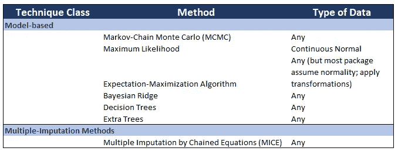
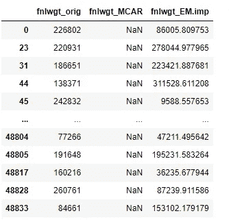
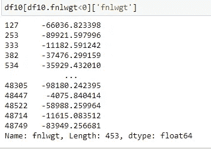
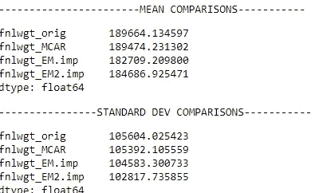
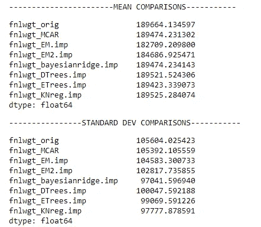
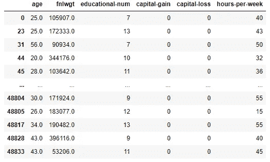
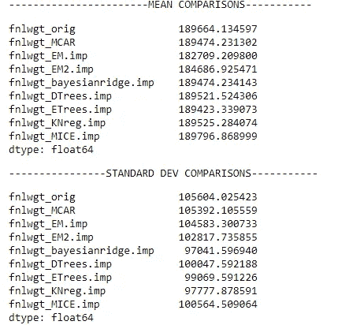

# 像专家一样处理“缺失数据”——第 3 部分:基于模型的多重插补方法

> 原文：<https://towardsdatascience.com/handling-missing-data-like-a-pro-part-3-model-based-multiple-imputation-methods-bdfe85f93087?source=collection_archive---------9----------------------->

## **数据科学。分析。PYTHON**

## 面向 21 世纪数据科学家的基本和高级技术


[迈特·沃尔什](https://unsplash.com/@two_tees?utm_source=medium&utm_medium=referral)在 [Unsplash](https://unsplash.com?utm_source=medium&utm_medium=referral) 上拍照

正如我们在专门研究缺失数据系列的第一篇文章[中所提到的，关于“缺失”的机制或结构的知识是至关重要的，因为我们的处理方法将主要依赖于它。](/the-three-types-of-missing-data-every-data-professional-should-know-d988e17d6ace)

在[像专家一样处理“缺失数据”——第 1 部分——删除方法](/handling-missing-data-like-a-pro-part-1-deletion-methods-9f451b475429)中，我们已经讨论了删除方法。

在[像专家一样处理“缺失数据”——第 2 部分:插补方法](/handling-missing-data-like-a-pro-part-2-imputation-methods-eabbf10b9ce4)中，我们讨论了简单的**插补方法**。虽然某些插补方法被认为适用于特定类型的数据，例如 n *正态分布数据、MCAR 缺失等。*，这些方法主要是因为我们的估计和模型有偏差而受到批评。因此，有些人认为删除方法在某些情况下更安全。

幸运的是，新的插补方法类别**解决了简单插补和删除方法**的这些弱点。

这些是基于模型的多重插补方法。

# 加载数据集并模拟缺失

加载成人数据集并模拟本文[中的 MCAR 数据集。](/handling-missing-data-like-a-pro-part-1-deletion-methods-9f451b475429)

# 基于模型的插补方法



本文中讨论的方法的总结

在我们的主要参考文献中，McKnight (2007)对基于模型的方法进行了不同的定义。在这种情况下，使用这些方法不是为了估计缺失数据，而是为了生成参数估计，就像观察到缺失数据一样。因此，它们被更恰当地称为*数据增强方法*。

对我们来说，我们称之为基于模型，因为它们使用机器学习/统计模型来估计缺失数据。事实上，回归估计应该属于这里(来自我们的上一篇文章)，但我们已经将下面的方法分开，因为它们被视为复杂得多(因此数据科学家较少使用)。

我们已经开始讨论最大似然均值的产生。让我们再讨论其中的两种，EM 算法和马尔可夫链蒙特卡罗方法。

## 期望值最大化算法

EM 算法是在数据缺失时获得最大似然估计的通用方法(Dempster，Laird & Rubin，1977)。

基本上，EM 算法由两个步骤组成:期望步骤(E)和最大化步骤(M)。这是一个为处理潜在(未观察到的)变量而设计的漂亮算法，因此适用于缺失数据。

要执行此算法:

1.  使用最大似然法估算缺失数据的值。使用每个观察值的**非缺失**变量计算缺失值的最大似然估计。
2.  根据步骤 1 为“模拟的”完整数据集生成参数估计值。
3.  基于从步骤 2 获得的参数估计值(或“更新的”参数估计值)重新估算值。
4.  根据步骤 3 中的估算数据重新估计参数。

当我们的参数估计“不再改变”或不再更新时，迭代过程停止。(*技术术语是，当前值减去更新值的误差小于某个ε。*)

与许多使用迭代的机器学习方法一样，EM 算法产生的估计偏差较小。

要用一个包来估算，首先安装`impyute`到`pip install impyute.`

与我们的线性回归一样，最好在计算最大似然估计值时包括您的研究中没有包括的变量，以免使模型产生偏差。

假设像 KNN 一样，我们希望使用下列项目的观测值来估计缺失数据:'**年龄**'、 **fnlwgt** '、**教育人数**'和'**每周工作时间**'。

代码应该是:

```
df10 = df.copy()# importing the package
import impyute as impy# imputing the missing value but ensure that the values are in matrix formdf10[['age', 'fnlwgt', 'educational-num', 'capital-gain', 'capital-loss',
       'hours-per-week']] = \
    impy.em(df10[['age', 'fnlwgt', 'educational-num', 'capital-gain', 'capital-loss',
       'hours-per-week']].values, loops=100)#Simulate New Comparison Container (So we can separate these new categories)
comparison_df = pd.concat([orig_df[['age', 'fnlwgt']], X], axis=1)#Rename so We can Compare Across Datasets
comparison_df.columns = ["age_orig", "fnlwgt_orig", "age_MCAR", "fnlwgt_MCAR"]
cols = comparison_df.columns.to_list()comparison_df = pd.concat([comparison_df, df10[['age', 'fnlwgt']]], axis=1)
comparison_df.columns =  [*cols,'age_EM.imp', 'fnlwgt_EM.imp']#View the comparison across dataset
comparison_df.loc[fnlwgt_missing,["fnlwgt_orig","fnlwgt_MCAR",
                              'fnlwgt_EM.imp']]
```



与 EM 算法插补的比较。

如我们所见，只需几行代码，我们就能执行 EM 插补。那些一直关注这个系列的人会立即看到，这是最接近我们理想想要的标准差参数的方法。

然而，这种特殊的方法假设我们的数据是多元正态的。然而，我们缺少值的特征不能被假定为正态分布。年龄和最终体重通常是正偏的，不会变成负的。

> **因此，盲目应用代码导致年龄和最终体重的插补值为负值，这是不可能的！**



EM 方法估算的负最终权重

因此，在应用上面的代码之前，我们必须找到一种规范化值的方法。

我们可以简单地应用对数变换，并检查我们的算法对这些新变换的变量的效果。

```
df11 = df.copy()# imputing the missing value but ensure that the values are in matrix formdf11[['age', 'fnlwgt', 'educational-num', 'capital-gain', 'capital-loss',
       'hours-per-week']] = \
    np.exp(impy.em(np.log(df10[['age', 'fnlwgt', 'educational-num', 'capital-gain', 'capital-loss',
       'hours-per-week']].values), loops=100))
```



原始数据集和对数变换数据集上 EM 代码的比较。

虽然我们的标准差较低，但与我们讨论过的其他单一插补方法相比，它仍具有更好的估计值。平均估计值也更接近原始值。

## 马尔可夫链蒙特卡罗方法

基于最大似然法的模型的一个局限性是，它们需要数据的分布假设(例如多元正态性)。

越来越流行的马尔可夫链蒙特卡罗(MCMC)程序可以在缺乏这种知识的情况下使用。该过程本质上是贝叶斯过程，最终目标是获得后验分布。

我们需要把这个概念分解成什么是马尔可夫链，蒙特卡洛与它有什么关系，但是我们把这个问题留给另一篇文章，这样这篇文章就简短了。但是像 EM 算法一样，MCMC 增加了观测数据来处理参数的估计。

从`NumPyro`开始，这些也可以采用一个包。由于这种方法使用的代码比其他方法长得多，我们将读者引向 NumPyro 的官方文档:[http://num . pyro . ai/en/latest/tutorials/Bayesian _ attribute . html](http://num.pyro.ai/en/latest/tutorials/bayesian_imputation.html)

## 其他 SCIKIT 估算器:贝叶斯岭、决策树、额外树、K 邻居

对本文中讨论的所有方法进行分类的一种方法是称它们为“多元估算器”。也就是说，它们基于数据集中存在的所有其他变量的值进行估算。

由于大多数读者被认为熟悉机器学习，另一种看待它的方式是使用数据集内的可用数据作为预测器来估算缺失数据的机器学习模型。

因为每个方法的过程都非常相似，所以让我们简单地为上面的四个方法创建一个循环。

```
from sklearn.experimental import enable_iterative_imputer #MUST IMPORT THIS
from sklearn.impute import IterativeImputerfrom sklearn.linear_model import BayesianRidge
from sklearn.tree import DecisionTreeRegressor
from sklearn.ensemble import ExtraTreesRegressor
from sklearn.neighbors import KNeighborsRegressor#STEP 1 - Choosing Variables and Create a Matrix of Values
df12 = df.copy()[['age', 'fnlwgt', 'educational-num', 'capital-gain', 'capital-loss',
       'hours-per-week']]X = df12.values #Matrix of Values# STEP 2 - INITIALIZE ESTIMATORS
estimators = {
    "bayesianridge":BayesianRidge(),
    "DTrees": DecisionTreeRegressor(max_features='sqrt'),
    "ETrees":ExtraTreesRegressor(n_estimators=10),
    "KNreg":KNeighborsRegressor(n_neighbors=15)
}# STEP 3 - RUN IMPUTATIONS AND STORE IMPUTED VALUES
for key, value in estimators.items():
    imputer = IterativeImputer(random_state=19, estimator=estimators[key])
    imputer.fit(X)
    transformed = imputer.transform(X)

    #Temporarily Store
    temp_df = pd.DataFrame(np.column_stack(list(zip(*transformed))), columns=df12.columns)
    #Get updated columns list

    cols = comparison_df.columns.to_list()

    #Combine for Comparison 
    comparison_df = pd.concat([comparison_df, temp_df[['age', 'fnlwgt']]], axis=1)
    comparison_df.columns =  [*cols,f'age_{key}.imp', f'fnlwgt_{key}.imp']
```



不同 scikit 插补的比较。

请注意，我们可以尝试的估计量并不局限于上面的估计量。这些只是在这里找到的官方文档中讨论的:[https://sci kit-learn . org/stable/auto _ examples/impute/plot _ iterative _ import _ variants _ comparison . html](https://scikit-learn.org/stable/auto_examples/impute/plot_iterative_imputer_variants_comparison.html)

# 多重插补方法

多重插补(MI)是目前处理缺失数据最受欢迎的方法。这些方法提供了无偏的(因此是可推广的)估计，并恢复了总体方差，这对于统计推断是至关重要的。

单一插补方法的主要区别在于，不是为缺失的观察值输入一个值，而是输入几个值(比如 3 到 10)。**其平均值被视为最终估算值。**

MI 不仅仅是一种方法，而是处理多重价值估算的许多方法的术语。这些多个值是从一个迭代过程中得到的，该迭代过程使用了:

1。观察数据和
2。迭代期间生成的样本值。

每组估算值随后被用来替换缺失值以创建一个完整的数据集。因此，如果我们选择估算 3 个值，这些值会产生三个完整的数据集。

这些多个估计值被组合以获得感兴趣的参数的单个最佳估计值。例如，如果我们的方法是多元回归模型，则构建三个回归模型，每个完整数据集一个。得到的模型有它们相应的参数和系数估计值，这些估计值的平均值将是我们的最终值。

在 Python 中实现这一点的一个包是 **MICEFOREST。—通过链式方程(小鼠)**和随机森林(`pip install miceforest`)进行多重插补。

回想一下，在我们之前的例子中，决策树在恢复群体特征方面表现相对较好。因此，该软件包将使用随机森林方法应用多重插补，因此，让我们希望这将产生比我们之前更好的性能。

```
import miceforest as mfdf13 = df.copy()df13 = df.copy()[['age', 'fnlwgt', 'educational-num', 'capital-gain', 'capital-loss',
       'hours-per-week']]# Create kernel. 
kernel = mf.MultipleImputedKernel(
  df13,
  datasets=4,
  save_all_iterations=True,
  random_state=1989
)# Run the MICE algorithm for 3 iterations on each of the datasets
kernel.mice(3)#View Last Dataset Imputedkernel.complete_data(2).loc[fnlwgt_missing]
```



来自 MICEFOREST 的结果

在生成这些多次迭代之后，我们还需要做一件事:**我们需要对它们进行平均**。

```
mi_results = pd.concat([kernel.complete_data(i).loc[:,["age", 'fnlwgt']] for i in range(3)]).groupby(level=0).mean()
```



最终比较，包括 MICE 森林估算

正如我们所看到的，我们的 MI 程序在恢复群体参数方面做得非常好。MI 的一个不言而喻的优点是，我们摆脱了上面讨论的一些方法，特别是 ML 方法所带来的分布假设。

因为 MI 方法产生渐近无偏的估计，所以它们可以被实现用于 MAR 和 MNAR 机制！这对我们数据科学家来说是一个巨大的胜利。

还有很多关于 MICE 方法的讨论，我们可以在这里回顾一下:[https://onlinelibrary.wiley.com/doi/epdf/10.1002/sim.4067](https://onlinelibrary.wiley.com/doi/epdf/10.1002/sim.4067)

# 结束语

虽然我们在这一系列文章中展示了许多备受推崇的现代技术，但我们必须记住以下几点:

1.  这些技术并不全面。新技术不断发展，推进了我们处理缺失数据的方式；
2.  该应用因用例及研究目标而异；在我们的案例中，我们只是通过参数估计来进行研究。
3.  尽管我们在这里讨论的方法很复杂，但是没有比避免缺失数据更好的方法来处理缺失数据。研究者应该对适当的研究设计、收集、储存和提取给予适当的考虑。

完整代码可以在我的 [Github 页面](https://github.com/francisadrianviernes/Data-Preprocessing-and-Feature-Engineering/blob/master/Handling%20Missing%20Data%20Like%20a%C2%A0Pro.ipynb)找到。

# 参考

麦克奈特，P. E. (2007)。*缺失数据:温柔的介绍*。吉尔福德出版社。

<https://github.com/AnotherSamWilson/miceforest#Simple-Example-Of-Multiple-Imputation>  <https://onlinelibrary.wiley.com/doi/epdf/10.1002/sim.4067> 