# 在 Python 中处理绘图轴脊线

> 原文：<https://towardsdatascience.com/handling-plot-axis-spines-in-python-f143b8554da2?source=collection_archive---------9----------------------->

## matplotlib 和 seaborn 中一些有用的方法和技巧


来自 [Unsplash](https://unsplash.com/photos/UaB91-kVLb4)

轴脊线是限制绘图区域的线。根据不同的情况，我们可能要删除一些(或全部)它们，改变它们的颜色，使它们不那么明显，调整它们的宽度/样式，或者改变它们的位置。在本文中，我们将探索一些处理轴刺的简便方法。

# 移除脊椎

很多情况下，我们只需要去掉棘突。让我们假设我们有下面的情节:

```
import numpy as np
import matplotlib.pyplot as pltx = np.arange(0, 5, 1)
y = 2 * x
plt.plot(x, y)
plt.show()
```

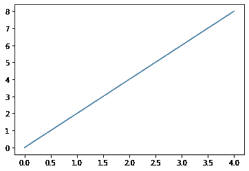

作者图片

我们想从轴上去掉顶部的脊椎。为此，我们可以使用*面向对象 API 接口*的`set_visible()`方法(即当我们使用`ax.plot`而不是`plt.plot`时)。语法如下:`ax.spines['top'].set_visible(False)`。要删除几根刺，使用 For 循环是有意义的:

```
fig, ax = plt.subplots()
ax.plot(x, y)
for spine in ['top', 'right']:
    ax.spines[spine].set_visible(False)
plt.show()
```

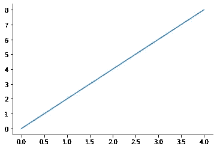

作者图片

更直接的方法是使用 seaborn 实用函数`sns.despine()`。在这种情况下，我们是使用面向对象的 API 还是 pyplot 接口并不重要。如果没有传入参数，默认情况下，顶部和右侧的脊线将被移除:

```
import seaborn as snsplt.plot(x, y)
sns.despine()
plt.show()
```


作者图片

可以移除任何剩余的脊线(如`left=True`)或恢复默认移除的脊线(如`right=False`)。

要一次移除所有 4 根刺，我们可以使用`set_visible()`或`sns.despine()`，但有一种更短的方法:使用`plt.box()`方法。

```
plt.plot(x, y)
plt.box(on=False)
plt.show()
```

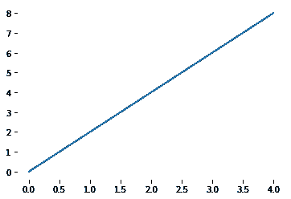

作者图片

# 更改书脊颜色和透明度

`set_color()`和`set_alpha()`方法与面向对象的 API 接口相关，语法类似于`set_visible()`的语法。当我们想要保留脊线但使其不明显时，`set_alpha()`方法很方便:

```
fig, ax = plt.subplots()
ax.plot(x, y)
ax.spines['left'].set_color('red')
ax.spines['bottom'].set_alpha(0.2)
plt.show()
```

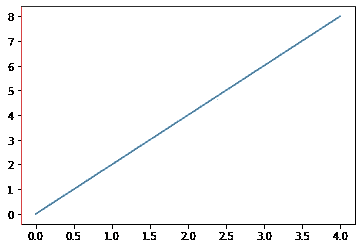

作者图片

# 调整书脊宽度/样式

现在让我们试着用方法`set_linewidth()`和`set_linestyle()`改变我们的绘图的宽度和样式，其中后者可以接受以下值:`'solid'`(默认)、`'dashed'`、`'dashdot'`或`'dotted'`。

```
fig, ax = plt.subplots()
ax.plot(x, y)
ax.spines['left'].set_linewidth(3)
ax.spines['bottom'].set_linestyle('dashed')
plt.show()
```

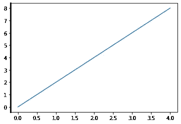

作者图片

看来`set_linestyle()`的方法没有起到预期的效果。我们可以通过改变同一脊柱的宽度来解决这个问题:

```
fig, ax = plt.subplots()
ax.plot(x, y)
ax.spines['bottom'].set_linewidth(4)
ax.spines['bottom'].set_linestyle('dashed')
plt.show()
```

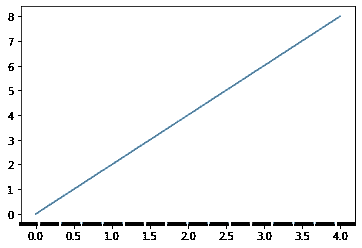

作者图片

现在看起来更好，但破折号彼此太近。为了进一步修复它，我们可以调整轴脊的另一个属性:capstyle，即每个虚线或圆点的结束样式。柱帽可以是凸出的*、*对接的*或圆形的*。为了理解它们之间的区别，让我们来看下面的示意图，该示意图显示了长度相同但顶样式不同的破折号:

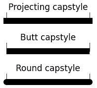

作者图片

我们看到*平头*帽型是最不“占用空间”的，而轴棘的默认帽型是*凸出*。让我们应用`set_capstyle()`方法并传入一个新值来调整我们的绘图:

```
fig, ax = plt.subplots()
ax.plot(x, y)
ax.spines['bottom'].set_capstyle('butt')
ax.spines['bottom'].set_linewidth(4)
ax.spines['bottom'].set_linestyle('dashed')
plt.show()
```


作者图片

还有一种提供书脊样式的替代方法:向`set_linestyle()`传递一个以下形式的元组: *(offset，onoffseq)* ，其中*偏移量*通常为 0， *onoffseq* 是一个以磅为单位的偶数长度的开/关墨迹元组。这种方法甚至更方便，因为它不需要调整任何其他参数，如宽度或 capstyle。我们可以用它来制作虚线、点线或任何其他图案的脊柱:

```
fig, ax = plt.subplots()
ax.plot(x, y)
ax.spines['top'].set_linestyle((0, (10, 10)))
ax.spines['right'].set_linestyle((0, (10, 10, 1, 10)))
plt.show()
```

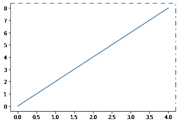

作者图片

# 改变位置

我们可以使用`set_position()`方法将任意脊柱放在任意位置，并传入以下形式的元组:*(位置类型，数量)*。可能的职位类型有:

*   `'outward'` —在绘图区域之外(或在绘图区域之内，如果以点为单位的数量为负值)，
*   `'axes'` —在指定的坐标轴坐标上，可以取 0 到 1 的值，
*   `'data'` —在指定的数据坐标上。

例如，最后一个选项对于在 0:

```
x1 = np.arange(-5, 5, 0.1)
y1 = np.sin(x1)
fig, ax = plt.subplots()
plt.plot(x1, y1)
ax.spines['left'].set_position(('data', 0))
sns.despine()
plt.show()
```

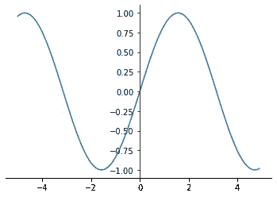

作者图片

`'outward'`位置类型在`sns.despine()`函数中有一个等价类型，我们可以传入可选的`offset`参数。该参数可以接受一个整数作为所有可见脊线的偏移量，也可以接受一个字典来分别指定每个可见脊线的偏移量。以下两个图是相同的:

```
fig, ax = plt.subplots()
ax.plot(x, y)
ax.spines['left'].set_position(('outward', 20))
sns.despine()
plt.show()fig, ax = plt.subplots()
ax.plot(x, y)
sns.despine(offset={'left': 20})
plt.show()
```

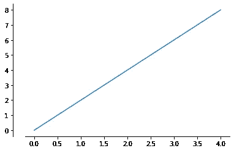

作者图片

最后，谈到定位 spines，在某些情况下，还有一种方法是有用的:`set_zorder()`。向它传递 0，我们可以在情节后面“隐藏”一个脊柱。下面我们来对比一下剧情:

```
fig, ax = plt.subplots()
plt.plot(x1, y1, color='red', linewidth=5)
ax.spines['left'].set_position(('data', 0))
ax.spines['left'].set_linewidth(5)
sns.despine()
plt.show()fig, ax = plt.subplots()
plt.plot(x1, y1, color='red', linewidth=5)
ax.spines['left'].set_zorder(0)
ax.spines['left'].set_position(('data', 0))
ax.spines['left'].set_linewidth(5)
sns.despine()
plt.show()
```

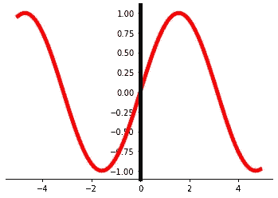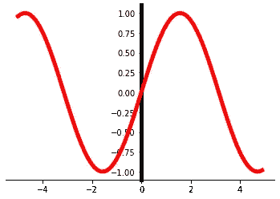

作者图片

# 结论

在本文中，我们探讨了在 matplotlib 和 seaborn 库中处理轴刺的不同方法和技巧，包括删除它们、更改它们的颜色和透明度、调整宽度/样式或更改位置。

感谢阅读！

**你会发现这些文章也很有趣:**

</how-to-fill-plots-with-patterns-in-matplotlib-58ad41ea8cf8>  </an-unconventional-yet-convenient-matplotlib-broken-barh-function-and-when-it-is-particularly-88887b76c127>  </how-to-fetch-the-exact-values-from-a-boxplot-python-8b8a648fc813> 