# 使用 Google AutoML 进行自动机器学习

> 原文：<https://towardsdatascience.com/hands-off-machine-learning-with-google-automl-e63b079f09d1?source=collection_archive---------6----------------------->

## Google 表格数据的 AutoML 简介

[Unsplash](https://unsplash.com?utm_source=medium&utm_medium=referral) 上 [AltumCode](https://unsplash.com/@altumcode?utm_source=medium&utm_medium=referral) 拍摄的照片

# **为什么是 AutoML？**

如今，表格数据无处不在，可以为我们提供对业务和工程问题的有意义的见解。提取这些见解的一种常见方法是对这些数据应用机器学习(ML)技术。将 ML 应用于数据集的过程由各种步骤组成，*例如，*数据预处理、特征工程和超参数优化，这些步骤中的每一个通常都是耗时的反复试验过程。此外，一个人需要成为 ML 领域的专家，以便在这些步骤中的每一步都高效和有效。对于一个组织来说，要么从外部找到这些领域专家，要么在内部培养这种专业技能，这可能需要相当长的时间。

进入[谷歌的 AutoML 平台](https://cloud.google.com/automl)，*，该平台使开发者(具有有限的 ML 专业知识)能够针对他们的需求训练高质量的模型*。作为谷歌统一 ML 平台 Vertex AI 的一部分，它提供了在视觉(图像和视频)、文本和结构化数据上自动训练模型的能力。在本教程中，我们将使用结构化数据的 AutoML 表格来训练预测[加州房价](https://www.kaggle.com/camnugent/california-housing-prices)、的模型。关于本文讨论主题的更多细节，我们参考[顶点人工智能文档](https://cloud.google.com/vertex-ai/docs/datasets/prepare-tabular)。该文档非常广泛，还包含其他 AutoML 产品的指南，*即*培训视觉和文本模型。

# 数据准备

在开始培训之前，我们必须确保培训数据采用平台支持的格式。AutoML 表格支持两种导入培训数据的方式；如果我们已经在使用 Google 的 BigQuery 平台，我们可以直接从 BigQuery 表中导入数据，或者上传一个逗号分隔值(CSV)文件到云存储中。对于本教程，我们将通过第二种方法。我们在下表中总结了 CSV 文件的要求。

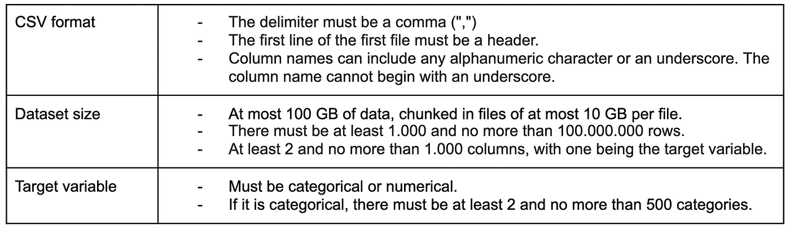

AutoML 表格培训数据格式摘要(图片由作者提供)

# 创建数据集

可以通过谷歌云平台(GCP)控制台导入数据集。在顶点人工智能部分有一个数据集页面，我们可以在那里管理我们的数据集。在这里，我们可以创建一个表格数据集，并为该数据集选择一个数据源。一旦提供了数据源，将显示一个显示数据一般统计信息的页面。这些步骤如下图所示；左边是数据集创建，中间是数据源选择，右边是统计视图。对于我们的例子，我们上传了包含[加州房价数据集](https://www.kaggle.com/camnugent/california-housing-prices)的 *housing.csv* 。

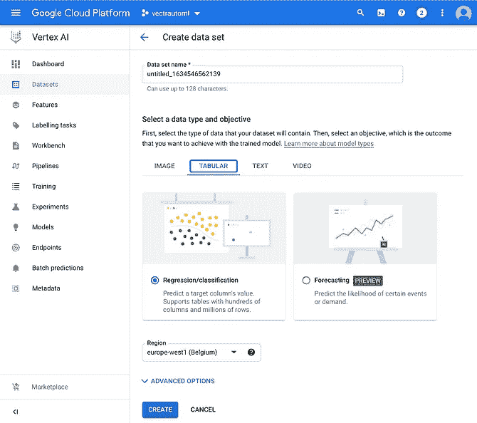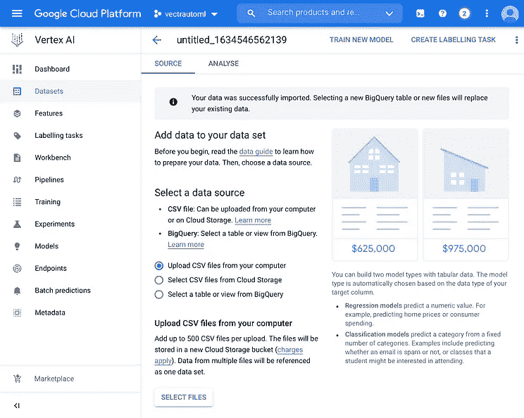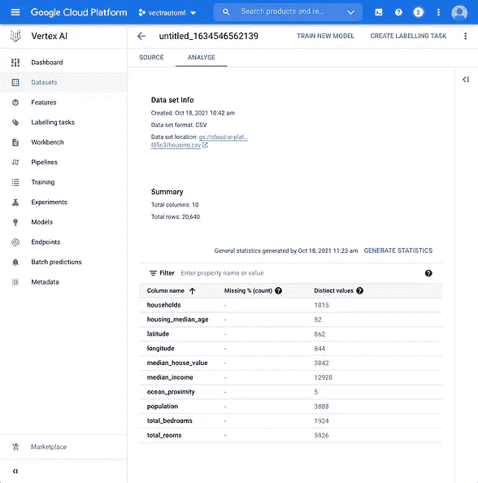

顶点人工智能数据集创建、源选择和统计页面(图片由作者提供)

# 训练模型

一旦数据集被创建，我们就可以开始训练我们的第一个模型。

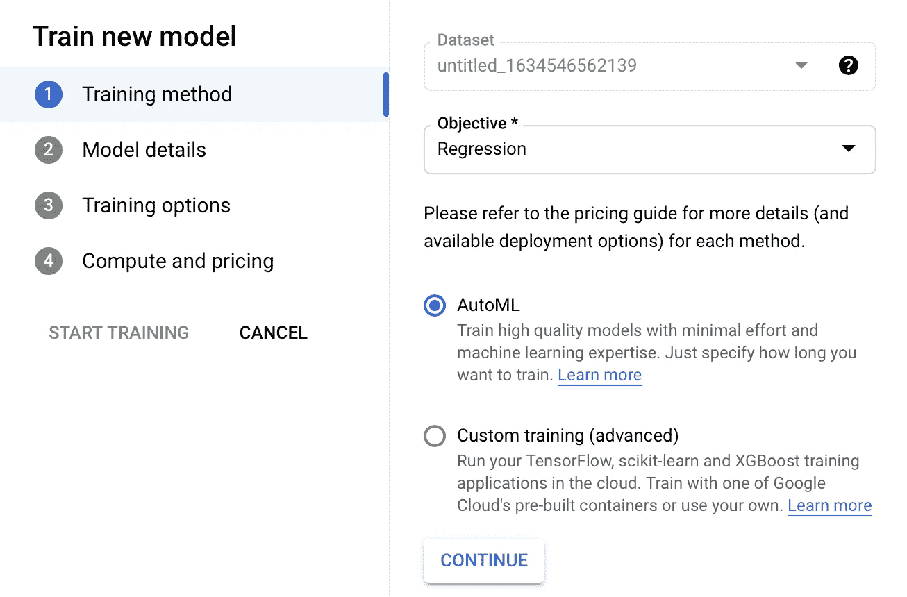

训练方法选择对话(图片由作者提供)

我们通过点击统计页面上的*训练一个新模型*来启动这个过程。然后，我们会看到一个对话框，允许我们**选择培训目标**，以及我们是使用 AutoML 来培训模型，还是使用定制的培训解决方案。对于我们的示例，我们选择回归作为训练目标，选择 AutoML 作为训练方法。

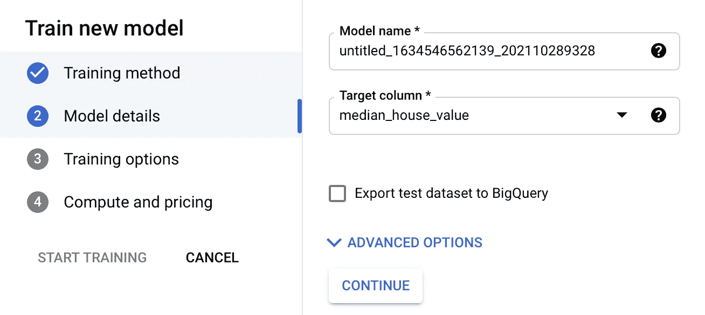

模型细节对话(图片由作者提供)

接下来，我们被要求**选择我们想要训练我们的模型来预测的目标变量/列**。在高级选项下，我们还可以控制如何在训练集、验证集和测试集之间拆分数据。

这种拆分可以通过随机分配、手动分配和基于所选列的按时间顺序分配来完成。对于我们的示例，我们选择*中值房屋价值*作为目标，并保留高级选项的默认值。

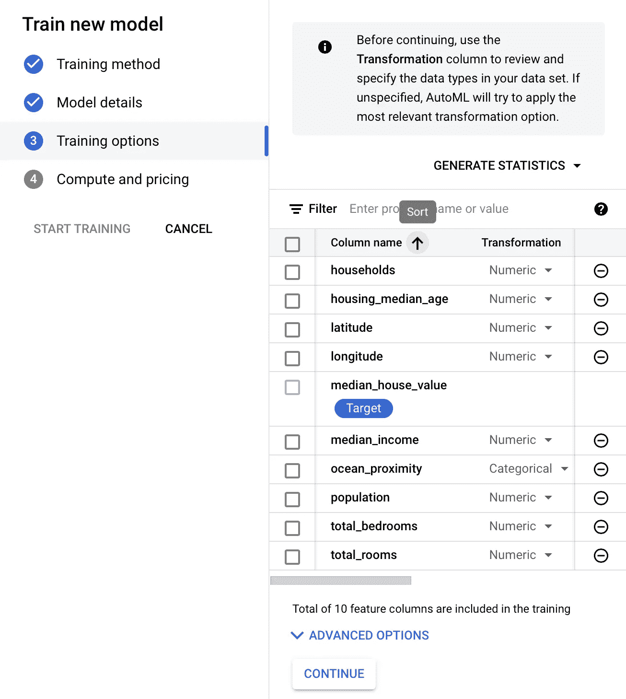

培训选项对话(图片由作者提供)

之后，系统会提示我们检查 AutoML 为我们的数据推断的数据类型。**对于每一列，我们可以选择一个转换，*即*数据类型(分类、文本、时间戳或数字)，以及我们是否希望它被** **包含在训练过程中**。在高级选项下，我们可以额外选择一个列，我们希望将其用作行的权重和优化目标。对于回归，这些目标包括 RMSE、MAE 和 RMSLE。[任何额外的预处理和/或特征工程最好留给 AutoML。](https://cloud.google.com/vertex-ai/docs/datasets/bp-tabular#tabular_data_preparation_best_practices_for_models)

对于我们的数据集，推断的数据类型是正确的。我们还在培训过程中包括所有列，并保留高级选项的默认值。

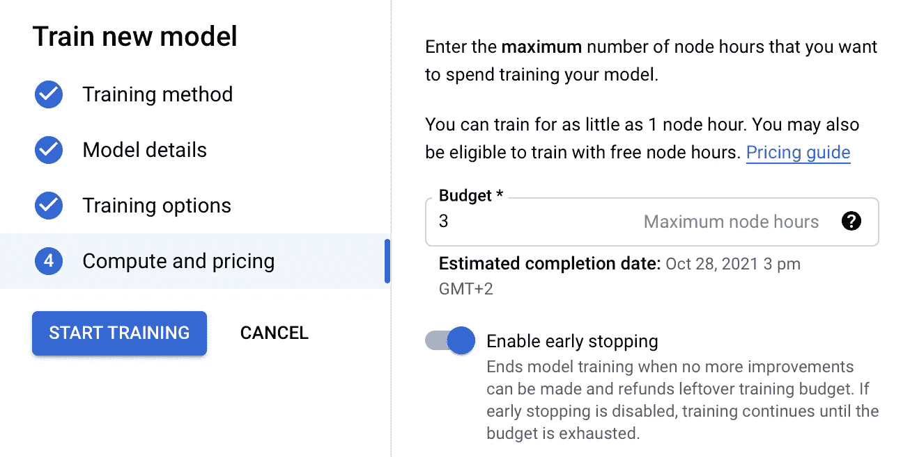

培训预算对话(图片由作者提供)

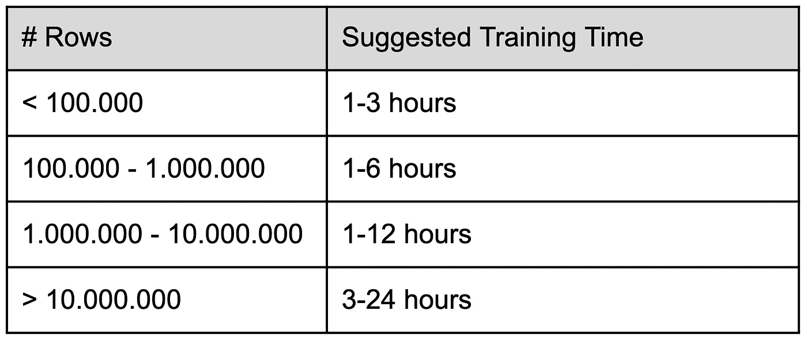

基于数据集大小的建议训练次数(图片由作者提供)

最后，要求**提供培训预算**、*，即*用于培训的最大节点小时数。我们根据谷歌建议的培训时间来选择我们的培训预算。培训预算设定后，培训过程将开始，并可通过 GCP Vertex AI 部分的培训页面进行监控。培训时间可能会比设定的培训预算长，但是，您将只需支付实际节点时间的费用，该时间受您设定的预算限制。一旦训练过程完成，最终的模型将出现在 Vertex AI 的模型页面上。从那里我们可以观察到各种性能指标和最终模型的特性的重要性，如下图所示。可以检查特性重要性图，以确保最重要的特性对我们的数据/业务问题有意义。

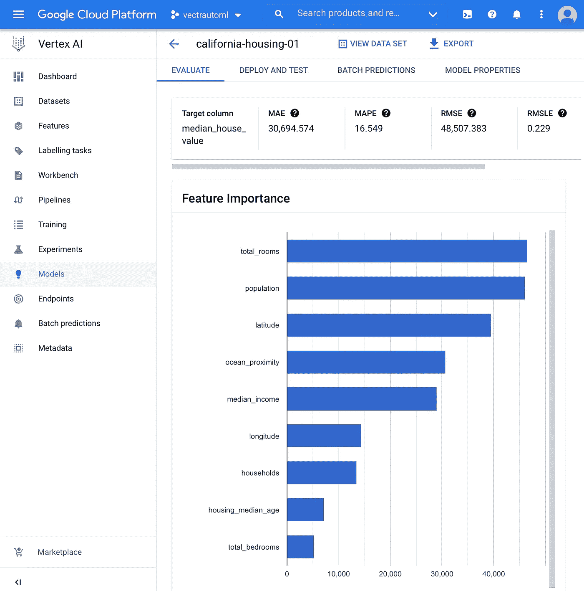

根据表格数据训练的自动回归模型的模型概述(图片由作者提供)

对于我们的例子，我们可以看到均方根误差约为 48.000，这看起来似乎很多，但实际上可以与人类训练的[模型的性能相媲美](https://www.kaggle.com/shtrausslearning/bayesian-regression-house-price-prediction)(数据集非常旧，不包含最佳特征集)。在性能指标下面，我们可以看到每一列的分数，表明它在进行预测时的重要性。我们可以看到, *total_rooms* 和 *population* 列被模型视为两个最重要的特性。

# 部署、测试和可解释性

然后，由 AutoML 生成的训练模型可以以两种方式部署；我们可以将模型导出为保存的 TensorFlow (TF)模型，然后我们可以在 Docker 容器中为自己服务，或者我们可以将模型直接部署到 GCP 端点。这两个选项都可以在模型页面上的*部署和测试*选项卡下找到。

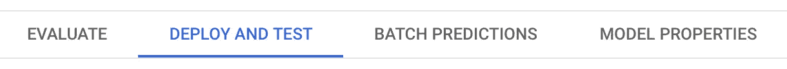

(图片由作者提供)

我们将示例中的模型部署到 GCP 端点，以便通过 GCP 控制台进一步测试它。一旦模型部署完毕，我们就可以开始通过 GCP 提供的[不同方式之一进行测试。我们使用了 GCP 控制台提供的 web 界面，它可以在前面提到的*部署和测试*选项卡的底部找到。在那里，我们可以处理模型的输入值，并观察它做出的预测。](https://cloud.google.com/vertex-ai/docs/predictions/online-predictions-automl)

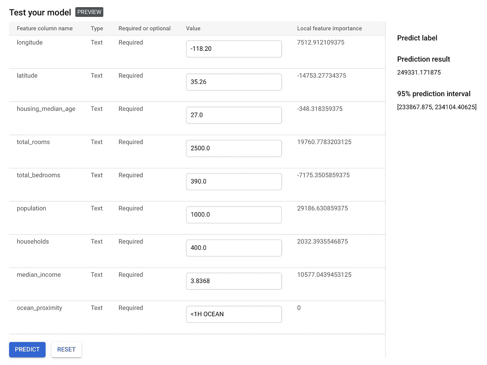

部署的 AutoML 模型预测+解释(图片由作者提供)

有趣的是，这个 web 界面不仅显示预测，还通过局部特征重要性值提供解释。对于 AutoML 表格(分类和回归)模型，使用[采样 Shapley 方法](https://cloud.google.com/vertex-ai/docs/explainable-ai/overview#compare-methods)计算这些值。这些解释值也可以在 GCP 控制台之外通过使用 Vertex AI 的[解释 API](https://cloud.google.com/vertex-ai/docs/predictions/online-predictions-automl#explanations-api) 来请求。

# 摘要

在本文中，我们展示了如何使用 Google AutoML 来训练、测试和部署一个 ML 模型，而不需要很多 ML 领域的专业知识。这使得 ML 民主化，允许 ML 专业知识有限的团队将 ML 应用到他们的数据中，并毫不费力地将结果模型部署到生产中。对于经验丰富的 ML 从业者，Google 的 AutoML 提供了有趣的高级配置选项，可以用来简化现有的 ML 工作流程。