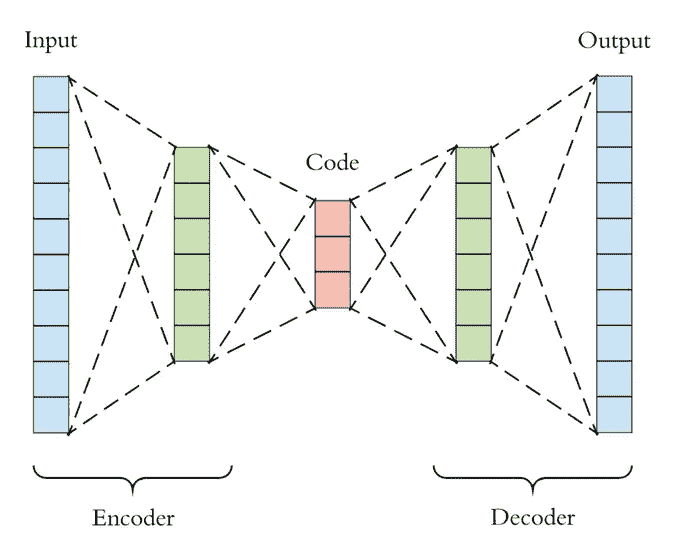
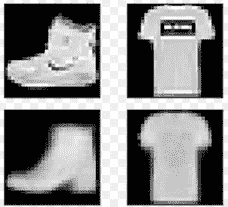
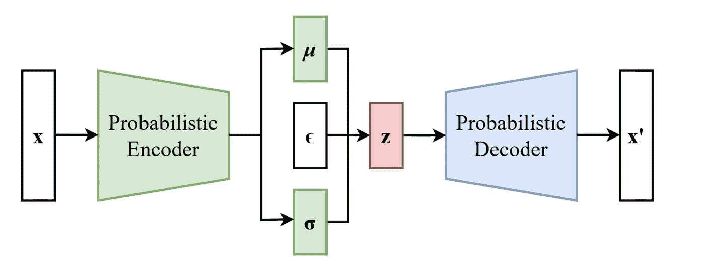
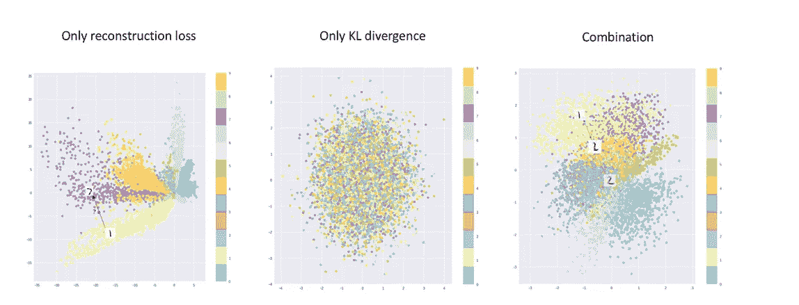
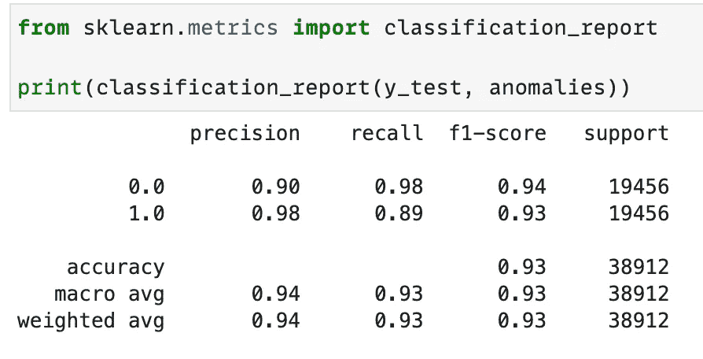
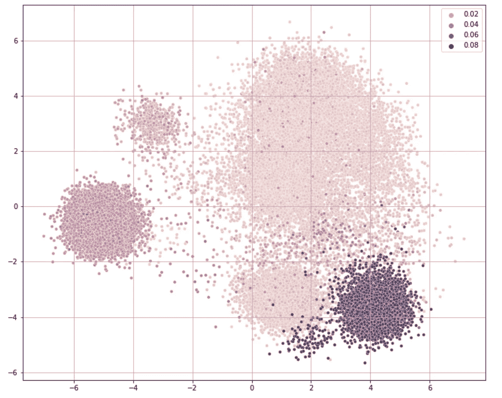
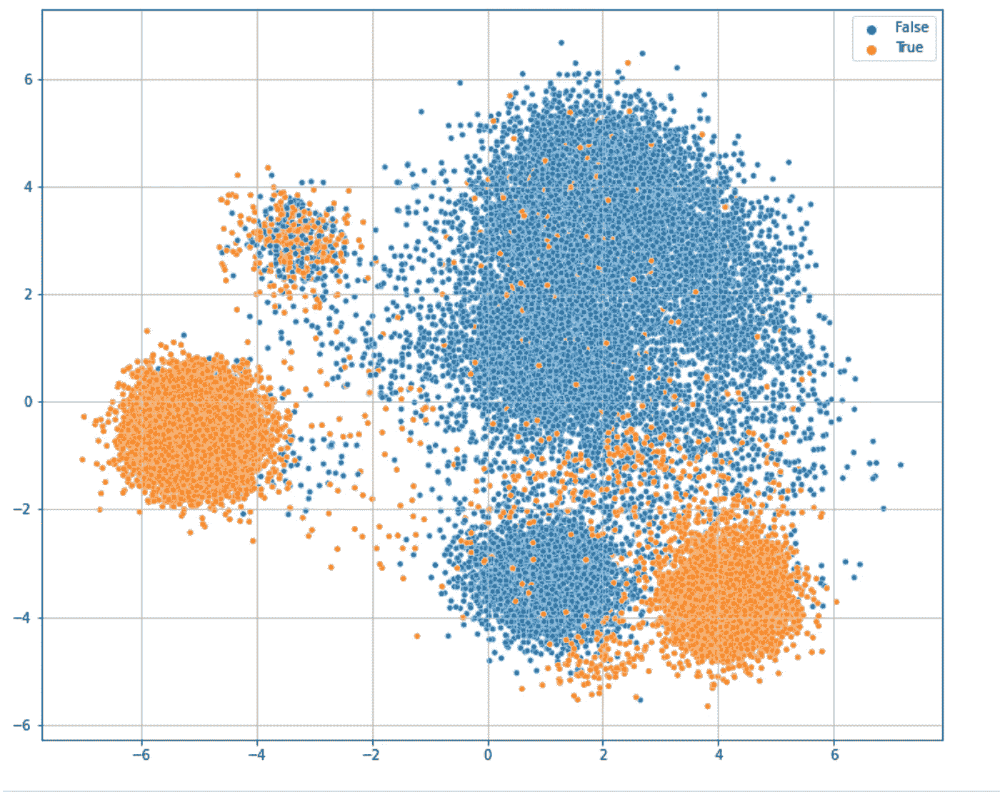
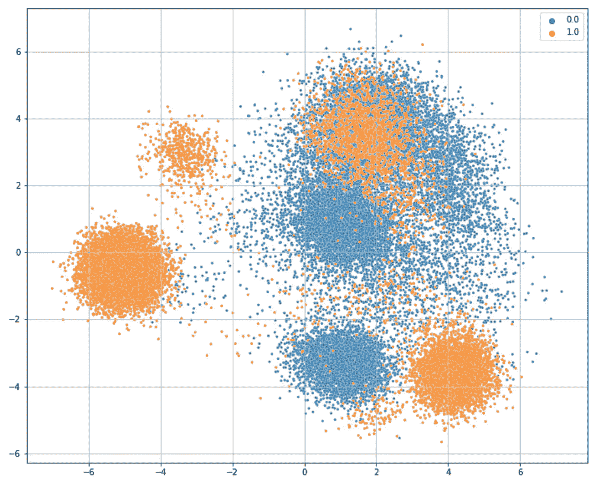

# 使用可变自动编码器进行实际异常检测

> 原文：<https://towardsdatascience.com/hands-on-anomaly-detection-with-variational-autoencoders-d4044672acd5?source=collection_archive---------1----------------------->

## 使用贝叶斯式重构方法检测表格数据中的异常


Pawel Czerwinski 在 [Unsplash](https://unsplash.com?utm_source=medium&utm_medium=referral) 上的照片

# 一.导言

异常检测是机器学习产生如此影响的领域之一，以至于今天几乎不用说，异常检测系统必须基于某种形式的自动模式学习算法，而不是基于一组规则或描述性统计(尽管许多可靠的异常检测系统使用这种方法非常成功和有效地运行)。

事实上，在过去十年左右的时间里，各种异常检测的 ML 方法变得越来越流行。一些方法，如一类 SVM，试图识别数据分布的维度空间中的“正常”区域或平面，然后将位于该区域之外的任何样本标记为异常。其他方法试图估计代表训练数据的分布(或混合分布)的参数，然后将任何看起来不太可能出现异常的样本指定为异常。每种方法都有自己的假设和需要考虑的弱点，这也是为什么测试异常检测算法并使其适合特定领域很重要的部分原因。

另一种流行的异常检测方法是基于 r *重建方法*，随着深度学习变得更加广泛，这种方法已经获得了很大的吸引力。潜在的想法是基于这样的假设，如果模型可以学习压缩和重建正常数据的函数，那么当遇到异常数据时，它将无法这样做，因为它的函数只在正常数据上训练。因此，重建数据的失败，或者更准确地说，重建误差的范围，可以表示异常数据的存在。

已经使用深度自动编码器(AE)实施了异常检测的重建方法，并取得了非常好的结果，尽管越来越多的文献表明使用更复杂的概率变分自动编码器可以改善结果，该编码器首先由 Diederik Kingma 和 Max Welling (2014 年)提出。尽管 VAEs 主要是作为图像和文本生成的生成模型而设计的，但是我们将会看到它们的一些特性也可以在异常检测领域得到利用。

有很多关于 VAEs 理论和数学的文章。然而，这篇文章的目的是采取一种更实际的或动手操作的方法，使读者只需要一点背景知识和一些代码就可以快速地构建一个可测试的模型。完整的实现链接在一个使用 KDDCup99 数据集的可复制笔记本中，该数据集通常用作异常检测文献中的基准，并显示接近 SOTA 的结果。

文章如下:第二部分非常简要地讨论了自动编码器和异常检测的重构方法。请注意，本部分旨在快速复习，并假设读者了解自动编码器的工作原理。如果没有，我不久前写了一篇关于自动编码器的[短文](/a-keras-based-autoencoder-for-anomaly-detection-in-sequences-75337eaed0e5),作为开始可能会有帮助。第三节集中在变型自动编码器和它们与传统自动编码器之间的区别。第四节深入研究了代码和实现细节。第五节得出结论。

# 二。自动编码器和异常检测

自动编码器是一种深度学习模型，通常基于两个主要组件:学习输入数据的低维表示的*编码器*，以及试图使用编码器生成的低维表示以原始维度再现输入数据的*解码器*。



来源:[https://towardsdatascience . com/generating-images-with-auto encoders-77fd 3a 8 DD 368](/generating-images-with-autoencoders-77fd3a8dd368)

这种架构的基本思想与图像压缩非常相似:一个训练有素的编码器学会以这样一种方式对输入数据进行编码，这种方式将捕获它包含的最重要的信息，从而足以(或尽可能接近足以)由解码器再现它。

AE 通过尝试最小化*再现误差*或原始输入向量与解码器从编码数据再现的输出向量之间的差异来学习对输入数据进行编码。如下图所示，尽管使用自动编码器重新生成的图像缺少一些细节，但其总体形状得以保留，这意味着编码器至少捕获了输入图像中包含的一些重要信息。



来源:[https://en.wikipedia.org/wiki/Autoencoder](https://en.wikipedia.org/wiki/Autoencoder)

这和异常检测有什么关系？简单明了的答案是，如果我们的 AE 经过充分训练，能够很好地再现其接受训练的输入数据，并且假设它接受了足够多的数据训练，那么当它被输入了与其接受训练的数据“相似”的数据时，它会产生或多或少稳定且最小的再现误差。然而，这也意味着不寻常的或极端的再现错误可能意味着 AE 遇到了与它被训练的输入非常不同的输入向量，因此它不能正确地再现它。如果显示给我们的 AE 的数据应该与它被训练的数据相似，那么产生极端再现误差的输入很可能是异常。

例如，如果我们在猫的图像上训练 AE，那么它可能很难再现大象的图像，并且如果这种大象的图像将被提供给在猫的图像上训练的 AE，那么它可能产生相对较高的再现误差，这可能正确地指示异常。当数据的维度很高，并且很难识别正常数据的行为以及哪些行为过于极端而不能被视为正常时，这种方法的最大好处就来了。

# 三。可变自动编码器

AE 以它认为最有效的方式将输入数据编码到潜在空间中，以便再现它。简而言之，编码器学习一个“函数”，该函数获取大小为 *n* 的向量，并输出大小为 *m* 的向量(使得*m<n*),*解码器*函数可以容易地使用该向量来再现原始输入向量。这意味着，例如，即使两个数据点非常相似，编码器也可以选择将它们放置在潜在空间中彼此相对较远的位置，如果这样可以最小化重建损失的话。这种架构中的编码器功能的输出产生非常离散的潜在空间，并且通常类似于过度拟合的模型。因此，虽然 AE 可以形成一个潜在空间，使其能够非常准确地完成任务，但对于它所产生的潜在空间的分布和拓扑结构，或者数据在那里是如何组织的，我们没有多少可以假设的。

在 VAE 中，编码器类似地学习将大小为 *n.* 的向量作为其输入的函数，然而，VAE 学习生成两个向量(大小为 *m)* ，这两个向量表示分布的参数(均值和方差),从该分布中对潜在向量进行采样，并且解码器函数可以将其转换回原始输入向量，而不是像传统 AEs 那样学习如何生成解码器函数可以再现的潜在向量。简而言之，AE 的学习任务*是学习将数据转换为解码器可以轻松再现的潜在向量的函数*，而 VAE 的学习任务*是学习生成分布参数的函数，解码器可以轻松再现的潜在向量可以从该分布参数中进行采样* d。更具体地说:

```
**In an AE**: (*) *encoder*(input_vector[]) => latent_v[]latent_v[] is our latent features vector**In a VAE**: (*) *encoder*(input_vector[]) => latent_v_mu[], latent_v_lvar[]So that - latent_v[0] ~  N(latent_v_mu[0], latent_v_lvar[0])and latent_v[1] ~  N(latent_v_mu[1], latent_v_lvar[1])As the other elements in the latent feature vector, latent_v[0] is sampled from a distribution parameterized by the mean and variance produced by the encoder (and which are forced by the KL loss function to be closer to N(0, 1))
```

因此，VAE 的潜在空间实际上是从编码器为每个潜在特征学习的分布中采样的。上面没有提到的另一个重要细节是，VAE 使用由两个部分组成的损失函数:(1)一个*重建损失部分*——它迫使编码器生成最小化重建损失的潜在特征，就像 AE 一样，否则它会受到惩罚；(2)*KL 损失分量*——其迫使编码器生成的分布类似于假设为正态的输入向量的先验概率，并因此将潜在特征空间推向正态。



来源:维基百科—[https://en.wikipedia.org/wiki/Variational_autoencoder](https://en.wikipedia.org/wiki/Variational_autoencoder)

因此，VAE 产生的潜在空间更加“驯服”并趋于正常。因为编码器被高度正则化以生成正态分布，并且潜在向量本身是从正态分布采样的，所以潜在空间将更加连续和平滑。下图清楚地显示了(1)编码器的潜在空间，该编码器仅基于重建损失产生潜在空间；(2)仅试图最小化 KL 损失并对分布(即，均值 0 和 var 1)施加正态性的编码器，这就是为什么所有数据点都被分组在相同的中间区域周围；(3)结合了重建损失和 KL 损失的 VAE 的潜在空间。



鸣谢:Irhum Shafkat，来源:[https://towards data science . com/直观-理解-变分-自动编码器-1bfe67eb5daf](/intuitively-understanding-variational-autoencoders-1bfe67eb5daf)

所有这些并不一定意味着 VAE 在每个异常检测任务中都会比人工智能表现得更好。vae 主要作为生成模型而闪耀，但是生成平滑且连续的潜在空间的优点对于异常检测任务来说也是有价值的，因为它的结果将以这种任务通常要求的方式更加稳定和可预期。

# 四。履行

这一部分的目的是快速探究可以检测异常的 VAE 的实现代码。我使用了 KDDCup99 cup 异常检测数据集，它经常被用作异常检测文献中的基准。这里我展示了代码的主要部分，而完整的实现可以在链接的笔记本中找到。

对于这个实现，我基本上遵循了 VAE 上的 Keras 博客中的代码示例，并进行了一些调整。我们将从模型的实现开始，然后寻找异常。

## VAE 模式

*编码器*:第一个重要的部分是编码器，它将大小为 *n* 的向量作为输入，并生成潜在向量( **z** )。然而，回想一下，在 VAE 中，编码器首先学习构成潜在向量的分布的参数，然后通过从该分布中采样来生成潜在向量 **z** 。如下图所示(第 5–6 行)，编码器首先学习 **z** 分布的均值和(对数)方差(即分别为 z_mean 和 z_log_var)。然后，它使用 lambda 层从该分布中采样 **z** ，调用函数 *sample(z_mean，z_log_var)* ，我们稍后将看到该函数，它返回采样向量 **z** 。

*sample()* 函数的目的是通过返回正态分布的 **z** 的*平均值+sigma***ε*来对其进行采样。正如 Francois Chollet 所解释的，ε的作用是确保潜在空间的连续性:

> 因为 epsilon 是随机的，这个过程确保了靠近你对[输入向量](z_mean)进行编码的潜在位置的每一个点都可以被解码成类似于[输入向量]的东西，从而迫使潜在空间持续有意义。潜在空间中的任意两个接近点将解码为高度相似的图像。连续性与潜在空间的低维度相结合，迫使潜在空间中的每个方向对数据变化的有意义的轴进行编码，使得潜在空间非常结构化，因此非常适合于通过概念向量进行操作(使用 Python 的深度学习，第 2 版。).

Chollet 显然试图让事情变得简单，尽管没有过多地进入理论(我自己也不完全理解)，但据称*ε*引入的正态随机性对于网络通过反向传播不断校正其参数也是必不可少的。

*解码器*:解码器相当简单。就像在传统的自动编码器中一样，它将采样的潜在向量 **z** 作为其输入，并试图再现它，只是在 VAE 的情况下，它实际上是生成组件。

以及最终的模型。

VAE 的主要组成部分之一是损失函数，如上所述，该函数试图在两个优化任务之间取得平衡:(1)最小化重建误差——这可以通过误差项来实现，例如我在下面使用的 MSE，或者通过其他差分函数来实现；(2)最小化 KL 散度——这实质上迫使 **z** 的分布趋于正态(例如，参见[这里的](https://forums.fast.ai/t/intuition-behind-kl-divergence-regularization-in-vaes/1650))。这可能是您希望根据结果进行调整的参数。两者之间的适当平衡将迫使 **z** 中的分布趋于常态，同时还确保网络能够再现输入向量。这将确保我们创建一个平滑和连续的潜在空间(由于强加的正态性),并形成我们可以用来检测异常和测量相似性的数据的准确表示。

然后，我们用组合损失函数拟合模型。

## 发现异常

异常检测的重建方法通过其相对较高的重建误差来识别异常。因此，当模型可以首先根据正常数据或大部分正常数据进行定型时，这些方法最有效。这样，我们可以增加我们的信心，即相对较高的重建误差是由真正的异常引起的。

具体来说，以下通常是一个良好的开端:

1.  测量原始训练(干净/正常)集和模型输出之间的误差，并生成表示每个样本的误差项的误差向量。
2.  在向量上找到一个相对极端的值作为你的误差阈值。假设一些异常可能会在训练集中引入一些噪声，因此选择 99%作为阈值(而不是最大的极值)是一个好主意。
3.  在测试或真实数据上运行模型，其中异常数据可能与正常数据混合在一起。
4.  测量重建误差并将表现出高于误差阈值的误差项的样本标记为异常。

正如您在下面所看到的，在 KDDCup99 数据集上使用这个非常简单明了的模型产生了一个非常令人印象深刻的结果(其中一些与该数据集的 SOTA 结果相差不远)。



我们还可以通过仅使用编码器模型而不使用解码器来检查编码器生成的潜在空间。

```
from sklearn.decomposition import PCAX_encoded = encoder.predict(X_test)pca = PCA(n_components=2)
X_transform = pca.fit_transform(X_encoded)
```

下图显示了编码器生成的潜在空间的散点图(在减暗至 2 暗后)。每个点的颜色反映了其相关的重建误差项(在 mae_vector 中)。暗点意味着更大的误差项。我们可以清楚地看到一大群看起来很正常的点(误差项相对较小)，被 3 个误差项相对较大的主要点群所包围。



我们可以用下面的图来证实这一点，该图在将每个超过误差阈值的点标记为异常(橙色)后，绘制了上面相同的点。



最后，我们可以将上面的图与下面的真实图进行比较，后者实际上显示了数据的真实标签。也就是说，图中橙色的点实际上是异常点——网络攻击期间发送的网络数据包。我们可以看到，虽然我们正确识别了绝大多数异常(98%)，但仍有一小部分我们未能识别，如图所示，这可能是因为与正常点有些相似。



# 动词 （verb 的缩写）摘要

变型自动编码器被广泛认为对各种机器学习任务极其有效。有很多关于变分自动编码器的文章，但是在异常检测领域没有太多的实际例子。这篇文章的目的是通过提供一个简单的例子来帮助填补这个空白，这个例子可以用来原型化和测试它。

VAEs 的最大优点来自于对生成的潜在空间施加的正则化。使用更平滑、更连续的向量空间的能力可以产生更稳定、更准确的结果，因为它可以确保相似的数据点靠得更近，并使相似性度量更可靠。在提出一个简单的架构后，我展示了 VAE 网络的这些特性如何通过相对较少的调整产生令人印象深刻的结果，尽管我试图强调如果结果不令人满意，需要在哪里进行调整和实验。

我认为，在异常检测领域，能够试验和有效测试不同的方法是非常重要的，因为每个领域都有自己的“特征”，有时允许我们做出某些假设，有时禁止我们做出其他假设。我希望这篇文章能让一些人在他们的工具箱中添加另一个工具，并鼓励更丰富的实验。

>>可复制笔记本可在我的 git 上获得[此处](https://github.com/a-agmon/anomaly_det/blob/master/AnomalyDetectorsVAE-KDD-original.ipynb)

>>一些非常好的参考资料:

[1]原论文:迪德里克·P·金马，马克斯·韦林，*自动编码变分贝叶斯*(2014)【https://arxiv.org/abs/1312.6114 

[2][https://towards data science . com/understanding-variable-auto encoders-vaes-f 70510919 f 73](/understanding-variational-autoencoders-vaes-f70510919f73)

[3][https://www.jeremyjordan.me/variational-autoencoders/](https://www.jeremyjordan.me/variational-autoencoders/)

[4][https://towards data science . com/直观-理解-变分-自动编码器-1bfe67eb5daf](/intuitively-understanding-variational-autoencoders-1bfe67eb5daf)

[5][https://wise odd . github . io/tech blog/2016/12/10/variation-auto encoder/](https://wiseodd.github.io/techblog/2016/12/10/variational-autoencoder/)