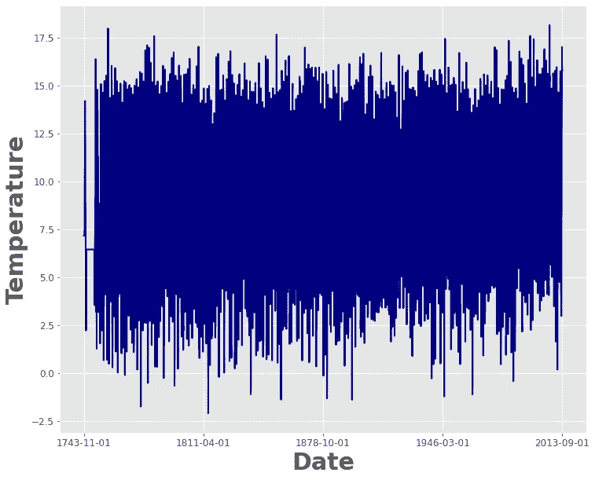

# 使用 Python 通过深度学习实践气候时间序列分类

> 原文：<https://towardsdatascience.com/hands-on-climate-time-series-classification-with-deep-learning-using-python-6d5de81004c9?source=collection_archive---------4----------------------->


照片由[萨夫](https://unsplash.com/@saffu?utm_source=unsplash&utm_medium=referral&utm_content=creditCopyText)在 [Unsplash](https://unsplash.com/s/photos/time?utm_source=unsplash&utm_medium=referral&utm_content=creditCopyText) 上拍摄

## 下面介绍如何用几行代码构建一个深度神经网络进行时间序列分类

**时间序列是我们生活中很大的一部分**。基本上**一切**都可以被建模为随着时间增加(在 x 轴上)而变化的某个量(在 y 轴上)。

另一方面，**分类是机器学习的一个重要应用。事实上，我们很容易将许多目标视为分类任务。**

把这两件事结合在一起我们就有了**时间序列分类。**我们的目标很容易确定:

> 我们想要一个模型，给定一个时间序列(即一个随时间变化的量)，能够输出一个类。

有大量的文章解释了这个目标背后的理论(在我看来，Marco Del Pra 在这篇文章中做得非常好)。本文不会关注理论，但会给出一个实用指南**关于如何对现实世界的时间序列进行分类，使用 Python 从头开始构建你的分类器。**

在我们的具体例子中，我们希望根据温度的时间序列来区分一个国家的大陆(欧洲、亚洲或非洲)。

所以让我们开始吧！

> 请注意:本文意在跟随您，**循序渐进，**走向解决方案。如果您对**预处理部分、**不感兴趣，请直接跳到**机器学习模型部分**或**结果部分。**

## 0.图书馆

我们首先要做的是打电话求助一些朋友:)

下面是我们完成工作所需的东西:

## 1.数据集

在我们的实验中，我使用了一个我非常熟悉的[数据集](https://www.kaggle.com/berkeleyearth/climate-change-earth-surface-temperature-data?select=GlobalLandTemperaturesByCountry.csv)，它可以用于我们的目标。这是一个由各国收集的地表温度数据组成的时间序列。

这里有一个直接来自英国的例子:



英国时间序列。[图片由作者使用 Python 制作]

## 2.数据预处理

现在您已经下载了您的。csv 该看了，有**熊猫**。

通过查看第一行，我们有一些东西需要考虑:

A.**我们还没有“大陆”信息，**我们想称之为“目标”
B. **我们必须处理平均温度列上的一些 NaN 值**，这是我们将认为是时间序列的 y 轴的值

让我们一步一步地解决这些问题。
我们首先要用的是我们导入的一个魔法库，即 **pycountry_convert** 。

通过下面几行代码，我们能够从一个国家名称中获取“大陆”:

```
country_code = pc.country_name_to_country_alpha2(c, cn_name_format="default")
        continent_name = pc.country_alpha2_to_continent_code(country_code)
```

但是，遗憾的是，这并不适用于整个数据集，我们可以从这些代码在我们的数据上的应用中看到:

很多国家不被 pycountry_convert 识别，所以我自己手动添加了大洲(稍后感谢；) ):

**我们可以看到，现在所有国家都有一个相关的洲，这就解决了一个点！**

一些国家来自南极洲，但它们形成了一个非常小的数量，在这个阶段，与添加到我们的数据集无关(顺便说一下，确定一个国家是否在南极洲是非常容易的，不是吗？).

所以我们最终需要将这些国家从我们的数据集中剔除。此外，我们还有那个问题要解决。我们就用神奇的 **pd.fill_na()** 函数来做！

代码如下:

**而且它解决了 B 问题！** 不幸的是，我们还没有完成。我们需要确保每个国家在时间序列中有相同数量的条目。在我们的数据集中，有些国家以 **1743** 为元年，有些国家以 **1948** 为元年。我们必须**将**数据集标准化到相同的**起始年**，以便拥有**相同数量的条目。**特别是，我们将使用**最近的年份**作为整个数据集的起始年份。

这是我们标准化之前的条目数:

这是**标准化代码和标准化数据集:**

**这是标准化后的条目数直方图:**

好了，让我们来看看我们的**类**:

让我们考虑三个人口最多的阶层:**欧洲，亚洲**和**非洲。**此外，让我们收集数据集的所有**标签**:

另外，让我们介绍一些我们将用来绘制数据的**函数**:

通过绘制我们三个国家的数据可以看出，**我们的任务一点也不轻松！**

**最后，让我们为机器学习模型准备数据集:**

## 3.机器学习模型

该模型是一个 1D 卷积神经网络。该结构非常容易理解，并且计算量小。此外，其细节由 Keras [在这里](https://keras.io/examples/timeseries/timeseries_classification_from_scratch/)提供。

**这里是模型:**

**及其摘要:**

**我们来训练模型:**

## 4.结果是:

已经获得了 79%的准确度；

以下是其他**指标**:

这里是**混淆矩阵:**

## 最终考虑:

虽然越来越大的模型通常是为了解决难以置信的复杂问题而构建的，但有时一个相当小的神经网络能够在有限的计算资源下获得可接受的结果。

如果你喜欢这篇文章，你想知道更多关于机器学习的知识，或者你只是想问我一些你可以问的问题:

A.在 [**Linkedin**](https://www.linkedin.com/in/pieropaialunga/) 上关注我，在那里我发布我所有的故事
B .订阅我的 [**简讯**](https://piero-paialunga.medium.com/subscribe) 。这会让你了解新的故事，并给你机会发短信给我，让我收到你所有的更正或疑问。
C .成为 [**推荐会员**](https://piero-paialunga.medium.com/membership) ，这样你就不会有任何“本月最大数量的故事”，你可以阅读我(以及成千上万其他机器学习和数据科学顶级作家)写的关于最新可用技术的任何内容。