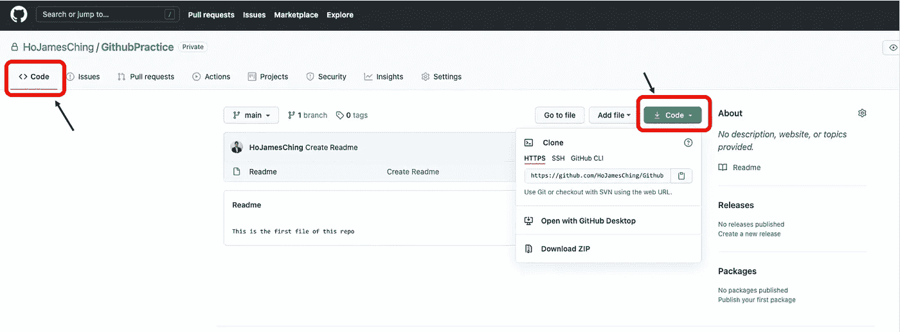
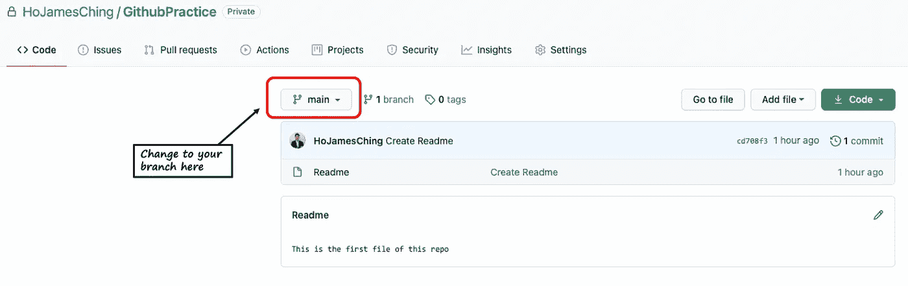
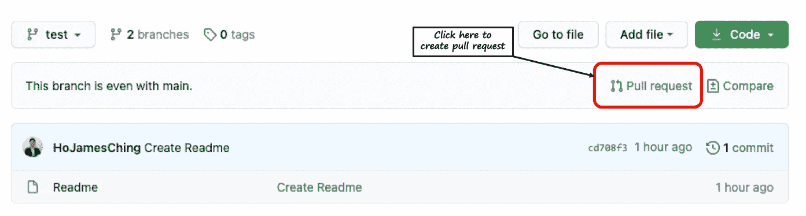

# 带代码示例的 Git 实践工作流

> 原文：<https://towardsdatascience.com/hands-on-git-workflow-with-code-example-a89ec2b3110b?source=collection_archive---------21----------------------->

## 通过动手实践一步一步地完成 Git 工作流(代码示例)


由[杰佛森·桑多斯](https://unsplash.com/@jefflssantos?utm_source=medium&utm_medium=referral)在 [Unsplash](https://unsplash.com?utm_source=medium&utm_medium=referral) 上拍摄的照片

继之前的[**Git 和 Github 初学者入门**](https://medium.com/swlh/an-intro-to-git-and-github-for-beginners-157c4374deff) 之后，今天我们将亲自动手。这个故事将通过实际的代码示例向您展示 Git 工作流程。由于 Github 是托管 Git 库的最受欢迎的网站，我们将用它作为例子。我们将使用 Git 的命令行界面，因此不考虑 Github CLI。

## 先决条件

1.  您必须在本地机器上安装 Git。你可以按照[官方文档](https://git-scm.com/book/en/v2/Getting-Started-Installing-Git)来做。
2.  有一个 [Github](https://github.com/) 账户(免费版就够了)。

# 从 Github 克隆存储库

有两种方法可以获得一个资源库，创建你自己的或者从 Github 或者类似的地方获得。我们将在这里着重从 Github 克隆一个。如果您对如何在自己的项目中启用 Git 并将其发布在 Github 上感兴趣，[这是一篇帮助您做到这一点的优秀文章](https://www.digitalocean.com/community/tutorials/how-to-push-an-existing-project-to-github)。

您首先需要转到您希望在终端中放置存储库的目录。假设我们想把它放在主目录的文档下。当你进入 Github 的一个资源库时，你可以在“`”标签下找到一个彩色的“代码”底部。在那下面，有三个选项，HTTPS、SSH 和 Github CLI。这是您可以克隆存储库的三种不同方式。`



语法是相同的，它们都是选项中的`git clone`+URL。

```
$cd ~/Documents/# HTTPS
$git clone https://github.com/<USERNAME>/<REPO NAME># SSH
$git clone git@github.com:<USERNAME>/<REPO NAME>.git
```

区别在于您的本地机器如何访问远程存储库。如果您选择“HTTPS ”,当您与远程数据库交互(如拉、推、取等)时，如果它是一个私有存储库，系统会提示您键入用户凭据。另一方面，通过 SSH 访问可以省去很多麻烦，尤其是当存储库是私有的时候。但是您必须将本地机器的 SSH 密钥添加到您的 Github 帐户中。

将存储库克隆到本地机器上之后，您需要创建自己的分支来工作。

# 创建新分支

让我们首先通过运行`git status`来检查状态。

```
$git status
>>On branch master
Your branch is up to date with 'origin/master'.nothing to commit, working tree clean
```

现在我们可以从这个最新的主分支(主要是开发分支)中分支出来。要实现，我们需要`git branch`命令。

```
$git checkout -b "new_branch_name"
>>Switched to a new branch 'new_branch_name'
```

显然，您可以随意更改分支的名称。

现在，您已经建立了您的分支，您可以开始工作了，您想改变文件。

# 重设基础并提交

一旦你做好了一切准备提交你的作品，一定要记得调整基础。为了重新基于最新的主或者开发分支，我们需要首先获取最新的版本。

```
# Commit your changes first
$git add (this step is called staging, to add changes to the commit)
$git commit -a -m "Your commit message"# Switch to develop/master branch
$git checkout develop>>Switched to branch 'master'
Your branch is up to date with 'origin/master'.# Use 'fetch' to check (just check, we haven't pulled yet)if there are updates in remote
$git fetch# If nothing comes out, your develop is up to date. If there are updates, pull those updates to your local machine
$git pull
```

现在我们本地机器上的 develop/master 分支是最新的。然后，我们可以在这个分支上重新建立基础

```
$git checkout new_branch_name
>>Switch to branch 'new_branch_name'$git rebase -i develop
```

# 推至远程

回想一下，到目前为止，我们只在本地机器上创建了分支，在远程机器上没有这样的“new_branch_name”分支。如果您只是运行`git push`，您将得到以下消息的错误:

```
fatal: The current branch test has no upstream branch.
To push the current branch and set the remote as upstream, use git push --set-upstream origin new_branch_name
```

这个错误消息抱怨说，它找不到一个远程分支，将您的提交推送到这个分支。解决方案很简单，完全按照它建议你做的去做:

```
$git push --set-upstream origin new_branch_name
```

这一行将在 remote 上创建一个分支，并将当前分支(包括所有提交)推送到 remote。

# 创建拉式请求

最后要做的事情是创建一个拉请求。一般的做法是在 Github 上创建一个 pull 请求，这里的界面比使用 CLI 更容易创建 PR。您可以在团队中指定一个特定的人来审核您的 PR，将它作为一个 PR 草案，以便您可以继续处理它，并审核您在此 PR 中所做的所有更改。



*我的 Git 系列故事:*

## [**Git 和 Github 初学者入门**](https://medium.com/swlh/an-intro-to-git-and-github-for-beginners-157c4374deff)

## [Rebase 和 Merge 的区别](https://hoooching.medium.com/the-differences-between-rebase-and-merge-30c91cd18f30)

## [我发现最有用的 5 个 Git 实践](https://hoooching.medium.com/5-git-practices-i-found-most-useful-af7410f390dd)