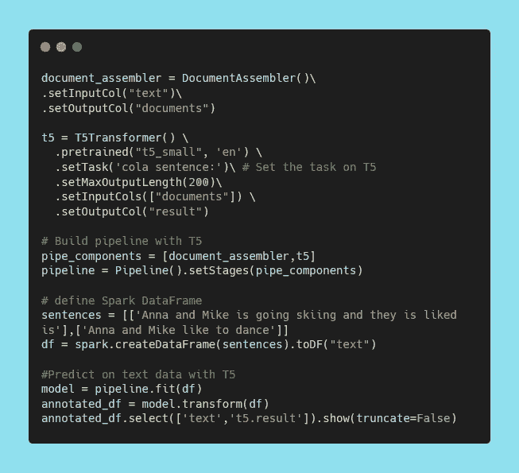

# 解决了！谷歌的文本到文本转换转换器(T5)瓶颈

> 原文：<https://towardsdatascience.com/hands-on-googles-text-to-text-transfer-transformer-t5-with-spark-nlp-6f7db75cecff?source=collection_archive---------5----------------------->

作者图片

## 探索极限:

## 使用 Spark NLP

我用 Google 的 T5 探索 NLP 已经有一段时间了。所以我决定更进一步。在这篇文章中，我简要介绍了 Google 的 T5，解决了围绕其*繁重的资源需求*和的挑战，如何使用最先进的自然语言处理库 [**Spark NLP**](https://nlp.johnsnowlabs.com/) 来克服这一障碍。

那么让我们来看第一个问题:

# 这篇文章是给我的吗？

这篇文章是写给任何想构建一个简单、高性能和精确的 NLP 管道，并能在分布式环境中轻松扩展的研究人员、数据科学家或学生的。

现在，我试图让这篇文章对初学者友好，但是，我建议你参考 [Spark NLP 文档](https://nlp.johnsnowlabs.com/docs/en/quickstart)或滚动到这篇文章的末尾，阅读博士[维塞尔·科贾曼](https://medium.com/u/eab5d8ce9651?source=post_page-----6f7db75cecff--------------------------------)关于 Spark NLP 的介绍性文章，如果你不熟悉 Spark NLP 环境，否则，拉把椅子，拿些爆米花，享受阅读的乐趣。

# 简介:统一文本到文本转换转换器的兴起(T5)

让我们回到那个我们可以握手问候的时代。2019 年，谷歌的一组研究人员通过引入一个统一的框架，将所有基于文本的语言问题转换为**文本到文本**格式，探索了 NLP 的迁移学习技术的前景。该模型在 *GLUE* 、 *SQuAD* 和 *CNN/Daily Mail* 数据集上展示了最先进的性能；并且在强力胶语言基准测试中获得了令人印象深刻的 88.9 分——仅比人类基准的 89.8 分差一点点。

但是真正将 T5 与 BERT 风格的模型区分开来的区别在于，它不输出标签或输入句子的输入范围，而是输出文本字符串**。**

Gif 作者[http://arxiv.org/abs/1910.10683](http://arxiv.org/abs/1910.10683)

这篇[论文](https://arxiv.org/pdf/1910.10683v3.pdf)背后的团队在过去十年中极其努力地评估和过滤各种 NLP 研究和论文，这些研究和论文基本上代表了相同的想法:**在大量未标记的文本上训练大型神经网络，然后针对非常具体的任务在标记的文本上对它们进行微调**。

他们的实验包括一些有趣的观察结果:

*   M *模型架构:*他们发现编码器-解码器模型通常优于“只有解码器”的语言模型
*   P *重新训练目标:*他们确认填空式去噪目标(训练模型以恢复输入中缺失的单词)效果最佳，并且最重要的因素是计算成本
*   u*n 标记的数据集:*他们表明对域内数据的训练可能是有益的，但对较小数据集的预训练可能会导致有害的过度拟合
*   T *培训策略:*他们发现，多任务学习可以与先训练后微调的方法相媲美，但需要仔细选择模型在每项任务上的训练频率
*   S *cale:* 他们比较了模型规模、训练时间和集合模型的数量，以确定如何充分利用固定的计算能力[2]

# 问题:这项研究的难点在哪里？

这就是事情变得有趣的地方。**这个研究有一个巨大的瓶颈**。从研究人员和学生的角度来看，他们想利用这个辉煌的模型的力量，它的大小是一个巨大的障碍。这个庞大的模型是像 BERT 这样的通用 NLP 模型的 30 多倍，这些早期的模型已经足够昂贵，可以在商用 GPU 硬件上使用！

# 解决方案:我们如何解决这个问题？

这就是 **Spark NLP** 介入的地方，它为*文本到文本转换转换器(T5)* 提供了广泛的功能，并能够快速有效地处理它，因为它从其基础 [**Apache Spark**](https://spark.apache.org/) 中借用了并行性、并发性和分布式计算。

由于 Spark NLP 使用 [**Tensorflow**](https://www.tensorflow.org/) 进行各种操作，它还利用了更强大的硬件提供的性能优势。相比之下，其他遗留库可能需要重写才能达到同样的效果。[5]

现在事不宜迟，让我们潜入 Spark NLP 的世界，征服 Google 的 T5。

# 实现:Google 的 T5 如何配合 Spark NLP 使用？

首先，Spark NLP 有各种型号的 T5，如[谷歌 T5(文本到文本转换转换器)底座](https://nlp.johnsnowlabs.com/2021/01/08/t5_base_en.html)和[谷歌 T5(文本到文本转换转换器)小型](https://nlp.johnsnowlabs.com/2021/01/08/t5_small_en.html)。

T5 模型在 18 个不同任务的几个数据集上进行训练，这些任务主要分为 8 类。

1.  文本摘要
2.  问题回答
3.  翻译
4.  情感分析
5.  自然语言推理
6.  共指消解
7.  句子完成
8.  词义消歧

## 每个 T5 任务都有解释

Google T5 的 NLP 任务

因此，让我们快速获取一个任务，并在 Spark NLP 中分解它的代码。

## 可乐——如果一个句子语法正确，就分类

可乐涉及到对一个给定的句子在语法和句法上是否可接受进行分类。语言可接受性语料库(CoLA)由 23 种语言学出版物中的 10657 个句子组成，由原作者对可接受性(语法性)进行了专业注释。

以下是您如何在 Spark NLP 中实现它:

作者图片

迷茫？:P

别担心，我会支持你的，

## **让我们来分解一下:**

➡In Spark NLP，*文件汇编员*是我们最好的朋友*。*它是一个关键的**转换器**，作为任何 Spark 数据帧的 Spark NLP 的初始入口点。

> (Psst…转换器是一种可以将一个数据帧转换为另一个数据帧的算法)

➡:然后，我们有一个*t5 变压器*，它从我们的*文件汇编器*获取输出`documents`，并将其通过我们预先训练好的 *T5。*就像我之前说的*，* Spark NLP 对于 T5 有各种型号，为了这个教程我选择了 *T5 小*。

➡我还使用了*任务*参数设置器`.setTask('cola sentence:')`来为 *T5* 指定我们的任务，在本例中是可乐。

➡现在，我们通过指定 Spark NLP *流水线*的组件，如*文档组装器*和 *T5* 来构建它。

> (Psst…管道只是按顺序执行的一系列步骤)

➡:然后，我们定义我们的数据，用列`text`创建我们的 Spark 数据框架。这个`text`专栏将会反馈给我们的朋友*文档汇编者。*

> 人们可以查看 Spark NLP 参考资料，了解 Spark NLP 世界的更多信息。我已经在这篇文章的末尾链接了它们。

➡接下来，我们用 spark 数据帧`(df)`在流水线上`.fit()`。这是我们的变压器与 spark 数据框架的融合。

最后，我们得到以下输出！

> 瞧啊。我们刚刚学习了如何使用谷歌的 T5 和 Spark NLP。

类似地，使用 Spark NLP 库，只需调整任务类型和输出列，就可以完成其他任务。

> 关于从导入库和启动 spark 会话到用 Spark NLP 实现所有 18 个可用的 Google T5 任务的完整代码，请参考这个[笔记本](https://github.com/JohnSnowLabs/spark-nlp-workshop/blob/master/tutorials/Certification_Trainings/Public/10.T5_Workshop_with_Spark_NLP.ipynb)。

# **参考文献**

*   [1] Raffel，c .，Shazeer，n .，Roberts，a .，Lee，k .，Narang，s .，Matena，m .，周，y .，Li，w .，& Liu，P. J. (2020)。[用统一的文本到文本转换器探索迁移学习的极限](http://arxiv.org/abs/1910.10683)。 *ArXiv:1910.10683 [Cs，Stat]* 。
*   [2] [用 T5 探索迁移学习:文本到文本的迁移转换器](https://ai.googleblog.com/2020/02/exploring-transfer-learning-with-t5.html)
*   [3] [Spark NLP 文档:Google T5(文本到文本转换转换器)库](https://nlp.johnsnowlabs.com/2021/01/08/t5_base_en.html)
*   [4] [Spark NLP Docs: Google T5(文本到文本转换转换器)Small](https://nlp.johnsnowlabs.com/2021/01/08/t5_small_en.html)
*   [5][Spark NLP 的优势](https://www.analyticsinsight.net/benefits-of-spark-nlp/)

我为那些希望开始使用 Spark NLP 并通过这个艺术图书馆探索自然语言处理的无限可能性的人提到了一些资源。

# **SparkNLP 资源**

*   [Spark NLP 文档和快速入门指南](https://nlp.johnsnowlabs.com/docs/en/quickstart)
*   [Spark NLP 简介:基础和基本组件](/introduction-to-spark-nlp-foundations-and-basic-components-part-i-c83b7629ed59)
*   [Spark NLP 简介:安装和入门](https://medium.com/spark-nlp/introduction-to-spark-nlp-installation-and-getting-started-part-ii-d009f7a177f3?source=your_stories_page---------------------------)
*   [Spark NLP 101:文档汇编器](https://medium.com/spark-nlp/spark-nlp-101-document-assembler-500018f5f6b5?source=your_stories_page---------------------------)
*   [Spark NLP 101:光管道](https://medium.com/spark-nlp/spark-nlp-101-lightpipeline-a544e93f20f1?source=your_stories_page---------------------------)
*   [使用 Bert 和通用语句编码器在 Spark NLP 中进行文本分类](/text-classification-in-spark-nlp-with-bert-and-universal-sentence-encoders-e644d618ca32)
*   [Spark NLP 中带 BERT 的命名实体识别(NER)](/named-entity-recognition-ner-with-bert-in-spark-nlp-874df20d1d77)

> 感谢您的阅读，祝您咖啡愉快！☕