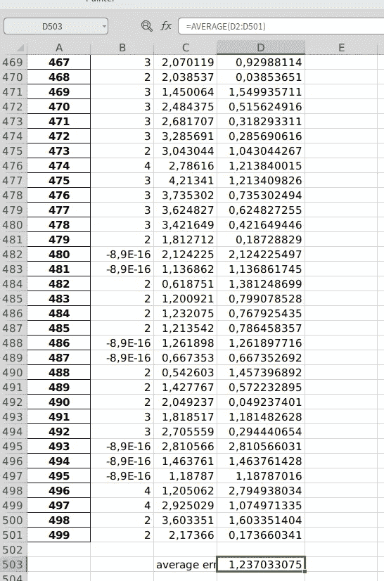

# 实践如何对时间序列预测模型进行基准测试

> 原文：<https://towardsdatascience.com/hands-on-how-to-benchmark-your-timeseries-prediction-model-ce473a91fd0f?source=collection_archive---------39----------------------->

## 利用时间卷积网络(TCN)预测风速的个例研究

乔纳森·博尔巴在 [Unsplash](https://unsplash.com?utm_source=medium&utm_medium=referral) 上的照片

确定你的模型性能有多好的标准是非常重要的。我们通常用于回归情况的标准之一是均方根绝对误差(MAE)。在本文的其余部分，我们将使用 MAE。

标准取决于我们建模的案例。**首先，标准取决于案例的可能值的范围**。我们不能一概而论，认为 MAE 的某个值是绝对好的，而不管我们建模的情况如何。例如，当我们想要预测每天的温度和降雨量时。它们的可能值的范围是不同的，即雅加达的日温度可以从 25 度变化到 36 度(注意:实际上我不知道，这只是为了举例)，但是对于降雨量，在极端天气的情况下，它可以从 0 度变化到 100 度甚至 200 度。

如果您想在不考虑范围值的情况下轻松确定模型的性能，只需将值的范围重新调整到您想要的比例即可。通常，你只用这个公式

其中，μ是数据集的平均值，σ是数据集的标准差。**这个公式假设我们的数据集是正态分布的**，因此 **MAE like 1 或以上是一个非常糟糕的分数**，不管范围值如何。您必须调整模型的超参数或使用数据集。

**第二，标准取决于你案件的可预见性**。不同的情况有不同的可预测性水平。像风速预测这样的现实世界案例(我们将在本文中演示的案例)往往具有较低的可预测性，因为现实世界是混乱的。可预测性是一个抽象的概念，我们无法得到可预测性水平的真实值。例如，在一种情况下，假设我们使用第一个公式重新调整数据集，MAE 为 0.2 是可以的，但在另一种情况下，这是一个糟糕的分数。为什么我们会得出这样的结论？用**与现有模型或方法**进行比较。**这就是我们所说的标杆管理**。而这正是我们讨论的重点。所有的数据集和代码都在下面。

<https://github.com/genomexyz/benchmark_timeseries>  

在我之前的文章[这里](/significant-wave-prediction-using-neural-network-7e5ee1b7f674)中，我已经演示了如何使用数据集的参数(平均值、中值、modus)对我们的模型进行基准测试。这一次，我们将尝试对时间序列模型进行基准测试。我们将尝试建模的是风速预测。事实上，当这篇文章写出来的时候，还没有现有的标准模型或方法(除了使用数值天气预报)来预测风速。因此，为了确定“现有模型或方法”的角色，让我们看一下我们的数据集。这些是大量的风速时间序列数据。

Kecepatan angin 是风速，arah angin 是风向，waktu 是时间。风速单位为米/秒。图片由作者提供

如您所见，相邻时间段的风速值相似。因此，我们可以选择的“现有模式或方法”是

> 未来的风速与当前条件下的风速相同

例如，现在的风速是 5 米/秒，那么未来 30 分钟的风速(我们的数据集具有 30 分钟的时间分辨率)也是 5 米/秒。

我们将评估的模型是时间卷积网络(TCN)。因此，首先我们将重建数据集的维度形状，以将其提供给 TCN。我们将数据分为两组，即训练数据和测试数据，就像任何其他 ML 模型一样。这是代码。

从这段代码中，我们将得到这样一个 excel 文件。

作者图片

作者图片

这里我没有重新调整我的数据集，这里显示的是风预测的真实值。让我们计算所有的误差，误差平均值，并绘制出来

误差平均值。作者图片

无论是从误差平均值还是从图表来看，我们的模型性能看起来都不错。这样真的好吗？让我们运行我们的基准模型并进行比较。

将`benchmark_error_wind.xlsx`中的内容复制并粘贴到`wind.xlsx`中，以便我们进行比较。

作者图片

这里是误差平均值

作者图片

整个情节。作者图片

由此我们知道，我们只提高了基准模型的精度(缩小误差平均值)大约 **9.3%** ，也就是**不太好**。看起来我们需要再次调整 TCN 的超参数或者重新排列我们的数据集。

这就是如何测试你的模型。这次我们的讨论很短，因为讨论的内容实际上很简单，但在我看来这很重要，所以我把它放在一篇单独的文章里。下一篇文章再见。