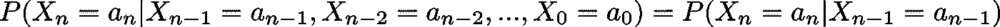
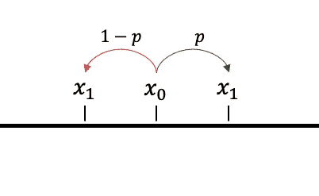
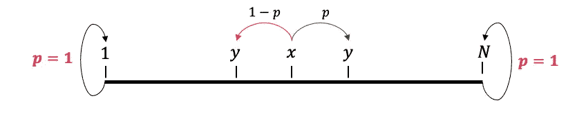
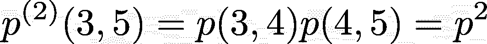
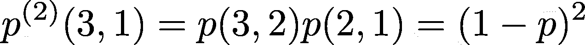
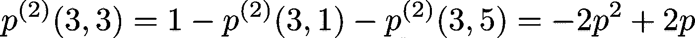
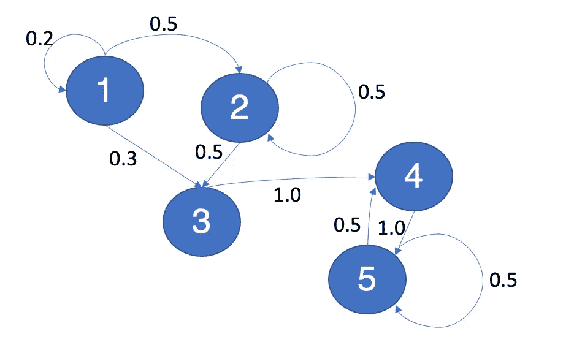
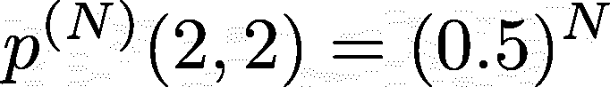

# 手动马尔可夫链示例，使用 Python

> 原文：<https://towardsdatascience.com/hands-on-markov-chains-example-using-python-8138bf2bd971?source=collection_archive---------1----------------------->


马库斯·斯皮斯克在 [Unsplash](https://unsplash.com/s/photos/chain?utm_source=unsplash&utm_medium=referral&utm_content=creditCopyText) 上的照片

## 一次解开一行代码中的马尔可夫链。

刚开始学物理的时候，我不喜欢**概率**这个概念。这个想法让我很兴奋，用物理可以模拟整个世界，不确定性的想法让我很愤怒:)

事实是，当我们想要研究真实的现象时，我们迟早必须处理一定程度的不确定性。处理它的唯一方法是获得一个精确的概率估计，这个概率决定了我们的过程。

马尔可夫链是一个很好的方法。马尔可夫链背后的思想非常简单:

> 未来会发生的一切只取决于现在正在发生的事情

用数学术语来说，我们说有一个随机变量序列 X_0，X_1，…，X_n 可以取某个集合 a 中的值。然后我们说，如果一个事件的序列是一个马尔可夫链，我们有:



我使用[乳胶](https://latex2png.com/)生成的图像

这听起来可能很复杂，但它只不过是上面表达的概念。

另一个假设是，该方程对每一步都有效(不仅仅是最后一步)，并且概率总是相同的(即使形式上，这只对**齐次马尔可夫链**成立)。

现在，可能状态 A 的集合通常表示为样本空间 S，你可以用所谓的**转移概率来描述从 S 中的状态 x 到 S 中的状态 y 的概率。**

但是我向您保证，这将是一篇“动手”文章，所以让我们开始将这些概念形象化吧！

公平地说，Python 并不是执行数值模拟的最佳环境。专业研究人员使用更复杂的语言，在某种程度上也更可靠，比如 C 语言或 Fortran 语言。

尽管如此，这个博客的目标是介绍一些非常简单的概念，使用 Python 可以使这个学习过程更容易。

所以让我们开始吧:这是你需要的:

所以就是一堆主流库像 **pandas** ， **matplotlib，seaborn，numpy。**

让我们从最简单的场景开始:

## 1.随机漫步

简单随机漫步是随机漫步的一个极其简单的例子。

第一个状态是 0，然后你以概率 0.5 从 0 跳到 1，以概率 0.5 从 0 跳到-1。



我用 Power Point 制作的图像

然后你对 x_1，x_2，…，x_n 做同样的事情。

你认为 S_n 是 n 时刻的状态。

有可能证明(其实很容易)在 t+1 时刻处于某个状态的概率，即一个整数 x，只取决于 t 时刻的状态，简而言之，**就是一个马尔可夫链。**

这是如何产生它的:

结果是:

现在随机漫步的想法是模拟如果我们决定从一个点开始，通过投掷一枚完美的硬币随机选择向上或向下会发生什么。

这个过程非常简单，但就其理论应用和性质而言，却非常有趣。

这个过程的第一个合理的扩展是考虑一个随机行走，但是使用一个不完美的硬币。意思是上升的概率和下降的概率不一样。这被称为**有偏见的随机漫步。**

让我们考虑以下几个概率:

```
 [0.1,0.9] , [0.2,0.8], [0.4,0.6], [0.6,0.4], [0.8,0.2],[0.9,0.1]
```

所以我们有 6 种可能的随机漫步。请注意，概率必须为 1，因此考虑“向上”或“向下”的概率就足够了。

以下是您的操作方法:

这就是我们想象它时发生的事情。

## 2.赌徒的破产链

扩展随机漫步的另一个简单方法是赌徒的破产链。
从概念上讲，它非常类似于随机漫步:你从一个状态 x 出发，你可以以概率 p 到达一个状态 y=x+1，或者以概率 1-p 到达一个状态 y=x-1



我用 Power Point 制作的图像

有趣的是，当你到达 1 或 N 时，你基本上被卡住了。除了永远保持那种状态，你什么也做不了。

这个函数，给定:

*   a **起点**(例如 3)
*   **第一个可能值**(例如 0)
*   以及**最后一个可能值**(例如 5)
*   **步数**(如 10000)

给你最后的状态:

现在，在尝试这个功能之前，让我们考虑一个更有趣的情况。

> 假设我们从状态 3 开始。两步后进入状态 5 的概率是多少？

这是从状态 3 到状态 4，然后从状态 4 到状态 5 的概率:



我用[乳胶](https://latex2png.com/)制作的图像

**在我们的例子中，它只是 0.25。**

如果现在我们问这个等式:

> 假设我们从状态 3 开始。两步后结束于状态 1 的概率是多少？

同样，它是从状态 3 到状态 2，然后从状态 2 到状态 1 的概率:



我用[乳胶](https://latex2png.com/)制作的图像

**同样，在我们的例子中，它只是 0.25。**

唯一的另一种选择是在两步之后从状态 3 进入状态 3。我们可以用一种非常简单的方法来计算这个概率。由于总概率必须为 1，因此:



我用[乳胶](https://latex2png.com/)制作的图像

如果 p=0.5，它也是 0.5

同样，概率的概念是，如果我们重复一个实验无限次，我们应该能够验证概率值所暗示的事件。

## 3.自定义马尔可夫链

前面的模型是众所周知的，并被用作马尔可夫链的介绍性例子。让我们发挥创意，建造一个全新的非现有模型，就像下图中的**一样。**



我用 Power Point 制作的图像

我画画很糟糕，但模型本身很简单。

当你看到两个节点(比如 A 和 B)之间有一个箭头时，这意味着你可以从节点 A 开始到节点 B，这个箭头用黑色表示。

*例如，从状态 A 到状态 B 的概率为 0.5*

一个重要的概念是，模型可以用转移矩阵来概括，这解释了你的马尔可夫链中可能发生的一切。这是我们模型的**转换矩阵**:

如果你仔细观察这个模型，你会发现一些非常特别的东西。假设你从状态 2 跳到状态 3。你能回到状态 2 吗？答案是否定的。

这同样适用于状态 3 和状态 1。状态 1、3 和 2 因此被定义为**瞬态。**

另一方面，如果你从状态 4 开始，总有可能在某个时候，你会回到状态 4。这同样适用于状态 5。这些状态被称为**循环状态。**

让我们做些实验，以便能正确理解这个概念。

直观上，我们可以看到，从状态 2 开始不回到状态 2 的概率，随着步数趋于无穷大而趋于 0。

事实上，从状态 2 开始，经过 N 步后，我们发现自己处于状态 2 的概率如下:



我用[乳胶](https://latex2png.com/)制作的图像

事实上，如果我们从状态 2 到状态 3，我们不可能回到状态 2。让我们将这个理论函数定义为 t(N ),并绘制成图:

现在，让我们使用马尔可夫链，看看我们是否验证了同样的结果。

我们从状态 2 开始，并在 N 步后验证处于状态 2 的概率。**概率，在这种情况下，就是最终状态的 2 的个数和出现次数的比值。**为了保持一致，出现的次数需要趋于无穷大。让我们考虑 1000 次测试。

这是我们将要使用的函数:

让我们对不同的 N 使用这个函数，称之为 p(N):

可以看到，我们使用了**转移矩阵**来进行模拟。我们可以使用转移矩阵来评估我们正在考虑的马尔可夫链的所有属性。

## 4.结论

在这本笔记本中，我们已经看到了非常著名的模型，如**随机漫步**和**赌徒的毁灭链**。然后，我们创建了我们自己的全新模型，并对其进行了一点小小的改动，发现了一些重要的概念，如**转换矩阵、循环状态和瞬态。最重要的是，我们已经看到了如何使用 Python 和众所周知的库以非常简单的方式验证这些概念。**

如果你喜欢这篇文章，你想知道更多关于机器学习的知识，或者你只是想问我一些你可以问的问题:

A.在 [**Linkedin**](https://www.linkedin.com/in/pieropaialunga/) 上关注我，我在那里发布我所有的故事
B .订阅我的 [**简讯**](https://piero-paialunga.medium.com/subscribe) 。这会让你了解新的故事，并给你机会发短信给我，让我收到你所有的更正或疑问。
C .成为 [**推荐会员**](https://piero-paialunga.medium.com/membership) ，这样你就不会有任何“本月最大数量的故事”，你可以阅读我(以及成千上万其他机器学习和数据科学顶级作家)写的任何关于现有最新技术的文章。

再见:)