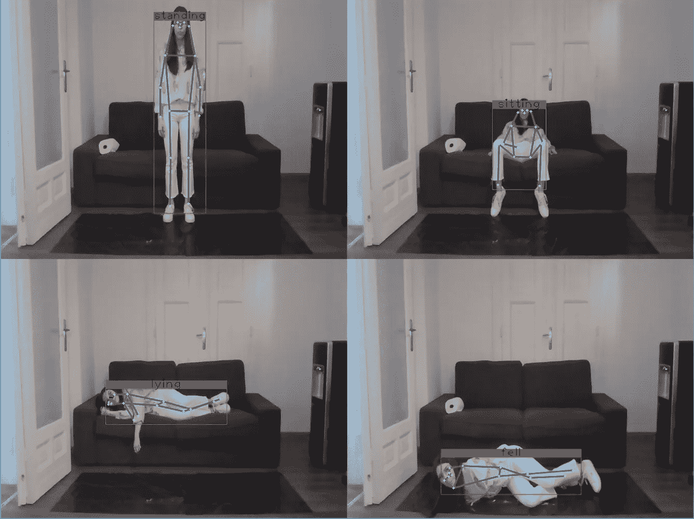
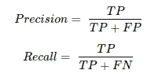
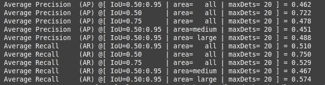
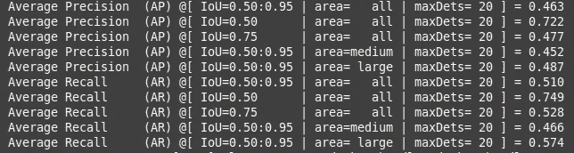
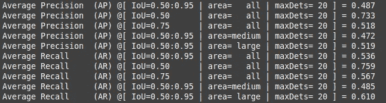
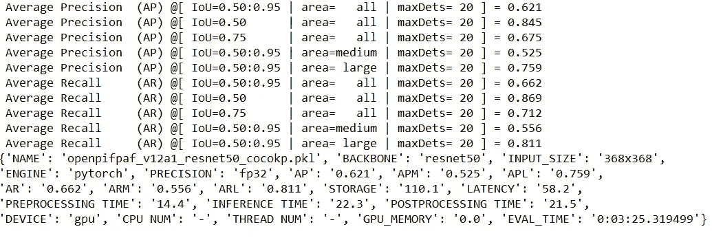
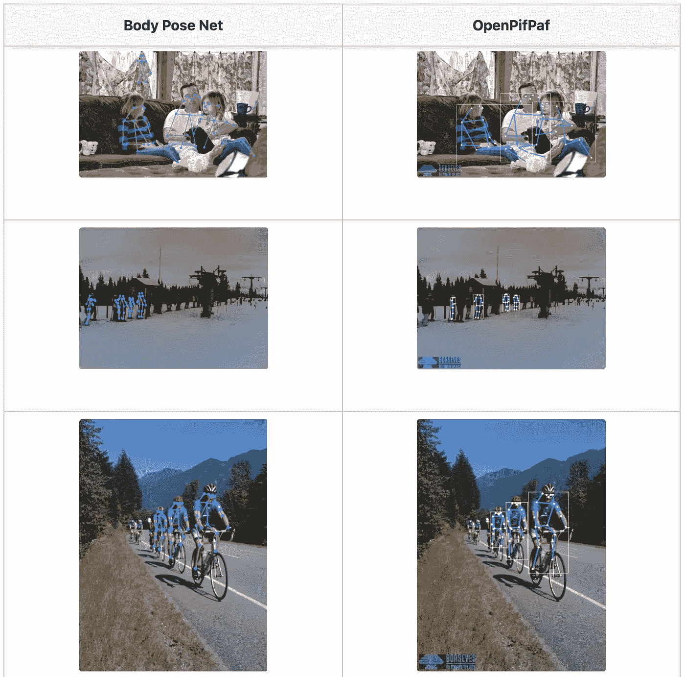

# 实践:优化和基准身体姿势估计模型

> 原文：<https://towardsdatascience.com/hands-on-optimizing-nvidia-body-pose-net-model-e27da4a9f8ec?source=collection_archive---------24----------------------->

## Nvidia Body Pose Net 与 OpenPifPaf 模型


来自 [Pexels](https://www.pexels.com/photo/photo-of-code-projected-over-woman-3861969/?utm_content=attributionCopyText&utm_medium=referral&utm_source=pexels) 的 [ThisIsEngineering](https://www.pexels.com/@thisisengineering?utm_content=attributionCopyText&utm_medium=referral&utm_source=pexels) 摄影

伊西多拉·斯坦科维奇，内韦娜·米勒托维奇，戈兰·贝纳克**，**德贝马尔亚·比斯瓦斯— [瑞士达尔文边缘](https://darwinedge.com/)

**摘要** *。Nvidia 最近宣布推出* [*2D 身体姿势估计模型*](https://developer.nvidia.com/blog/training-optimizing-2d-pose-estimation-model-with-tao-toolkit-part-1/) *作为迁移学习工具包 3.0 的一部分。在本文中，我们提供了一个详细的教程来训练和优化模型。我们进一步提供了另一个广泛用于感知任务的开源模型的基准测试结果:*[*OpenPifPaf*](https://github.com/openpifpaf/openpifpaf)*——允许您决定何时使用哪个模型。*

在之前的一篇文章[4]中，我们通过将身体姿势模型应用于现实生活中的医疗保健应用程序，展示了它的实际效用。该应用程序在病人家中监控病人，并在有人从床上摔下来、发生事故等情况时发出警报。这对于医院和养老院的居民来说是个大问题。



实践中的身体姿态检测(图片由作者提供)

# 训练身体姿态网络模型

在本节中，我们将介绍训练和优化 Nvidia 身体姿势网络模型所需的所有步骤。该模型使用 TAO Toolkit 进行训练，TAO Toolkit 使用预训练的模型和自定义数据集来构建新的 AI 模型[1]。

第一步是安装和运行 TAO 工具包。遵循此链接中的步骤:

[陶工具包快速入门指南—陶工具包 3.0 文档](https://docs.nvidia.com/tao/tao-toolkit/text/tao_toolkit_quick_start_guide.html)

登录到 NGC docker 注册表后，运行以下命令:

```
mkdir Programs
cd Programs/
wget -O ngccli_linux.zip [https://ngc.nvidia.com/downloads/ngccli_linux.zip](https://ngc.nvidia.com/downloads/ngccli_linux.zip) && unzip -o ngccli_linux.zip && chmod u+x ngc
mkdir ngccli_linux
cd ngccli_linux/
chmod u+x ngc 
echo "export PATH=\"\$PATH:$(pwd)\"" >> ~/.bash_profile && source ~/.bash_profile
cd ..
ngc config set
ngc registry model list
```

我们使用 conda 虚拟环境(按照[链接](https://docs.anaconda.com/anaconda/install/linux/)中的步骤安装 Anaconda)。要创建并激活虚拟环境，请运行以下两个命令:

```
conda create -n 'env_name' python=3.7 
conda activate 'env_name'
```

该工具包现在可以使用了，培训准备工作可以继续进行。在[这一页](https://developer.nvidia.com/blog/training-optimizing-2d-pose-estimation-model-with-tao-toolkit-part-1/)中，解释了强制步骤。第一步是环境设置，其中下载了最新的示例(用于设置培训的配置文件)，设置了 env 变量并创建了挂载文件。最后，安装所需的依赖项。下一步是下载预先训练好的模型。

> 用来训练这个模型的数据集是 COCO 数据集，它是从[这个链接](https://cocodataset.org/#download)下载的。

应该是这样组织的:

```
<user>                          
├──tlt-experiments
   ├──bpnet
     ├──data            
       ├──annotations              
       ├──test2017        
       ├──train2017               
       └──val2017
```

数据集需要为训练做准备，因此分段掩码与 *tfrecords* 一起生成。配置文件和所用命令的详细解释可在[这里](https://docs.nvidia.com/tao/tao-toolkit/text/bodypose_estimation/bodyposenet.html#bodyposenet)找到。

下一步是为训练配置 spec 文件，它包含六个组件:训练器、数据加载器、增强、标签处理器、模型和优化器。我们使用默认的规范文件，即/workspace/examples/BP net/specs/BP net _ train _ m1 _ coco . YAML。

现在可以开始训练了。

> 我们在 Nvidia GeForce RTX 2080 GPU 上的培训过程持续了 104 个小时。

用于评估模型的度量是精确度和召回率。这些值按以下方式计算:



其中 TP 是真阳性的数量，FP 是假阳性的数量，FN 是假阴性的数量。针对交集/并集(IoU)的不同阈值计算精度和召回率。IoU 是基于预测边界框和地面真实边界框之间的重叠计算的参数。

例如，如果 IoU 阈值为 0.5，并且用于预测的 IoU 值为 0.7，则该预测被分类为真阳性。反之，如果 IoU 为 0.3，则归类为假阳性。假阴性是未能预测图像中的对象的预测。

> 在评估结果中，IoU 阈值为 0.5:0.95。这意味着精度和召回率是通过对 0.5 和 0.95 之间的不同阈值以特定步长平均精度和召回率来计算的。

我们在验证集上得到的准确率和召回率是:



## 最佳化

使用 TAO Toolkit 对模型进行的优化在此处解释[。](https://developer.nvidia.com/blog/training-optimizing-2d-pose-estimation-model-with-tao-toolkit-part-2/)优化模型的一种方法是修剪。它消除了低量级的权重，从而产生压缩模型，占用较少的内存资源[2]。

> 修剪后的准确率和召回率不明显降低，因此使用修剪模型是合理的。



修剪后，建议重新训练模型，因为修剪会导致精度下降。在同一个 GPU 和数据集上的再训练持续了 99 个小时。重新训练模型的评估结果是:



# OpenPifPaf 基准测试

OpenPifPaf [3]是一种通用的神经网络架构，它使用复合场来实时检测和构建时空姿态。我们使用自然人体运动的几何学来计算和检测预先确定的感兴趣区域中的身体位置，以检测一个人是否站着、坐着、躺着、摔倒等。

OpenPifPaf 和 Body Pose Net 模型都是自底向上的实现，这意味着它们检测图像中的所有关节，然后将属于不同人的部分关联起来。另一方面，自上而下的方法首先检测人，然后对每个人执行单人姿势估计以预测人体关节[5]。

> 自下而上的方法更适合有人群的图像，以及复杂的姿势和人们互相遮挡的情况。

OpenPifPaf 模型也在 COCO 数据集上进行了训练。评估是在与身体姿态网络模型相同的验证集上进行的。以下是我们在相同输入量下得到的结果:



用于训练 OpenPifPaf 模型的参数与用于身体姿势网络的参数略有不同。学习率是 0.001，而在身体姿势网络模型中，基本学习率是 2e-5，最小学习率是 8e-8。动量为 0.95，而 BP 网络使用 0.9。最后，批量大小是 8，而不是 BP 网络中的 10。

> 事实证明，OpenPifPaf 模型为每个 IoU 阈值提供了更好的结果。IoU=0.5:0.95 的平均精度是 0.621，而身体姿势网络模型中的相同度量是 0.487。

## 结果

> 为了模型的视觉比较，我们使用了新的数据集— [*Halpe 全身人体关键点*](https://github.com/Fang-Haoshu/Halpe-FullBody) 数据集。

此处描述的两个模型从未见过该数据集。选择某个子集来可视化这些模型提供的预测结果。



Nvidia Body Pose Net 与 OpenPifPaf 的基准测试

# 参考

[1] [概述— TAO 工具包 3.0 文档](https://docs.nvidia.com/tao/tao-toolkit/text/overview.html#tao-conversational-ai-workflow-overview)

[2]开尔文。*通过修剪进行模型压缩*。[https://towards data science . com/model-compression-via-pruning-ac9b 730 a 7 c 7 b](/model-compression-via-pruning-ac9b730a7c7b)

[3]克里斯、贝尔托尼和阿拉希:OpenPif-Paf: *语义关键点检测和时空关联的复合字段*。arXiv，abs/2103.02440，2021。

[4] M. Vuletic 等人。艾尔。*面向医疗保健应用的 Edge AI 框架*。2021 年 8 月，关于人工智能用于老龄化、康复和智能辅助生活的第四届 IJCAI 研讨会( [ARIAL](https://sites.google.com/view/arial2021) )。[https://medium . com/Darwin-edge-ai/edge-ai-framework-for-rapid-prototyping-and-deployment-cabf 466 DD def](https://medium.com/darwin-edge-ai/edge-ai-framework-for-rapid-prototyping-and-deployment-cabf466dddef)

[5] [深度学习的人体姿态估计概述——beyond minds](https://beyondminds.ai/blog/an-overview-of-human-pose-estimation-with-deep-learning/)