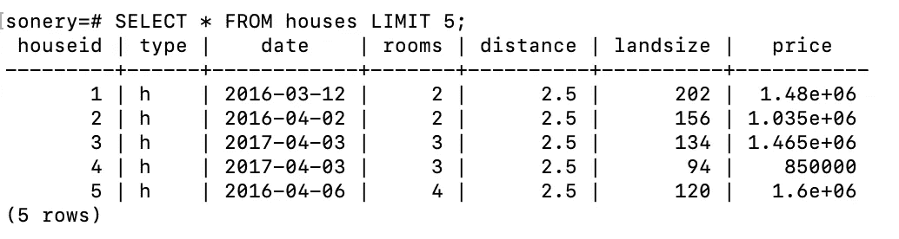

# 动手操作 PostgreSQL:基本查询

> 原文：<https://towardsdatascience.com/hands-on-postgresql-basic-queries-a5f1249bba78?source=collection_archive---------17----------------------->

## 世界上最先进的开源关系数据库


[南安](https://unsplash.com/@bepnamanh?utm_source=unsplash&utm_medium=referral&utm_content=creditCopyText)在 [Unsplash](https://unsplash.com/s/photos/elephant?utm_source=unsplash&utm_medium=referral&utm_content=creditCopyText) 上的照片

SQL 提供了许多函数和方法来管理以表格形式存储的数据。关系数据库管理系统(RDBMS)是一个使用 SQL 来管理存储在关系数据库中的数据的程序。

关系数据库包含许多通过共享列相互关联的表。有许多不同的 RDBMSs，如 MySQL、PostgreSQL、SQL Server 等等。

我之前写了一篇[文章](/practical-introduction-to-postgresql-5f73d3d394e)作为对 [PostgreSQL](https://www.postgresql.org/) 的介绍，解释了如何设置 PostgreSQL 数据库和创建表。在本文中，我们将讨论几个演示如何查询关系数据库的例子。

第一步是创建一个我们可以查询的表。一种选择是创建表，并使用 insert 语句手动填充它。更实用的方法是从 csv 文件中复制数据。

我有一个 csv 文件，其中包含了 Kaggle 上提供的墨尔本住房[数据集](https://www.kaggle.com/anthonypino/melbourne-housing-market)的一些列。我们需要在从文件上传数据之前创建表。

```
CREATE TABLE houses (                                                                      HouseId SERIAL,                                                                                     Type VARCHAR(20),                                                                                   Date date,                                                                                          Rooms INT,                                                                                          Distance real,                                                                                      Landsize real,                                                                                      Price real,                                                                                         PRIMARY KEY (HouseId)                                                                               );
```

表格中的列必须与 csv 文件中的列兼容。第一个字表示列名，第二个字表示数据类型。

我们现在可以将 csv 文件中的数据复制到 houses 表中。

```
\COPY houses(HouseId, Type, Date, Rooms, Distance, Landsize, Price)                        FROM '/Users/sonery/Downloads/melb_sql/houses.csv'                                                  DELIMITER ','                                                                                       CSV HEADER;
```

第一行包括表名和列名。然后，我们写入将用于复制数据的文件的路径。最后两行是关于 csv 文件的特征。

我们现在可以开始查询 houses 表。让我们首先检查表中有多少观察值(即行)。

```
SELECT COUNT(1) FROM houses;count
-------
13580(1 row)
```

我们使用 count 函数来计算行数。因为每一列都包含相同数量的行，所以我们可以将任何一列传递给 count 函数。

我们可以通过显示前 5 行来看看这个表。

```
SELECT * FROM houses LIMIT 5;
```



(图片由作者提供)

SQL 也可以被认为是一种数据分析工具。它提供了多种过滤、分析和转换数据的功能和方法。

例如，我们可以查看价格超过 100 万英镑的房屋数量。我们只需要使用 where 语句添加一个条件。

```
SELECT COUNT(1) FROM houses
WHERE price > 1000000;count
-------
5743(1 row)
```

where 语句接受多个条件。我们来求 h 型，距离大于 2 的房子的最高价。

```
SELECT MAX(price) FROM houses                                                              WHERE distance > 2 AND type = 'h';max
-------
9000000(1 row)
```

我们在价格列上使用 max 函数。过滤条件与“and”关键字相结合。

SQL 函数提供了极大的灵活性和多功能性。考虑前面的例子。结果集中的聚合列显示了函数名，但实际上并没有告诉我们它代表什么。

“as”关键字可用于为聚合列分配别名。我们也可以用 1000000 除以百万来表示价格。

```
SELECT MAX(price / 1000000) AS price_million FROM houses                                   WHERE distance > 2 AND type = 'h';price_million
---------------
9(1 row)
```

数据分析中常用的函数是 group by。它根据列中的不同值对行进行分组，然后允许对数值执行聚合。

例如，我们可以计算每种房屋类型的平均价格。

```
SELECT type, AVG(price) AS avg_price FROM houses                                           GROUP BY type;type |     avg_price
-----+-------------------
t    | 933735.0538599641
h    | 1242664.761138745
u    | 605127.4845873384(3 rows)
```

该查询的作用是选择 type 和 price 列，然后根据 type 列中的类别对行进行分组。avg 函数计算每个类别的平均房价。

我们还可以使用 order by 语句对结果集中的值进行排序。我们来看看最近公布的 5 栋房子的身份证号码。为了使情况稍微复杂一点，我们还将在距离列上添加一个条件进行过滤。

```
SELECT houseid, date FROM houses
WHERE distance BETWEEN 2 AND 3
ORDER BY date desc
LIMIT 5;houseid |    date
--------+------------
  10879 | 2017-12-08
  10880 | 2017-12-08
  10877 | 2017-12-08
  10878 | 2017-12-08
  10973 | 2017-12-08(5 rows)
```

我们首先实现过滤条件，然后对结果进行排序。默认情况下，order by 语句按升序对结果进行排序。我们可以用 desc 关键字改变它的行为。

## 结论

我们已经做了几个例子来演示如何编写基本查询来从表中检索数据。全面理解基本 SQL 语句至关重要。高级查询是在基本查询的基础上创建的。

我计划通过逐渐增加复杂性来写更多关于 PostgreSQL 的文章。敬请关注更多内容！

感谢您的阅读。如果您有任何反馈，请告诉我。