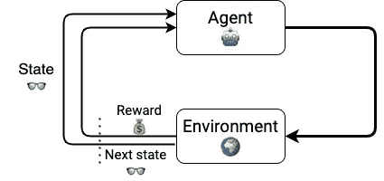
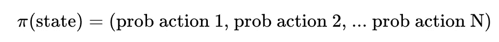

# 实践强化学习课程:第 1 部分

> 原文：<https://towardsdatascience.com/hands-on-reinforcement-learning-course-part-1-269b50e39d08?source=collection_archive---------3----------------------->

## [实践教程](https://towardsdatascience.com/tagged/hands-on-tutorials)

## 从零到英雄，一步一个脚印。

凯(图片作者提供)

# 欢迎来到我的强化学习课程！❤️

让我们一步一步地走在这条从基础到前沿强化学习(RL)的美丽道路上，一起用 Python 编写代码示例和教程吧！

这第一部分涵盖了开始这一旅程所需的最基本的概念和理论。然后，在接下来的每一章中，我们将解决一个不同的问题，难度越来越大。

最终，最复杂的 RL 问题涉及强化学习算法、优化和深度学习的混合。

您不需要了解深度学习(DL)来学习本课程。我会给你足够的背景，让你熟悉 DL 哲学，并理解它如何成为现代强化学习的一个重要组成部分。

# 第一部分

在第一课中，我们将通过例子、数学和一点 Python 知识来讲述强化学习的基础。

## 内容

1.  什么是强化学习问题？🤔
2.  政策👮🏽和值函数。
3.  如何生成训练数据？📊
4.  Python 样板代码。🐍
5.  重述✨
6.  家庭作业📚
7.  下一步是什么？❤️

开始吧！

# 1.什么是强化学习问题？🤔

强化学习(RL)是机器学习(ML)中与学习问题相关的一个领域，其中

> *一个智能***代理** *🤖需要学习，通过试错，如何采取* ***行动*** *内心和* ***环境*** *🌎为了最大限度地获得***的累计奖励。**

*强化学习是最接近人类和动物学习方式的一种机器学习。*

*什么是代理？还有一个环境？代理可以采取的具体行动是什么？奖励呢？为什么说累积奖励？*

*如果你问自己这些问题，你就在正确的轨道上。*

*我刚刚给出的定义引入了一堆你可能不熟悉的术语。其实他们是故意暧昧的。这种普遍性使得 RL 适用于广泛的看似不同的学习问题。这是数学建模背后的哲学，它停留在 RL 的根源。*

*让我们来看看几个学习问题，并通过强化学习的视角来看待它们🔍。*

# *例子 1:学习走路🚶🏽‍♀️🚶🏿🚶‍♀️*

*作为一个刚刚开始走路的孩子的父亲，我不禁问自己，*他是怎么学会的？**

**

*凯和保罗(图片由作者提供)*

*作为一名机器学习工程师，我幻想着用软件和硬件来理解和复制那条不可思议的学习曲线。*

*让我们尝试使用 RL 成分来模拟这个学习问题:*

*   *经纪人是我的儿子凯。他想站起来走路。他的肌肉在这个时候足够强壮，有机会尝试。对他来说，学习的问题是:如何顺序调整他的身体位置，包括他的腿、腰、背和手臂上的几个角度，以平衡他的身体，不摔倒。*
*   ***环境**是他周围的物理世界，包括物理定律。其中最重要的是重力。如果没有重力，学会走路的问题将会彻底改变，甚至变得无关紧要:为什么你想要在一个你可以简单地飞翔的世界里行走？这个学习问题中的另一个重要定律是牛顿第三定律，用简单的话来说就是，如果你摔倒在地板上，地板将以同样的力度回击你。哎哟！*
*   ***动作**是这些身体角度的所有更新，当他开始追逐周围的东西时，这些角度决定了他的身体位置和速度。当然，他可以同时做其他事情，比如模仿奶牛的声音，但这些可能不会帮助他实现他的目标。我们在我们的框架中忽略了这些动作。添加不必要的动作不会改变建模步骤，但是会使问题以后更难解决。*
*   *他收到的奖励是来自大脑的刺激，让他快乐或感到痛苦。当他摔倒在地板上时，会有负面的回报，那就是身体上的疼痛，随后可能会感到沮丧。另一方面，有几件事对他的快乐有积极的影响，比如更快到达目的地的快乐👶🚀或者是当我和我的妻子贾戈达说“干得好”时的外部刺激。或 *Bravo！*“对每一次尝试和边际改善他都表现出来。*

*一个重要的(也是显而易见的)备注是，Kai 不需要学习牛顿的物理学来站立和行走。他将通过观察环境的**状态**来学习，采取行动，并从这个环境中收集奖励。他不需要学习环境的模型来实现他的目标。*

***关于奖励的更多信息**💰*

*奖励对凯来说是一个信号，他一直在做的事情对他的学习是好是坏。随着他采取新的行动，经历痛苦或快乐，他开始调整自己的行为，收集更多积极的反馈，减少消极的反馈。换句话说，他学会了*

*有些动作在开始时对宝宝来说可能看起来很有吸引力，比如试着奔跑来获得刺激。然而，他很快了解到，在一些(或大多数)情况下，他最终摔倒在地，并经历了一段时间的痛苦和眼泪。这就是为什么聪明的代理人最大化**累积报酬**，而不是边际报酬。他们用长期回报换取短期回报。一个能立即得到回报，但却让我的身体处于即将倒下的位置的行动，并不是一个最佳的行动。*

*巨大的快乐伴随着更大的痛苦并不是长期幸福的秘诀。这是婴儿通常比我们成年人更容易学会的东西。*

*奖励的频率和强度是帮助代理学习的关键。很少(稀疏)的反馈意味着更难学习。想想看，如果你不知道你做的是好是坏，你怎么能学习呢？这是为什么有些 RL 问题比其他问题难的主要原因之一。*

*对于许多现实世界的 RL 问题来说，奖励塑造是一个**艰难的**建模决策。*

# *示例 2:学习像职业玩家一样玩大富翁游戏🎩🏨💰*

*小时候，我花了很多时间和朋友、亲戚玩大富翁。谁没有呢？这是一个令人兴奋的游戏，结合了运气(你掷骰子)和策略。*

*大富翁是一款两人至八人的房地产棋盘游戏**。你掷两个骰子在棋盘上走来走去，购买和交易房产，开发房子和酒店。你从你的对手那里收取租金，目的是让他们破产。***

**

*图片来自 [**Pexels**](https://www.pexels.com/photo/miniature-toy-car-on-monopoly-board-game-1422673/?utm_content=attributionCopyText&utm_medium=referral&utm_source=pexels)*

*如果你对这个游戏如此着迷，以至于你想找到玩这个游戏的聪明方法，你可以使用一些强化学习。*

*4 RL 成分是什么？*

*   *经纪人是你，一个想在大富翁游戏中获胜的人。*
*   *你的**动作**就是你在下面这张截图上看到的动作:*

**

*垄断中的行动空间。 [**阿勒夫·阿塞法**](https://github.com/aleph-aseffa/monopoly)*

*   ***环境**是游戏的当前状态，包括每个玩家拥有的财产、位置和现金数量的列表。还有对手的策略，这是你无法预测的，也是你无法控制的。*
*   *而**奖励**是 0，除了你最后一步棋，如果你赢了游戏就是+1，如果你破产就是-1。这种奖励方式有道理，但却让问题难以解决。我们上面说过，更稀疏的奖励意味着更难的解决方案。正因为如此，才有了 [**其他方式**](http://doc.gold.ac.uk/aisb50/AISB50-S02/AISB50-S2-Bailis-paper.pdf) 来塑造奖励，让它们更吵但不那么稀疏。*

*当你和另一个人玩“大富翁”时，你不知道她或他会怎么玩。你能做的就是和自己玩。当你学着玩得更好时，你的对手也一样(因为是你)，迫使你提高游戏水平以保持胜利。你可以看到正反馈循环。*

*这一招叫自玩。它为我们提供了一条无需使用专家玩家的外部建议就能引导智能的途径。*

*自玩是 [**AlphaGo**](https://deepmind.com/research/case-studies/alphago-the-story-so-far) 和 [**AlphaGo Zero**](https://deepmind.com/blog/article/alphago-zero-starting-scratch) 的主要区别，这两个由 DeepMind 开发的模型比任何人类都玩围棋。*

# *示例 3:学习驾驶🚗*

*几十年后(也许更短)，机器将驱动我们的汽车、卡车和公共汽车。*

**

*照片由 [**张瑞阳**](https://www.pexels.com/@ruiyang-zhang-915467?utm_content=attributionCopyText&utm_medium=referral&utm_source=pexels) 发自 [**Pexels**](https://www.pexels.com/photo/time-lapse-photo-of-cars-in-asphalt-road-3717291/?utm_content=attributionCopyText&utm_medium=referral&utm_source=pexels)*

*但是，*如何？**

*学开车不容易。司机的目标很明确:从 A 点到 B 点，让她和车上的乘客都感到舒适。*

*对驾驶员来说，有许多外部因素使驾驶变得具有挑战性，包括:*

*   *其他驾驶员行为*
*   *交通标志*
*   *行人行为*
*   *路面状况*
*   *天气状况。*
*   *…甚至燃料优化(谁愿意在这上面多花钱？)*

*我们如何用强化学习来解决这个问题？*

*   *代理人是想舒适地从 A 地到达 B 地的司机。*
*   *驾驶员观察到的环境的**状态**有很多东西，包括汽车的位置、速度和加速度、所有其他汽车、乘客、路况或交通标志。可以想象，将如此巨大的输入向量转化为适当的行动是多么具有挑战性。*
*   ***动作**基本就是三个:方向盘方向、油门力度、刹车力度。*
*   *每次行动后的**奖励**是驾驶时你需要平衡的不同方面的加权总和。到 B 点的距离减少会带来积极的回报，而增加则会带来消极的回报。为了确保不发生碰撞，与另一辆车，甚至行人靠得太近(甚至碰撞)应该有非常大的负面奖励。此外，为了鼓励平稳驾驶，速度或方向的急剧变化会导致负面奖励。*

*在这 3 个例子之后，我希望 RL 元素的以下表示以及它们如何一起发挥作用是有意义的:*

**

*强化学习成分(图片由作者提供)*

*既然我们知道了如何用公式表示一个 RL 问题，我们需要解决它。*

*怎么会？*

*继续读下去！*

# *2.政策和价值函数*

# *政策*

*代理根据环境的当前状态选择她认为最好的操作。*

*这就是代理人的策略，通常被称为代理人的**政策**。*

> **一个* ***策略*** *是一个从状态到动作的学习映射。**
> 
> **解决强化学习问题意味着找到最佳策略。**

*策略或者是**确定性的**，当它们将每个状态映射到一个动作时，*

**

*或者当他们将每个状态映射到所有可能行为的概率分布时，称为**随机**。*

**

**随机*是你在机器学习中经常读到和听到的一个词，本质上是指*不确定*、*随机*。在具有高度不确定性的环境中，比如你正在掷骰子的垄断，随机政策比确定性政策更好。*

*存在几种方法来实际计算这个最优策略。这些被称为**策略优化方法**。*

# *价值函数*

*有时，根据问题的不同，可以尝试找到与最优策略相关的**值函数**，而不是直接尝试找到最优策略。*

*但是，*什么是价值函数*？*

*在那之前，*

**在这个上下文中，价值是什么意思？**

> *****值*** *是与环境的每个状态***相关联的数字，用于估计代理处于状态***有多好。*****
> 
> ***从状态***开始，根据策略****【π】****选择动作时，代理收集的累计奖励。****
> 
> ***价值函数是从状态到价值的学习映射。***

**政策的价值函数通常表示为**

****

**值函数也可以将(动作、状态)对映射到值。在这种情况下，它们被称为 *q 值*函数。**

****

**最优值函数(或 q 值函数)满足一个数学方程，称为**贝尔曼方程**。**

****

**这个方程是有用的，因为它可以被转换成一个迭代过程来寻找最佳值函数。**

**但是*，为什么价值函数有用？*
因为你可以从一个最优 q 值函数中推断出一个最优策略。**

***如何？*
最优策略是在每个状态 **s** 时，代理选择使 q 值函数最大化的动作 **a** 的策略。**

**所以，你可以从最优策略跳到最优 q 函数，反之亦然😎。**

**有几种 RL 算法专注于寻找最佳 q 值函数。这些被称为**Q-学习方法**。**

# **强化学习算法的动物学🐘🐅🦒**

**有许多不同的 RL 算法。一些人试图直接找到最优策略，另一些人试图找到 q 值函数，还有一些人试图同时找到两者。**

**RL 算法的动物学是多样的，有点吓人。**

**谈到 RL 算法，没有“一刀切”的。每次你解决一个 RL 问题时，你都需要尝试其中的一些方法，看看哪种方法适合你的情况。**

**在学习本课程的过程中，您将实现其中的几种算法，并深入了解在每种情况下什么效果最好。**

# **3.如何生成训练数据？📊**

**强化学习代理非常需要数据。**

****

**[karst en wine geart 拍摄的照片](https://unsplash.com/photos/pQVecS8pBNY)**

**为了解决 RL 问题，你需要大量的数据。**

**克服这一障碍的方法是使用模拟环境。编写模拟环境的引擎通常比解决 RL 问题需要更多的工作。此外，不同引擎实现之间的变化会使算法之间的比较变得毫无意义。**

**这就是为什么 OpenAI 的家伙们在 2016 年发布了 [**健身房工具包**](https://gym.openai.com/) 。OpenAIs 的 gym 为不同问题的环境集合提供了一个标准化的 API，包括**

*   **经典的雅达利游戏，**
*   **机械臂**
*   **或者登月(嗯，一个简化的)**

**也有专有环境，像 [**MuJoCo**](https://www.endtoend.ai/envs/gym/mujoco/) ( [最近被 DeepMind](https://venturebeat.com/2021/10/18/deepmind-acquires-and-open-sources-robotics-simulator-mujoco/) 收购)。MuJoCo 是一个你可以在 3D 中解决连续控制任务的环境，比如学习走路👶。**

**OpenAI Gym 还定义了一个标准的 API 来构建环境，允许第三方(比如您)创建您的环境并让其他人可以使用。**

**如果你对自动驾驶汽车感兴趣，那么你应该看看卡拉，这是最受欢迎的开放式城市驾驶模拟器。**

# **4.Python 样板代码🐍**

**你可能会想:**

**到目前为止，我们讨论的内容很有趣，但是我如何用 Python 来写这些内容呢？**

**我完全同意你的观点😊**

**让我们看看这一切在 Python 中是怎样的。**

**有没有发现这段代码有什么不清楚的地方？**

**23 号线呢？这个ε是什么？**

**不要惊慌。我以前没有提到这一点，但我不会没有解释就离开你。**

**Epsilon 是一个关键参数，确保我们的代理在得出每个状态下最佳行动的明确结论之前，充分探索环境。**

**它是一个介于 0 和 1 之间的值，代表代理选择随机行动而不是她认为最好的行动的概率。**

**探索新策略和坚持已知策略之间的权衡被称为**探索-开发问题**。这是 RL 问题中的一个关键因素，也是 RL 问题与监督机器学习的区别。**

**从技术上讲，我们希望代理找到全局最优，而不是局部最优。**

**良好的做法是以较大的值(例如 50%)开始训练，并在每次训练后逐渐减少。通过这种方式，代理在开始时探索了很多，随着她策略的完善，探索的越来越少。**

# **5.重述✨**

**第一部分的关键要点是:**

*   **每个 RL 问题都有一个代理(或多个代理)、环境、动作、状态和奖励。**
*   **代理人依次采取行动，目标是最大化总报酬。为此，她需要找到最佳策略。**
*   **价值函数是有用的，因为它们为我们提供了寻找最优策略的另一种途径。**
*   **在实践中，您需要针对您的问题尝试不同的 RL 算法，看看什么效果最好。**
*   **RL 代理需要大量的训练数据来学习。OpenAI gym 是一个很好的工具，可以重复使用和创建你的环境。**
*   **在训练 RL 代理时，探索与利用是必要的，以确保代理不会陷入局部最优。**

# **6.家庭作业📚**

**没有一点家庭作业的课程就不是课程。**

**我想让你选择一个你感兴趣的现实世界的问题，你可以用强化学习来建模和解决。**

**挑一个你关心的问题。这些是你想把宝贵的时间花在上面的。**

**定义什么是代理、行动、状态和奖励。**

**如果您有任何问题，请随时在[**【plabartabajo@gmail.com】**](mailto:plabartabajo@gmail.com)给我发电子邮件，我会给您反馈。**

# **7.下一步是什么？**

**在 [**第二部分**](/hands-on-reinforcement-learning-course-part-2-1b0828a1046b) 中，我们使用 Q-learning 解决了第一个强化学习问题。**

**那里见！**

# **想支持我吗？**

**你喜欢阅读和学习关于 ML、AI 和数据科学的知识吗？**

**无限制地访问我在 Medium 上发布的所有内容，并支持我的写作。**

**👉🏽今天使用我的 [**推荐链接**](https://pau-labarta-bajo.medium.com/membership) 成为会员。**

**<https://pau-labarta-bajo.medium.com/membership>  

👉🏽订阅 [***datamachines* 简讯**](https://datamachines.xyz/subscribe/) **。**

👉🏽关注我 [**推特**](https://twitter.com/paulabartabajo_)[**中**](https://pau-labarta-bajo.medium.com/)[**LinkedIn**](https://www.linkedin.com/in/pau-labarta-bajo-4432074b/)。

👉🏽给我很多掌声👏🏿👏🏽👏在下面

祝你愉快🤗

避寒胜地**