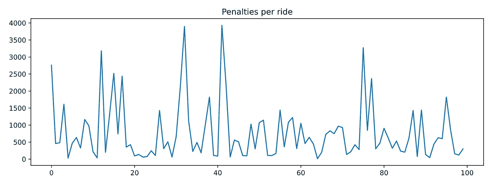

# 实践强化学习课程:第 2 部分

> 原文：<https://towardsdatascience.com/hands-on-reinforcement-learning-course-part-2-1b0828a1046b?source=collection_archive---------10----------------------->

## [实践教程](https://towardsdatascience.com/tagged/hands-on-tutorials)

## 表格 Q 学习

来自 [Pexels](https://www.pexels.com/photo/blue-and-black-boat-on-dock-5870314/?utm_content=attributionCopyText&utm_medium=referral&utm_source=pexels) 的海伦娜·扬科维奇

# 欢迎来到我的强化学习课程❤️

这是我强化学习实践课程的第二部分，带你从零到英雄🦸‍♂️.

如果您错过了 [**part 1**](/hands-on-reinforcement-learning-course-part-1-269b50e39d08) ，请阅读它，以便将强化学习术语和基础知识掌握到位。

今天我们要解决第一个学习问题…

我们将训练一名代理人驾驶出租车🚕🚕🚕！

嗯，一个简化版的出租车环境，但是一天结束的时候出租车。

我们将使用 Q-learning，这是最早和最常用的 RL 算法之一。

当然，还有 Python🐍。

本课所有代码在 [**本 Github repo**](https://github.com/Paulescu/hands-on-rl) **中。** Git 克隆它，跟随今天的问题。

# 第二部分

## 内容

1.  出租车驾驶问题🚕
2.  环境、行动、状态、奖励
3.  随机代理基线🤖🍷
4.  q-学习代理🤖🧠
5.  超参数调谐🎛️
6.  重述✨
7.  家庭作业📚
8.  下一步是什么？❤️

# 1.出租车驾驶问题🚕

我们将使用强化学习来教一个智能体驾驶出租车。

首先，在现实世界中驾驶出租车是一项非常复杂的任务。因此，我们将在一个简化的环境中工作，该环境包含一名优秀出租车司机所做的三件重要事情，即:

*   接载乘客并把他们送到他们想要的目的地。
*   安全驾驶，意味着没有碰撞。
*   在尽可能短的时间内驾驶它们。

我们将使用 OpenAI Gym 中的一个环境，称为`[**Taxi-v3**](https://gym.openai.com/envs/Taxi-v3/)`环境。

出租车环境(图片由作者提供)

在网格世界中有四个指定的位置，分别用 R(ed)、G(reen)、Y(ellow)和 B(lue)表示。

当这一集开始时，出租车在一个随机的广场出发，乘客在一个随机的位置(R，G，Y 或 B)。

出租车开到乘客所在地，接乘客，开到乘客的目的地(四个指定地点中的另一个)，然后让乘客下车。在这样做的时候，我们的出租车司机需要小心驾驶，以避免撞到任何墙壁，标记为 **|** 。一旦乘客下车，这一集就结束了。

这就是我们今天将构建的 q-learning 代理如何驱动:

优秀的出租车司机

在我们到达那里之前，让我们很好地理解什么是这个环境的行动、状态和回报。

# 2.环境、行动、状态、奖励

[👉🏽notebooks/00 _ environment . ipynb](https://github.com/Paulescu/hands-on-rl/blob/main/01_taxi/notebooks/00_environment.ipynb)

让我们首先加载环境:

在每个步骤中，代理可以选择哪些**操作**？

*   `0`往下开
*   `1`开车过来
*   `2`向右行驶
*   `3`向左行驶
*   `4`搭载乘客
*   `5`让乘客下车

**表示**？

*   25 个可能的滑行位置，因为世界是一个 5x5 的网格。
*   乘客的 5 个可能位置，即 R、G、Y、B，加上乘客在出租车中的情况。
*   4 个目的地位置

这给了我们 25×5×4 = 500 个状态

那么**奖励**呢？

*   **-1** 默认每步奖励。
    *为什么-1，而不是简单的 0？因为我们希望通过惩罚每一个额外的步骤来鼓励代理花费最短的时间。这就是你对出租车司机的期望，不是吗？*
*   **+20** 将乘客送到正确目的地的奖励。
*   **-10** 在错误地点执行取货或卸货的奖励。

可以从`env.P.`读取奖励和环境转换*(状态，动作)→ next_state*

顺便说一句，你可以在每个状态下渲染环境来仔细检查这个`env.P`向量是否有意义:

来自`state=123`

州= 123

代理向南移动`action=0`到达`state=223`

州=223

奖励是-1，因为这一集既没有结束，也没有司机错误地选择或放弃。

# 3.随机代理基线🤖🍷

[👉🏽notebooks/01 _ random _ agent _ baseline . ipynb](https://github.com/Paulescu/hands-on-rl/blob/main/01_taxi/notebooks/01_random_agent_baseline.ipynb)

在您开始实现任何复杂的算法之前，您应该总是建立一个基线模型。

这个建议不仅适用于强化学习问题，也适用于一般的机器学习问题。

直接跳到复杂/花哨的算法中是非常有诱惑力的，但是除非你真的很有经验，否则你会失败得很惨。

让我们使用一个随机代理🤖🍷作为基准模型。

我们可以看到这个代理对于给定的初始`state=198`的表现

3804 步很多！😵

请在此视频中亲自观看:

行动中的随机代理

为了获得更有代表性的性能度量，我们可以重复相同的评估循环`n=100`次，每次从随机状态开始。

如果你画出`timesteps_per_episode`和`penalties_per_episode`，你可以观察到它们都没有随着代理完成更多的剧集而减少。换句话说，代理没有学到任何东西。

如果您想要性能的汇总统计，您可以取平均值:

实现代理学习是强化学习的目标，也是本课程的目标。

让我们使用 Q-learning 实现我们的第一个“智能”代理，Q-learning 是现存的最早和最常用的 RL 算法之一。

# 4.q-学习代理🤖🧠

[👉🏽notebooks/02_q_agent.ipynb](https://github.com/Paulescu/hands-on-rl/blob/main/01_taxi/notebooks/02_q_agent.ipynb)

[Q-learning](https://www.gatsby.ucl.ac.uk/~dayan/papers/cjch.pdf) (by [**克里斯·沃金斯**](http://www.cs.rhul.ac.uk/~chrisw/) 🧠和 [**彼得·达扬**](https://en.wikipedia.org/wiki/Peter_Dayan) 🧠)是一种寻找最优 q 值函数的算法。

正如我们在[第 1 部分](/hands-on-reinforcement-learning-course-part-1-269b50e39d08)中所说的，与策略 **π** 相关联的 Q 值函数 **Q(s，a)** 是代理人在状态 **s** 采取行动 **a** 并随后遵循策略 **π** 时期望得到的总报酬。

最优 Q 值函数 **Q*(s，a)** 是与最优策略 **π*相关联的 Q 值函数。**

如果你知道 **Q*(s，a)** 你可以推断π*:也就是说，你选择一个最大化当前状态 s 的 Q*(s，a)的动作作为下一个动作。

Q-learning 是一种迭代算法，从任意初始猜测 **Q⁰(s，a)** 开始，计算最佳 q 值函数 **Q*(s，a)** 的越来越好的近似值

在类似于`Taxi-v3`的表格环境中，状态和动作的数量有限，q 函数本质上是一个矩阵。它的行数与状态数一样多，列数与动作数一样多，即 500 x 6。

好的，*但是你如何准确地从 Q⁰(s，a)计算下一个近似值 Q (s，a)？*

这是 Q-learning 的关键公式:

q-学习公式(图片由作者提供)

当我们的 q-agent 导航环境并观察下一个状态***s’***和奖励 ***r*** 时，你用这个公式更新你的 q-值矩阵。

*这个公式中的学习率* **𝛼** *是多少？*

**学习率**(通常在机器学习中)是一个小数字，它控制 q 函数的更新量。你需要调整它，因为太大的值会导致不稳定的训练，太小的值可能不足以避开局部最小值。

*还有这个折现因子* ***𝛾*** *？*

**折扣因子**是一个介于 0 和 1 之间的(超)参数，它决定了相对于近期的回报，我们的代理人对远期回报的关心程度。

*   当𝛾=0 时，代理人只关心眼前报酬的最大化。正如生活中发生的那样，最大化眼前回报并不是获得最佳长期结果的最佳方法。这也发生在 RL 特工身上。
*   当𝛾=1 时，代理人根据其所有未来报酬的总和来评估其每一个行为。在这种情况下，代理人同等重视眼前的回报和未来的回报。

折扣因子通常是中间值，例如 0.6。

总而言之，如果你

*   训练足够长的时间
*   有着不错的学习率和折扣系数
*   代理在状态空间中探索了足够多的时间
*   你用 Q 学习公式更新 Q 值矩阵

你的初始近似最终会收敛到最优 q 矩阵。瞧啊。

那么让我们为 Q-agent 实现一个 Python 类。

Q-agent 的 API

它的 API 与上面的`RandomAgent`相同，但是多了一个方法`update_parameters()`。该方法采用转移向量`(state, action, reward, next_state)`，并使用上面的 Q 学习公式更新 Q 值矩阵近似值`self.q_table`。

现在，我们需要将这个代理插入到一个训练循环中，并在代理每次收集新的经验时调用它的`update_parameters()`方法。

此外，记住我们需要保证代理充分探索状态空间。还记得我们在[第一部分](/hands-on-reinforcement-learning-course-part-1-269b50e39d08)中谈到的勘探-开采参数吗？这就是`epsilon`参数进入游戏的时候。

让我们为`n_episodes = 10,000`培训代理，并使用`epsilon = 10%`

还有剧情`timesteps_per_episode`和`penalties_per_episode`

不错！这些图表看起来比`RandomAgent`好得多。这两个指标都随着训练而下降，这意味着我们的代理正在学习🎉🎉🎉。

我们实际上可以看到代理是如何从与我们用于`RandomAgent`相同的`state = 123`开始驱动的。

好棒的车！

如果你想比较硬数字，你可以评估 q-agent 的性能，比如说，100 个随机事件，并计算时间戳和招致的惩罚的平均数。

## 一点点关于ε贪婪政策

评估代理时，使用正的`epsilon`值而不是`epsilon = 0.`值仍然是一个好的做法

为什么会这样？我们的特工不是训练有素吗？为什么我们在选择下一个行动时需要保留这种随机性的来源？

原因是防止过度拟合。即使对于这样一个小州，在`Taxi-v3`(即 500 x 6)中的行动空间，很可能在培训期间我们的代理没有访问足够的特定州。

因此，它在这些状态下的性能可能不是 100%最佳的，导致代理“陷入”次优操作的几乎无限循环中。

如果 epsilon 是一个小正数(例如 5%)，我们可以帮助代理摆脱这些次优行为的无限循环。

通过在评估时使用小ε，我们采用了所谓的**ε贪婪策略**。

让我们使用`epsilon = 0.05.`来评估我们在`n_episodes = 100`上训练过的代理，观察这个循环看起来几乎与上面的训练循环完全一样，但是没有调用`update_parameters()`

这些数字看起来比`RandomAgent.`好得多

我们可以说我们的代理已经学会开出租车了！

q 学习为我们提供了一种计算最优 q 值的方法。但是，*超参数* `alpha`、`gamma`和`epsilon`呢？

我为你选择了它们，相当随意。但是在实践中，您将需要针对您的 RL 问题来调整它们。

让我们探索它们对学习的影响，以获得对正在发生的事情的更好的直觉。

# 5.超参数调谐🎛️

[👉🏽notebooks/03 _ q _ agent _ hyperparameters _ analysis . ipynb](https://github.com/Paulescu/hands-on-rl/blob/main/01_taxi/notebooks/03_q_agent_hyperparameters_analysis.ipynb)

让我们使用不同的值`alpha`(学习率)和`gamma`(折扣因子)来训练我们的 q-agent。至于 T2，我们保持在 10%。

为了保持代码整洁，我将 q-agent 定义封装在`[src/q_agent.py](https://github.com/Paulescu/hands-on-rl/blob/50c61a385bbd511a6250407ffb1fcb59fbfb983f/01_taxi/src/q_agent.py#L4)`中，并将训练循环封装在`[src/loops.py](https://github.com/Paulescu/hands-on-rl/blob/50c61a385bbd511a6250407ffb1fcb59fbfb983f/01_taxi/src/loops.py#L9)`的`train()`函数中

让我们为每个超参数组合绘制每集的`timesteps`。

这张图看起来很艺术，但有点太吵杂了😵。

不过你可以观察到，当`alpha = 0.01`时，学习速度变慢。`alpha`(学习率)控制我们在每次迭代中更新多少 q 值。值太小意味着学习速度较慢。

让我们放弃`alpha = 0.01`，对每个超参数组合进行 10 次训练。我们使用这 10 次运行，对从 1 到 1000 的每个剧集编号的`timesteps`进行平均。

我在`src/loops.py`中创建了函数`[train_many_runs()](https://github.com/Paulescu/hands-on-rl/blob/50c61a385bbd511a6250407ffb1fcb59fbfb983f/01_taxi/src/loops.py#L121)`来保持笔记本代码的整洁:

看起来`alpha = 1.0`是效果最好的值，而`gamma`似乎影响较小。

恭喜你！🥳，你已经在本课程中调整了你的第一个学习率

调整超参数既费时又乏味。有一些优秀的库可以自动完成我们刚刚完成的手动过程，比如[**【Optuna】**](https://optuna.org/)，但是这是我们将在课程的后面部分使用的。暂时享受一下我们刚刚发现的训练提速。

等等，我告诉你要相信我的这个`epsilon = 10%`怎么了？

现在的 10%值是最好的吗？

我们自己检查一下。

我们选择找到的最好的`alpha`和`gamma`，即

*   `alpha = 1.0`
*   `gamma = 0.9`(我们也可以选择`0.1`或`0.6`)

和训练用不同的`epsilons = [0.01, 0.1, 0.9]`

并绘制产生的`timesteps`和`penalties`曲线:

如你所见，`epsilon = 0.01`和`epsilon = 0.1`似乎都工作得很好，因为它们在勘探和开发之间取得了恰当的平衡。

另一方面，`epsilon = 0.9`是一个太大的值，导致训练过程中“太多”的随机性，并阻止我们的 q 矩阵收敛到最优值。观察性能如何稳定在每集大约`250 timesteps`的水平。

一般来说，选择`epsilon`超参数的最佳策略是**渐进ε衰变**。也就是说，在训练开始时，当代理对其 q 值估计非常不确定时，最好访问尽可能多的州，为此，大的`epsilon`是很好的(例如 50%)

随着训练的进行，代理改进了它的 q 值估计，探索那么多不再是最佳的。相反，通过减少`epsilon`，代理可以学习完善和微调 q 值，使它们更快地收敛到最优值。太大的`epsilon`会导致我们看到的`epsilon = 0.9`的收敛问题。

我们会在课程中不断调整，所以我暂时不会坚持太多。再次，享受我们今天所做的。这是非常了不起的。

B-R-A-V-O！(图片由作者提供)

# 6.重述✨

恭喜你(可能)解决了你的第一个强化学习问题。

这些是我希望你能记住的关键知识:

*   强化学习问题的难度与可能的动作和状态的数量直接相关。`Taxi-v3`是一个表格环境(即有限数量的状态和动作)，所以它是一个简单的环境。
*   Q-learning 是一种学习算法，非常适合表格环境。
*   无论您使用什么 RL 算法，都有一些超参数需要调整，以确保您的代理了解最佳策略。
*   调整超参数是一个耗时的过程，但必须确保我们的代理了解。随着课程的进展，我们会在这方面做得更好。

# 7.家庭作业📚

[👉🏽notebooks/04_homework.ipynb](https://github.com/Paulescu/hands-on-rl/blob/main/01_taxi/notebooks/04_homework.ipynb)

这是我要你做的:

1.  [**Git 克隆**](https://github.com/Paulescu/hands-on-rl) 把 repo 到你的本地机器上。
2.  [**设置**](https://github.com/Paulescu/hands-on-rl/tree/main/01_taxi#quick-setup) 本课的环境`01_taxi.`
3.  打开`[01_taxi/otebooks/04_homework.ipynb](https://github.com/Paulescu/hands-on-rl/blob/main/01_taxi/notebooks/04_homework.ipynb)`并尝试完成 2 个挑战。

我称之为挑战(不是练习)，因为它们并不容易。我希望你尝试它们，弄脏你的手，并且(可能)成功。

在第一个挑战中，我谅你也不敢更新`train()`函数`src/loops.py`来接受一个依赖于剧集的 epsilon。

在第二个挑战中，我希望您升级 Python 技能并实现并行处理，以加快超参数实验。

像往常一样，如果你遇到困难，需要反馈，请给我写信`plabartabajo@gmail.com.`

我将非常乐意帮助你。

# 8.下一步是什么？❤️

在下一部分，我们将解决一个新的 RL 问题。

更难的一个。

使用新的 RL 算法。

有很多蟒蛇。

还会有新的挑战。

而且好玩！

回头见！

# 想支持我吗？

你喜欢阅读和学习关于 ML、AI 和数据科学的知识吗？

无限制地访问我在 Medium 上发布的所有内容，并支持我的写作。

👉🏽今天使用我的 [**推荐链接**](https://pau-labarta-bajo.medium.com/membership) 成为会员。

<https://pau-labarta-bajo.medium.com/membership>  

👉🏽订阅 [***datamachines* 简讯**](https://datamachines.xyz/subscribe/) **。**

👉🏽 [**跟着我**](https://medium.com/@pau-labarta-bajo) 上媒。

👉🏽给我很多掌声👏🏿👏🏽👏在下面

祝你愉快🤗

避寒胜地