# 实践强化学习课程:第 3 部分

> 原文：<https://towardsdatascience.com/hands-on-reinforcement-learning-course-part-3-5db40e7938d4?source=collection_archive---------9----------------------->

## 表格 SARSA

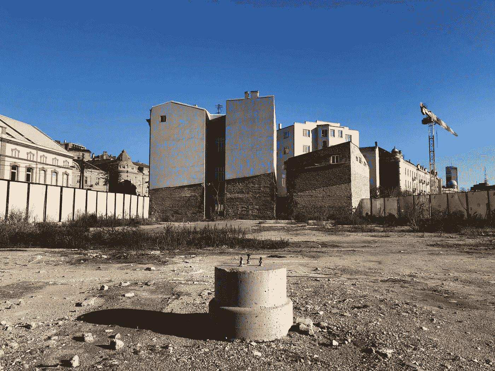

贝尔格莱德萨瓦马拉(图片由作者提供)

# 欢迎来到我的强化学习课程❤️

这是我强化学习实践课程的第三部分，带你从零到英雄🦸‍♂️.

我们仍处于旅程的起点，解决相对容易的问题。

在[第 2 部分](/hands-on-reinforcement-learning-course-part-2-1b0828a1046b)中，我们实现了离散 Q 学习来训练`Taxi-v3`环境中的代理。

今天，我们将进一步解决`MountainCar`环境问题🚃使用 SARSA 算法。

让我们帮助这辆可怜的车赢得对抗地心引力的战斗！

本课所有代码都在 [**本 Github repo**](https://github.com/Paulescu/hands-on-rl) **中。** Git 克隆它，跟随今天的问题。

[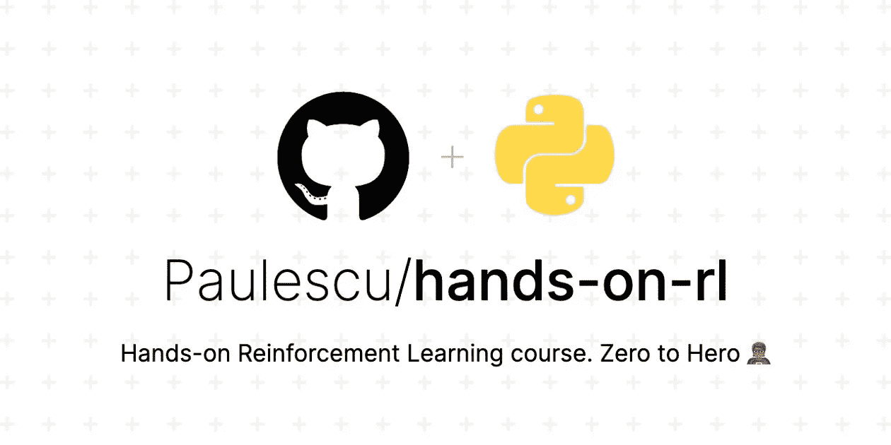](https://github.com/Paulescu/hands-on-rl)

# 第三部分

# 内容

1.  山地汽车问题🚃
2.  环境、行动、状态、奖励
3.  随机代理基线🚃🍷
4.  萨尔萨特工🚃🧠
5.  停下来喘口气，⏸🧘
6.  重述✨
7.  家庭作业📚
8.  下一步是什么？❤️

# 1.山地汽车问题🚃

山地汽车问题是一个重力存在的环境(多么令人惊讶)，目标是帮助一辆可怜的汽车赢得与它的战斗。

汽车需要逃离它被困的山谷。这辆车的引擎不够强大，无法单程爬上山，所以唯一的办法就是来回行驶，建立足够的动力。

让我们来看看它的实际应用:

你刚刚看到的视频对应于我们今天要建造的`SarsaAgent`。

很有趣，不是吗？

你可能想知道。*这个看起来很酷，但是当初为什么会选择这个问题呢？*

## 为什么会有这个问题？

本课程的理念是逐步增加复杂性。循序渐进。

与第 2 部分中的`Taxi-v3`环境相比，今天的环境在复杂性方面有了微小但相关的增加。

但是，*这里到底什么更难？*

正如我们在 [**第二部分**](/hands-on-reinforcement-learning-course-part-2-1b0828a1046b) 中看到的，一个强化学习问题的难度与问题的大小直接相关

*   行动空间:*代理在每一步可以选择多少个行动？*
*   状态空间:*代理可以在多少种不同的环境配置中找到自己？*

对于动作和状态数量有限的小环境，我们有强有力的保证像 Q-learning 这样的算法能够很好地工作。这些被称为**表格或离散环境**。

q 函数本质上是一个矩阵，其行数与状态数相同，列数与动作数相同。在这些*小*的世界里，我们的代理人可以轻松地探索各州并制定有效的政策。随着状态空间和(尤其是)动作空间变得更大，RL 问题变得更难解决。

今天的环境是**不是**表格化的。但是，我们将使用一个离散化“技巧”将其转换为表格形式，然后求解。

我们先熟悉一下环境吧！

# 2.环境、行动、状态、奖励

[👉🏽notebooks/00 _ environment . ipynb](https://github.com/Paulescu/hands-on-rl/blob/main/02_mountain_car/notebooks/00_environment.ipynb)

让我们加载环境:

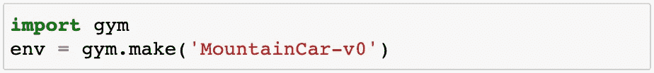

并绘制一帧:

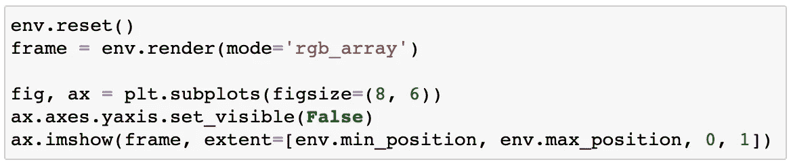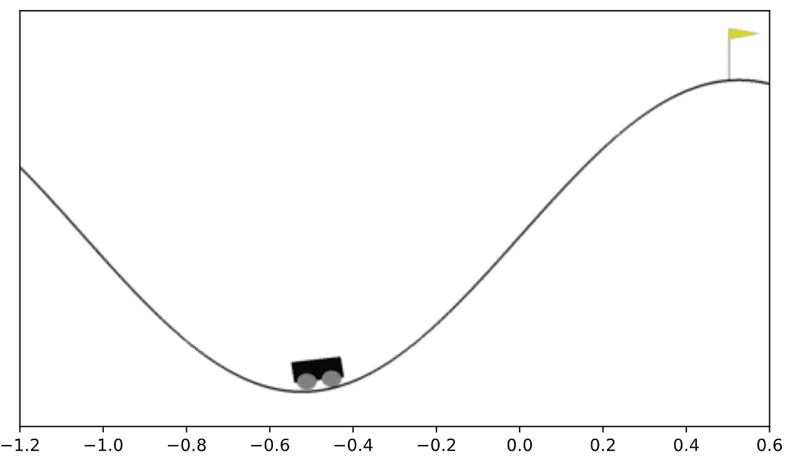

两个数字决定了汽车的**状态**:

*   其位置范围从 **-1.2** 到 **0.6**
*   其速度范围从 **-0.07** 到 **0.07** 。

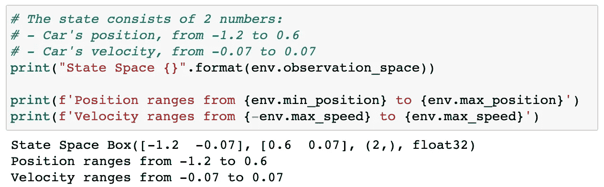

状态由两个连续的数字给出。这是`Taxi-v3`环境与[第二部分](/hands-on-reinforcement-learning-course-part-2-1b0828a1046b)的显著区别。我们将在后面看到如何处理这个问题。

有哪些**动作**？

有 3 种可能的操作:

*   `0`向左加速
*   `1`无所事事
*   `2`向右加速

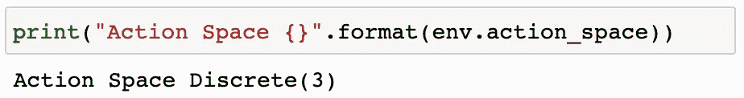

而**奖励**？

*   如果汽车位置小于 0.5，则奖励-1。
*   一旦汽车的位置高于 0.5，或者达到最大步数，本集就结束:`n_steps >= env._max_episode_steps`

默认的负奖励-1 鼓励汽车尽快逃离山谷。

总的来说，我建议你直接在 Github 中检查[开放 AI 健身房环境的](https://github.com/openai/gym/tree/master/gym/envs)实现，以了解状态、动作和奖励。

该代码有很好的文档记录，可以帮助您快速了解开始 RL 代理工作所需的一切。`MountainCar`的实现是[这里以](https://github.com/openai/gym/blob/master/gym/envs/classic_control/mountain_car.py)为例。

很好。我们熟悉了环境。

让我们为这个问题建立一个基线代理！

# 3.随机代理基线🚃🍷

[👉🏽notebooks/01 _ random _ agent _ baseline . ipynb](https://github.com/Paulescu/hands-on-rl/blob/main/02_mountain_car/notebooks/01_random_agent_baseline.ipynb)

强化学习问题很容易变得复杂。结构良好的代码是控制复杂性的最佳盟友。

今天我们将提升我们的 Python 技能，并为我们所有的代理使用一个`BaseAgent`类。从这个`BaseAgent`类，我们将派生出我们的`RandomAgent`和`SarsaAgent`类。

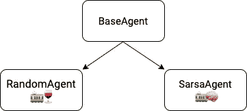

父类和子类(图片由作者提供)

`BaseAgent`是我们在`[src/base_agent.py](https://github.com/Paulescu/hands-on-rl/blob/main/02_mountain_car/src/base_agent.py)`中定义的一个**抽象类**

它有 4 种方法。

它的两个方法是抽象的，这意味着当我们从`BaseAgent:`派生出`RandomAgent`和`SarsaAgent`时，我们必须实现它们

*   `get_action(self, state)` →根据状态返回要执行的动作。
*   `update_parameters(self, state, action, reward, next_state)` →根据经验调整代理参数。这里我们将实现 SARSA 公式。

其他两种方法允许我们将经过训练的代理保存到磁盘或从磁盘加载。

*   `save_to_disk(self, path)`
*   `load_from_disk(cls, path)`

随着我们开始实现更复杂的模型和训练时间的增加，在训练期间保存检查点将是一个很好的主意。

下面是我们的`BaseAgent`类的完整代码:

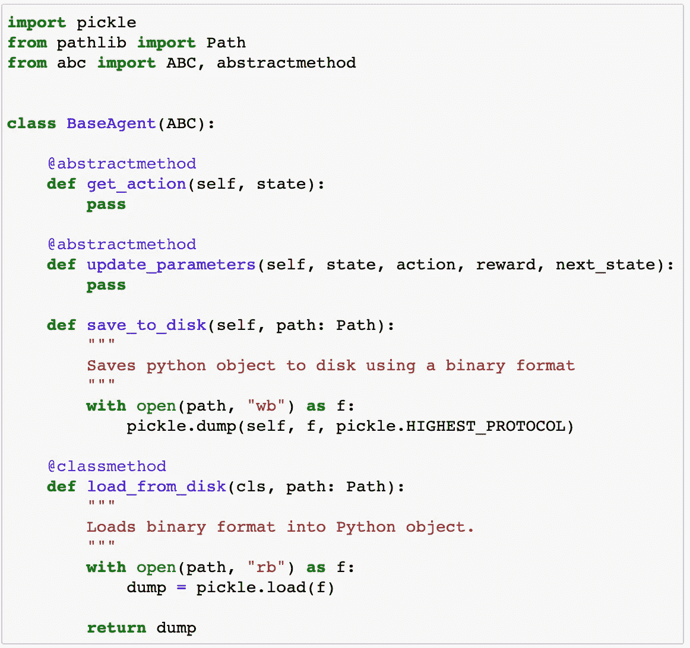

从这个`BaseAgent`类，我们可以将`RandomAgent`定义如下:

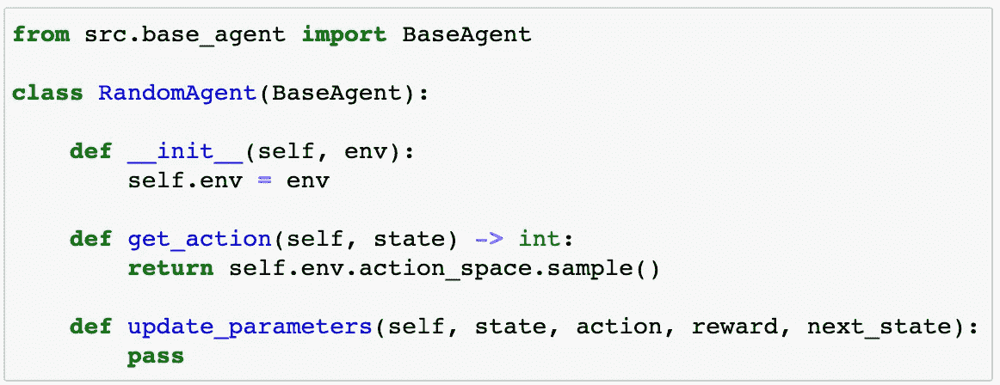

让我们评估一下这个`RandomAgent`而不是`n_episodes = 100`，看看它的表现如何:

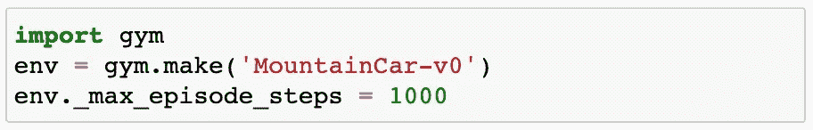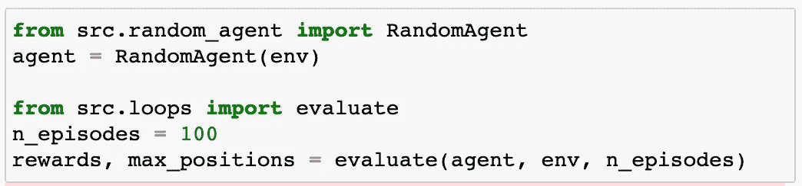

而我们`RandomAgent`的成功率是…

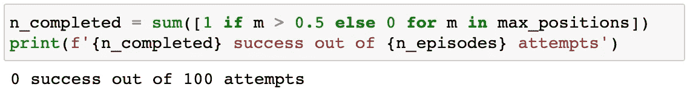

0% 🤭…

我们可以用下面的直方图来看代理在每集中走了多远:

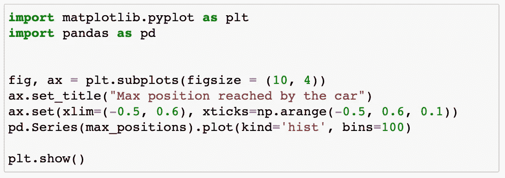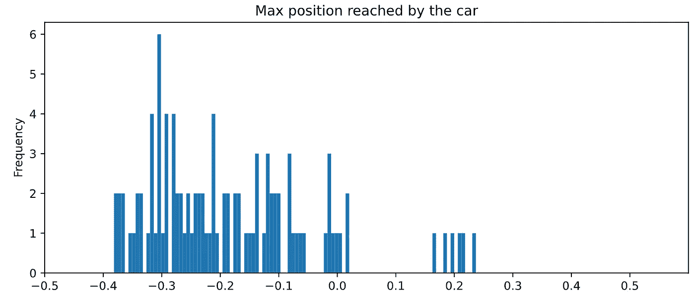

在这些`100`运行中，我们的`RandomAgent`没有越过 **0.5** 标记。一次都没有。

当你在本地机器上运行这段代码时，你会得到稍微不同的结果，但是在任何情况下，0.5 以上的完成剧集的百分比都不会是 100%。

你可以使用`[src/viz.py](https://github.com/Paulescu/hands-on-rl/blob/37fbac23d580a44d46d4187525191b324afa5722/02_mountain_car/src/viz.py#L52-L61)`中的`show_video`功能观看我们悲惨的`RandomAgent`行动

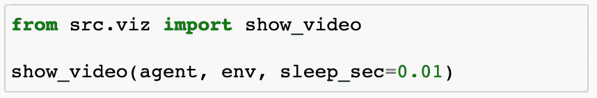

一个随机的代理不足以解决这种环境。

让我们试试更聪明的方法😎…

# 4.萨尔萨特工🚃🧠

[👉🏽notebooks/02 _ sarsa _ agent . ipynb](https://github.com/Paulescu/hands-on-rl/blob/main/02_mountain_car/notebooks/02_sarsa_agent.ipynb)

[SARSA](http://citeseerx.ist.psu.edu/viewdoc/download?doi=10.1.1.17.2539&rep=rep1&type=pdf) (由 Rummery 和 Niranjan 提出)是一种通过学习最优 q 值函数来训练强化学习代理的算法。

它于 1994 年出版，是 Q-learning(由克里斯·沃金斯和彼得·达扬出版)的两年后。

SARSA 代表 **S** 状态 **A** 动作**R**e 前进 **S** 状态 **A** 动作。

SARSA 和 Q-learning 都利用贝尔曼方程来迭代地寻找最佳 Q 值函数的更好的近似 **Q*(s，a)**

但是他们的做法略有不同。

如果您还记得第 2 部分，Q-learning 的更新公式是

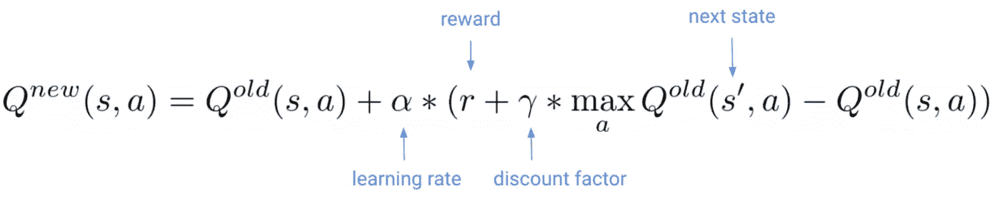

这个公式是一种计算 q 值的新估计值的方法

这个数量是一个*目标*🎯我们想把原来的估计修正为。这是我们应该瞄准的最佳 q 值的*估计*，它随着我们训练代理和我们的 q 值矩阵的更新而改变。

> 强化学习问题通常看起来像有监督的 ML 问题，但是带有移动的目标🏃 🎯

SARSA 有一个类似的更新公式，但有一个不同的*目标*

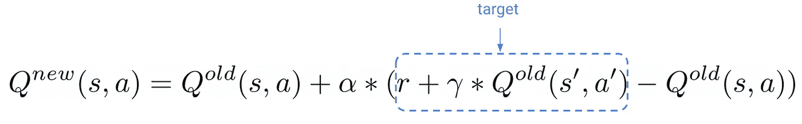

SARSA 的目标

也取决于代理将在下一个状态**s’采取的动作**a’**。**这是非典**A’**s 中最后一个 **A** 的名字。

如果你探索足够的状态空间并用 SARSA 更新你的 q 矩阵，你将得到一个最优策略。太好了！

你可能会想…

Q-learning 和 SARSA 在我看来几乎一模一样。有什么区别？🤔

有一个关键区别:

*   SARSA 的更新取决于下一个动作**a’，**并因此取决于当前策略。随着您的训练和 q 值(以及相关策略)的更新，新策略可能会针对相同的状态**s’**产生不同的下一个动作**a’**。你不能用过去的经验 **(s，a，r，s’，a’)**来提高你的估计。取而代之的是，你用一次经历来更新 q 值，然后把它扔掉。因此，SARSA 被称为**基于策略的**方法。
*   在 Q-learning 中，更新公式不依赖于下一个动作**a’，**，而只依赖于 **(s，a，r，s’)。**您可以重用使用旧版本策略收集的过去经验 **(s，a，r，s’)，**，以提高当前策略的 q 值。Q-learning 是一种**非政策**方法。

策略外的方法比策略内的方法需要更少的经验来学习，因为您可以多次重用过去的经验来改进您的估计。他们更**样高效**。

然而，当状态、动作空间增长时，非策略方法具有收敛到最优 Q 值函数 Q*(s，a)的问题。他们可能很狡猾，而且不稳定。

当我们进入深度 RL 领域时，我们将在课程的后面遇到这些权衡🤓。

回到我们的问题…

在`MountainCar`环境中，状态不是离散的，而是一对连续的值(位置`s1`，速度`s2`)。

*连续*在这个上下文中实质上是指*无限可能的值*。如果有无限个可能的状态，不可能把它们都访问一遍来保证 SARSA 收敛。

为了解决这个问题，我们可以使用一个技巧。

让我们把状态向量离散成一组有限的值。本质上，我们并没有改变环境，而是改变了代理用来选择其动作的状态的表示。

我们的`SarsaAgent`通过将位置`[-1.2 … 0.6]`四舍五入到最近的`0.1`标记，将速度`[-0.07 ...0.07]`四舍五入到最近的`0.01`标记，将状态`(s1, s2)`从连续离散化。

该函数正是这样做的，将连续状态转化为离散状态:

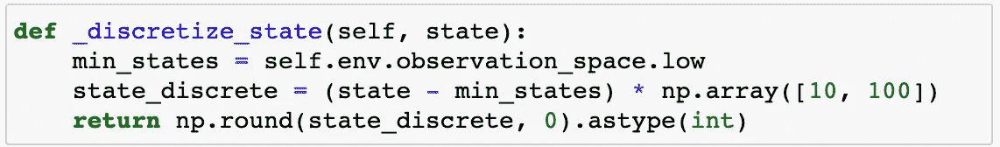

一旦代理使用离散化状态，我们可以使用上面的 SARSA 更新公式，随着我们不断迭代，我们将更接近最佳 q 值。

这是`SarsaAgent`的全部实现

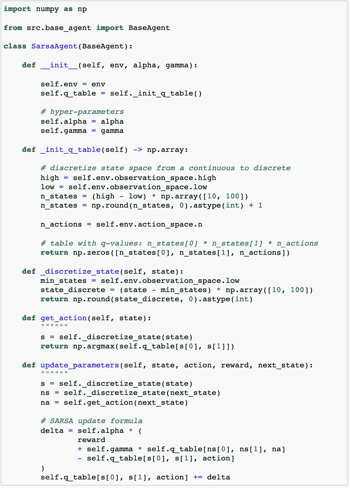

注意👆q 值函数是一个 3 维矩阵:2 维表示状态(位置、速度)，1 维表示动作。

让我们选择合理的超参数，并为`n_episodes = 10,000`训练这个`SarsaAgent`

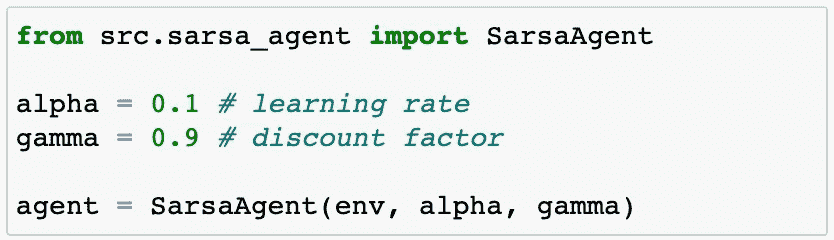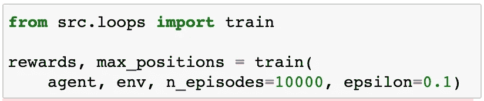

让我们用它们的 50 集移动平均线(橙色线)来绘制`rewards`和`max_positions`(蓝色线)

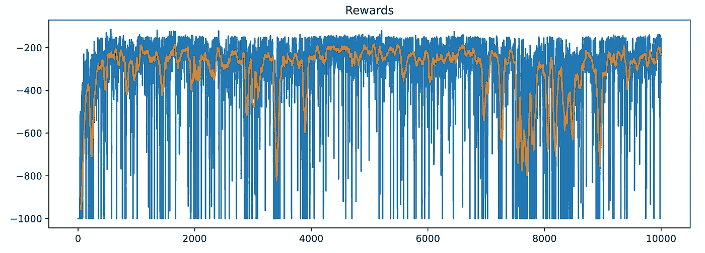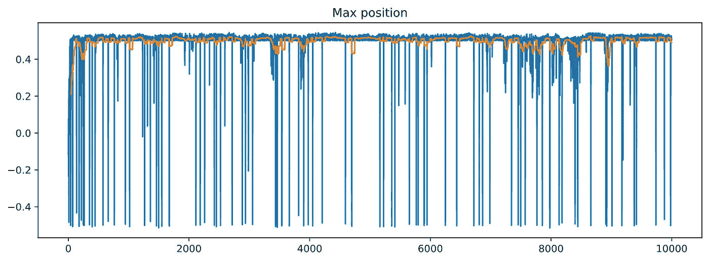

超级！看起来我们的`SarsaAgent`正在学习。

在这里你可以看到它的作用:

如果你观察上面的`max_position`图表，你会意识到汽车偶尔无法爬山。

这种情况多长时间发生一次？让我们评价一下`1,000`随机集上的代理:

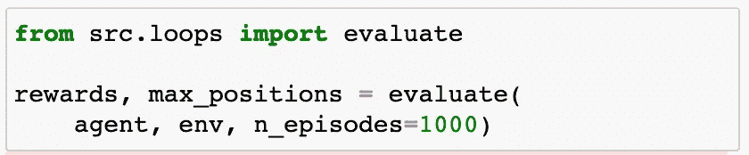

并计算成功率:

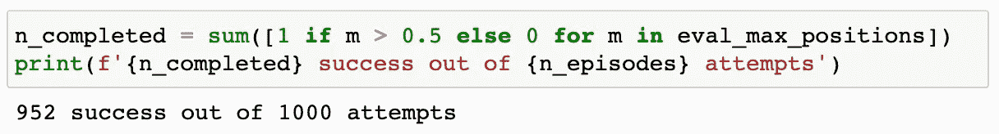

**95.2%** 还算不错。尽管如此，并不完美。请记住这一点，我们将在本课程的稍后部分回来。

**注意:**当您在您的终端上运行这段代码时，您会得到稍微不同的结果，但是我敢打赌您不会得到 100%的性能。

干得好！我们实现了一个`SarsaAgent`来学习🤟

这是一个暂停的好时机…

# 5.停下来喘口气，⏸🧘

[👉🏽notebooks/03 _ momentum _ agent _ baseline . ipynb](https://github.com/Paulescu/hands-on-rl/blob/main/02_mountain_car/notebooks/03_momentum_agent_baseline.ipynb)

如果我告诉您,`MountainCar`环境有一个更简单的解决方案会怎么样…

100%的时间都有效？😅

要遵循的最佳政策很简单。

*跟着势头走*:

*   当汽车向右移动时向右加速`velocity > 0`
*   当汽车向左移动时，向左加速`velocity <= 0`

这个策略看起来像这样:

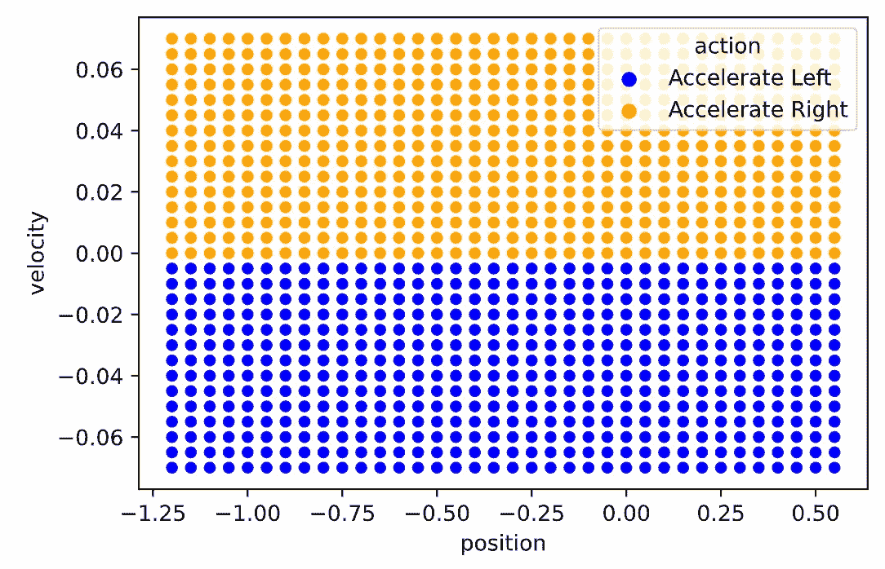

这是你如何用 Python 写这个`MomentumAgent`:

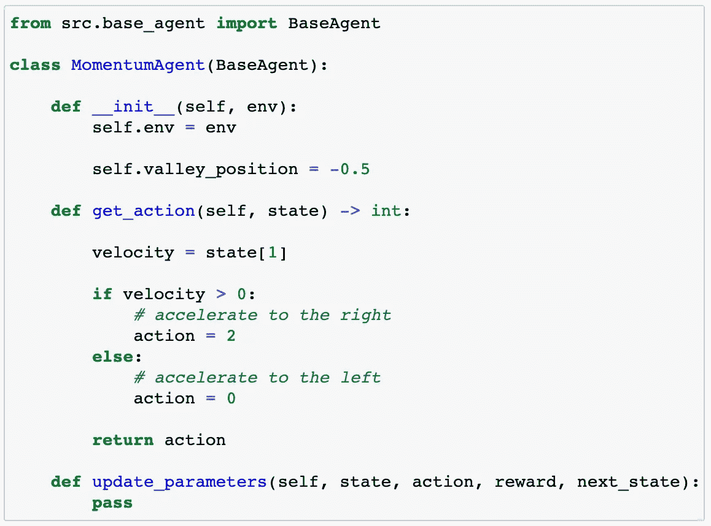

你可以仔细检查它是否完成了每一集。百分之百的成功率。

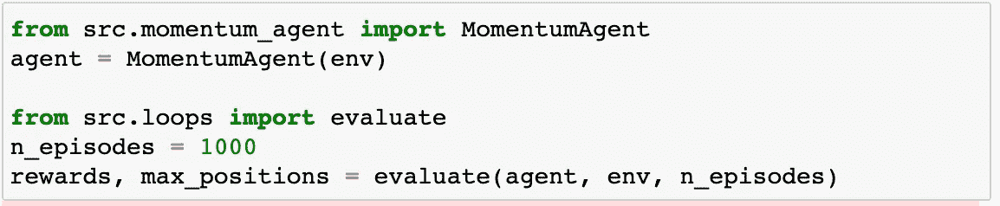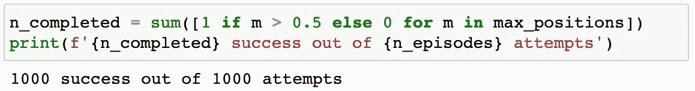

另一方面，如果你画出受过训练的`SarsaAgent`的政策，你会看到这样的东西:

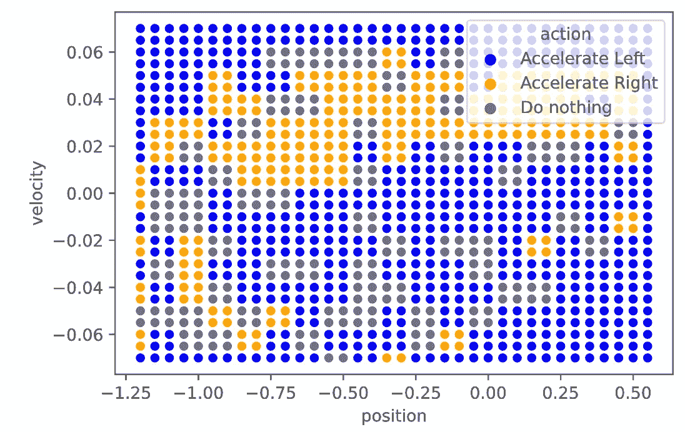

这与完美的`MomentumAgent`策略有 50%的重叠

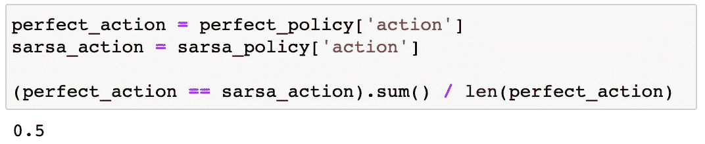

这意味着我们的`SarsaAgent`只有 50%的时间是正确的*。*

这很有意思……

**为什么** `**SarsaAgent**` **经常出错却仍能取得好成绩？**

这是因为`MountainCar`仍然是一个小环境，所以 50%的时候做出错误的决定并不那么关键。对于更大的问题，经常犯错不足以构建智能代理。

> *你会买一辆 95%都正确的自动驾驶汽车吗？😱*

另外，你还记得我们用来应用 SARSA 的*离散化技巧*吗？这是一个对我们帮助很大的技巧，但也给我们的解决方案带来了错误/偏见。

**我们为什么不提高对状态和速度离散化的分辨率，以获得更好的解呢？**

这样做的问题是状态数量的指数增长，也称为**维数灾难**。随着每个状态分量分辨率的增加，状态总数呈指数增长。状态空间增长太快，SARSA 代理无法在合理的时间内收敛到最优策略。

**好吧，但是有没有其他的 RL 算法可以完美解决这个问题？**

是的，有。我们将在接下来的课程中讨论它们。总的来说，对于 RL 算法，没有一种方法是万能的，因此您需要针对您的问题尝试几种算法，看看哪种效果最好。

在`MountainCar`环境中，完美的策略看起来如此简单，以至于我们可以尝试直接学习它，而不需要计算复杂的 q 值矩阵。一种**策略优化**方法可能效果最好。

但是我们今天不打算这样做。如果您想使用 RL 完美地解决这种环境，请按照课程进行操作。

享受你今天的成就。

谁在找乐子？(图片由作者提供)

# 6.重述✨

哇！我们今天讨论了很多事情。

这是 5 个要点:

*   SARSA 是一种基于策略的算法，可以在表格环境中使用。
*   使用状态的离散化，可以将小型连续环境视为表格，然后使用表格 SARSA 或表格 Q-learning 进行求解。
*   由于维数灾难，更大的环境不能被离散化和求解。
*   对于比`MountainCar`更复杂的环境，我们将需要更先进的 RL 解决方案。
*   **有时候 RL 并不是最佳方案**。当你试图解决你关心的问题时，请记住这一点。不要和你的工具结婚(在这种情况下是 RL)，而是专注于找到一个好的解决方案。不要只见树木不见森林🌲🌲🌲。

# 7.家庭作业📚

[👉🏽notebooks/04 _ homework . ipynb](https://github.com/Paulescu/hands-on-rl/blob/main/02_mountain_car/notebooks/04_homework.ipynb)

这是我要你做的:

1.  [**Git 克隆**](https://github.com/Paulescu/hands-on-rl)repo 到你的本地机器。
2.  [**设置**](https://github.com/Paulescu/hands-on-rl/tree/main/02_mountain_car#quick-setup) 本课的环境`02_mountain_car`
3.  打开`[02_mountain_car/notebooks/04_homework.ipynb](http://02_mountain_car/notebooks/04_homework.ipynb)`并尝试完成 2 个挑战。

在第一个挑战中，我要求你调整 SARSA 超参数`alpha`(学习率)和`gamma`(折扣系数)以加速训练。可以从[第二部](/hands-on-reinforcement-learning-course-part-2-1b0828a1046b)中得到启发。

在第二个挑战中，尝试提高离散化的分辨率，并使用表格 SARSA 学习 q 值函数。就像我们今天做的一样。

让我知道，如果你建立一个代理，实现 99%的性能。

# 8.下一步是什么？❤️

在下一课中，我们将进入强化学习和监督机器学习交叉的领域🤯。

我保证会很酷的。

在那之前，

在这个叫做地球的神奇星球上多享受一天吧🌎

爱❤️

不断学习📖

如果你喜欢这门课程，请分享给你的朋友和同事。

你可以通过`plabartabajo@gmail.com`找到我。我很乐意联系。

回头见！

*你想成为(甚至)更好的数据科学家，接触关于机器学习和数据科学的顶级课程吗？*

👉🏽订阅 [***datamachines* 简讯**](https://datamachines.xyz/subscribe/) **。**

👉🏽 [**跟着我**](https://medium.com/@paulba-93177) 上媒。

祝你愉快，🧡❤️💙

避寒胜地