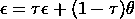
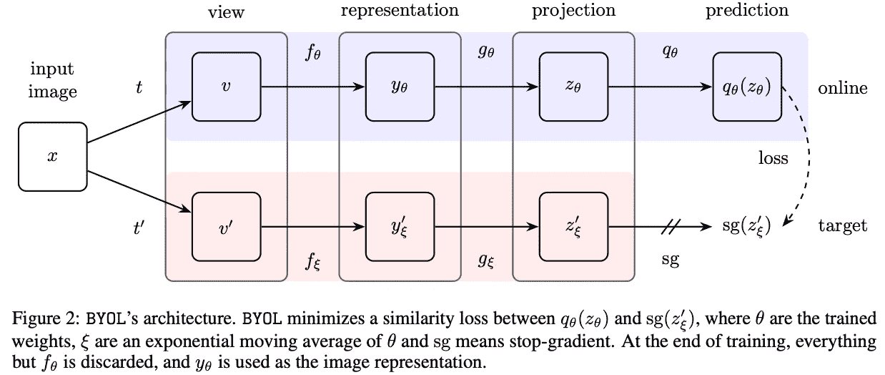
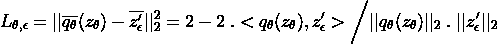
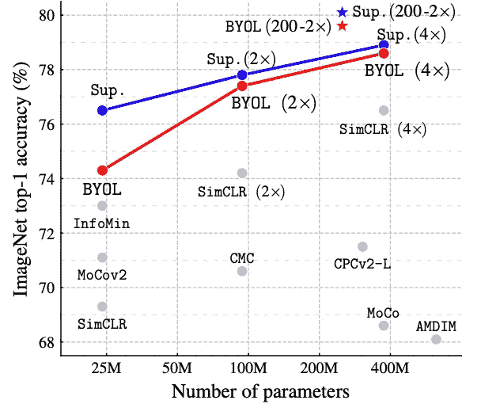
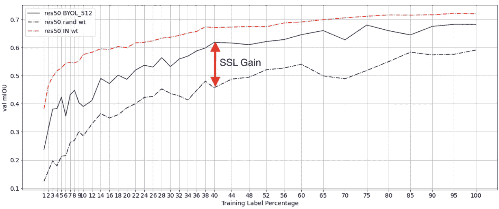

# 第一手评论:BYOL

> 原文：<https://towardsdatascience.com/hands-on-review-byol-bootstrap-your-own-latent-67e4c5744e1b?source=collection_archive---------16----------------------->

最近，自我监督学习方法已经成为无监督视觉表征学习的基石。最近推出的一个这样的方法**B**ootstrap**Y**our**O**wn**L**atent(BYOL)在这篇文章中被评论。我已经介绍了其他有趣的基于对比学习的自我监督学习方法，这些方法出现在 BYOL 之前，如 SimCLR，MoCo 等。在另一个职位彻底，并应考虑理解这个职位的基本原则。请在这里找到它们[。](/self-supervised-learning-methods-for-computer-vision-c25ec10a91bd)

与其他对比学习方法不同，BYOL 在不使用任何负面样本的情况下实现了最先进的性能。基本上，像一个连体网络，BYOL 使用两个相同的编码器网络，称为在线和目标网络，用于获得表示，并减少两个表示之间的对比损失。

**网络架构**

BYOL 网络的架构如下所示。θ和ϵ分别代表在线和目标网络参数，f_θ和 f_ϵ分别是在线和目标编码器。目标网络权重是在线网络权重的缓慢移动平均值，即



想法是在第一步中训练在线网络 f_θ，并在第二步中使用这些学习到的表示用于下游任务，并使用标记的数据进一步微调它们。第一步，即 BYOL，可以总结为以下 5 个简单的步骤。

1.  给定输入图像 x，通过对 x 应用两个随机增强，生成同一图像 v 和 v’的两个视图
2.  给定在线编码器和目标编码器的 v 和 v ’,得到矢量表示 y_θ和 y'_ϵ。
3.  现在，这些表示被投影到另一个子空间 z。这些投影的表示在下图中由 z_θ和 z'_ϵ表示。
4.  因为目标网络是在线网络的慢速移动平均，所以在线表示应该是目标表示的预测，即 z_θ应该预测 z'_ϵ，因此另一个预测器(q_θ)被放在 z_θ之上。
5.  <q_ z="">之间的对比损失减少。</q_>



图片来源: [Grill，Jean-Bastien 等人，“引导你自己的潜能:自我监督学习的新方法”arXiv 预印本 arXiv:2006.07733 (2020)。](https://arxiv.org/abs/2006.07733)

数学上，对比损耗计算为 q_θ(z_θ)和 z'_ϵ.之间的均方误差在计算均方误差之前，标签 z'_ϵ和目标 q_θ(z_θ)是 L2 归一化的。等式是，



对比损失

z`_ϵ棒是 L2 归一化的 z`_ϵ，而 q_θ(z_θ)棒是 L2 归一化的 q_θ(z_θ)。

**为什么是 BYOL？**

第一个问题是，为什么以及在哪里应该使用 BYOL？

BYOL 方法有助于学习各种下游计算机视觉任务的有用表示，如对象识别、对象检测、语义分割等。一旦以 BYOL 方式学习了这些表示，它们可以与任何标准的对象分类模型一起使用，例如 Resnet、VGGnet，或者任何语义分割网络，例如 FCN8s、deeplabv3 等，或者任何其他特定于任务的网络，并且它可以获得比从头开始训练这些网络更好的结果。这是 BYOL 受欢迎的主要原因。下图显示了使用 Imagenet 图像学习的 BYOL 表示击败了所有以前的无监督学习方法，并在线性评估协议下使用 Resnet50 实现了 74.1%的分类准确度。如果你不确定线性评估协议，它在我的上一篇[帖子](/self-supervised-learning-methods-for-computer-vision-c25ec10a91bd)中有详细描述。



线性评估方案下的 BYOL 结果。图片来源:[烧烤店，让-巴斯蒂恩](https://arxiv.org/abs/2006.07733)

在密集的预测任务中，BYOL 的能力得到了更有效的利用，由于数据标注任务复杂且成本高昂，因此通常只有少数几个标注可用。当 BYOL 用于一个这样的任务，即使用带有 FCN8s 网络和 Resnet50 主干的 cityscapes 数据集的语义分割时，它优于从零开始训练的网络版本，即具有随机权重。下图比较了 cityscapes 数据集上 3 个主要网络的性能。

*   Resnet50 根据 Imagenet 权重进行训练，并使用 3k 城市风景标记的图像(红色虚线)进行微调。
*   仅使用 3k 城市风景图像(黑色虚线)从随机权重训练 Resnet50。
*   Resnet50 使用 20k 未标记的城市景观图像在 BYOL 上进行预训练，然后使用 3k 城市景观图像(蓝色实线)进行微调。

下图清楚地显示了 BYOL 极大地有助于学习该任务的有用表示，并提示它应被视为其他计算机视觉工业应用的预训练步骤，在这些应用中，由于许可法规而不能使用 Imagenet 权重，并且存在大量未标记的数据用于无监督训练。



BYOL 增益(图表由作者提供)

**实施细则**

对于图像放大，使用以下一组放大。首先，从图像中选择一个随机裁剪，并将其大小调整为 224x224。然后应用随机水平翻转，接着是随机颜色失真和随机灰度转换。随机色彩失真由亮度、对比度、饱和度和色调调整的随机序列组成。以下代码片段在 PyTorch 中实现了 BYOL 增强管道..

```
from torchvision import transforms as tfmsbyol_tfms = tfms.Compose([
    tfms.RandomResizedCrop(size=512, scale=(0.3, 1)),
    tfms.RandomHorizontalFlip(),
    tfms.ToPILImage(),
    tfms.RandomApply([
            tfms.ColorJitter(0.4, 0.4, 0.4, 0.1)
    ], p=0.8),
   tfms.RandomGrayscale(p=0.2),
   tfms.ToTensor()])
```

在实际的 BYOL 实现中，Resnet50 被用作编码器网络。对于投影 MLP，首先利用批范数将 2048 维的特征向量投影到 4096 维的向量空间，然后进行 ReLU 非线性激活，最后将特征向量缩减到 256 维。预测器网络使用相同的架构。以下 PyTorch 代码片段实现了基于 Resnet50 的 BYOL 网络，但它也可以与任何任意编码器网络结合使用，如 VGG、InceptionNet 等。没有任何重大变化。

**BYOL 的运作方式**

另一个有趣的事实是，虽然为 BYOL 策划的任务存在一个崩溃的解决方案，但该模型安全地避免了它，其实际原因是未知的。塌陷的解决方案意味着，模型可能通过学习任何图像的任何视图的恒定向量而逃脱，并且达到零损失，但是它没有发生。

原始论文[1]的作者推测，这可能是由于主干中使用的复杂网络(具有跳跃连接的深度 Resnet ),该模型从未得到直接的折叠解决方案。但是在 SimSiam[2] Chen、Xineli 和 He 最近发表的另一篇论文中，他们发现不是复杂的网络结构，而是“停止梯度”操作使模型避免了折叠表示。“停止梯度”意味着网络永远不会直接通过梯度来更新目标网络的权重，因此永远不会得到崩溃的解决方案。他们还表明，没有必要使用动量目标网络来避免折叠表示，但如果使用的话，它肯定会为下游任务提供更好的表示。

这是对 BYOL 和 PyTorch 代码的简要总结。如需全面实施，可参考 https://github.com/nilesh0109/self-supervised-sem-seg 的 GitHub 回购[。](https://github.com/nilesh0109/self-supervised-sem-seg)

下面是这篇文章中使用的参考文献列表。

1.  引导你自己的潜能:自我监督学习的新方法。 *arXiv 预印本 arXiv:2006.07733* (2020)。
2.  陈、和何。"探索简单的暹罗表象学习."arXiv 预印本 arXiv:2011.10566 (2020)。