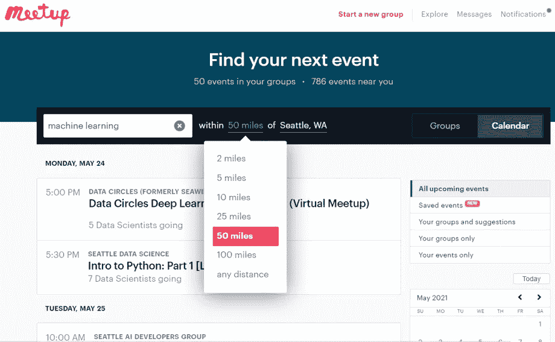
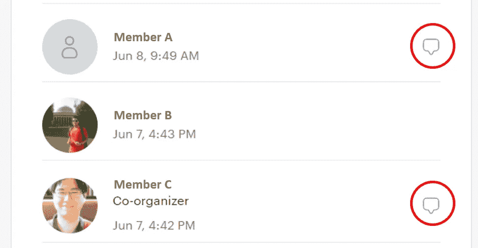
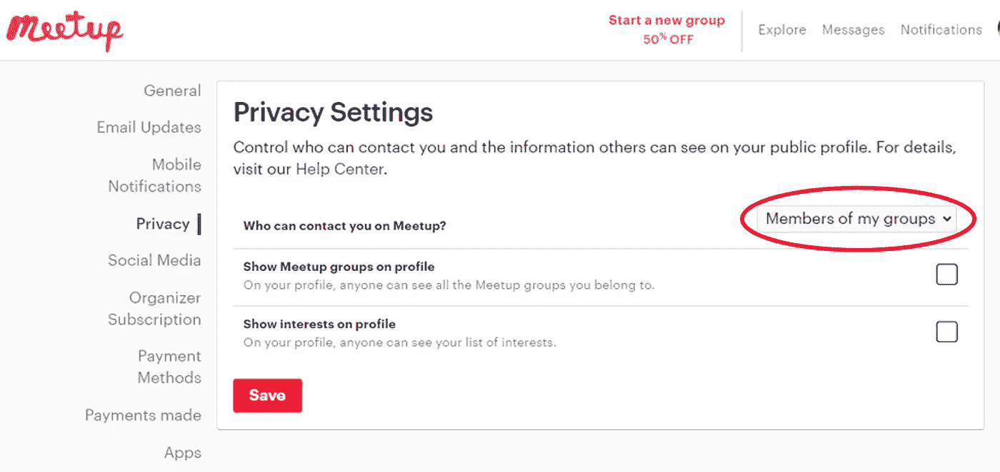

# 实践逐步指导增加你的工作机会

> 原文：<https://towardsdatascience.com/hands-on-step-by-step-guidance-to-grow-your-job-opportunities-fe0c757fb966?source=collection_archive---------22----------------------->

## ***职业建议***

## ***如何战略性地利用 Meetup 会议获得你梦寐以求的数据科学工作***

图片来自 [Pixabay](https://pixabay.com/photos/human-jump-luck-success-cheers-3509144/) 的 [Gerd Altmann](https://pixabay.com/users/geralt-9301)

你是一名有抱负的数据科学家，你会努力遵循更有经验的同事给出的所有建议。

*   你正在用所有推荐的免费和付费在线书籍和课程学习数据科学。
*   你可以阅读所有最新的数据科学博客。
*   你钻研所有被推荐的研究论文。
*   你参加了卡格尔比赛。
*   你建立了一个 GitHub 项目组合。
*   你浏览所有张贴的面试问题。

但是当你最终申请工作时，你会面临许多拒绝。你写了 100 多份申请，如果有一次你得到了一些关于你为什么没有得到这份工作的反馈，那就是“我们决定和另一个更适合的候选人一起前进。”

这是许多有抱负的数据科学家面临的常见情况。他们经常把这当成比赛的一部分，像往常一样前进。

在我的职业生涯中，我参加过数百次面试。未被选中的原因通常分为以下两类。

*   技能，以及
*   不适合这个团队。

本文将重点放在第二个方面，因为这一点不太明确，而且经常不被考虑。

许多候选人都在问，他们必须改变什么才能成为一个合适的人，他们应该参加什么课程。但这部分和技术技能无关。这是关于对你的看法。

*   那个人给我们团队带来了什么精神？
*   员工喜欢和她/他一起工作吗？
*   我们信任这个人吗？

这种“不适合团队”的原因不能通过参加另一个在线课程和自己做另一个项目来消除。你无法改变人们在面试中对你的看法。

但可以改变的是，你会找到适合你的团队和公司。

要解决它们，你需要走出你孤立的自学世界，与外面的环境联系起来。你必须在申请工作之前解决这个问题。

随着疫情和越来越多的远程工作，数据科学职位的竞争加剧。

另一方面，还有 Oscar，一个有经济学背景，只有一点编程知识的数据治理专家。不久前，他搬进了一家跨国公司的数据科学部门，开始了他的数据科学之旅。

他没有申请招聘广告。他没有令人讨厌的招聘流程，你最终听不到任何反馈，而是直接通过主要的招聘步骤。

奥斯卡是真实的。我雇了他。

区别在于对网络的战略性使用。得到一份数据科学的工作，不仅仅是知识、技能、证书。它是一个网络的集成。

嵌入这样一个网络并解决拒绝原因的一个简单且负担得起的选择是 [Meetup 会议](https://www.meetup.com/)。

所以，让我们来分解一下战略性地使用 Meetups 找工作的过程，这样你也可以应用它。

## **Meetup 会议的秘密**

*什么是 Meetup 会议？*

Meetup 是一个为兴趣小组提供在线服务的平台。个人可以创建对特定主题感兴趣的团体，他们组织面对面或虚拟的活动。活动包括人们展示项目的会议、技术会议、徒步旅行、语言课、创业推介等。它是所有数据科学主题的完美平台，因此，可以找到数千个与数据科学相关的群组。

在数据科学领域寻找 Meetup 群组时，搜索以下关键词。

*   数据科学
*   机器学习
*   深度学习
*   AI 或人工智能
*   自然语言处理
*   物联网、云、边缘计算
*   金融科技、教育科技、医疗科技等等
*   人工智能开发者
*   编程；编排
*   Python、Julia、Java、Js、KNIME、C/C++等等
*   等等

你可以从你的位置选择半径，你会发现所有的团体靠近你的地方。

作者截图:搜索半径的选择

***Pro tip* :** 特别是在疫情期间，许多 Meetup 会议转变为在线会议，你可以在全球范围内参加。因此，选择“任何距离”，然后在全球范围内寻找虚拟会议。

自从疫情启动以来，我在硅谷参加了许多(在线)会议，并结识了几个新的商业伙伴。我现在有项目合作，甚至和斯坦福大学合作。一家大型科技公司也联系了我，让我出演一个角色。

谁会参加聚会？

80%的参与者希望进入数据科学领域，或者是数据分析师、业务分析师、有抱负的数据科学家、学生、学者以及没有团队领导角色的经验丰富的数据科学家。20%的与会者是担任团队领导职务的高级数据科学家、招聘经理和首席数据科学家。

*为什么你既需要 80%又需要 20%的网络？*

那 80%可以算是“同行”同行是必不可少的，原因有三:

1.  为了你的未来。你们一起成长，你们将独立经历相同的发展步骤和相似的职业水平。这些同事支持你在五年、十年或十五年内从一个职位或公司转到另一个职位或公司。它们是你今天投资的关系资本的利息。
2.  讨论方法、项目挑战以及何时需要数据科学相关问题的意见。这不仅仅是你作为初学者的时间。此外，当数据科学领导者面临尚未找到解决方案的问题时，他们也会这样做。
3.  为团队和公司打开大门。当人们熟悉你和你的技能并信任你时，他们愿意为你辩护。许多公司都有所谓的推荐计划，这意味着如果一名现有员工推荐了一名候选人，而这名候选人被录用了，她/他就可以获得一笔可观的现金奖励。

这 20%是你短期和中期工作目标的机会。他们雇人，并且雇佣他们信任的人。他们需要熟悉你。

和金融投资一样，你应该两者都投资。平均来说，你应该用 50%的时间与每个小组交流。

你应该多久参加一次？

参加聚会和建立关系网是销售。你推销自己。销售研究表明，一个人至少要有八次互动才能达成交易。所以，和一个人见一两次面并不会给你带来工作机会。你必须参加许多 Meetup 会议才能见到同一个人至少八次，尤其是一位有其他任务的资深科学家。

但是在你停止阅读之前，请等待。Meetup 的诀窍是建立一个连接，让你能够在 Meetup 平台之外建立关系网。我稍后将回到如何做这件事。

*有哪些类型的 Meetup 会议？*

在研究数据科学领域时，我将它们大致分为:

*   申请，即来自不同行业和公司的从业者的项目演示。
*   研究，即最新的机器学习或 AI 研究和方法。
*   软件公司/工具提供商，也就是说，他们通常会亲自动手，在指导下对工具进行测试
*   特定技术和主题，如 Kubernetes、加密、云计算等。
*   编程类，例如 Python 或 C/C++ / live 编码类。
*   将多样性引入技术领域的团队，例如数据科学/机器学习领域的女性。
*   特定行业会议，即技术、数据和数字化会议，关注特定行业。
*   初创企业推介，即初创企业可以向投资者或正在寻找联合创始人的初创企业推介。

你有各种各样的会议，你可以随时找到你感兴趣的会议。

## **建立你的 Meetup 组合**

*如何决定参加哪个 Meetup 会议？*

关于如何选择会议，又有两个选项:主题或行业，以及公司相关。

首先，按主题呈现，即主题或行业。如果你想进入物联网相关的数据科学或客户分析，请选择物联网相关或客户分析聚会。如果你想进入制药和生命科学领域，选择一个有生命科学和健康数据科学主题的专业。

在这样的聚会上，你会找到在那个领域工作的人。

在第二种情况下，你的目标是扩大你的关系网，以便有一个专家交流或潜在的职位，提出的主题是次要的。

然后，您可以根据主持人、与会人员和召开 Meetup 会议的公司来选择会议。

看看演讲者来自哪家公司，如果是与公司合作完成的，看看他们是否是学者。找出聚会的地点。当一家公司举办这种活动时，通常会有不少员工参加。

根据您希望加入的行业或主办公司选择 Meetup 会议。

专业提示:如果主持人是年长的，可以预期观众也是年长的。让几个合适的人参加聚会比尽可能多的人参加更重要。

*如何充分利用聚会？*

参加之前要做好准备！

许多人没有任何准备就参加会议。他们很少了解演讲者或主持的公司——只知道这是一个众所周知的品牌或话题，会议结束后，他们很失望，因为他们没有从那次会议中受益。

我如何准备 Meetup 会议？

我为主持人做研究:LinkedIn、Google 和其他搜索工具。

*   谁是主持人，他们的职业道路是什么？
*   他们在公司中扮演什么角色？
*   他们是否已经有了其他演讲，主题是什么？
*   他们在这个话题上有多资深，在这次会议上听众有什么期望？
*   他们的网络是什么样的？我认识与他们有联系的人吗？我在哪里可以找到他们？

我了解这个话题，以便进行有意义的讨论。

*   它是做什么用的？在哪些行业或公司？
*   主题是独特的还是标准的？它是否提出了重大问题的解决方案？

通过对这两个问题的分析，你可以深入了解从事相同主题工作的其他公司将会参加哪些会议。

*   该领域常用的方法是什么？
*   还有哪些问题和那个话题有关？

你不需要写一篇关于这个的论文，但是你需要基本的知识来进行(积极的)持久的互动。

我收集关于公司的信息。

*   公司是做什么的？(如果不是知名品牌。)
*   我认识那家公司的人吗？(**专业提示:**检查你在 LinkedIn 上的关系。)
*   公司招人吗？他们招聘什么职位？(看对应的招聘广告。)
*   那家公司的战略主题是什么？提出的案例是其中之一吗？

这样，你就可以评估该公司的切入点可能在哪里。

然后，我查看其他已经注册的参与者。您点击一个 Meetup 事件，然后您可以向下滚动并查看与会者列表。

然后，我查看他们的个人资料——并非所有人都输入了个人资料信息或看到了全名，但这让我第一次看到了谁在参加。如果有全名，我会在 LinkedIn 上寻找潜在的附加信息。

你应该和谁交往？

如上所述，你应该用一半的时间和可以被视为同事的人交往，用另一半的时间和负责招聘的人交往。所以，你应该和所有可能的人交往。

基于对简介的回顾，你对受众有一个大致的了解。如果你想和某个特定的人交谈，你可以特别留意这个人。

你不需要整个晚上都和一个人呆在一起。进行自然的讨论，询问她/他为什么参加，这个人在哪个领域工作，如果你对更深入的讨论不感兴趣，你可以继续。

我通常会告诉对方，我要开始另一场讨论了，但还是要感谢他们有趣的谈话，祝他们有一个愉快的夜晚，并说“我们希望在下次聚会时再见。”敞开大门是很重要的，因为情况可能会改变，这个人以后可能会对你至关重要。

如果你对一个人感兴趣，想进行后续互动，你可以问她/他是否在 LinkedIn 上，或者可以分享联系方式。我还会问一个人多久参加一次 Meetup 会议，参加哪些会议，是否已经有参加下一次会议的计划。然后，你知道在哪里可以再遇到那个人。

**专业提示**:我建议和主办方谈谈。也可以在活动页面上找到它们。他们有一个广泛的网络，因为活动和知道许多人参加，并可以指出你的人来讨论。而且他们往往在一个公司里处于领导地位。他们是建立你的社交网络的倍增器。

最后，与演讲者建立联系。不管你是不是绝对的初学者。有意义的讨论是必要的，为此，你做了准备。

你可以通过让演示者知道你是一个初学者，但阅读了这个主题来开始讨论。你可以就此引用一两点，并就如何进一步深入这个主题征求意见。你可以询问是否有可用的数据集，以便你可以尝试这些方法，或者她/他是否最终有一些代码示例。你可以进一步问这个话题对她/他的公司是否重要，有多少人在做这个，以及他们正在做的其他事情。

如果你表现出真诚的兴趣，你就会建立信任，人们会回答你的问题并支持你。当你们进行这样的对话时，你也可以询问联系方式，以及是否有可能进行跟进。大多数情况下，当你准备充分时，他们会支持你。

*会后你应该做什么？*

答案很简单:人脉，人脉，人脉。

你之前读到过你至少需要八次互动。那么，你如何得到它们呢？

如果你知道这个人的名字，而且他在 LinkedIn 上，那就联系他/她。重要事项:添加一条信息，如“我们在 XYZ 见过面，我想再次感谢您的有趣讨论，”或“感谢您在 XYZ 的有趣讨论，正如所讨论的，我想跟进 ABC，”这样，对方会觉得已经熟悉您了。然后你可以用准备好的问题继续跟进。但是至少要等两个星期。没有比两天后再发一条信息而被人忽视更大的机会了，除非你已经同意了。

如果你和一个人分享了联系方式，你也应该看看 LinkedIn。利用这些联系，进一步拓展人脉。

您还可以在 Meetup 平台上向 Meetup 成员发送消息。在 Meetup 会员名称的右侧，您可以查看是否可以发送消息。组织者通常会在个人资料中提供更多的联系方式。

使用此功能联系其他参与者。

作者截图:启用消息传递的成员

**亲提示:**部分会员已禁用消息功能。然而，在 LinkedIn 上可以找到很多。然后，我在 LinkedIn 上联系他们，在联系邀请中添加一条之前看到的信息，因为——同样——你需要与这个人建立信任。

我在 LinkedIn 上收到很多邀请，大多数情况下，我不认识那个人。每当有人写一条短信，比如“我已经读过你写的 XYZ 关于数据科学的文章”或者“我们都参加了 ABC 会议”，那么在几秒钟内，我就接受了邀请。

另一方面，为了让别人能够联系到你，选择相应的设置。

作者截图:其他成员联系的设置

做完所有这些，你就可以开始自然而有规律的互动了。

*如何在网络活动中建立关系网？*

在网络事件中建立关系网确实有点困难，但是用一些技巧，还是可以的。

在大多数活动中，在线活动期间可以看到与会者。所以，我做了一个参与者名单的截图。我记下是谁在问什么问题，以便联系。

如果你觉得舒服，你可以问一个问题，或者对之前的一个回答或问题进行评论。如果我对与一个特定的人建立关系感兴趣，并且那个人问了一个问题，我会问一个我可以向他提及的问题，比如“我发现这是一个很好的问题，但是在 ABC 的情况下我们会有什么？”有时，甚至有可能在活动中以这种方式与他人联系。

组织者和演讲者通常都有详细的联系方式，如上所述，你可以在会后与他们联系。在大多数情况下，他们主动向他们伸出援手，他们会有所回应。

然后，我像上面提到的那样表演:我在 LinkedIn 上和他们联系，给他们发消息。

如何让你的互动增加 10 倍？

组织 Meetup 会议！

你可以选择演讲者，这应该是有策略的。问问那些你想在哪里找到工作的人。作为组织者，你有一连串的互动:最初的接触(社交媒体、电子邮件)，关于会议主题和期望的简报，在他们陈述之前和陈述期间的帮助，活动结束后的感谢电子邮件，简报，以及最终对其中一个主题的个人跟进。通过自然地这样做，你可以很快产生六到十次互动。

回到奥斯卡，他完全做到了这些。他还借此机会组织了一次 Meetup 会议，在会上他联系我做了一个演示。通过所有的互动，我熟悉了他的技能和潜力。互动是建立在信任的基础上的。

## **将所有这些整合在一起**

Meetup 会议是最被低估的机会，它能让你在求职中获得竞争优势。

战略性地使用它们来与你想工作的公司建立关系，与同行建立信任的交流，并建立你未来的机会。

也要做好准备，人们也可能会接近你。不要因为一个人的知识比你少而拒绝他。作为一名数据科学家，我并不是仅仅通过向他人学习而成长起来的；我最大的收获是给予。

你应该什么时候开始参加 Meetup 会议？从您踏上数据科学之旅的第一步开始！

成功的数据科学家并不是技术更好，也不是证书更多。他们有一个更大的网络。

**你喜欢我的故事吗？在这里你可以找到更多。**

 [## 作为数据科学初学者应该避免的 10 个错误

towardsdatascience.com](/10-mistakes-you-should-avoid-as-a-data-science-beginner-ec1b14ea1bcd)  [## 发现 9 个咨询领域，开始任何经验水平的激动人心的数据科学之旅

### 和更多指导，让您做好咨询准备

towardsdatascience.com](/discover-9-consultancy-segments-to-start-an-exciting-data-science-journey-for-any-experience-level-a972cb6b63e4)  [## 5 个具体的真实项目来构建您的数据科学组合

### 独特性是关键，而不是花哨

towardsdatascience.com](/5-concrete-real-world-projects-to-build-up-your-data-science-portfolio-ef44509abdd7)