# 使用 Python 进行实际生存分析

> 原文：<https://towardsdatascience.com/hands-on-survival-analysis-with-python-270fa1e6fb41?source=collection_archive---------6----------------------->

## 公司能从员工流动数据中学到什么


照片由[盒装水更好](https://unsplash.com/@boxedwater?utm_source=unsplash&utm_medium=referral&utm_content=creditCopyText)上 [Unsplash](https://unsplash.com/s/photos/nature?utm_source=unsplash&utm_medium=referral&utm_content=creditCopyText)

生存分析是一种流行的统计方法，用于调查感兴趣的事件发生之前的预期持续时间。我们可以从医学中回忆起病人的生存时间分析，从工程学中回忆起可靠性分析或无故障时间分析，从经济学中回忆起持续时间分析。

除了这些学科之外，生存分析还可以被人力资源团队用来了解和创造关于他们的员工参与度、保留率和满意度的洞察力——这是当今的一个热门话题🌶 🌶 🌶

根据 Achievers[的员工参与度和保留率报告](https://www.achievers.com/resources/white-papers/workforce-institute-2021-engagement-and-retention-report/)，52%的员工计划在 2021 年寻找新工作，最近一项由 31 个国家的 30，000 多名员工参与的调查显示，40%的员工正在考虑辞职。《福布斯》将这种趋势称为“[离职海啸](https://www.forbes.com/sites/karadennison/2021/04/27/why-the-2021-turnover-tsunami-is-happening-and-what-business-leaders-can-do-to-prepare/?sh=7fc949fa4e6d)”，主要是由疫情的倦怠和 Linkedin 专家预测大规模人才迁移的到来，并在[#大辞职](https://www.linkedin.com/signup/cold-join?session_redirect=https%3A%2F%2Fwww%2Elinkedin%2Ecom%2Ffeed%2Fhashtag%2Fgreatresignation&trk=storyline-update_share-update_update-text)和[#大洗牌](https://www.linkedin.com/signup/cold-join?session_redirect=https%3A%2F%2Fwww%2Elinkedin%2Ecom%2Ffeed%2Fhashtag%2Fgreatreshuffle&trk=storyline-update_share-update_update-text)主题下进行讨论。

一如既往,**数据**有助于了解员工敬业度&保留率，以减少人员流动，建立更敬业、更投入、更满意的团队。

人力资源团队可以从员工流动数据中挖掘的一些示例如下:

*   *留下/离开*的员工的某些特征是什么？
*   不同员工群体之间的流失率有相似之处吗？
*   员工在一定时间后离职的概率有多大？(即两年后)

在本文中，我们将构建一个生存分析来帮助回答这些问题。您也可以在我的 GitHub 上查看 [Jupyter 笔记本](https://github.com/Idilismiguzel/Machine-Learning/blob/master/Survival_Analysis/Survival_Analysis.ipynb)以获得完整的分析。开始吧！☕️


照片由[丹妮尔·麦金尼斯](https://unsplash.com/@dsmacinnes?utm_source=medium&utm_medium=referral)在 [Unsplash](https://unsplash.com?utm_source=medium&utm_medium=referral) 上拍摄

# 数据选择👥

我们将使用一个虚构的[员工流失率&绩效数据集](https://www.kaggle.com/pavansubhasht/ibm-hr-analytics-attrition-dataset/tasks)来探索员工流失率和重要的员工特征，以预测当前员工的生存时间。

# 背景

在对生存函数建模之前，让我们先了解生存分析背后的一些基本术语和概念。

*   **事件**是感兴趣的体验，如生存/死亡或留下/辞职
*   **存活时间**是指感兴趣事件发生前的持续时间，即员工离职前的持续时间

## 审查问题🚫

如果某些个体的事件没有被记录，则删失观察发生在事件时间数据中。这可能是由于两个主要原因:

*   事件尚未发生(即存活时间未知/对尚未辞职的人具有误导性)
*   丢失数据(即丢失)或失去联系

有三种类型的审查:

1.  ***左删截:*** *存活持续时间小于观察持续时间*
2.  ***右删:*** 生存持续时间大于观察持续时间
3.  ***区间-删失:*** *存活持续时间无法确切定义*

最常见的类型是右删失型，通常由生存分析来处理。但是，另外两个可能表明数据中存在问题，可能需要进一步调查。

## 生存函数

***T*** 是事件发生时， ***t*** 是观察期间的任意时间点，生存 ***S(t)*** 是 *T* 大于 *t.* 的概率，换句话说，生存函数是个体在时间 *t.* 后存活的概率

> S(t) = Pr(T > t)

生存曲线的图示:

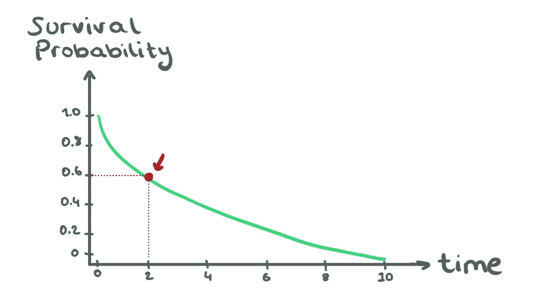

个体存活超过 2 年的概率是 60%——图片由作者提供

生存函数的一些重要特征:🔆

*   T ≥ 0 且 0 < t < ∞
*   It is non-increasing
*   If 【 , then 【 (survival probability is 1 at time 0)
*   If 【 ∞, then 【 (survival probability goes to 0 as time goes to infinity

## Hazard Function

Hazard function or hazard rate, **和 0*h(t)****，*是存活到时间 *t* 并且恰好在时间 *t* 经历感兴趣事件的个体的概率。危险函数和生存函数可以通过下面的公式相互推导。

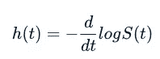

冒险函数

# 卡普兰-迈耶估计量

作为一个非参数估计量，Kaplan-Meier 不需要对数据的分布进行初始假设。它还通过从观察到的存活时间计算存活概率来处理右删失观察。它使用来自概率的乘积法则，事实上，它也被称为乘积限估计量。

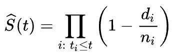

生存概率作为时间 t

其中:

*   **d _ I**:t _ I 时刻发生的事件数
*   **n_i** :存活到时间 t_i 的受试者人数

我们可以认为在时间 *t_i* 的生存概率等于在先前时间 *t_i-1* 的生存概率和在时间 *t_i* 的生存几率百分比的乘积。*👇*

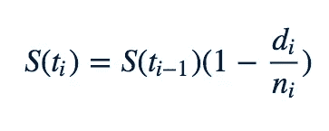

t=2 的生存概率是 t=1 的生存概率乘以 t=2 时生存的百分比机会。

## KMF 的生存函数

我们可以用卡普兰-迈耶钳工模型使用`lifelines`包。在对数据进行 kmf 拟合时，我们应该指定**持续时间**(在公司度过的年数)和**事件观察值**(损耗值:1 或 0)。

```
from lifelines import KaplanMeierFitter# Initiate and fit
kmf = KaplanMeierFitter()
kmf.fit(durations=df.YearsAtCompany, event_observed=df.Attrition)# Plot the survival function
kmf.survival_function_.plot()
plt.title('Survival Curve estimated with Kaplan-Meier Fitter')
plt.show()
```

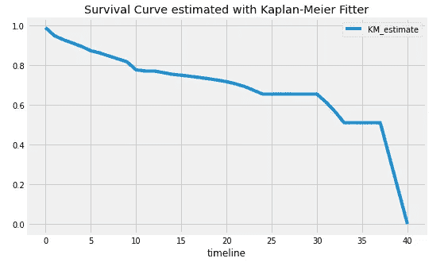

```
# Print survival probabilities at each year
kmf.survival_function_
```

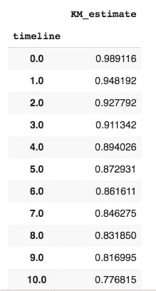

时间线一直延续到第 40 年。

我们可以看到，个人在公司存活超过 2 年的概率是 92%，而存活超过 10 年的概率下降到 77%。

我们也可以用置信区间画出生存函数。

```
# Plot the survival function with confidence intervals
kmf.plot_survival_function()
plt.show()
```

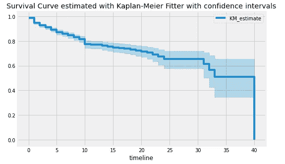

请注意，较宽的置信区间表明模型在那时不太确定，通常是因为数据点较少。

## KMF 不同人群的生存功能

我们可以绘制不同群体(如性别)的生存曲线，看看概率是否会改变。

让我们根据环境满意度栏来做，我们有以下输入:

> 1= '低'
> 2= '中等'
> 3= '高'
> 4= '非常高'

为了简单起见，我将把“低环境满意度”下的“低”和“中”放在一起，把“高环境满意度”下的“高”和“非常高”放在一起。

```
# Define the low and high satisfaction
Low = ((df.EnvironmentSatisfaction == 1) | (df.EnvironmentSatisfaction == 2))High = ((df.EnvironmentSatisfaction == 3) | (df.EnvironmentSatisfaction == 4))# Plot the survival function
ax = plt.subplot()kmf = KaplanMeierFitter()
kmf.fit(durations=df[Low].YearsAtCompany,
event_observed=df[Low].Attrition, label='Low Satisfaction')
kmf.survival_function_.plot(ax=ax)kmf.fit(durations=df[High].YearsAtCompany, event_observed=df[High].Attrition, label='High Satisfaction')
kmf.survival_function_.plot(ax=ax)plt.title('Survival Function based on Environmental Satisfaction')
plt.show()
```

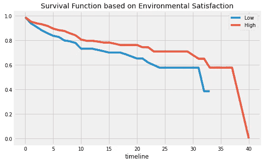

正如我们所见，高环境满意度的个体比低满意度的个体有更高的生存概率。

我们也可以对“性别”和“工作-生活平衡”进行同样的分析。

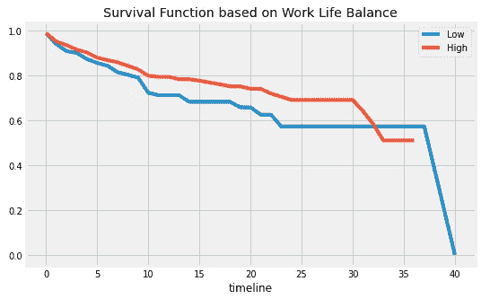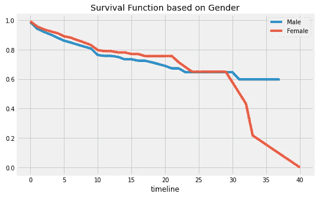

在上面的工作生活平衡图中，我们可以看到，与工作生活平衡度低的人相比，工作生活平衡度高的人倾向于在公司呆得更久。

然而，在性别情节中，男性和女性的生存曲线几乎是齐头并进的，这使得很难理解是否存在差异。为了研究这个问题，我们可以运行一个**对数秩假设检验**。

零假设表明男性和女性生存曲线是相同的，替代假设表明它们不相同。如果对数秩检验的 p 值低于 0.05，我们可以拒绝零假设。

```
from lifelines.statistics import logrank_test# Define logrank test
output = logrank_test(
durations_A = df[male].YearsAtCompany,
durations_B = df[female].YearsAtCompany,
event_observed_A = df[male].Attrition,
event_observed_B = df[female].Attrition)output.print_summary
```

> p 值= 0.18

> *p 值大于 0.05，我们* ***不拒绝*** *的零假设。换句话说，我们不拒绝男性和女性生存曲线相同的假设。☑️*

如果我们对“工作-生活平衡”进行对数秩检验；我们发现 p 值是 0.04。它低于 0.05，所以我们拒绝零假设。换句话说，我们**拒绝**低工作-生活和高工作-生活平衡的个体的生存曲线相同的假设。

如果我们有两个以上的组(如低、中、高工作-生活平衡)，我们可以使用`pairwise_lograng_test()`或`multivariate_logrank_test().`

# Cox 比例风险模型

Cox-PH 模型是发现个体的存活时间和预测变量之间的关系的回归模型。它适用于分类和数字预测变量。我们将使用 Cox-PH 模型不仅调查哪些因素对生存有高低影响，而且预测当前员工未来的生存概率。

## 用 Cox-PH 模型预测生存时间

让我们选择一组我们想要研究的列。出于个人好奇，我挑选了以下几个:

```
columns_selected = ['Attrition', 'EnvironmentSatisfaction', 'JobInvolvement', 'JobLevel', 'JobSatisfaction', 'PercentSalaryHike', 'RelationshipSatisfaction', 'StockOptionLevel', 'TrainingTimesLastYear', 'YearsAtCompany']df = df[columns_selected]
```

让我们将选择的数据拟合到`CoxPHFitter`，并指定生存持续时间和事件列。

```
from lifelines import CoxPHFitter# Initialize and fit the model
coxph = CoxPHFitter()
coxph.fit(df, duration_col='YearsAtCompany', event_col='Attrition')# Print model summary
coxph.print_summary()
```

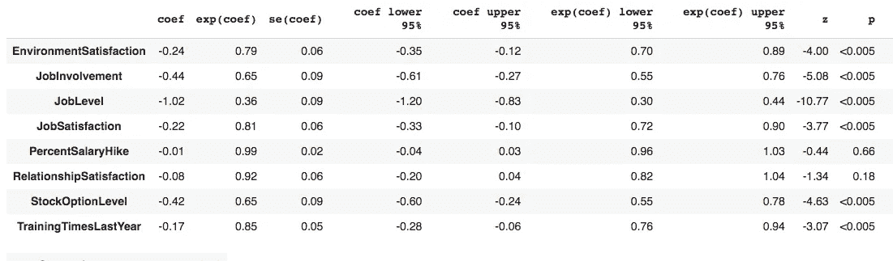

模型摘要

在模型总结中，exp(coef)是风险比，它表示由于相应因子的一个单位变化，基线风险变化的程度。例如，如果环境满意度改变一个单位:

*   危险比率:0.79
*   危险变化:0.79–1 =-0.21
*   存活时间变化:(1/0.79)-1 = 0.26 →存活时间增加 26%

模型总结还显示了因素变量的重要性。查看 **p** 我们可以了解到“加薪百分比”和“关系满意度”并不显著。我们也可以从下面的因素效应图中看到这一点。

```
# Plot factor effects 
coxph.plot()
```

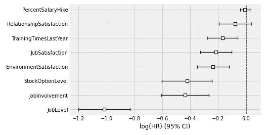

因子效应(较低的效应接近于 0)

为了预测员工的生存概率，我们需要创建一个包含当前员工的新数据框架:其中自然减员为 0，数组指定“在公司的年数”。之后，我们可以预测存活时间。我们需要在`predict_survival_function`中指定在公司工作的年数，以便相应地开始每个人的时间表。

```
# Current employees
df_new = df.loc[df['Attrition'] == 0]# Years at the company of current employees
df_new_obs = df_new['YearsAtCompany']# Predict survival probabilities 
coxph.predict_survival_function(df_new,conditional_after=df_new_obs)
```

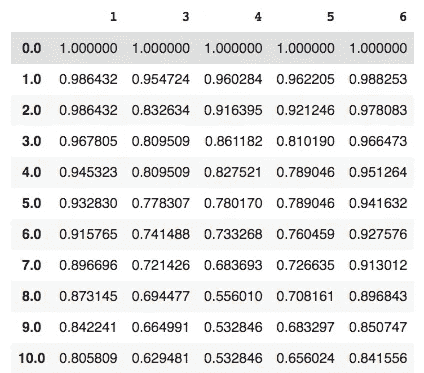

预测—列是员工，索引是时间线

员工 1 在 10 年后的预计生存概率是 80%，而员工 4 的生存概率是 53%

像其他回归模型一样，Cox-PH 模型也对数据进行初始假设。为了检查假设是否成立，我们可以使用`check_assumptions.`

```
# Check the Cox-PH model assumptions
coxph.check_assumptions(df)
```

> 比例风险假设看起来不错。

我们很好！🌴

否则，我们可能需要操纵一些变量。

# 结论

在这篇文章中，我们回答了一些公司可能会有的关于他们的员工特征和对自然减员的影响的重要问题。我们使用 Kaplan-Meier fitter 计算并绘制生存概率，使用 Cox-PH 模型预测当前员工未来几年的生存概率。这些预测非常有见地，因为它们让我们知道哪些因素降低和增加了生存概率，以及谁是短期内处于风险中的员工。利用这些预测，公司可以付出额外的努力来防止员工流失，并最终建立更积极、更高效、更快乐的团队！🙌

# 奖金

我们已经了解了如何分析不同群体之间生存曲线的差异。我们可以在 **A/B 测试**中使用这个特性——在这里我们可以调查一个新的特性/变化是否会导致存活率的显著变化。

如果你对 A/B 测试感兴趣，你可以阅读我下面的文章🌠

[](/a-guide-to-a-b-testing-how-to-formulate-design-and-interpret-f820cc62e21a) [## A/B 测试指南——如何制定、设计和解释

### 用 Python 实现

towardsdatascience.com](/a-guide-to-a-b-testing-how-to-formulate-design-and-interpret-f820cc62e21a) 

我希望你喜欢阅读生存分析，并发现这篇文章对你的分析有用！

*如果你喜欢这篇文章，你可以* [***在这里阅读我的其他文章***](https://medium.com/@idilismiguzel)**和* [***关注我上媒***](http://medium.com/@idilismiguzel/follow)*如果有任何问题或建议，请告诉我。✨**

**喜欢这篇文章吗？ [**成为会员求更！**](https://idilismiguzel.medium.com/membership)**

## **参考**

1.  **[劳动力研究所——2021 年雇佣和保留报告](https://www.achievers.com/wp-content/uploads/2021/03/Achievers-Workforce-Institute-2021-Engagement-and-Retention-Report.pdf)**
2.  **[微软调查](https://www.weforum.org/agenda/2021/06/remote-workers-burnout-covid-microsoft-survey/)**

4.  **[Linkedin——伟大的辞呈在这里](https://www.linkedin.com/news/story/the-great-resignation-is-here-5480770/)**
5.  **[救生索包](https://lifelines.readthedocs.io/en/latest/index.html)**