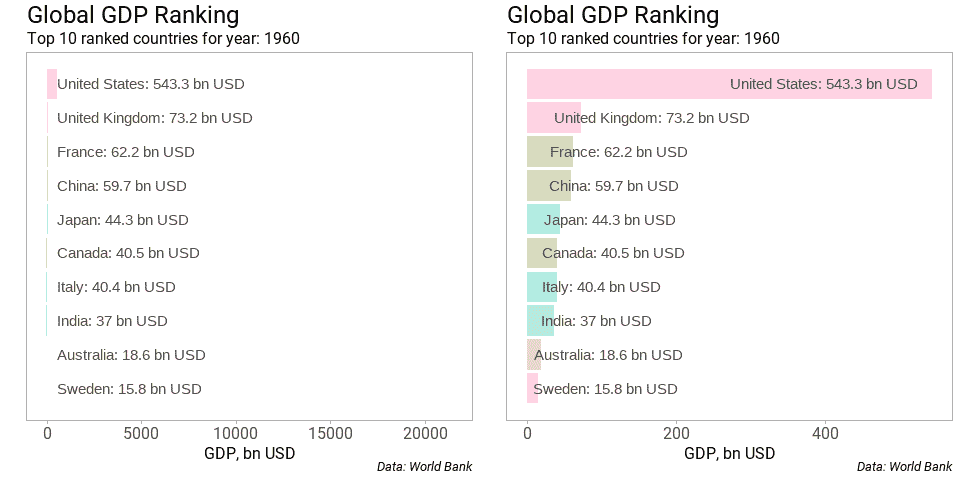
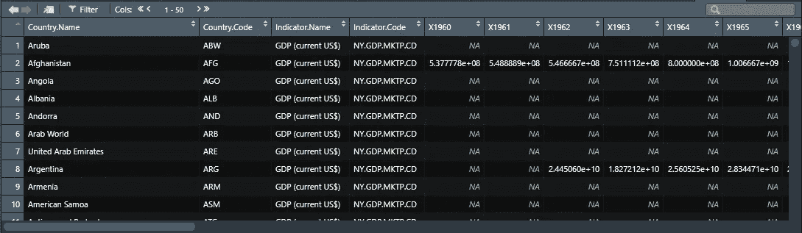
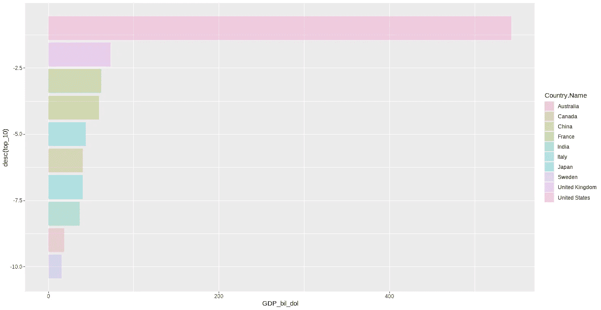
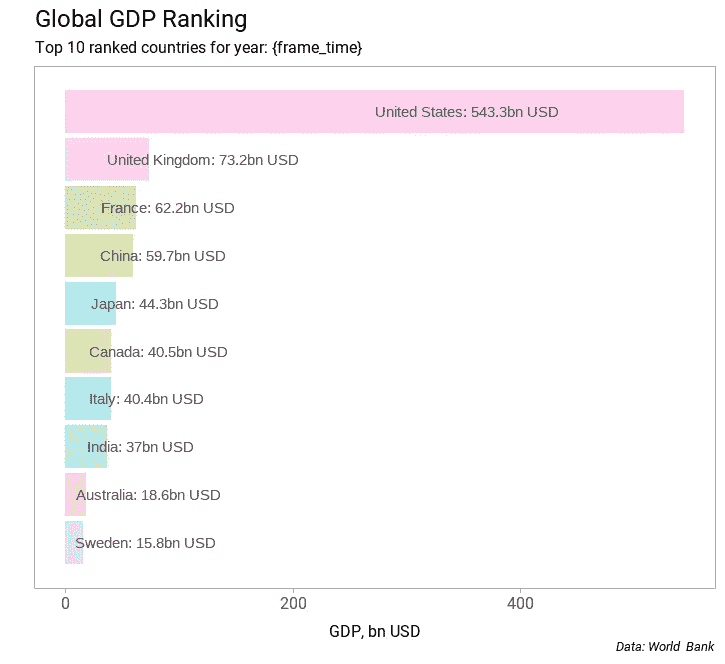
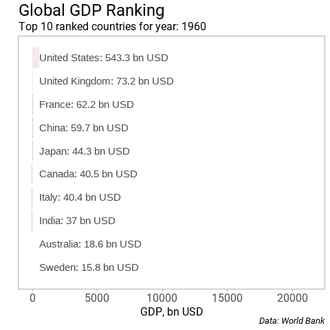
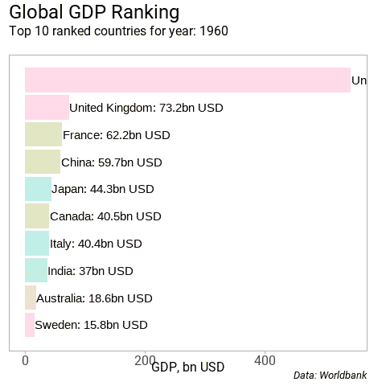
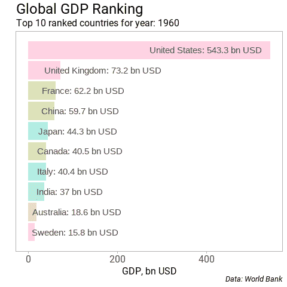

# 条形图动画制作完全指南

> 原文：<https://towardsdatascience.com/hands-on-tutorial-f2ee5dc4d0a8?source=collection_archive---------25----------------------->

## 制作两种不同风格的条形图动画的分步指南



作者图片

图和信息图形式的数据可视化是传达故事的方式。如果这些故事有实质内容并且不言自明，那么它们对大众是有吸引力的。信息图或演示之所以比单纯的情节更受欢迎，是因为它们传达了一个故事，并且是自给自足的。情节只讲述了故事的一部分。为了使情节更有意义，人们可以将一系列的情节堆叠在一起，或者堆叠一系列的情节来创建动画。一个很好的例子是由[汉斯·罗斯林](https://www.youtube.com/watch?v=jbkSRLYSojo)创作的动画，其中他比较了预期寿命和收入。

在这里，我将使用 1960 年至 2019 年间 10 个最大国家的 GDP 支出数据创建一个条形图竞赛。本教程的重点是:

1.  使用 GDP 支出数据创建从 1960 年到 2019 年每个财年前 10 个国家 GDP 的动画。
2.  清楚地展示如何提高默认`ggplot`图的质量。
3.  提供创建两种不同风格的竞赛条形图的步骤。

我们将创建两种不同风格的条形图比赛，一个具有固定轴，另一个具有动态轴。完整的代码可以在我的 [Github 库](https://github.com/amalasi2418/Blog-post/tree/master/Blog%2014-animate)中找到。

创建条形图比赛动画的灵感来自约翰·伯恩-默多克的推特帖子，他在那里制作了世界上人口最多的 10 个城市的动画。在本教程中，条形图比赛动画是使用世界银行的世界 GDP 数据重新创建的。

# 数据准备

如果您打开数据文件，您会注意到相关的列从第 5 行开始。所以你需要去掉前四行。要么我们可以手动删除它们，要么我们可以在读取 CSV 文件时编写一个参数，让计算机为您删除它们。让我们走后一条路。要读取 CSV 文件，加载`readr`包，并使用函数`read.csv()`。`skip = 4`参数跳过文件的前四行。数据由国家名称、国家代码和 GDP 值组成。为了确保国家名称和国家代码列属于 string 类，我们将参数设置为`stringsAsFactors = False`。

```
gdp <- read.csv("C:/Users/amalasi/Documents/R/Blog post/Blog 14-animate/GDP/GDP.csv", 
                skip = 4,stringsAsFactors = F)
```

在预览`gdp`变量时，我们注意到一些列是多余的，可以删除。因为我们对使用时间索引创建动画感兴趣，所以我们需要将当前数据表从宽到长重新排列，以增加包含年份和 GDP 值的列。使用`tidyr`包中的`gather()`函数，一个新变量`gdp_long`被定义为两个名为 *Year* 和 *GDP_dollar* 的新列(GDP 值以美元为单位)。



作者图片

```
# removing reduncdant columns
gdp %<>% select(-c(2:4,65,66))# converting the wide table to long
gdp_long <- gdp %>% gather(Year,GDP_dollar,c(2:61))
```

将数据转换为长格式后，*年*列值显示年值前的 ***X*** 。为了去掉 ***X*** ，我们将使用`gsub()`函数。我们调用`gsub()`函数，第一个参数是我们想要替换的字符串，第二个参数是我们想要替换的字符串，第三个参数是动作发生的数据。我们使用`as.integer()`函数将*年*列转换为整数。这种到整数变量的转换将在以后制作动画时派上用场。

```
gdp_long$Year <- as.integer(gsub("X","",gdp_long$Year))
```

最后一个清理步骤是从*国家中删除几个特定值。名称*列。*国家有几个值。Name* 代表一组国家或地区的列，如阿拉伯世界、加勒比海小国、中欧和波罗的海、海峡群岛等。最好的方法是使用国家的标准 ISO 代码来删除不需要的数据。由于所有的国家都被分配了一个 ISO 代码，我们可以利用它。为此，我们将使用`countrycode`包中的`countrycode()`函数。使用`mutate()`函数定义了一个名为 Code 的新变量。要将国家名称转换成 ISO 代码，第一个参数是我们想要处理的数据。对于当前情况，发送的数据是国家名称，因此`countrycode()`的第二个参数将被设置为`country.name`，第三个参数将被设置为`iso3c`。这样做的目的是将国家名称转换成 3 个字母的国家代码。

```
gdp_long %>% mutate(Code = countrycode(gdp_long$Country.Name,
                                            "country.name","iso3c"))
```

所有不必要的地区或国家集群没有 ISO 代码，将被赋予`NA`值。我们现在可以过滤数据，删除不必要的数据。

```
gdp_long %>% mutate(Code = countrycode(gdp_long$Country.Name,
                                            "country.name","iso3c")) %>% 
  filter(!is.na(Code))
```

对于动画来说，我们需要以某种方式排列数据。我们首先将数据按年份分组，并按 GDP 支出的降序排列。`rank()`函数中的负号按降序排列 *GDP_dollar* 值。我们定义了一个新的变量，通过将 GDP 值除以 10⁹，将 GDP 值转换为十亿美元。最后一步是过滤数据，提取 GDP 支出最高的前 10 个国家，并取消数据分组。

```
c <- gdp_long %>% mutate(Code = countrycode(gdp_long$Country.Name,
                                            "country.name","iso3c")) %>% 
  filter(!is.na(Code)) %>%
  group_by(Year) %>% 
  mutate(top_10 = rank(-GDP_dollar), GDP_bil_dol = GDP_dollar/1e9) %>% 
  group_by(Country.Name) %>% 
  filter(top_10 <= 10) %>% 
  ungroup()
```

# 静态条形图

在数据准备之后，让我们创建一个静态图，以确保我们的图中有我们想要的一切。要创建动画帧，请将数据过滤到年份= 1960，以绘制 GDP 支出排名前 10 位的国家。

```
c %>% filter(Year==1960) %>% 
  ggplot(aes(desc(top_10),GDP_bil_dol, fill = Country.Name)) +
  geom_bar(stat = "identity", alpha = 0.3) +
  coord_flip()
```



作者图片

所以，我们有一个需要润色的柱状图。我们能做的改善情节外观的几件事是去除灰色背景和图例。添加描述性文本，使其不言自明，并增加字体大小。

我们可以做的第一件事是使用`theme_set()`函数改变`ggplot`的主题。如果有兴趣了解更多关于 R 中的 theme()函数的信息，请查看这篇文章。

</master-data-visualization-with-ggplot2-theme-customization-8421695d24e2>  

```
geom_text(aes(y=ifelse(GDP_bil_dol<1000, 500,GDP_bil_dol/2),
                label = paste0(Country.Name,": ",round(GDP_bil_dol,1)," bn USD"), 
                hjust = 0),color = "gray30") +
  theme(panel.grid = element_blank(),
        legend.position = "none",
        axis.title = element_text(size = 12),
        axis.title.x = element_text(vjust = -1.5),
        axis.text.y = element_blank(),
        axis.ticks.y = element_blank(),
        axis.text.x = element_text(family = "Roboto", size = 12),
        plot.subtitle = element_text(size = 12),
        plot.caption = element_text(size = 10, face = "italic")
        ) + 
  labs(x="", y="GDP, bn USD", caption = " Data: World Bank") +
  ggtitle("Global GDP Ranking", subtitle = "Top 10 ranked countries for year: {frame_time}") 
```



我们所做的是过滤数据并绘制出 1960 年前 10 个 GDP 值。这里是添加到`ggplot`的图层列表以及使用它们背后的想法。

**在绘图面板中添加文本时，geom_text()** 很有用。为了在条形旁边显示 GDP 值，使用 `ifelse`语句定义 y 坐标，因为文本的长度可以变化。我想确保文本保持在大 GDP 值的绘图边界内。为此，我将 GDP 的临界值定义为 1000。对于低于 1000 的 GDP 值，从 500 值开始打印文本，否则从当前 GDP 值的中点开始打印。然后使用`paste0()`函数定义*标签*，因为我想将运行变量与预定义文本合并。接下来，我使用`hjust = 0`来确保文本不会从绘图的左边界超出绘图区域。最后，选择`color = "gray30"`来匹配轴刻度的颜色。

**theme()** :使用 theme 函数，我们负责字体大小、字体类型、颜色，如果我们想要网格线、主要和次要刻度、图例、调整文本等。

**labs()** :所有的轴标题和标题都是用这个函数定义的。

ggtitle() :我用这个函数定义了剧情的标题和副标题。 *{frame_time}* 来自`gganimate`包，将显示运行时间指数。

在最终确定了情节的美感之后，我们将完整的情节表达分配给一个对象`xx`。一旦这一步完成，我们就可以制作情节动画了。

```
xx <- c %>% group_by(Year) %>% 
  ggplot(aes(y = desc(top_10),x = GDP_bil_dol)) +
  geom_barh(stat = "identity", aes(fill = Country.Name),alpha = 0.3) +
  geom_text(aes(x=GDP_bil_dol/2,label = paste0(Country.Name,": ",round(GDP_bil_dol,1)," bn USD"), 
                hjust=0), color = "gray30") +
  theme(panel.grid = element_blank(),
        legend.position = "none",
        axis.title = element_text(size = 12),
        axis.title.x = element_text(vjust=-1.5),
        axis.text.y = element_blank(),
        axis.ticks.y = element_blank(),
        axis.text.x = element_text(family = "Roboto", size = 12),
        plot.subtitle = element_text(size = 12),
        plot.caption = element_text(size = 10, face = "italic")
  ) + 
  labs(y="", x="GDP, bn USD") +
  ggtitle("Global GDP Ranking", subtitle = "Top 10 ranked countries for year: {frame_time}") + labs(caption = " Data: World Bank")
```

# 制作条形图动画

我们有两种可能来激活条形图。在第一种情况下，我们保持轴不变，让棒线随着时间增长。为此，我们需要加载`gganimate`包，并开始向 ggplot 函数添加层。通过添加`transition_time()`层，ggplot 函数知道哪个变量是运行指数。`transition_time()`的参数是定义时间索引的变量，在我们的例子中，它是*年*列。我们定义了一个新的对象`p2`，并为它分配了更新后的动画参数。

```
p2 <- xx + transition_time(Year)
```

一旦定义了过渡时间，我们可以使用`animate()`函数创建一个 gif 动画。



带固定轴的动画(图片由作者提供)

第二种情况是，具有 GDP 值的轴随着时间的推移自动调整。我们为第一种情况添加了另一层代码，使用固定的轴。该层由来自`gganimate`包的`view_follow()`函数组成。`view_follow()`功能让您定义哪个轴需要是动态的。默认值设置为两个轴都是动态的。要仅设置一个轴动态，我们可以将参数设置为`fixed_x = TRUE`。这样`view_follow()`功能知道 x 轴是固定的。同样，我们可以通过设置参数`fixed_y = TRUE`来设置 y 轴。我们可以使用参数`fixed_x = c(0, NA)`设置动态轴的起始范围(类似于 y 轴)。取决于数据，向量中的第一个值可以是任何起始值，但最终值必须是`NA`。用户也可以使用`ease_aes()`功能来定义运行动画时数值如何变化。

```
p2 <- xx + transition_time(Year) + 
  # ease_aes('linear', interval = 0.1) +
  view_follow(fixed_x = c(0,NA), fixed_y = TRUE)
```

在创建 gif 时，我们可以在`animate()`函数中提供参数来定义`nframes`或`fps`。`nframes`为帧数(默认为 100)，而`fps`为每秒显示帧数的帧率(默认为 10 fps)。

```
# if using magick for saving gif files
anim <- animate(p2, nframes = 240, fps = 10)# using gganimate for saving gif files
animate(p2, nframes = 240, fps = 10)
```

在使用 view_follow()运行修改后的代码时，我们看到轴刻度上的数据在闪烁，轴标题正在交换位置，如下所示。



作者图片

> 由于`view_follow()`功能与`coord_flip()`不兼容，所以出现了问题。此的[修正是不使用`coord_flip()`并手动切换 ggplot 美学中的 x 轴和 y 轴或使用`ggstance()`包中的`geom_barh()`。](https://github.com/thomasp85/gganimate/issues/336)

修复这个问题后，动画 gif 应该是这样的。



动态 x 轴(图片由作者提供)

# 保存动画

生成的 gif 文件可以使用`magick`包或`gganimate`包保存。

```
# using magick packagemagick::image_write(anim, path="myanimation.gif")# using gganimate package
anim_save("myanimation.gif")
```

下面是创建这两个动画 gif 的完整代码。

# 结论

在上面的教程中，我们实现了:

1.  从 GDP 数据创建 gif 文件。
2.  改进了默认的绘图质量。
3.  展示了为相同数据创建 gif 文件的两种不同方法。
4.  找到了一个解决同时使用`view_follow()`和`coord_flip()`的限制的方法。

我希望你喜欢这个关于创建动画条形图的简短教程。最好的方法是探索 gganimate 来测试可以使用 r 创建的动画的极限。

对使用 ggplot 创建地块感兴趣，请查看以下帖子:

</data-visualization-using-ggplot2-5-features-worth-knowing-c0447a760335>  </master-data-visualization-with-ggplot2-scatter-and-box-plots-2f0c14cf2b26>  </master-data-visualization-with-ggplot2-histograms-bar-and-density-plots-86c8290c9adc>  </master-data-visualization-with-ggplot2-pie-charts-spider-plots-and-bar-plots-899a07a15827>  </master-data-visualization-with-ggplot2-theme-customization-8421695d24e2>  

链接到 [Github 库](https://github.com/amalasi2418/Blog-post/tree/master/Blog%2014-animate)。

*你可以在*[*LinkedIn*](https://www.linkedin.com/in/abhinav-malasi/)*和*[*Twitter*](https://twitter.com/malasi_abhinav)*上与我连线，跟随我的数据科学和数据可视化之旅。*