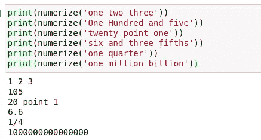
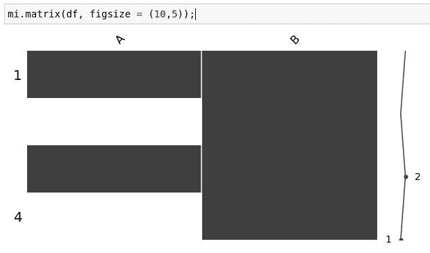
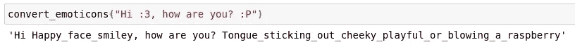
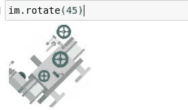
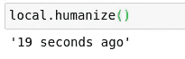
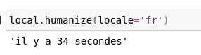

# 用于数据处理的便捷 Python 模块

> 原文：<https://towardsdatascience.com/handy-dandy-python-modules-for-data-processing-3a85d6806d39?source=collection_archive---------8----------------------->

## 一些我最喜欢的 Python 数据处理模块，你可能不知道


[https://pixabay.com/images/id-2167835/](https://pixabay.com/images/id-2167835/)

# 介绍

用于数据操作的 Python 模块——大多数数据科学家可能知道用于此目的的标准工具。我们如此习惯于把熊猫作为 pd 导入，以至于在这一点上我们不用键盘或鼠标也能做到。虽然我们通常用来操作和处理数据的标准工具当然是一套很好的工具，但实际上在 Pythonic 数据科学生态系统中还有更多模块可供我们使用。这个生态系统非常庞大，在 Python 包索引(PIP)中有超过 300，000 个注册包。请让您的朋友 PIP 做好准备，因为您将想要添加这些令人兴奋的软件包来增强您的数据处理工作流程！

> [笔记本](https://github.com/emmettgb/Emmetts-DS-NoteBooks/blob/master/Python3/Great%20Python%20modules%20for%20data%20processing.ipynb)

# 数字计算器

一个相当有趣的 Python 模块是一个叫做 numerizer 的小模块。numerizer 模块有一个非常简单的目的，那就是将字符串形式的数字转换成整数。在很多情况下，这可能非常有用，但我发现这个模块最有用的领域很可能是自然语言处理。也就是说，我可以肯定地看到，这也适用于数据框中的一些字符串数据，由于某种原因，这些数据被存储为单词而不是数字。我们都知道这是怎么回事，数据是不可预测的。幸运的是，大量的 Python 工具(如 Numerizer)通常在这方面为我们提供了帮助！

```
sudo pip install numerizerfrom numerizer import numerize
print(numerize('one two three'))
print(numerize('One Hundred and five'))
print(numerize('twenty point one'))
print(numerize('six and three fifths'))
print(numerize('one quarter'))
print(numerize('one million billion'))
```



作者图片

# 骗子

在我的数据科学职业生涯中，有很多情况下我需要构建一个原型或概念证明，但却找不到任何基础数据来处理。没必要害怕，因为 Faker 模块在这里！Faker 模块可用于快速有效地生成各种伪造数据。我决定用它来生成一个新的熊猫数据框架:

```
sudo pip install fakerfrom faker import Faker
import pandas as pd
fake = Faker()
```

注意，我们必须初始化 Faker()类。

```
df = pd.DataFrame({"Name" : [fake.name() for x in range(1, 200)],
                   "Website" : [fake.url() for x in range(1, 200)]
                  })
df.head(20)
```


作者图片

> 我想我真的认识一个叫凯瑟琳·邓恩的人，她是我的高中同学，所以这很现实。不确定她是否有一个叫 cunningham.com 的网站。

# 缺少编号

Missingno 是一个简单但非常棒的库，可以在缺少值时快速评估数据的健康状况。这个软件包的独特之处在于，它提供了一个矩阵，可以形象地显示您丢失了多少数据。

```
sudo pip install missingno
import missingno as mi
import numpy as npdf = pd.DataFrame({"A" : [5, np.NaN, 10, np.NaN], 
                  "B" : ["eight", "seven", "two", "three"]})mi.matrix(df, figsize = (10,5));
```



作者图片

# 情感

Emot 是一个 Python 模块，可以非常有效地用于从表情符号中获取真实数据。随着表情符号的流行，这一点变得更加重要。我们可以利用这个模块进行情感分析和一般的自然语言处理。这个模块将从本质上改变我们的表情符号的文本到他们做什么的描述。这将允许算法实际分析文本的这些部分，并寻找一致性。

```
sudo pip install emot
import re
from emot.emo_unicode import UNICODE_EMO, EMOTICONS
def convert_emoticons(text):
    for emot in EMOTICONS:
        text = re.sub(u'('+emot+')', "_".join(EMOTICONS[emot].replace(",","").split()), text)
    return textconvert_emoticons("Hi :3, how are you? :P")
```



作者图片

> 不确定第二个需要包含“_ 或 _ 吹 _ 一个 _ 覆盆子”。奇怪。

# 枕头

Pillow 是一个非常基本且易于使用的 Python 图像处理模块。不用说，可能有一千种不同的情况，这可能会派上用场。这个模块最好的部分是，它仍然在大多数方面保持相对用户友好！

```
sudo pip install pillow
import pillow as pil
im = pil.Image.open("logo.png")
im.show()
```

> 至少对我来说，这使用了 xgd-open 来打开我的系统的图像查看器。也很奇怪。

```
im.rotate(45)
```



作者图片

# 箭

Python 有很多非常棒的 datetime 模块。比如 datetime 模块(讽刺地读那个。)当然还有 datetime 类型的 Pandas 实现，我认为这是我最常使用的，也是最值得注意的。然而，我发现很多这种类型有时仍然有点乏味，Pandas 实现可能是最好的…也就是说..除了 Arrow！Arrow 是一个模块，它为 Python 语言提供了一些更好的日期时间功能。这个包的另一个很酷的特性是“人性化”功能，我实际上已经使用过了！请允许我解释。当我比现在年轻很多的时候，我在学校有一个创建在线聊天应用程序的任务，为此我使用了 Django。我使用了人性化功能，以便将我的计算机语言和不太人性化的时间转换成我们实际上可以在对话中说的简单短语。

```
sudo pip install arrow
import arrow
utc = arrow.utcnow()
local = utc.to('US/Eastern')
local.humanize()
```



作者图片

我们甚至可以通过使用本地关键字参数来更改语言！

```
local.humanize(locale='fr')
```



作者图片

# 结论

使用 Python 编程语言的最大好处之一是，无论出于何种目的，通常都有一个工具可以完成。进一步说，Python 生态系统是如此之大，以至于学习新的包是 Python 程序员的一个持续的乐趣来源。很有可能你还没有听说过这个列表中的每一个模块，这正说明了人类可能学不完的东西。当然，这是好事，不是坏事！数据科学领域或 web 开发领域也有很多优秀的数据处理工具。不用说，显而易见，为什么 Python 是程序员和数据科学家中最受欢迎的选择。感谢您阅读我的文章，我希望它能帮助您学习一些有用的新模块！